# 伊朗解除比特币开采禁令/毒贩 100 万比特币返还/币安 KYC 强制执行

> 原文：<https://medium.com/coinmonks/irans-lift-ban-from-bitcoin-mining-drug-dealer-s-1-million-bitcoin-return-binance-kyc-6217e0bfcb2d?source=collection_archive---------0----------------------->

## 免费 1000 美元比特币/签证进入 NFT——加密朋克

同为修道士，

比特币再次突破 50K 美元，希望你们能赚到钱😃。如果没有，

> [***电报上加入我们的密码信号频道***](https://t.me/coincodecap) *获取交易分析和买入机会。*

也

> *今日订阅我们的* [*Youtube 频道*](https://www.youtube.com/channel/UCbyDhTbOiKh2iUMKBi4-4Zg)*；这将对我们有很大帮助🙌*

现在，让我们看看上周 Crypto 发生了什么。📰

## 1.比特币游说未能说服国会改变加密税收规则

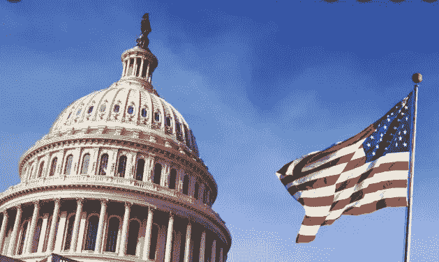

Image Source: Economic Times

众议院以 220 票对 212 票阻止了对拜登政府 1 万亿美元基础设施一揽子计划的修改。该协议汇集了进步和中间派民主党人，他们预计该措施的替代途径。

本月，参议院颁布了一项两党基础设施措施，将为参议员认为至关重要的各种项目提供资金，包括桥梁建设和清洁水处理。参议员们提出了一项措施，以扩大国税局对经纪人的定义，将从事数字资产交易的个人纳入其中，以支付该法案的一些举措。

然后，这些经纪人将负责代表他们的客户向国税局提交 1099 表格，这将需要收集姓名和地址。人们希望这一计划能筹集到 280 亿美元的税收，否则这些税收将不会上报。

虽然像比特币基地这样的集中式加密货币交易所可能符合标准，但硬币中心等加密倡导组织认为，经纪人的新定义过于宽泛。如果广义地解释，该术语可能包括负责在区块链上执行交易的个人，例如矿工或验证者。

它也可能对比特币钱包提供商和分散的应用程序开发者产生影响。他们声称，由于比特币的去中心化和匿名性质，这些参与者将无法满足标准。隐私倡导者也加入进来，称这项措施是扩大银行监控的秘密手段。

阿拉巴马州参议员理查·谢尔比反对后，澄清该条款并排除非监禁秘密演员的最后提案在参议院失败。

虽然拜登政府下的财政部据称表示，它不会对矿工等强制执行纳税申报要求，但加密倡导组织认为，众议院应该修改现在摆在他们面前的法案。

## 2.保利网络将向遭受 6.1 亿美元黑客攻击的用户退款

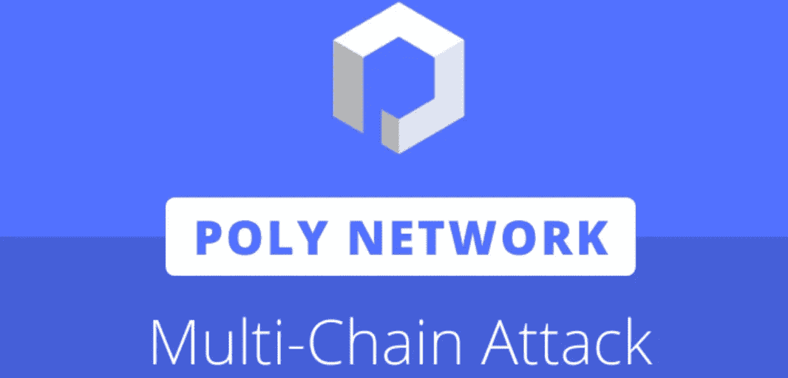

Image Source: kudelskisecurity

互操作平台 Poly Network 已经开始恢复过程，以归还在黑客攻击网络智能合同后被盗的 6.1 亿美元。

昨天，一名保利网络团队成员表示，黑客给了他们一个装有剩余资金的钱包的秘密钥匙。该项目利用该地址回收剩余的 1.41 亿美元加密货币，其中包括 28，953 个以太币和 1，032 个包装比特币。保利网络确信解冻将会很快发生。

Image Source: Twitter

## 3.据报道，伊朗将于下月解除比特币开采禁令

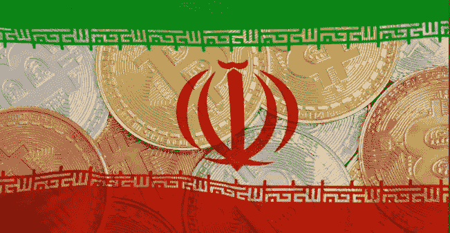

Image Source: UToday

据伊朗英语新闻网站[财经论坛报](https://financialtribune.com/articles/business-and-markets/109873/authorized-cryptominers-to-resume-operation-in-autumn)援引伊朗学生通讯社的报道，伊朗将于 9 月放宽对加密货币开采的四个月禁令。

由于高温和能源短缺给国家电网带来压力，哈桑·鲁哈尼总统在五月实施了 T2 临时禁令。

根据伊朗发电、配电和输电公司发言人 Mostafa Rajabi Mashhadi 今天的声明，工业、矿业和贸易部打算坚持 9 月 22 日的最初恢复日期，而不是延长禁令。根据 Mashhadi 的说法，Tavanir 认为未来一个月的用电量将会减少，以便合法的比特币矿工可以继续运营。

比特币开采在伊朗是一项受监管的活动，伊朗已经设计出了规避美国经济制裁的新方法。在特朗普政府于 2018 年放弃全球核协议并对其他国家施加压力以避免与伊斯兰共和国做生意后，这个拥有丰富石油和天然气的国家再次发现自己几乎没有买家。

## 4.圆形稳定硬币将“完全”以现金形式持有——美国国债

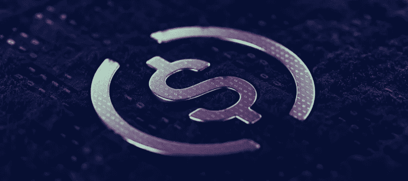

Image Source: Shutter stock

根据最近来自中心联盟的[博客文章](https://www.centre.io/blog/usdc-reserves-composition)，美元硬币(USDC)将只由现金和美国国库券支持。2018 年，总部位于波士顿的 Circle 和美国加密货币交易所比特币基地推出了 Centre。

Circle 创建 USDC，而 Centre 决定允许哪些实体创建 stablecoin 并使用其 API。例如，今年 3 月，Visa[宣布](https://decrypt.co/63170/visa-completes-first-cryptocurrency-transaction-on-ethereum)将开始在 USDC 结算交易。

USDC 与美元挂钩。该中心还表示，这些稳定的货币可以 1:1 的比例兑换成与之挂钩的货币。

然而，在 7 月，Circle 宣布他们的 stablecoin 只有 61%由现金和金融等价物支持，这使 1:1 的支持受到质疑。在这个意义上，现金也可以指货币市场基金，而现金等价物是短期证券。

Source: Circle

## 5.PayPal 在英国推出加密服务

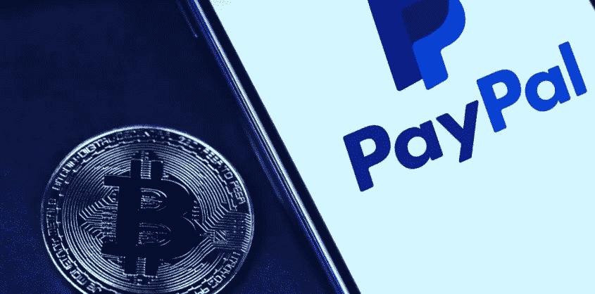

Image Source: Shutter stock

从周一(2021 年 8 月 23 日)开始，英国的 PayPal 客户将可以购买、交易和持有比特币、以太坊、比特币现金和莱特币。

客户可以通过 PayPal 网站和移动应用程序上的加密标签，使用他们的银行账户、PayPal 余额或借记卡购买低至 1 英镑(1.3 美元)的加密货币。

2020 年 10 月，数字支付巨头在美国推出其加密套件后，英国是第二个获得这些服务的国家。它向美国的消费者提供同样的四种硬币。

PayPal 不向客户收取 HODLing 费用，但会向他们收取交易和货币转换费用。它没有给出收费时间表，尽管在美国，费用从低于 25 美元的交易的 50 美分到超过 1000 美元的交易的 1.5%不等。

消费者将无法将加密货币转移到其他钱包。PayPal 购买的加密货币只能通过该应用程序消费，尽管该公司显然是为了修改这个[。](https://decrypt.co/71982/paypal-users-send-bitcoin-off)

Source: Decrypt Interview

## 6.德勤调查显示，Crypto 将在 10 年内取代菲亚特

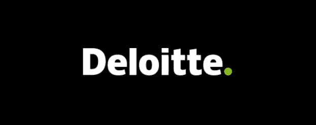

Image Source: Deloitte

根据德勤的年度全球区块链民意调查，76%的金融专业人士认为数字资产“将在未来 5—10 年内成为法定货币的有力替代或彻底替代”

[来自巴西、中国、中国香港、日本、新加坡、南非、阿联酋、英国和美国的 1000 多名金融专家](https://www2.deloitte.com/us/en/insights/topics/understanding-blockchain-potential/global-blockchain-survey.html)接受了《商业周刊》的调查。它是在 3 月 24 日至 4 月 10 日之间进行的，当时比特币市场处于今年的高峰期。

81%的受访者表示，该技术“可广泛扩展，并已得到广泛使用。”73%的人认为他们的公司应该使用区块链和数字资产，否则他们将失去竞争优势。

## 7.EIP-1559 已经燃烧了 70，000 ETH 甚至更多

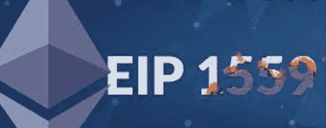

Image Source: Edge

自从 8 月 5 日交易烧钱升级 EIP-1559 生效后，以太坊网络就火了。

烧毁的硬币总数现已超过 71，000 埃特，或 2.215 亿美元。

EIP-1559 烧毁了用于支付以太网交易的以太网，例如在分散式交易所交易货币或发送 NFT。

在 EIP-1559 之前，以太坊网络不烧代币，尽管事实上一些基于以太坊的代币，如柴犬，烧代币作为他们货币政策的一部分。

相反，天然气成本被分配给以太坊矿工，这是一个由强大计算机组成的分散网络，保持网络运行。然而，除非用户“小费”矿工，矿工将不再获得这些费用，这些费用将被烧毁。

用于根据供需规则计算天然气价格的网络。在 1559 年的 EIP，它被固定费用所取代。

## 8.VanEck 和 ProShares 提出的以太坊 ETF 提案已经撤回

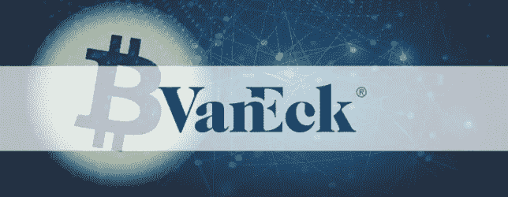

Image Source: Crypto Potato

继周三向美国证券交易委员会(SEC)提交以太坊期货 ETF 提案后，VanEck 和 ProShares 要求将其删除。

周五，这些金融公司向美国证券交易委员会提交了信函，降低了加密 ETF 今年将获得授权的希望。

ETF 或交易所交易基金是一种跟踪某种资产或资产集合价格的金融产品。你可以在交易所购买和交易这些资产的股票，而不是购买这些资产。由于 ETF 比 gray ' s 等封闭式信托更容易交易，金融公司一直在推动基于加密的 ETF 的发行。

SEC 主席加里·詹斯勒(Gary Gensler)本月早些时候表示，他将更容易接受与比特币期货挂钩的 ETF，如在芝加哥商品交易所交易的 ETF，而不是比特币本身。美国证券交易委员会的姐妹机构商品期货交易委员会负责监管期货交易。

## 9.贝莱德在比特币采矿上下了大赌注，每天产生 4400 万美元的收入

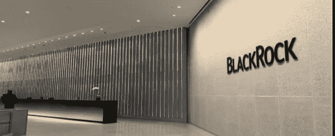

Image Source: Black Rock

贝莱德(BlackRock)是全球最大的资产管理公司，管理着 9 万亿美元的资产(AUM)，已经投资了两家位于美国的比特币矿业公司:马拉松数字控股公司(Marathon Digital Holdings)和 Riot Blockchain。

根据 6 月 30 日提交的一份文件，贝莱德目前拥有马拉松数字控股公司 6.71%的股份和 Riot 区块链 6.61%的股份。

据估计，中国拥有大约 70%的矿工。直到最近，那是。

在该行业最受欢迎的管辖区实施采矿禁令后，高达 90%的中国矿工逃到了更有利于加密的地方，导致比特币杂凑率下降了 50%。

杂碎率现在又回升了，日收入比上一年增长了惊人的 256.4%。

根据剑桥替代金融中心的数据，美国目前约占全球比特币税率的 17%。与此同时，俄罗斯和哈萨克斯坦增加了他们的采矿能力，将中国的主导地位降低到不到 46%。

## 10.密苏里州市长希望给每个居民 1000 美元的比特币

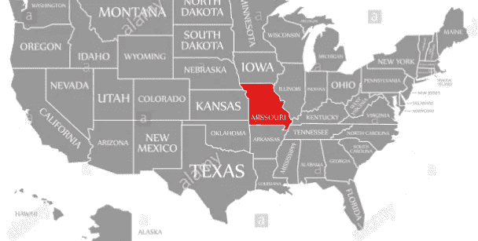

Image Source : Alamy Stock Photo

斯图尔特市长打算在年底前开始他的比特币业务，并正在从各种来源寻求资金。

“我有一些非常慷慨的捐助者，他们承诺将我筹集的资金匹配到 100 万美元。”我正试图获得一些政府资金来支持它。“或者可能是 Covid 救济金的一部分，”他解释道。

此外，据称市长正在考虑使用城市自己的财政。“这是可以想象的，”他补充道。"我们将看看事情如何发展。"

“我们正在制定类似比特币归属时间表的东西，”斯图尔特市长解释道。“这个概念是，在你真正获得完全使用权之前，你要五年不碰它，”他继续说，他说，居民会“非常后悔”今天使用比特币来支付汽车付款，却发现它“这么多年后还在 50 万美元左右。”

比特币交付给人们的确切方法尚不清楚，但斯图尔特建议敲门，并向当地人提供如何使用和存储比特币的免费课程。

## 11.瑞典政府向一名毒贩返还了超过 100 万美元的比特币

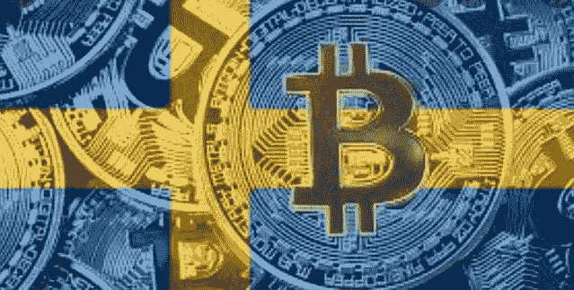

Image Source: Bitcoinst

据说瑞典当局已经将 130 万美元的比特币归还给一名被监禁的毒贩，这名毒贩是通过非法互联网销售获得这些现金的。

毒贩被捕后，瑞典执法局开始拍卖当时积累的 36 枚比特币。

然而，被盗加密货币的价值随后上升到只有三个比特币被拍卖的地步，以匹配非法交易时被盗比特币的法定价值。

结果，剩余的 33 个比特币，现在价值超过 100 万美元，被归还给了毒贩。

## 12.所有币安用户现在必须完成 KYC 注册过程

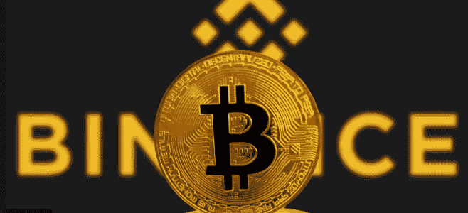

Image Source: Coindesk

加密货币交易所币安今天表示，所有客户现在必须完成“了解你的客户”( KYC)验证。

尚未完成 KYC 验证的现有客户同样包括在升级中。币安在一份新闻稿中表示，虽然这项验证已经完成，但这些账户只允许提取加密货币。

尽管用户需要提供他们的姓名和出生日期来完成“基本”层的验证，但最近的公告要求所有用户完成“中间”层。这一层要求用户提供他们的护照信息，并上传自拍照片到网站。

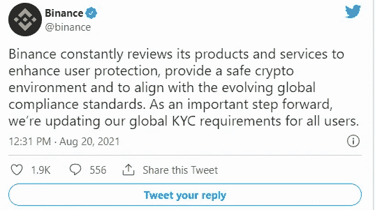

Image Source: Binance Twitter Handle

## 13.据首席执行官 Brian Armstrong 称，比特币基地的资产负债表上增加了 5 亿美元的加密货币

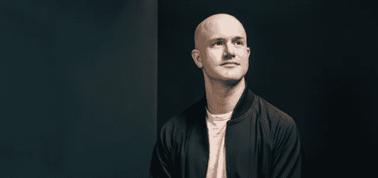

Image Source: Fortune

比特币基地首席执行官 Brian Armstrong 今天在 Twitter 上表示，公开上市的加密货币交易所已经获得董事会批准，将 5 亿美元的比特币资产添加到其资产负债表中。不仅如此，它还将把未来所有收入的 10%投资于比特币。

今年 2 月，比特币基地发布了一份 S-1 文件，准备通过直接上市上市，披露其拥有大约 3.65 亿美元的加密货币。其中比特币价值 2.3 亿美元，以太坊价值 5300 万美元，stablecoins 价值 4900 万美元，其他加密资产价值 3400 万美元。

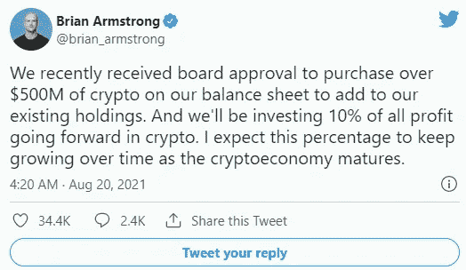

Image Source: Twitter

## 14.比特币基地在日本建立加密货币交易所

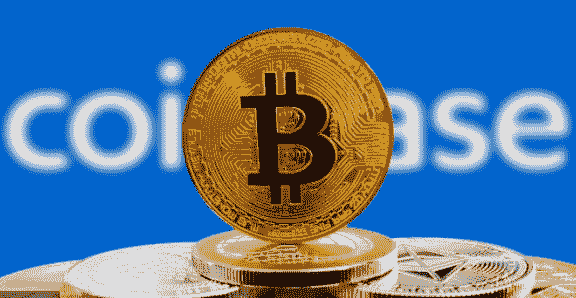

Image Source: Coinbase

比特币基地宣布在日本开设加密货币交易所，日本是全球主要的数字资产市场之一。

据称，此次推出是该公司全球增长计划的一部分，是与三菱 UFJ 金融集团(MUFG)合作进行的，MUFG 是日本最大的金融机构之一，拥有多达 4000 万客户。

比特币基地的日本客户将能够使用 MUFG 的快速存款服务存入资金，该公司正努力成为“日本最容易使用、最值得信赖、完全符合当地法规的交易所”

## 15.一项调查显示，美国每十个人中就有一个人投资加密货币

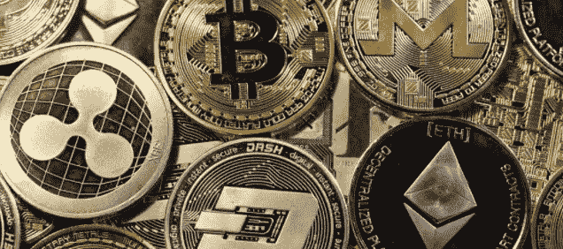

Image Source: Forbes

加密在美国的接受度正在提高，该国每 10 个人中就有一个人投资比特币/其他替代硬币。

根据美国消费者新闻与商业频道和美国化学公司 Momentive 本月早些时候在 T2 进行的一项研究，5530 人说他们选择投资有各种各样的原因。

60%的美国加密投资者受到长期发展前景的激励，而 44%受到快速增长前景的激励。三分之一(33%)的人是被自己进行交易的简单性所驱使，而略多于四分之一(26%)的人是被投资的刺激所吸引。

不到一半的受访者(44%)表示，他们不知道比特币到 2021 年底会是什么样子。事实上，不到五分之一(21%)的受访者预测今年年底比特币价格将高于现在。

相比之下，超过一半的受访者(45%)认为比特币是一种高风险投资。

年龄也是一个重要因素，年长的投资者认为这个行业风险很高。18 岁至 34 岁的投资者中，共有 29%的人认为加密货币是高风险的，而 34 岁至 65 岁的老年受访者中，几乎一半(46%)的人认为加密货币是高风险的。

年龄在 35-64 岁的人中，只有 3%声称社交媒体教会了他们投资。65 岁以上的人只有 1%同意。

## 16.继英国退出欧盟之后，加密货币交易所北海巨妖正在寻找新的欧盟许可证

Image Source: Kraken

按交易量计算，北海巨妖是美国第二大加密货币交易所，它正在与欧洲各国当局谈判，希望在 2021 年底前获得进入欧洲市场的许可证。

据一位北海巨妖代表称，该交易所在技术上存在于欧洲；然而，它目前通过一家在英国金融行为监管局(FCA)注册的机构向其欧洲客户提供服务。

虽然北海巨妖声称遵守欧盟第五反洗钱指令，但英国退出欧盟迫使加密交易所寻找新的方式重新进入欧洲大陆。

据鲍威尔称，该交易所希望在今年年底进入欧洲，马耳他、卢森堡以及爱尔兰共和国都有可能提供这样的许可证。

虽然谈判仍在进行中，但目前还没有做出正式决定。

**NFT 空间**

## 1.有了这个 JPEG，一个艺术爱好者最终在以太坊把 1400 美元变成了 330 万美元

Image Source: NFT Revolution

一幅来自 Art Blocks 收集的以太坊艺术作品的菲登扎·NFT 今天在瑞士联邦理工学院以 330 万美元成交。
仅在 8 月份，艺术街区倡议就产生了 2.94 亿美元的贸易活动。

泰勒·霍布斯的 Fidenza #313 在收购时以 1,000 ETH 的价格售出，略高于 330 万美元。令人惊讶的是，这件艺术品最后一次以 0.58 ETH(约 1400 美元)的价格售出是在 6 月 11 日，就在它被创作出来之后，这对前主人来说代表着巨大的投资回报。

Art Blocks 于 2020 年 11 月发布，但该简编包含了近几周价值飙升的各种创作者的 140 多幅不同的生成性艺术作品。根据 CryptoSlam 的统计数据，Art Blocks 在 8 月份迄今为止已经收集了 2.94 亿美元的交易量，占其 3.89 亿美元总交易量的绝大部分。今天是 NFT 收藏迄今为止最棒的一天，交易量超过 4800 万美元。

NFT 是一种罕见的数字对象的收据，它可以包含数字艺术品、视频剪辑、个人资料照片和视频游戏商品。今年早些时候，NFT 市场人气飙升，2021 年上半年的交易量达到 25 亿美元。

## 2.据创作者说，亚利桑那冰茶使用无聊猿 NFT 品牌被认为是“不恰当的”

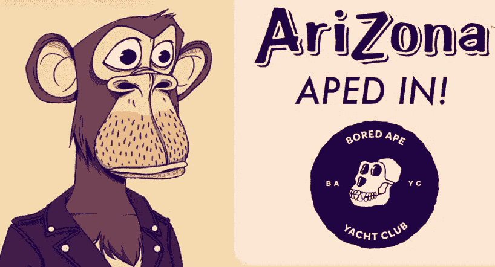

Image Source: Arizona Iced Tea

亚利桑那冰茶周五透露，它已经从著名的 Bored Ape 游艇俱乐部收藏中获得了一幅 NFT——这是一系列随机生成的 1 万幅个人资料图像，自 4 月份发布以来，其价值已经增加。尽管 Bored Ape Twitter 账户公布了这一消息，并且[欢迎](https://twitter.com/BoredApeYC/status/1428821881675714560)该公司加入社区，但该饮料品牌的创造者随后告知 Decrypt，该饮料已经超越了其商业限制。

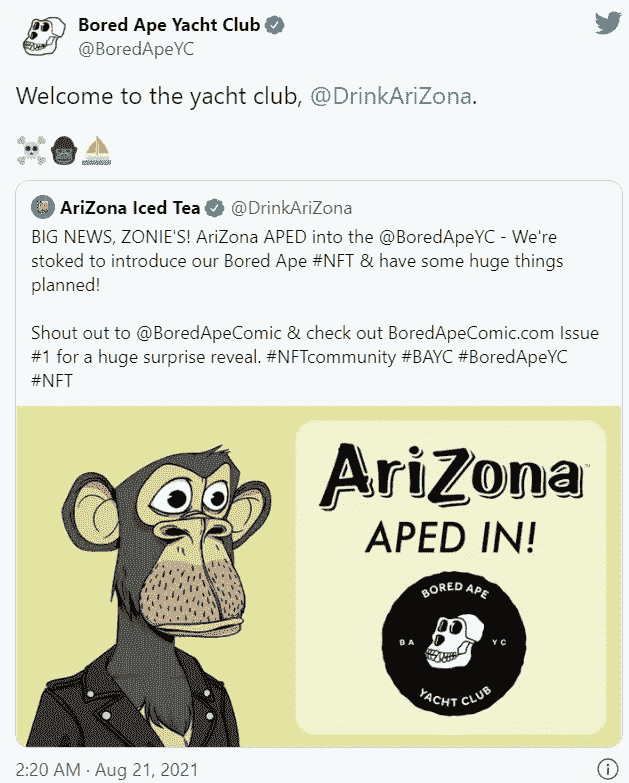

Image Source: Twitter

无聊猿游艇俱乐部最近成为最受欢迎的 NFT 集合之一。根据 CryptoSlam 的统计数据，自 4 月份成立以来，该系列已经产生了超过 2.41 亿美元的贸易活动。就数量而言，8 月份是迄今为止募集资金最多的一个月，本月迄今共募集了 1.39 亿美元。

## 3.在 Visa 的投资之后，CryptoPunks NFTs 在以太坊创下了 6900 万美元的日销售额纪录

Image Source: Larva Labs

Visa 透露，它已经以大约 50 ETH(购买时约为 15 万美元)的价格购买了一台 CryptoPunks NFT，一些密码行业观察家对此感到震惊。这也可能鼓励了一大批买家:密码朋克正在从货架上飞下来，入门级价格也因此飙升。

根据 CryptoSlam 的统计数据，截至本文撰写之时，已售出超过 260 台 CryptoPunks NFTs，与周日仅售出的 39 台相比有了相当大的增长。

它创造了密码朋克单日最多交易的新纪录，自今天开始以来，总交易量已经超过 6900 万美元。

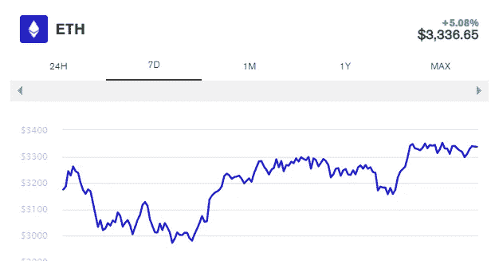

Image : Eth Price Chart

2021 年 8 月是目前 CryptoPunks 销售额最高的一个月，交易量超过 3.14 亿美元。之前的最高纪录是 7 月份的 1.35 亿美元，当时的交易额首次超过了 1 亿美元。根据 CryptoSlam 的统计，CryptoPunks 迄今为止已经产生了超过 8.15 亿美元的交易量。

## 4.Visa 以 50 以太坊(价值 165000 美元)购买 CryptoPunk NFT

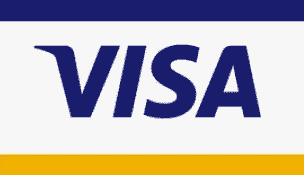

Image Source : Visa

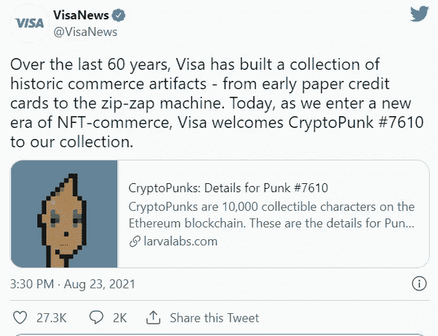

Image Source: Twitter

Visa 的加密主管 Sheffield 声称，Visa 可以促进 NFT 商业的“安全交易”。

从短期来看，这需要帮助品牌和企业更好地了解 NFT 市场——以及它如何帮助这些组织吸引消费者。

Visa 还致力于“新概念和合作”,希望未来能让 NFT 的客户、经销商和创作者受益。“我们期待在未来几个月发布更多信息，”谢菲尔德补充道。

## 5.随着 NFT 狂潮的继续，一幅以太坊摇滚的 JPEG 图片售价高达 60 万美元

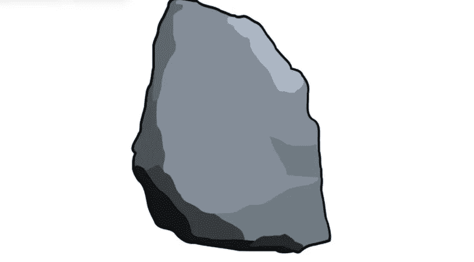

Image Source : Ether Rocks

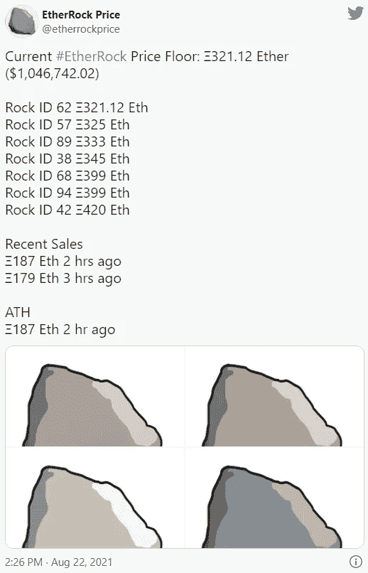

## 6.Vine 的联合创始人创建了以太坊 NFT 游戏

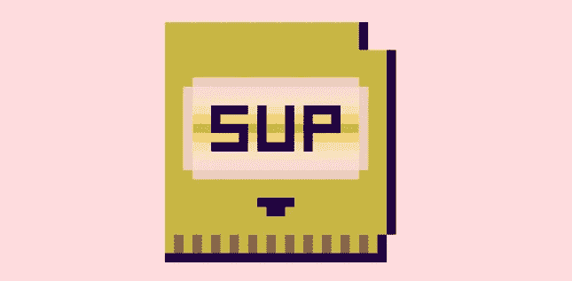

Image Source: Sup Drive

多姆·霍夫曼(Dom Hofmann)是现已倒闭的循环视频服务 Vine 的联合创始人，也是最近宣布的 NFT 计划 Supdrive 的推动力量。Supdrive 将是一个“连锁幻想主机”，游戏本身就是 NFT。如果你有 NFT 游戏，你可以使用“Supdrive 虚拟固件”程序来玩。

正如 Supdrive 想要推出的那样，NFT 可以作为数字资产的收据或所有权凭证，如数字艺术品、视频剪辑或游戏中的物品，甚至是视频游戏。

Supdrive 将首先由霍夫曼本人制作的原创游戏提供支持，第一部游戏名为“起源”。他打算向合作伙伴开放平台，以便在未来开发新的产品。霍夫曼在一篇不和谐的帖子中，将这一努力与艺术街区(Art Blocks)相提并论，后者是一个以太坊 NFT 项目，迄今为止包括了来自各种艺术家的生殖艺术作品。

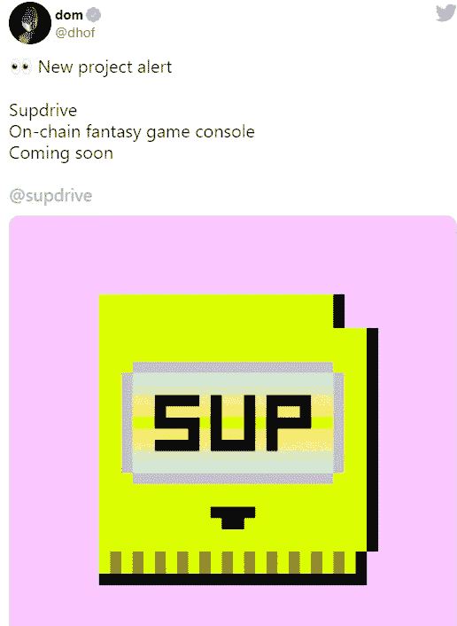

Image Source: Twitter

## 7.一天一个名词 NFTs 让以太巨鲸得以进入一个专属俱乐部

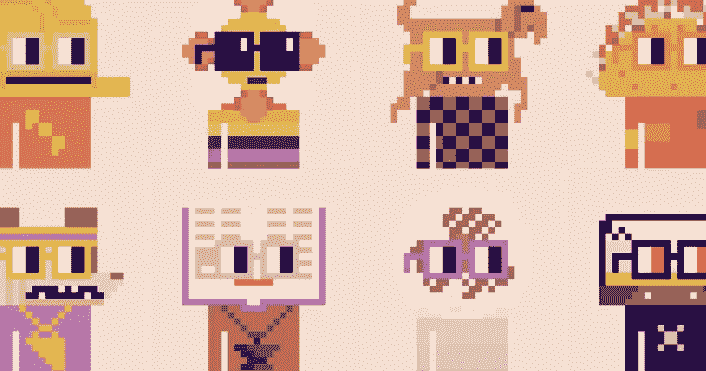

Image Source: Nouns

名词，一个新的 NFT 倡议，采取了完全不同的方法。名词公司没有向市场倾销大量 NFT 商品，而是每天铸造一个彩色像素形状的 NFT，然后拍卖给出价最高者。

NFT 的功能相当于数字资产(如图片、视频或几乎任何其他东西)的所有权契约。在这个例子中，它是以太坊的区块链上随机产生的一个像素字符。根据不到两周内创造的货币数量，ETH 鲸鱼会来得到它们。

总共生产了 14 种不同名词的非功能性纺织品，其中 12 种拍卖给了出价最高者，产量略高于 1，642 ETH，按目前汇率计算超过 530 万美元。古怪的名词被给了这个项目的创始人:现在，每十分之一的 NFT 都给了发明者，而不是从销售额中提成。

## 8.NBA Top Shot 引入 WNBA NFTs，并计划扩展

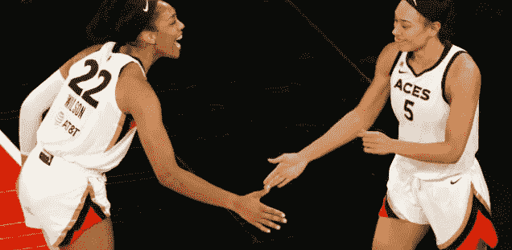

Image Source: Board room

Dapper Labs 的 [NBA 顶级投篮平台](https://decrypt.co/59968/nft-mania-february-trading-volume-just-topped-all-2020)在今年早些时候帮助推出了 NFT 市场，最近宣布增加基于 WNBA 女子篮球联赛的加密收藏品。

他们之前透露，NFT 套装是一个普通稀有的套装，将于周五作为现有 NBA 顶级投篮计划的一部分出售。第一包包括可收集的“时刻”——基于著名球员的真实 WNBA 视频集锦的数字交易卡。

***作者* : Eth！c@l 又名库马尔**

> 加入 [Coinmonks 电报频道](https://t.me/coincodecap)，了解加密交易和投资

## 另外，阅读

*   [尤霍德勒 vs 考尼洛 vs 霍德诺特](/coinmonks/youhodler-vs-coinloan-vs-hodlnaut-b1050acde55a) | [Cryptohopper vs 哈斯博特](https://blog.coincodecap.com/cryptohopper-vs-haasbot)
*   [币安 vs 北海巨妖](https://blog.coincodecap.com/binance-vs-kraken) | [美元成本平均交易机器人](https://blog.coincodecap.com/pionex-dca-bot)
*   [如何在印度购买比特币？](/coinmonks/buy-bitcoin-in-india-feb50ddfef94) | [WazirX 评论](/coinmonks/wazirx-review-5c811b074f5b) | [BitMEX 评论](https://blog.coincodecap.com/bitmex-review)
*   [比特币主根](https://blog.coincodecap.com/bitcoin-taproot) | [Bitso 点评](https://blog.coincodecap.com/bitso-review) | [排名前 6 的比特币信用卡](/coinmonks/bitcoin-credit-card-bc8ab6f377c6)
*   [双子座 vs 比特币基地](https://blog.coincodecap.com/gemini-vs-coinbase) | [比特币基地 vs 北海巨妖](https://blog.coincodecap.com/kraken-vs-coinbase) | [硬币罐 vs 硬币点](https://blog.coincodecap.com/coinspot-vs-coinjar)
*   [印度密码交易所](/coinmonks/bitcoin-exchange-in-india-7f1fe79715c9) | [比特币储蓄账户](/coinmonks/bitcoin-savings-account-e65b13f92451) | [Paxful 审核](/coinmonks/paxful-review-4daf2354ab70)
*   [杠杆令牌](/coinmonks/leveraged-token-3f5257808b22) | [最佳加密交易所](/coinmonks/crypto-exchange-dd2f9d6f3769) | [AscendEX 评论](/coinmonks/ascendex-review-53e829cf75fa)
*   [Godex.io 审核](/coinmonks/godex-io-review-7366086519fb) | [邀请审核](/coinmonks/invity-review-70f3030c0502) | [BitForex 审核](https://blog.coincodecap.com/bitforex-review) | [HitBTC 审核](/coinmonks/hitbtc-review-c5143c5d53c2)
*   [币安费用](/coinmonks/binance-fees-8588ec17965) | [僵尸工具审查](/coinmonks/botcrypto-review-2021-build-your-own-trading-bot-coincodecap-6b8332d736c7)|[Crypto.com 替代方案](https://blog.coincodecap.com/crypto-com-alternatives)
*   [什么是交易信号？](https://blog.coincodecap.com/trading-signal) | [Bitstamp 诉比特币基地](https://blog.coincodecap.com/bitstamp-coinbase)
*   [盈利农民回顾](https://blog.coincodecap.com/profitfarmers-review) | [如何使用康沃尔交易机器人](https://blog.coincodecap.com/cornix-trading-bot)
*   [MXC 交易所评论](/coinmonks/mxc-exchange-review-3af0ec1cba8c) | [Pionex 诉币安](https://blog.coincodecap.com/pionex-vs-binance) | [Pionex 套利机器人](https://blog.coincodecap.com/pionex-arbitrage-bot)
*   [我的加密副本交易经验](/coinmonks/my-experience-with-crypto-copy-trading-d6feb2ce3ac5) | [比特币基地评论](/coinmonks/coinbase-review-6ef4e0f56064)
*   [CoinFLEX 点评](https://blog.coincodecap.com/coinflex-review) | [AEX 交易所点评](https://blog.coincodecap.com/aex-exchange-review) | [UPbit 点评](https://blog.coincodecap.com/upbit-review)
*   [上行保证金交易](https://blog.coincodecap.com/ascendex-margin-trading)|[Bitfinex Staking](https://blog.coincodecap.com/bitfinex-staking)|[bitFlyer Review](https://blog.coincodecap.com/bitflyer-review)
*   [麻雀交换评论](https://blog.coincodecap.com/sparrow-exchange-review) | [纳什交换评论](https://blog.coincodecap.com/nash-exchange-review) | [概率单位评论](https://blog.coincodecap.com/probit-review)
*   [加密货币储蓄账户](/coinmonks/cryptocurrency-savings-accounts-be3bc0feffbf) | [赌注加密](https://blog.coincodecap.com/staking-crypto) | [StealthEX 评论](/coinmonks/stealthex-review-396c67309988)
*   [BigONE 交易所评论](/coinmonks/bigone-exchange-review-64705d85a1d4) | [CEX。IO 审查](https://blog.coincodecap.com/cex-io-review) | [交换区审查](/coinmonks/swapzone-review-crypto-exchange-data-aggregator-e0ad78e55ed7)
*   [最佳比特币保证金交易](/coinmonks/bitcoin-margin-trading-exchange-bcbfcbf7b8e3) | [Bityard 保证金交易](https://blog.coincodecap.com/bityard-margin-trading) | [Prokey 点评](/coinmonks/prokey-review-26611173c13c)
*   [加密保证金交易交易所](/coinmonks/crypto-margin-trading-exchanges-428b1f7ad108) | [赚取比特币](/coinmonks/earn-bitcoin-6e8bd3c592d9) | [Mudrex 投资](https://blog.coincodecap.com/mudrex-invest-review-the-best-way-to-invest-in-crypto)
*   [WazirX vs CoinDCX vs bit bns](/coinmonks/wazirx-vs-coindcx-vs-bitbns-149f4f19a2f1)|[block fi vs coin loan vs Nexo](/coinmonks/blockfi-vs-coinloan-vs-nexo-cb624635230d)
*   [BlockFi 信用卡](https://blog.coincodecap.com/blockfi-credit-card) | [如何在币安购买比特币](https://blog.coincodecap.com/buy-bitcoin-binance)
*   [火币交易机器人](https://blog.coincodecap.com/huobi-trading-bot) | [如何购买 ADA](https://blog.coincodecap.com/buy-ada-cardano) | [Geco？一次审查](https://blog.coincodecap.com/geco-one-review)
*   [加密副本交易平台](/coinmonks/top-10-crypto-copy-trading-platforms-for-beginners-d0c37c7d698c) | [五大 BlockFi 替代方案](https://blog.coincodecap.com/blockfi-alternatives)
*   [CoinLoan 点评](https://blog.coincodecap.com/coinloan-review)|【Crypto.com】点评 | [火币保证金交易](/coinmonks/huobi-margin-trading-b3b06cdc1519)
*   [顶级付费加密货币和区块链课程](https://blog.coincodecap.com/blockchain-courses) | [币安评论](/coinmonks/binance-review-ee10d3bf3b6e)
*   [在美国如何使用 BitMEX？](https://blog.coincodecap.com/use-bitmex-in-usa) | [BitMEX 审查](https://blog.coincodecap.com/bitmex-review)
*   [最佳免费加密信号](https://blog.coincodecap.com/free-crypto-signals) | [YoBit 评论](/coinmonks/yobit-review-175464162c62) | [Bitbns 评论](/coinmonks/bitbns-review-38256a07e161)
*   [OKEx 评论](/coinmonks/okex-review-6b369304110f) | [Kucoin 交易机器人](/coinmonks/kucoin-trading-bot-automate-your-trades-8cf0ca2138e0) | [期货交易机器人](/coinmonks/futures-trading-bots-5a282ccee3f5)
*   [AscendEx Staking](https://blog.coincodecap.com/ascendex-staking)|[Bot Ocean Review](https://blog.coincodecap.com/bot-ocean-review)|[最佳比特币钱包](https://blog.coincodecap.com/bitcoin-wallets-india)
*   [霍比审核](https://blog.coincodecap.com/huobi-review) | [OKEx 保证金交易](https://blog.coincodecap.com/okex-margin-trading) | [期货交易](https://blog.coincodecap.com/futures-trading)
*   [比特币基地赌注](https://blog.coincodecap.com/coinbase-staking) | [Hotbit 评论](/coinmonks/hotbit-review-cd5bec41dafb) | [KuCoin 评论](https://blog.coincodecap.com/kucoin-review)
*   [最佳加密交易信号电报](/coinmonks/best-crypto-signals-telegram-5785cdbc4b2b) | [MoonXBT 评论](/coinmonks/moonxbt-review-6e4ab26d037)
*   [Coinswitch 俱吠罗评论](/coinmonks/coinswitch-kuber-review-1a8dc5c7a739) | [电网交易机器人](https://blog.coincodecap.com/grid-trading) | [比特币基地收费](/coinmonks/coinbase-fees-831e77d4f2c5)
*   [Bitget 回顾](https://blog.coincodecap.com/bitget-review)|[Gemini vs block fi](https://blog.coincodecap.com/gemini-vs-blockfi)|[OKEx 期货交易](https://blog.coincodecap.com/okex-futures-trading)
*   [OKEx vs KuCoin](https://blog.coincodecap.com/okex-kucoin) | [摄氏替代品](https://blog.coincodecap.com/celsius-alternatives) | [如何购买 VeChain](https://blog.coincodecap.com/buy-vechain)
*   [币安期货交易](https://blog.coincodecap.com/binance-futures-trading)|[3 comas vs Mudrex vs eToro](https://blog.coincodecap.com/mudrex-3commas-etoro)
*   [如何购买 Monero](https://blog.coincodecap.com/buy-monero) | [IDEX 评论](https://blog.coincodecap.com/idex-review) | [BitKan 交易机器人](https://blog.coincodecap.com/bitkan-trading-bot)
*   [币安 vs 比特邮票](https://blog.coincodecap.com/binance-vs-bitstamp) | [比特熊猫 vs 比特币基地 vs Coinsbit](https://blog.coincodecap.com/bitpanda-coinbase-coinsbit)
*   [如何购买 Ripple (XRP)](https://blog.coincodecap.com/buy-ripple-india) | [非洲最好的加密交易所](https://blog.coincodecap.com/crypto-exchange-africa)
*   [非洲最佳加密交易所](https://blog.coincodecap.com/crypto-exchange-africa) | [胡交易所评论](https://blog.coincodecap.com/hoo-exchange-review)
*   [eToro vs robin hood](https://blog.coincodecap.com/etoro-robinhood)|[MoonXBT vs Bybit vs Bityard](https://blog.coincodecap.com/bybit-bityard-moonxbt)
*   [Stormgain 回顾](https://blog.coincodecap.com/stormgain-review) | [Bexplus 回顾](https://blog.coincodecap.com/bexplus-review) | [币安 vs Bittrex](https://blog.coincodecap.com/binance-vs-bittrex)
*   [Bookmap 评论](https://blog.coincodecap.com/bookmap-review-2021-best-trading-software) | [美国 5 大最佳加密交易所](https://blog.coincodecap.com/crypto-exchange-usa)
*   [如何在 FTX 交易所交易期货](https://blog.coincodecap.com/ftx-futures-trading) | [OKEx vs 币安](https://blog.coincodecap.com/okex-vs-binance)