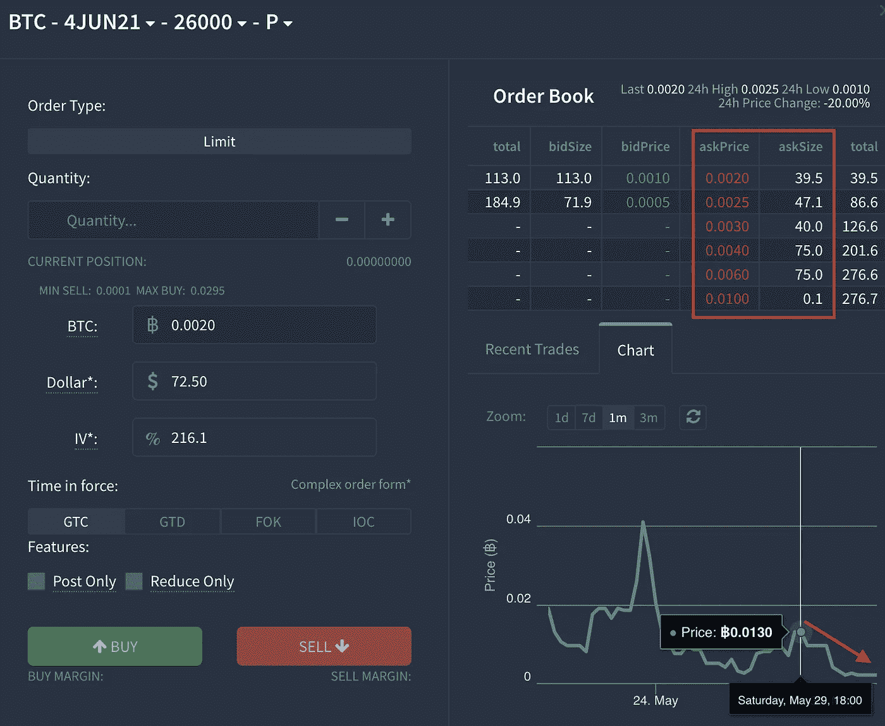

# 不合理的不耐烦

> 原文：<https://medium.com/coinmonks/irrationally-impatient-7fa207d2e71e?source=collection_archive---------4----------------------->

一个多星期前的闪光弹还在造成一些后遗症。

根据交易者看市场的类型，它可以被认为是一个小错位，消极情绪，或者只是不耐烦。

不管是什么，这种行为在期权市场得到了充分展示。

上周末，比特币价格出现小幅下跌，这对看跌比特币的人来说就像是一碗新鲜的蜂蜜。

这里有一个截屏，显示了在上周末小幅下跌期间，超过 50 个 BTC 期权正在交易。

下图中有趣的一点是，这些合约中只有三份不是看跌合约。

此外，我在右侧突出显示了一些百分比。这些都是隐含波动率。很多时候，你可以根据这些价值粗略地衡量一份合同的价格。

这些接近 200%的值有点偏高。更不用说像这样的每周合约的流动性是相当低的。通常只有两个

更不用说像这样的每周合约的流动性是相当低的。在下图中，我在 6 月 4 日的 26k 罢工看跌期权合约周围画了一个红色矩形。正如你所看到的，在 39.5 合约之后，另外 47.1 合约的成本上升了 25%。接下来的 40 年增加 50%。

在图片的右下方是那些价格有些不稳定的合约的价格。在 0.013 BTC 卖出的看跌合约是“顶部”……现在合约交易价格为 0.0015 BTC……价值几乎下降了 90%。

现在，更重要的是…我们可以看到，由于我们的下一个指标，为下行保护支付的溢价是历史上昂贵的。这不仅仅是本周末的一次性事件，而是当今的市场结构。

这是 25d 的偏斜。这是一种观察看跌期权和看涨期权谁更贵的奇特方式。现在，看跌期权价格居高不下。

我在下图中使用了一个月的合约。如你所见，现在看跌期权比看涨期权多 20%。

这是目前市场过度悲观情绪的一种表现。这就是为什么我称之为抛售的后效，因为这不是我们第一次看到这种情况。

回顾 25d 的历史和价格图表，我想起了九月初。

这是 25d 最后一次过度看跌。这是 2020 年 9 月初的 25d 偏斜。

和现在差不多，价格刚降下来。唯一不同的是，与我们最近清仓大甩卖的价格相比，降幅为 21%。

下图显示了价格下跌后的走势。长得有点像？

你可能记得这是市场上相当无聊的时期。类似于你今天的感觉。

对于做市商来说，这是他们在所谓的卖出波动中获利的时候。当你卖出期权合约时，因为你可以因隐含波动率上升而获得溢价……或者换句话说，做市商正在利用那些不耐烦的人。

这也是为什么在周末购买的主要看跌合约几乎是可笑的部分原因。

如果有人真的那么担心比特币在几天内下跌 20 %- 30 %,可能有更好的方式来进行交易。

在市场过度看跌时购买定价过高的看跌合约，根本不是一项经过深思熟虑的交易。

当你看到像这样的非理性交易时，这不是一件值得遵循的事情。

大笔资金并不总是明智的。精明的资金是那里的做市商，为非理性的买家提供流动性。

这类似于我们现在在链上看到的…

资本的主要流向是流向智能合约的稳定资本。美元兑日元在智能合约中的使用比例在周末从不足 15%升至近 19%。

这是市场机会的标志。

主要的机会不在于开仓，而在于通过提供流动性收取溢价。

不幸的是，这不是一个非常适合零售的游戏。在智能合约中投入少量资金往往会超出市场价格。

为 10，000 美元的智能合约支付 50 美元的费用是 0.5%。当你考虑到这样一个事实，当你想从一个智能合同中提取资本时，这可能是在一个高油价的环境中，这就没有任何为了收益而借出资本的动机了。

尤其是当你的稳定收益率为 2-2.7%时。

糟透了。当对市场的兴趣变得过于悲观时，我们刚刚摆脱下跌，市场充满了稳定的货币资本…这就是你所得到的。

我们现在可能会看到 DEX 数量开始下降，进而看到整个加密的收益率下降。

这可能就是 DeFi 现在遭受重创的原因。此外，我不完全确定底部是否会出现赤字。

我们是它的大力拥护者，并且相信为这个领域提供动力的协议是必须拥有的。然而，有一个迫在眉睫的威胁，我们觉得这是迟早的事。

这是明天的话题。但我不会让你完全被吊起来，我会把这个留给你。

Tether 的市值为 620 亿美元。其中 17.7 亿美元在交易所交易。不到 19%的人持有智能合约……其中 25 亿美元是在过去几天刚刚进入这些合约的……没有对这些基金进行任何反洗钱/KYC。

我有一种感觉，监管者不喜欢这样。这也是我们看到一些银行家开始敲响警钟的部分原因。

六月到了，FinCEN 也近了。

明天更…

你的脉搏在加密，

本·莉莉

附注——观察我们今天看到的交易环境的一个问题是，我们倾向于有更多的时间来观察市场风险。这是其中一种情况。

因此，不要误以为我们认为牛市已经结束。我们根本没有这么说。事实上，我们认为今天的市场是我们在 2013 年和 2017 年看到的牛市的独特之处，这要归功于 DeFi 和 stablecoins。这也是为什么我们相信最好的还在后面，只是比我们预期的时间要长一点。

## 另外，阅读

*   [CoinLoan 点评](/coinmonks/coinloan-review-18128b9badc4)|【Crypto.com】点评 | [火币保证金交易](/coinmonks/huobi-margin-trading-b3b06cdc1519)
*   [顶级付费加密货币和区块链课程](https://blog.coincodecap.com/blockchain-courses) | [币安评论](/coinmonks/binance-review-ee10d3bf3b6e)
*   [在美国如何使用 BitMEX？](https://blog.coincodecap.com/use-bitmex-in-usa) | [BitMEX 回顾](https://blog.coincodecap.com/bitmex-review) | [币安 vs Bittrex](https://blog.coincodecap.com/binance-vs-bittrex)