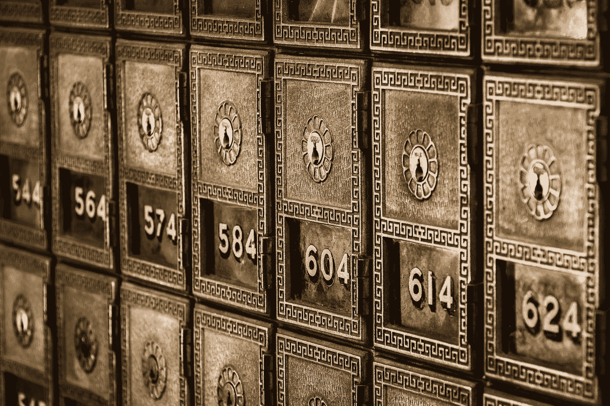

# 摄氏 3.51%的 BTC 利率值得我们去冒险吗？

> 原文：<https://medium.com/coinmonks/is-3-51-btc-interest-on-celsius-worth-the-risk-817782efee18?source=collection_archive---------8----------------------->

Photo by [Tim Evans](https://unsplash.com/@tjevans?utm_source=medium&utm_medium=referral) on [Unsplash](https://unsplash.com?utm_source=medium&utm_medium=referral)

像 Celsius 和 BlockFi 这样的利差业务一直在为存放在他们平台上的密码提供慷慨的平均利率，这远远超过了传统银行提供的利率。利率可高达 17%。当我第一次下载这个应用程序时，我得到的是比特币 3.51%的利率和 USDC 等稳定货币 8.88%的利率。这看起来很容易…