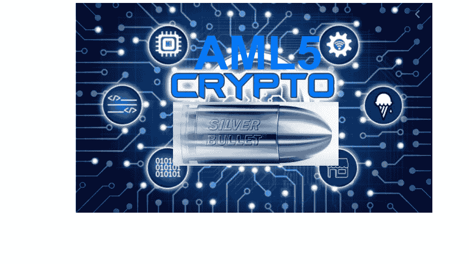

# AML5 Cryptos 是解决欧盟银行业问题的灵丹妙药吗？

> 原文：<https://medium.com/coinmonks/is-aml5-cryptos-silver-bullet-for-its-eu-banking-problem-ad99ddb8fab4?source=collection_archive---------1----------------------->

在过去的一两个月里，有许多文章(附件[一](https://www.btcnn.com/new-eu-law-to-give-banks-zero-power-over-cryptocurrency-related-activities/) & [二](https://www.forbes.com/sites/pawelkuskowski/2020/02/20/europes-new-aml-directive-means-banks-can-no-longer-shut-crypto-out/#65b7d285466d))声称 AML5 实际上意味着欧盟的银行*将不得不为加密业务*提供银行服务，如果它们遵守 AML5 的要求的话。

自 2020 年 1 月 20 日起，AML5 现包括以下加密相关业务:

"**从事虚拟货币和法定货币之间的兑换服务的提供商，以及保管钱包的提供商。**为了反洗钱和打击资助恐怖主义行为(反洗钱/CFT ),主管当局应能够通过有义务的实体监测虚拟货币的使用。这种监测将提供一种平衡和均衡的方法，保障技术进步和在替代金融和社会企业家领域实现的高度透明度。”

PostRaise 已经阅读了 32 页的[文件](https://eur-lex.europa.eu/legal-content/EN/TXT/PDF/?uri=CELEX:32018L0843&from=EN)(不，这并不有趣)，似乎没有任何具体提到银行现在有义务向加密领域的企业提供服务，无论它们是交易所还是钱包提供商。

有没有可能，一家曾经对是否向加密交易所或钱包提供商提供企业银行服务犹豫不决的银行，现在提供了这项服务？是的，当然，可能是这种情况，而且这肯定是 PostRaise 希望的。

抛开一厢情愿的想法不谈，PostRaise 很乐意与几个过去被 X 银行拒绝的加密企业进行试验。这个实验看起来像这样:

**加密交易所/钱包提供商现已完全符合 AML5 标准，这在理论上消除了 X 银行的一个主要担忧(加密业务，他们的潜在客户没有充分 AML/KYCing 他们的客户)。一旦确定了这一点，联系银行 X 并询问他们现在是否愿意提供他们过去不愿意提供的加密交换/钱包提供商银行服务。**

如果你是一家加密交易所/钱包提供商的创始人，伸出手来，我们可以一起进行实验，这肯定会有所启发。

鉴于过去 14 个月中代表加密客户与银行打交道的情况，PostRaise 的最佳猜测是……银行仍然认为加密是一种他们不感兴趣服务的客户类型，尽管遵守了 AML5。

为什么会出现这种情况？因为有各种各样的[例子](https://insidebitcoins.com/news/some-indian-banks-continue-to-ignore-supreme-courts-crypto-verdict/253928)政府/监管机构实施法律或指令，要求银行对 XYZ 业务类型更加开放，而银行(在大多数情况下)只是忽略指令，因为它不符合他们的风险偏好，或者它与他们没有兴趣服务的客户类型有关。这个[条](https://cryptonews.com/exclusives/amld5-won-t-save-crypto-exchanges-from-bank-rejection-5972.htm)似乎也同意。

如果有一家加密企业想要进行试验，或者已经尝试获得银行业务，现在他们正在坚持 AML5 reach out，那么了解一下您的经验将是非常有趣的。

> [在您的收件箱中直接获得最佳软件交易](https://coincodecap.com/?utm_source=coinmonks)

***最终想法***

这一观点受到当前市场动荡的影响；整个金融体系面临的流动性问题和冠状病毒加剧了这种局面。在这种环境下，PostRaise 认为银行不会神奇地向几个月前还非常不受欢迎的市场领域敞开大门。

在外面注意安全！

后加注输出...

