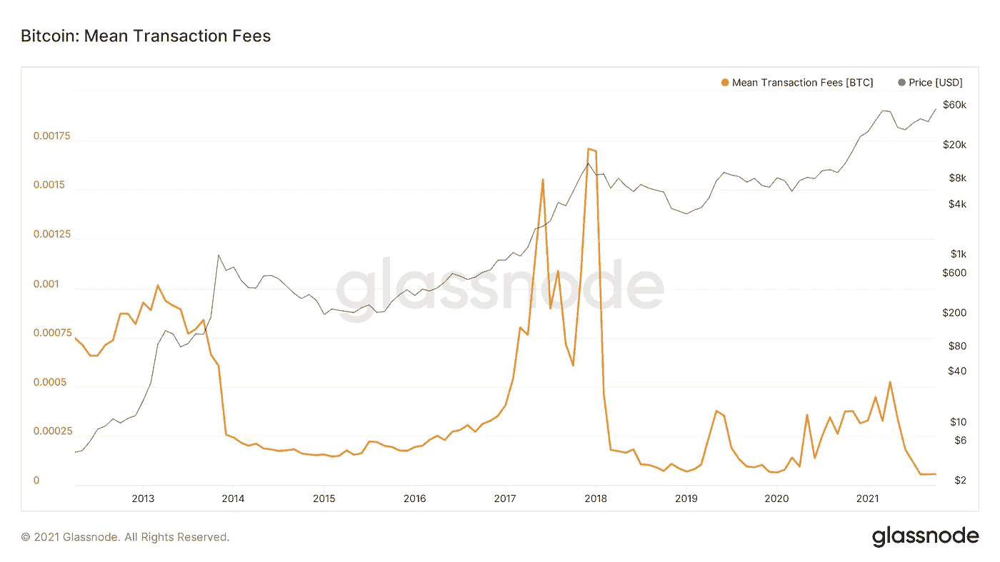
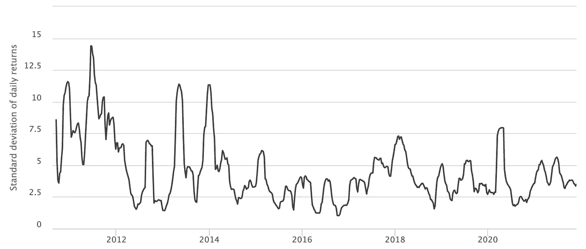

# 比特币是货币吗？

> 原文：<https://medium.com/coinmonks/is-bitcoin-a-currency-ccd250fa124b?source=collection_archive---------7----------------------->

## 评克里斯蒂娜·拉加德关于密码的评论

Source: [André François McKenzie](https://unsplash.com/@silverhousehd) on [Unsplash](https://unsplash.com/photos/Q4W8GjjKjuw)

在最近的一次采访中，一名记者向欧洲央行行长克里斯蒂娜·拉加德(Christine Lagarde)询问了加密货币的潜在经济价值。

克里斯蒂娜·拉加德很快用下面的话驳斥了他们的好处:

> “密码不是货币，句号。” —克里斯蒂娜·拉加德，欧洲中央银行行长

央行行长发表此类言论并不奇怪，因为加密被视为对央行控制货币政策的主权的潜在威胁。

拉加德削弱 crypto 的动机似乎显而易见。因此，她关于所有密码都不是货币的说法有多站得住脚？

为了回答这个问题，本文着眼于货币的属性，并评估比特币是否符合货币的定义。选择比特币是因为它是最大的(按网络和市值计算)、最安全的、最分散的加密方式。

# 比特币:资产还是货币

甚至比特币的创造者也争论了很长时间，比特币是一种资产还是一种货币。货币叙事的支持者认为比特币的创造者中本聪将其定义为一种

> “电子现金的纯点对点版本，将允许在线支付直接从一方发送到另一方，而不经过金融机构”。—中本聪，[比特币白皮书](https://bitcoin.org/bitcoin.pdf)

**尽管如此，比特币的基础层架构使得该协议(作为独立协议)不适合电子商务用例。**首先，小额交易在经济上不可行。其次，比特币十分钟的阻塞时间阻止了快速交易终结。因此，用户只有在成功确认几个新的区块后才能确信交易已结算，而这个过程可能需要长达一个小时。由于这些限制，比特币在早期阶段主要被视为稀缺的数字资产，而不是货币。

Bitcoin: Mean Transaction Fees (2012–2021) | Glassnode

**自那以后，众多新的发展大大加快了比特币领域的创新。**如后所述，其中一些创新也影响了比特币作为货币的属性和适用性。

# 五种货币属性

*这表明克里斯蒂娜·拉加德对比特币作为货币的能力的担忧(从历史上看)并非毫无根据。然而，它们今天仍然有效吗？*

为了回到我们最初的问题，即比特币是否是一种货币，我们必须**评估比特币满足任何货币所需的以下五个属性的能力:可替代性、持久性、便携性、可识别性和稳定性。**

让我们深入研究这五个属性，并讨论比特币在多大程度上符合这些标准。

## 可替代性

> 商品的单位应该具有相对统一的质量，以便它们可以相互替换。— [投资媒体](https://www.investopedia.com/terms/m/money.asp)

比特币是完全可替代的，即它们可以相互交易和/或交换。1 BTC = 1 BTC 在任何时候任何情况下都是正确的。

## 持久性

> 商品的物理特性应该足够耐用，以保持其在未来交换中的有用性，并可多次重复使用。— [投资媒体](https://www.investopedia.com/terms/m/money.asp)

比特币有 2100 万枚硬币的上限，并且没有硬币被销毁，这使得比特币比法定货币更加持久。除此之外，比特币还受到高度分散的、广泛的矿工和验证者网络的保护。

## 可移植性(&可分性)

> 它应该可以被分割成小部分，这样人们才能欣赏它最初的使用价值——足够高，以至于可以方便地携带或运输一定数量的商品。— [投资媒体](https://www.investopedia.com/terms/m/money.asp)

为了允许人们用货币进行交易，货币必须是可携带和可分割的。

便携性允许一个人在任何地方进行交易。为了使用比特币进行交易，用户只需要使用手机或电脑。

从历史上看，货币也需要被分割，以确保其可携带性。想象一下，有人用黄金作为交易媒介，需要携带大块大块的黄金。在一个数字世界里，可分性不是保证可移植性的问题；但是，要求允许较低价值的交易。**比特币也符合这一标准，因为 1 个比特币可以分成 1 亿个 Satoshis。**

如前所述，一个更重要的问题是，由于交易费用相对较高，从经济角度来看，小额交易是否可行。**该领域最有意义的突破是闪电网络的开发:**

> 闪电是一个分散的网络，使用区块链(比特币)中的智能合约功能，实现参与者网络的即时支付。— [闪电网](https://lightning.network/)

这是第二层支付协议，旨在用于比特币之上，以促进快速廉价的交易。它的工作原理如下:

1.  用户可以打开需要第一次比特币交易的支付通道。开通一个频道类似于一个预付费银行账户，用户可以将余额充值，以便以后使用。
2.  一旦比特币金额得到认可，参与者就可以相互交易。每笔交易都不写在任何区块链上。相反，用户交换智能合约，作为未来支付的担保。每次交易后，记录余额的变化。
3.  在任何时间点，用户都可以关闭支付通道。最终的余额将被广播到比特币网络。

它表明，每个通道都需要两次比特币交易来打开和关闭通道。在这两者之间，可以以极低的成本执行无限量的交易。事实上，截至本文撰写之时，闪电网络(L.N .)每笔交易的基本费用为 1 Satoshi(0.000586 美元)。在这些条件下，比特币与 L.N .一起，对于各种规模的交易都是完全可分的，经济上也是可行的。

## 可识别性

> 商品的真实性和数量应该易于被用户确定。— [投资媒体](https://www.investopedia.com/terms/m/money.asp)

**交易的可识别性在历史上受到比特币相对较高的 10 分钟阻塞时间的限制。**为了最大限度地降低虚假交易的可能性，用户不得不等待几个区块进行确认，这可能需要 30 到 60 分钟。

如上所述，L.N .允许用户通过交换智能合同进行交易。这个过程不需要在比特币区块链上处理交易。只要用户在第一时间开通了支付渠道，他们现在就可以立即确定支付的最终结果。

用户必须拥有足够的与其公共地址相关联的比特币来为交易提供资金，以开通支付通道。公共地址相当于国际银行账号(IBAN)的比特币。可以通过考虑与地址相关联的所有交易来计算余额。**此类交易公开存储在比特币区块链上，由运行完整节点的所有人进行验证。因此，可用资金很容易识别。**除此之外，一个 ca 的网络。13，000 个比特币节点验证比特币区块链上存储的所有信息。

综上所述，**比特币与 L.N .的结合是完全可以识别的，因为资金的可用性可以很容易地得到确认，并且最终结算是即时的。**

## 稳定性

> 就人们愿意交易的其他商品而言，人们对一种商品的估价应该是相对恒定的，或者随着时间的推移而增加。— [投资媒体](https://www.investopedia.com/terms/m/money.asp)

比特币非常不稳定(另见[加密市场波动指南](/coinmonks/crypto-market-volatility-guide-c61e7d18a4e3))。例如，在 2020 年 3 月的前两周，比特币损失了 40%的价值。因此，作为交换媒介，商品和服务需要不断重估，并根据比特币的当前价格水平进行调整。这些特性降低了比特币作为当今货币的适用性。

尽管如此，比特币的市值和采用水平仍然很低，这可能是其高波动性的原因之一。比特币的市值只有黄金的 10%左右，根据其定义，比特币的采用程度甚至更低(来源:[我是不是对比特币来说太晚了](https://www.swanbitcoin.com/am-i-too-late-for-bitcoin/))。目前，价格仍然受到鲸鱼(大量比特币的持有者)的消息和行动的高度影响。

下图显示，自比特币诞生以来，随着其市值的增长，其波动性指数显著下降。自 2017 年以来，下降速度略有放缓，这很可能是由于新的衍生产品的推出。

Bitcoin Volatility Index | source: [Bitcoin World Wide](https://www.buybitcoinworldwide.com/volatility-index/)

**总而言之，比特币相对较高的波动性确实降低了其作为货币的功能。然而，这种劣势不会永久存在。考虑到其较低的市值、较低的采用率和不断降低的波动指数，稳定性可能会在未来几年内得到改善。**

# 结论

这表明，L.N .的发展极大地提高了比特币作为货币的适用性。

单独考虑一种货币所需的属性，比特币是完全可替代的、耐用的、可携带的、可分割的和可识别的。如今，比特币主要受限于其高波动性。尽管如此，它的稳定性在未来几年可能会提高。如果比特币在一夜之间被大规模采用为全球货币，L.N .也会遇到可扩展性问题。尽管如此，其目前的网络容量约为。3，300 BTC(193，400，000 美元)正在快速增长。

*那么，克里斯蒂娜·拉加德的名言“密码不是货币，句号”意味着什么？*

**首先，讨论表明，货币可以不同程度地满足多种要求的属性。事实上，她以“句号”来结束她的引用，这表明了相反的情况，误导了公众。**

**其次，比特币显著提高了其作为货币在所有维度上的适用性。**事实上，如今在萨尔瓦多，比特币已经被用作日常交易的法定货币和货币。此外，像 [Strike](https://strike.me/en/) 这样的公司正在利用 L.N .构建革命性的新产品和服务，并通过将跨境交易成本降低到接近于零，彻底改变支付行业。甚至像 [Twitter](https://help.twitter.com/en/using-twitter/tips) 这样的大型科技公司现在也使用比特币 L.N .来允许用户互相发送提示。

**因此，如今比特币在有限的范围内被用作货币。随着未来市场资本和 L.N .容量的增加，预计比特币将在未来几年继续改善其货币属性，并最终允许全球大规模采用。出于这个原因，克里斯蒂娜·拉加德的引用可以被认为是错误的，或者至少是不够分化的。**

非常感谢 [Preston Pysh](https://twitter.com/PrestonPysh) 在他的播客[比特币基础](https://www.theinvestorspodcast.com/bitcoin-fundamentals/https://www.theinvestorspodcast.com/bitcoin-fundamentals/)中讨论了上述许多概念。

如果你喜欢阅读我的文章，请随时[在 Twitter 上关注我](https://twitter.com/och_nicolas)获取更多定期更新。

## 也阅读

 [## 加密市场波动指南

### 如何操纵动荡的密码市场的策略

medium.com](/coinmonks/crypto-market-volatility-guide-c61e7d18a4e3)  [## 互联网的去中心化(Pt。1)

### 当今互联网的问题

medium.com](/coinmonks/the-decentralisation-of-the-internet-pt-1-f72bf65a4bad) 

> 交易新手？尝试[加密交易机器人](/coinmonks/crypto-trading-bot-c2ffce8acb2a)或[复制交易](/coinmonks/top-10-crypto-copy-trading-platforms-for-beginners-d0c37c7d698c)