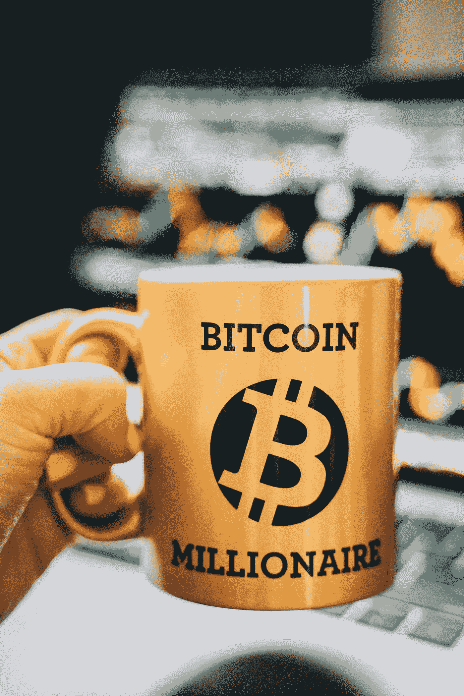
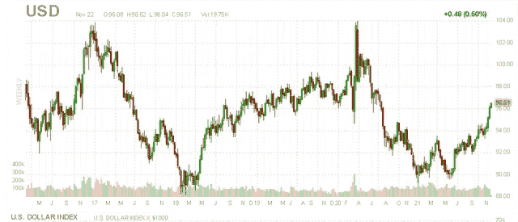
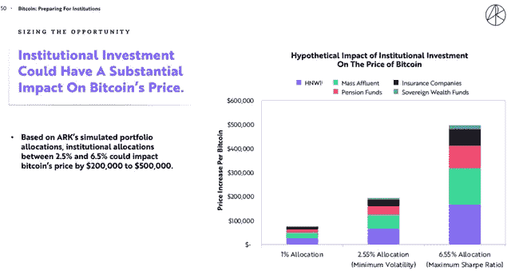

# 比特币是 2022 年的好投资吗| 2022 年投资的最佳加密货币

> 原文：<https://medium.com/coinmonks/is-bitcoin-a-good-investment-in-2022-best-cryptocurrency-to-invest-in-2022-344b8e18e331?source=collection_archive---------3----------------------->

# 比特币是 2022 年的好投资吗| 2022 年投资的最佳加密货币

在本文中，您将了解 2022 年长期投资于的[最佳加密货币，并了解比特币在 2022 年是否会达到 10 万美元，以及对 2025 年比特币价格的各种预测。](http://bitcoininvestmentrex.com)

这将真正带你深入思考这个问题的结果:2022 年，比特币是一项好的投资吗？

加密货币在过去几年中流行起来，以至于另类投资类别基本上已经成为主流。

虽然比特币是第一种并且仍然是最知名的加密货币，但实际上成千上万的其他加密货币已经进入了这个领域。

围绕这一资产类别大肆宣传的部分原因是一些投资者获得了巨大的回报。比如，比特币是 2011 年 3 月至 2021 年 3 月期间表现最好的资产，年化回报率高达惊人的 230%。

在此期间，第二个表现最好的资产类别是纳斯达克 100 指数 ETF，代码为 QQQ，年化回报率“仅为”20%。

比特币([BTC-美元](https://seekingalpha.com/symbol/BTC-USD?source=content_type%3Areact%7Csection%3Amain_content%7Cbutton%3Abody_link))交易价格低于 6 万美元，自上周触及 69 万美元的历史高点后遭到抛售。

没有太多的标题来解释当前的疲软，尽管它是在一个怪物般的反弹背景下出现的，BTC 今年仍上涨了约 100%，从 7 月的低点开始也有类似的表现。

在技术上超买的情况下，一些获利回吐可能已经过期，我们在这里的信息是，最近上涨的健康整合最终可以建立下一个上涨。

但是，快速增长的加密货币市场将会怎样？以下是 2022 年最受欢迎的加密货币预测。

# 比特币技术展望

就像钟表一样，只要有波动的迹象，熊市就会突然出现，宣布“顶部已经到来”，或者宣布这是“加密冬天”的开始。通过快速的互联网搜索，这似乎是当今主导头条新闻的流行语。众所周知，加密货币具有很高的波动性，对于该资产类别来说，最新的举动完全正常。

开门见山地说，我们认为，只要比特币继续在 50k 美元上方交易，作为下一个主要技术支持水平和关键生理水平，中期势头就会保持看涨。

追溯到今年 2 月，比特币已经围绕 5 万美元进行了几次关键的转向。我们预计，如果该线下跌，多头将会奋力一搏并守住该线，这可能是增加头寸的好时机。

通过这种方法，我们在当前价格下有一个战术性的“持有”评级，假设比特币将保持波动，填补最近几个月的上升趋势。另一方面，跌破 50k 美元将标志着更深的调整，为重新测试 7 月份的低点至 30k 美元打开了大门，我们认为这不太可能，需要某种无法预见的重大监管挫折。

有理由认为，目前的一些宏观趋势也代表着逆风，增加了波动性。

随着市场开始考虑美联储加息，美元走强，利率飙升。比特币作为一种全球资产，在世界各地交易，其价格与各种其他货币相对。对于给定名义金额的任何其他外币，如欧元、英镑、澳元，甚至墨西哥比索，强劲的美元会使加密货币对当地投资者来说相对更贵。

同样，收益率曲线上较高的利率使得风险资产相对于新债券头寸中较高的无风险回报而言吸引力下降。这些是推动所有金融市场交易的一些日常技术细节。

(来源:[finviz.com](http://finviz.com/))

举例来说，从高层面来看，欧元兑美元汇率下跌几个百分点或 10 年期美国国债利率上涨 50 个基点，对比特币价格的影响微乎其微，但最终会影响整体情绪。作为背景，美元指数自今年低点以来已经攀升了令人印象深刻的 7%，我们认为短期内还会有更多上涨。

由于与加密货币有关，长期前景更多地基于这样一种观点，即所有法定货币的供应都在扩大，而比特币仅限于[2100 万枚硬币](https://www.blockchain.com/charts/total-bitcoins)，而已经开采的硬币有 1890 万枚。更多的纸币追逐比特币是该资产类别长期看涨理论的关键部分。

# 比特币在 2022 年的积极发展

就基本面而言，今年有许多积极的进展，这增加了比特币的前景。

就在这个月，在网络协议上实现了一个重大的“[主根更新](https://seekingalpha.com/news/3770366-bitcoins-biggest-upgrade-in-four-years-taproot-goes-live?source=content_type%3Areact%7Csection%3Amain_content%7Cbutton%3Abody_link)”，有效地增加了一个比特币区块可以容纳的交易数量。

这对比特币来说是一个游戏规则的改变者，因为它促进了网络上智能合约的生态系统，缩小了今年在以太坊( [ETH-USD](https://seekingalpha.com/symbol/ETH-USD?source=content_type%3Areact%7Csection%3Amain_content%7Cbutton%3Abody_link) )上极其流行的功能差距。

从分散金融“defi”到不可替代代币(NFT)和其他应用程序，现在都可以更容易地通过比特币而不是许多其他在该领域处于领先地位的替代加密货币工作。我们认为最近的抛售除了时间上的巧合之外，没有任何其他原因。

也许 2021 年最令人鼓舞的信号是来自 [SEC 主席](https://seekingalpha.com/news/3749232-secs-gary-gensler-says-the-us-wont-ban-crypto-bloomberg?source=content_type%3Areact%7Csection%3Amain_content%7Cbutton%3Abody_link) Gary Gensler 的直接声明，暗示“美国不会禁止加密货币”

在此之前，货币监理署(OCC)发布了有利的指导方针，允许受监管的金融机构提供托管服务，并为加密货币支付提供便利。

事实上，美国财政部刚刚宣布了一个新的框架，描述了银行业内加密货币的[合法性。](https://www.federalreserve.gov/newsevents/pressreleases/files/bcreg20211123a1.pdf)

这与中国和印度等国家采取措施限制数字资产扩散的努力形成了鲜明对比。在这一点上，令人鼓舞的是，即使中国有效地关闭了加密的大门，市场还是有弹性的。

10 月，比特币的一大胜利是 SEC 批准了首只[交易所交易基金](https://seekingalpha.com/news/3755301-proshares-bitcoin-strategy-etf-witnesses-total-trade-volume-just-shy-of-1b-on-its-debut?source=content_type%3Areact%7Csection%3Amain_content%7Cbutton%3Abody_link)，该基金与 ProShares 比特币策略交易所交易基金(NYSEARCA: [BITO](https://seekingalpha.com/symbol/BITO?source=content_type%3Areact%7Csection%3Amain_content%7Cbutton%3Abody_link) )以及瓦尔基里比特币策略交易所交易基金(NASDAQ: [BTF](https://seekingalpha.com/symbol/BTF?source=content_type%3Areact%7Csection%3Amain_content%7Cbutton%3Abody_link) )一起跟踪上市比特币期货合约的表现。

尽管美国证交会以持续的市场监管担忧为由，叫停了直接投资于现货比特币市场的产品，但包括追踪“加密股票”的交易所交易基金在内的上市产品的增长，增加了流入该行业的资本，推动了看涨的需求。其中包括 Bitwise Crypto Industry Innovators ETF(NYSEARCA:[BITQ](https://seekingalpha.com/symbol/BITQ?source=content_type%3Areact%7Csection%3Amain_content%7Cbutton%3Abody_link))、Global X block chain ETF(NASDAQ:[BKCH](https://seekingalpha.com/symbol/BKCH?source=content_type%3Areact%7Csection%3Amain_content%7Cbutton%3Abody_link))和 va neck Vectors Digital Transformation ETF(NASDAQ:[DAPP](https://seekingalpha.com/symbol/DAPP?source=content_type%3Areact%7Csection%3Amain_content%7Cbutton%3Abody_link))，它们都是在今年推出的。

这组基金跟踪越来越多的公司，这些公司有能力从加密市场的增长以及比特币矿业股票、金融服务公司和更广泛的区块链科技公司之间的价格上涨中受益。总体而言，在更广泛的加密和区块链生态系统中有一种持续增长的感觉，这可能对加密货币的价格有利。

## [立即开始在 Bitcoininvestmentrex 投资加密，并从您的加密中赚取 30% — 50%的利润](https://bitcoininvestmentrex.com/bitcoin-investment-plan/)

# 比特币的长期看涨顺风

# 比特币是 2022 年长期投资的最佳加密货币

越来越多的人认识到，比特币和加密货币将继续存在。

除了作为支付方法的效用之外，主要金融机构接受加密货币是一种合法的替代资产类别，这是资本流入该领域的主要驱动因素之一，在我们看来，这是支持价格上涨到 2022 年的最乐观的驱动因素。

根据方舟投资管理公司(Ark Investment Management)的研究，世界各地的机构系统地将 1%的资本投入比特币，可能会使其价格增加 10 万美元。

(来源:[方舟投资](https://research.ark-invest.com/hubfs/1_Download_Files_ARK-Invest/White_Papers/ARK%E2%80%93Invest_BigIdeas_2021.pdf))

该小组的研究还发现，根据他们的模拟投资组合优化模型，比特币的 6.55%配置将最大化夏普比率方面的风险调整投资组合回报潜力。

虽然这种情况可能需要数年时间，但机构在这一水平上配置比特币可能会使比特币的价格递增 50 万美元。

有迹象表明，[美国养老基金](https://www.nasdaq.com/articles/us-public-pension-fund-invests-in-bitcoin-for-the-first-time-2021-10-21)刚刚开始认真考虑比特币，包括休斯顿消防员救济和退休基金中的第一只美国基金投资 2500 万美元的报道。

展望未来，我们预计这些趋势将继续，包括保险公司和主权财富基金的举措，这将增加潜在需求。未来十年，像 MicroStrategy([【MSTR】](https://seekingalpha.com/symbol/MSTR?source=content_type%3Areact%7Csection%3Amain_content%7Cbutton%3Abody_link))、 [Square Inc.](https://www.cnbc.com/2021/02/23/square-buys-170-million-worth-of-bitcoin.html) ( [SQ](https://seekingalpha.com/symbol/SQ?source=content_type%3Areact%7Csection%3Amain_content%7Cbutton%3Abody_link) )甚至特斯拉(Tesla Inc .)这样的公司购买比特币作为资产负债表现金替代品的举动可能会变得司空见惯。

# 2022 年比特币和加密预测

# 以太坊可能超越比特币

以太坊没有比特币那么广为人知，但应该是。目前，以太坊是第二大加密货币，其收益一直超过比特币。如果目前的轨迹继续下去，以太坊很可能在 2022 年的某个时候取代比特币成为最有价值的加密货币。这可能使以太坊成为投资者的一个有趣选择，这些投资者希望分散他们的加密投资组合，而不仅仅是拥有比特币。

# Cryptos 将成为更受欢迎的支付来源

反对加密货币的一个主要理由是，它不被接受为传统货币的可行替代品。如果这种情况发生，许多加密货币可能真的变得一文不值。然而，2021 年发生了相反的事情，这种趋势似乎可能会持续到 2022 年。随着越来越多的企业开始接受比特币等加密货币作为法定货币，加密货币的可行性和价值都可能会增加。

# 各国央行将发行自己的数字货币

中国一直在推动各国采用央行发行的数字货币。为了抵御现有加密货币的威胁，许多其他国家也在考虑创建自己的数字货币。尼日利亚的 E-Naira 于 2021 年创建并于今年推出，这一趋势可能会导致其他国家在 2022 年采用并创建自己的国家密码。通过管理和控制自己的数字货币，各国可以避免现有加密货币不受监管、分散的特性。

# 投资者和公司可能会提高他们的加密分配

随着加密货币变得更加主流，它越来越经常地被个人投资者和公司的投资组合所采用。一些金融顾问现在建议加密货币分配几个百分点，更多的公司正在将现金分配给加密货币和数字资产。这些类型的配置转移往往会呈现出自己的势头，这意味着越来越多的资金可能会在 2022 年流入加密货币。

# 一些，也许是许多，密码将变得毫无价值

虽然加密货币被接受的总体趋势似乎在增加，成千上万的加密货币都在争夺行业空间，但不可避免的是，一些(如果不是很多)加密货币将失去所有价值。行业领导者比特币仍然有许多主要投资者反对它，这表明比特币的最终价值将为 0 美元。如果最大和最知名的加密货币倒下，可能不会有太多的支持数以千计的不太有用或不被接受的次要加密货币。

# 2022 年比特币能否达到 10 万美元？

# 2021 年的价格目标可能遥不可及，但比特币需求的飙升可能会在明年推动其达到这一水平。

2021 年，距离新年还有一个月，比特币([**【BTC】**](https://www.fool.com/quote/crypto/btc/)**【1.61%)**的价值已经翻了近一番。不过，这是一段疯狂的旅程。经过去年冬天的大幅上涨后，最初的加密货币价格在夏季下跌了一半，只是在秋季再次创下历史新高。

但随着新的奥米克隆冠状病毒变种再次让投资市场陷入混乱，人们期待已久的 10 万美元比特币里程碑(比本文撰写时的市价高 74%)仍然遥遥无期，看起来不太可能在 2021 年达到。

但是加密货币的价格是不稳定的，无论是下跌*还是上涨*。它的比特币可能在 2022 年达到 10 万美元大关。这是可能发生的情况。

# 另一个比特币上涨的三个催化剂

自 2009 年推出以来，比特币一直享有先行者的地位，比现在第二大加密货币**【以太坊】(**[**ETH**](https://www.fool.com/quote/crypto/eth/)**2.89%)**领先[六年。比特币的市值超过 1 万亿美元，在拥挤的加密货币领域也占据高位，并在个人和机构投资者中获得了大量采用者。](https://www.fool.com/the-ascent/buying-stocks/articles/if-you-bought-100-worth-of-ethereum-at-the-start-heres-how-much-youd-have-today/)

但由于它是一种稀缺资源(目前，在 2100 万枚硬币的长期最高值中，已开采了近 1890 万枚硬币)，如果需求增加，比特币可能会更高。以下三个因素可能会让明年的油价升至 10 万美元:

*   如果通货膨胀持续，比特币被视为一种价值储存手段。
*   采用在公司、机构投资者和主权国家之间传播。
*   在 Taproot 更新后，比特币网络作为分散金融(DeFi)解决方案的采用增加。

## [今天就开始在 Bitcoininvestmentrex.com 投资加密技术，从您的加密技术中赚取 30% — 50%的利润](https://bitcoininvestmentrex.com/bitcoin-investment-plan/)

# 比现金更好的保值选择？

由于疫情的影响，基本商品和服务的价格将在 2021 年飙升，美联储董事长 Jerome Powell 经常将通胀称为“暂时”事件。我也认为通货膨胀是暂时的，也许会在 2022 年开始缓解。

但由于供应链仍然受到限制，随着我们进入通胀环境的第二年，“暂时”这个形容词在美联储已经过时了。

随着通胀侵蚀现金的购买力，许多投资者开始接受比特币作为合法资产类别的一个原因是，它有可能跟上(或超过)经济中更高的价格。

这是因为可以开采的硬币数量有上限，而像美元这样的法定货币没有印刷数量的限制。

如果通胀担忧在 2022 年持续存在，更多的投资者可能会寻求比特币作为现金的替代品，这可能有助于推动比特币向 10 万美元的目标线迈进。

# 大投资者的更多采用

所有迹象都表明，越来越多的大型机构投资者开始涉足加密货币行业。例如，**银门资本(**[**SI**](https://www.fool.com/quote/nyse/si/)**-2.03%)**银行运营着一个交易所(称为 SEN)，该交易所[促进数字货币的全天候支付，](https://www.fool.com/investing/2021/10/29/battle-of-the-crypto-banks-silvergate-capital-vs-s/)这是加密货币投资者和交易者的一项重要能力，因为市场总是开放的。截至第三季度末，SEN 拥有 1，305 家机构用户，高于三个月前的 1，224 家和去年同期的 928 家。

除了大投资者，中美洲的萨尔瓦多共和国最近成为第一个接受比特币作为法定货币的国家。其他国家，尤其是拉丁美洲国家，也表示有朝一日有兴趣效仿。一些大公司也用比特币取代了资产负债表上的部分或全部现金。

在机构投资者的支持下，这些加密货币的采用者也可能刺激较小的散户投资者。上述所有需求的提振可能会推动比特币的价值在 2022 年达到 10 万美元。

# 比特币日常功能的更新

2021 年 11 月，比特币区块链网络经历了自 2017 年以来的首次重大更新。被称为 Taproot 的升级旨在使比特币成为日常服务和应用(基于在线的数字支付、借贷等)更可行的解决方案。).

这是比特币一直在努力的一个领域，因为其区块链的特点使其难以用于日常支付解决方案。相比之下，以太坊是专门为 DeFi 建造的，在这方面占主导地位。

矿工和其他加密货币持有者花了数年时间才采用了最近一次重大的比特币更新(称为 SegWit)。

然而，Taproot 在其用户和投资者生态系统中获得了压倒性的支持，生态系统的逐步更新可能会吸引使用 cryptos 构建新金融服务和产品的开发者。

比特币作为交易手段的日常使用越来越多，这对其在 2022 年的价值来说也是一个好消息。

# 2022 年该不该投资比特币？

我这里不是说你应该挤进比特币。投资任何种类的加密货币——包括最原始和最大的代币——并不适合所有人。

但随着当前俄罗斯和乌克兰的紧张局势，我们应该期待比特币获得主流采用。

乌克兰和俄罗斯正从比特币和加密生态系统的内在价值中受益匪浅。

俄罗斯利用比特币抵制制裁，乌克兰通过加密获得约 4500 万美元的捐款，这些事件刺激了比特币和加密的大规模采用。

瑞士卢加诺市刚刚宣布比特币为法定货币，紧随萨尔瓦多在 2021 年宣布比特币的脚步。

随着主要机构和对冲基金跳上比特币的马车，将投资组合的一部分分配给 crypto 是一个不错的选择。

即使比特币在 2022 年达到 10 万美元，这也将是一次疯狂的旅程。如果你真的投资于这个动荡的领域，把这些赌注保持在你总可投资净值的一小部分。

如果你决定用比特币替换投资组合中的任何现金头寸，不要用完你所有的美元。

随着时间的推移，通货膨胀确实会侵蚀你的购买力，但现金也有它的好处。它的价值不会像加密货币那样波动，拥有一些现金可以提供在投资价值不可避免的下跌时购买的机会。

然而，比特币正在引起全球各种大型机构的兴趣，2022 年很有可能上涨。如果你对投资加密货币感兴趣，比特币是一个很好的起点。

## [立即开始在 Bitcoininvestmentrex 投资加密，从您的加密中赚取 30% — 50%的利润](https://bitcoininvestmentrex.com/bitcoin-investment-plan/)

**所提供的信息不打算用作任何投资决策的唯一依据，也不应被解释为旨在满足任何特定投资者投资需求的建议。所提供的任何内容均不构成财务、税务、法律或会计建议，也不构成量身定制的投资建议。此信息仅用于教育目的。**

> 加入 Coinmonks [电报频道](https://t.me/coincodecap)和 [Youtube 频道](https://www.youtube.com/c/coinmonks/videos)了解加密交易和投资

# 另外，阅读

*   [印度的加密交易所](/coinmonks/bitcoin-exchange-in-india-7f1fe79715c9) | [比特币储蓄账户](/coinmonks/bitcoin-savings-account-e65b13f92451)
*   [OKEx vs KuCoin](https://coincodecap.com/okex-kucoin) | [摄氏替代度](https://coincodecap.com/celsius-alternatives) | [如何购买 VeChain](https://coincodecap.com/buy-vechain)
*   [币安期货交易](https://coincodecap.com/binance-futures-trading)|[3 commas vs Mudrex vs eToro](https://coincodecap.com/mudrex-3commas-etoro)
*   [如何购买 Monero](https://coincodecap.com/buy-monero) | [IDEX 评论](https://coincodecap.com/idex-review) | [BitKan 交易机器人](https://coincodecap.com/bitkan-trading-bot)
*   [CoinDCX 评论](/coinmonks/coindcx-review-8444db3621a2) | [加密保证金交易交易所](https://coincodecap.com/crypto-margin-trading-exchanges)
*   [红狗赌场评论](https://coincodecap.com/red-dog-casino-review) | [Swyftx 评论](https://coincodecap.com/swyftx-review) | [CoinGate 评论](https://coincodecap.com/coingate-review)
*   [Bookmap 评论](https://coincodecap.com/bookmap-review-2021-best-trading-software) | [美国 5 大最佳加密交易所](https://coincodecap.com/crypto-exchange-usa)
*   [如何在 FTX 交易所交易期货](https://coincodecap.com/ftx-futures-trading) | [OKEx vs 币安](https://coincodecap.com/okex-vs-binance)
*   [CoinLoan 审核](https://coincodecap.com/coinloan-review) | [YouHodler 审核](/coinmonks/youhodler-4-easy-ways-to-make-money-98969b9689f2) | [BlockFi 审核](https://coincodecap.com/blockfi-review)