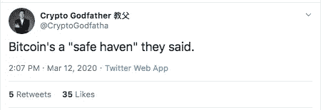
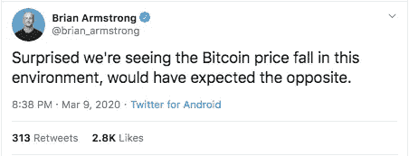
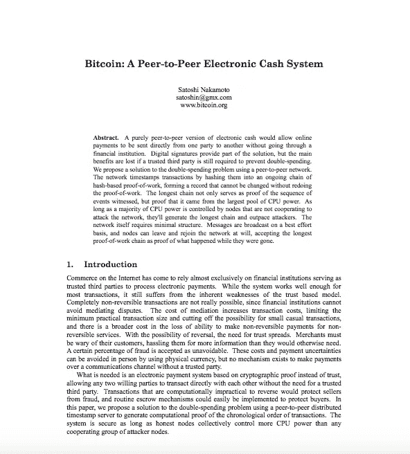

# 比特币是避风港吗？一定要这样吗？

> 原文：<https://medium.com/coinmonks/is-bitcoin-a-safe-haven-does-it-have-to-be-cae934333787?source=collection_archive---------2----------------------->

在 2008 年经济危机之后，中本聪建立了世界上第一个加密货币，比特币。它的创立是为了反抗中央集权和传统的银行方式。本周，另一场金融灾难席卷全球，股市大幅下跌。虽然[比特币](https://blog.coincodecap.com/tag/bitcoin/)被吹捧为危机发生时的避风港，但这种数字资产随着股票市场的轨迹暴跌。

这不仅在[密码](https://blog.coincodecap.com/tag/crypto/)社区，而且在整个金融领域引发了一场辩论。就像所有人一样，我们也很困惑[比特币](https://blog.coincodecap.com/tag/bitcoin/)是否是一个安全的避风港。但这种情况下的关键问题是——一定要这样吗？在这篇短文中，ChangeHero 试图找到这些问题的答案。

> 还看:[对比特币的坦诚解释](https://blog.coincodecap.com/a-candid-explanation-of-bitcoin/)

## 黑色星期一

3 月 9 日，星期一，世界各地的股票市场以重大损失收盘。据英国广播公司报道，在美国，道琼斯工业平均指数下跌超过 2000 点。同样，标准普尔 500 指数和纳斯达克指数分别下跌了 7.6%和 7.3%。英国和欧洲国家的股市指数也出现了类似的下跌。

分析师将此次衰退归因于冠状病毒疫情的爆发，该疫情导致中国制造业停产。更糟糕的是，最近俄国和石油输出国组织之间的谈判变得苍白无力，沙特发动战争故意降低价格。整个场景导致了自 2008 年全球经济危机以来最严重的市场崩溃，这一天被称为黑色星期一。与此相反，黄金一如既往地充当着避风港的角色，突破了每盎司 1700 美元的七年高点。

## 输入比特币

比特币长期以来被誉为数字黄金，加密专家称它填补了传统股票的空白。世界上第一种[加密货币](https://blog.coincodecap.com/tag/cryptocurrency/)采用数字稀缺硬编码，供应量仅限 2100 万。这使得这种资产类似于黄金等贵金属。尽管其他加密货币也遵循了同样的诀窍，但它们无法像比特币那样吸引人群并达到高度。

比特币是一种非相关资产，这意味着相对于股票和债券等传统资产，它不会向任何方向移动。SFOX 的一份[报告](https://blog.sfox.com/bitcoin-2019-performance-returns-correlations-volatility-year-end-review-a15fe460c90)支持了比特币是安全避风港的观点。在他们的分析中，比特币在 2019 年与标准普尔 500 指数和黄金都没有关联。此外，与黄金相比，数字资产的年回报率更高，波动性更小。

## 大屠杀

2020 年初，比特币以惊人的速度上涨，突破一万美元大关。价格的突然下跌粉碎了精通密码的人的希望。这场风暴发生在三月的第二周，比特币[在两天内损失了令人震惊的 50%。低价竞标也受到了冲击，导致超过 500 亿美元从市场上抹去。截至发稿时，根据 CoinMarketCap 的数据，BTC 跌破 5500 美元。](https://www.forbes.com/sites/billybambrough/2020/03/12/the-real-reason-behind-bitcoin-ethereum-ripples-xrp-and-litecoins-50-billion-crash/#1cabeea769b5)

可悲的是，这种急剧的趋势与传统市场遭受巨大损失的全球经济形势有关。引发了比特币是否真的是避风港的讨论。然而，一些人认为这场血战与庞氏骗局 Plus Token 有关。上周六，他们出售了价值超过 1 亿美元的比特币，并用比特币和卖单淹没了市场。据说这引发了市场的崩溃。

Source: [Crypto Godfather](https://twitter.com/CryptoGodfatha/status/1238059095682199556); [Brian Armstrong](https://twitter.com/brian_armstrong/status/1237070332374081536)

许多人在推特上表达了他们对此的看法。化名为 [Crypto](https://blog.coincodecap.com/tag/crypto/) Godfather 的 Block Journal 首席执行官很快对比特币是避风港的说法进行了嘲讽。比特币基地公司的首席执行官 Brian Armstrong 似乎对市场形势感到困惑。我们也发现许多推特用户取笑当前的情况。

## 回到基础——比特币:一个点对点的电子现金系统

Source: [Bitcoin](https://bitcoin.org/bitcoin.pdf)

比特币白皮书的标题明确引用了“一个点对点的电子现金系统”。很明显，中本聪创造了比特币作为支付手段。在声称是避风港的争论中，比特币的最初目的——一种点对点版本的数字现金交易价值——被遗忘了很久。

我们都知道，这种数字资产的供应是有限的，随着使用的增加，需求增加，这将导致价值的飙升。要看到比特币或任何加密技术的价值，唯一的方法就是将其投入使用。为了实现这一点，必须进行一些开发，使大众在日常生活中从美钞转向使用密码，并且必须提高人们对密码的认识。简而言之，领养是关键。

那么，比特币是避风港吗？历史回顾表明这并不相关，但目前的形势迫使许多人得出结论，这并不相关。下一个也是最重要的问题是——T2 的比特币真的必须是安全港吗？不，不需要，至少现在不需要。人们现在需要的是一种分散的货币，能够提供无缝支付，这确实会使它在未来比其他货币更有价值。

如果你喜欢这篇文章，请鼓掌，并发表评论来引发讨论。更多这类信息丰富且有趣的文章，请在 [Twitter](https://twitter.com/Changehero_io?lang=en) 和 [Medium](/@changehero) 上关注 [ChangeHero](https://changehero.io/?utm_source=Medium&utm_medium=Content) 。

> [直接在您的收件箱中获得最佳软件交易](https://coincodecap.com/?utm_source=coinmonks)

