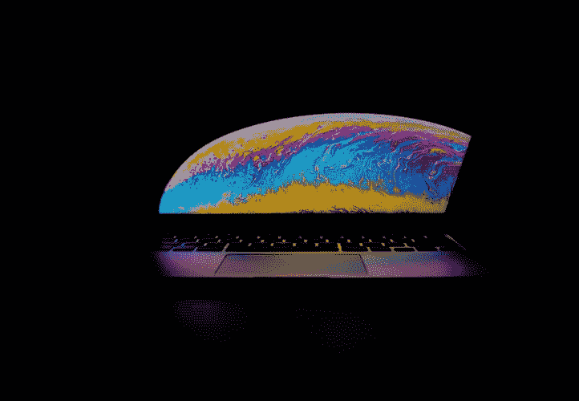

# 比特币处于均衡状态吗？

> 原文：<https://medium.com/coinmonks/is-bitcoin-at-equilibrium-9e80bddd4deb?source=collection_archive---------5----------------------->

这可能是一件好事。

Source: [Victor Garcia](https://unsplash.com/@victor_g)

在过去动荡的几个月里，比特币的价格未能大幅突破 12500 美元的上限，而是徘徊在 10000 美元的心理水平之上，并在下方徘徊。截至目前，价格为 10，700 美元，除了横盘之外，没有任何迹象表明未来一周价格会进一步显著波动。