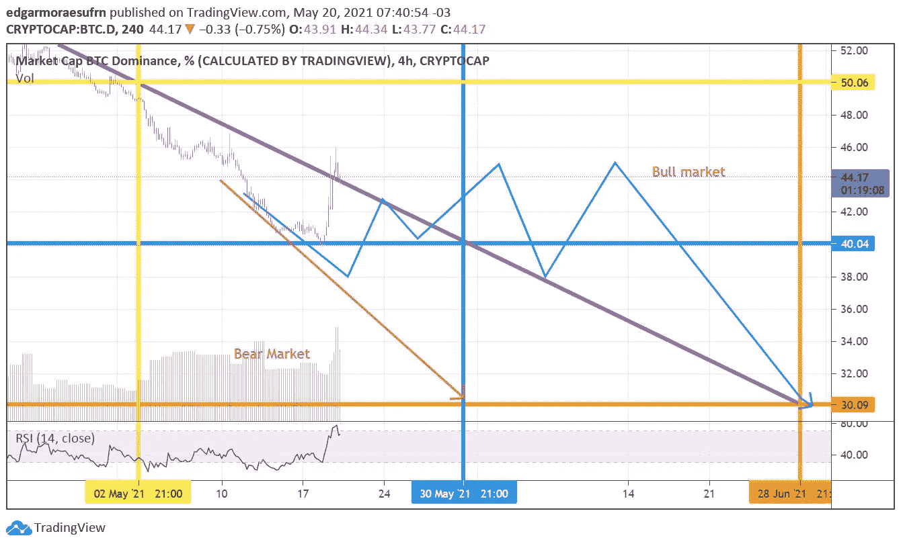
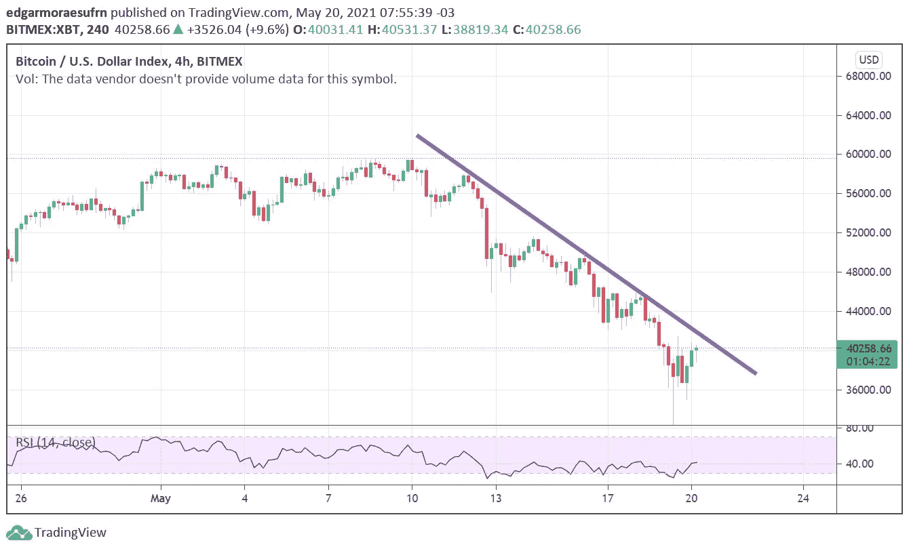
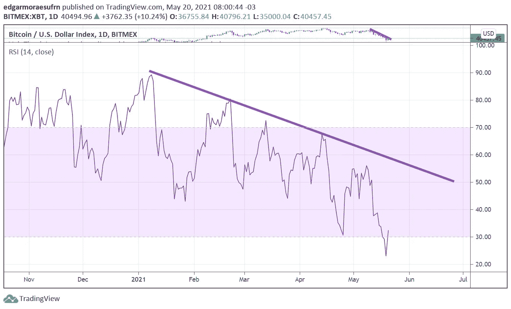
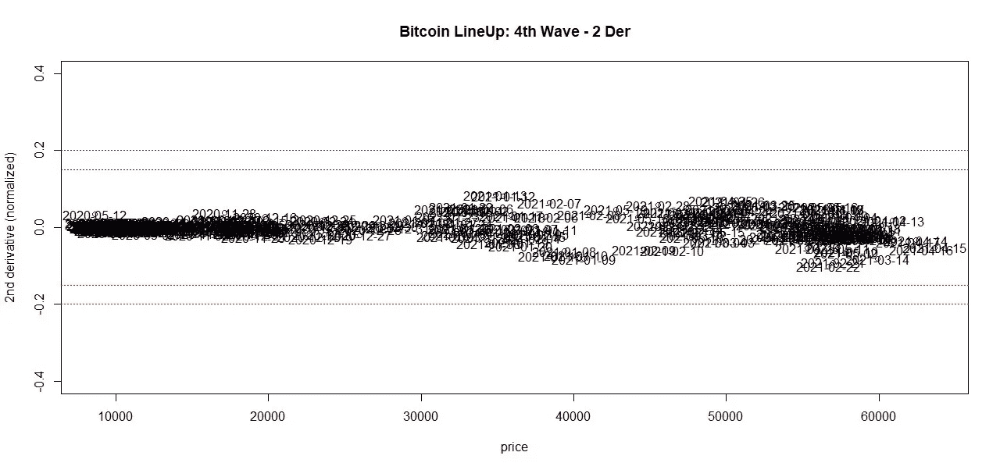
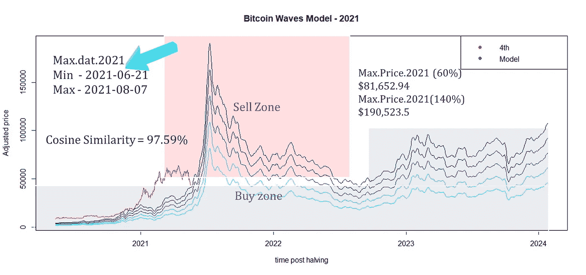

# 比特币死了吗？市场分析

> 原文：<https://medium.com/coinmonks/is-bitcoin-dead-36a6cf75905a?source=collection_archive---------2----------------------->

## **简介**

在这些动荡的日子里，很多人找我，问比特币是不是死了。一个人有可能毁掉比特币吗？不，这是不可能的，因为比特币没有领袖，也永远不会有。

到目前为止，Pi 周期是唯一匹配这波牛市结束的指标[1]。另一方面，著名的指标，如 MVRV、储备风险、2 年移动平均乘数、Puell 倍数、对数增长曲线、股票流量和伟大计划 B 的 S2Fx、黄金比例、rHODL 和未实现净损益都没有达到顶部，恕我直言，我的指标*比特币阵容*和*比特币波动*指向市场操纵，仅此而已。

有鉴于此，本研究建议调查三条下降趋势线观察和最终预测的*比特币系列*和*比特币波*隐含和明确揭示的潜力和可能的牛市连续性。

## **三条下降趋势线**

比特币需要克服三大挑战，以确保这波牛市的持续性。第一个是市值 BTC 优势(图 1)。

Figure 1\. Market Cap Bitcoin Dominance (%).

来自图 1 的第一个重要信息是，比特币的统治地位克服了紫色下降趋势线。如果统治力顺着红线走，大概比特币在熊市跳水。但是，如果统治地位遵循蓝线或类似的，比特币将仍然活着。

现在，比特币有两条大的下降趋势线需要克服:比特币价格(图 2)和相对强度指数 RSI(图 3)。

Figure 2\. The downtrend line of Bitcoin price (4h).

Figure 3\. The downtrend line of Bitcoin Relative Strength Index, RSI (1D).

在我看来，对于这项挑战国家和精英的伟大技术来说，这是一个小小的争议。HODL！

## **比特币阵容**

在*比特币阵容*指标【2】的基础上，利用导数测试定位比特币价格函数的临界点。如图 4 所示，二阶导数测试有助于找到最佳的卖出时机。

Figure 4\. Price of Bitcoin vs 2nd derivative scaled (autoscaling).

如果*比特币阵容*指标小于-0.2，则是卖出的最佳时刻，二阶导数非常负。事实上，指标还远没有结束。

## **比特币浪潮**

*比特币波动*模型预测了宏观经济周期的可能性(图 5)。使用比特币价格的增长率、每天的比特币交易数量以及以分钟为单位挖掘一个区块的平均时间来调整模型。

Figure 5\. Bitcoin Waves Model — 2021

最后，根据模型，如果通过克服三个下行趋势来确认宏观周期，则预测价格指向 81，600 美元至 190，500 美元之间的最高价格。这不是财务建议。

## **结论**

> 比特币还活着。

如果您喜欢这些内容，请考虑以下建议:

BTC:BC 1 qljlmuwq 9 gyvn 7 uhvwwypsj 4x 8 hcetuzhw 9 quh 0

BNB:bnb 159am 7 huy 53mg 7 sygnklrtxkahkdk 2 qxzmnk 0 GW

BUSD:bnb 159am 7 huy 53mg 7 sygnklrtxkahkdk 2 qxzmnk 0 GW

## **致谢**

作者感谢、Hal Finney、Nick Szabo、赵昌鹏、Sabrina Moraes、Fernando Ulrich、André Fauth、Criptomaníacos 和 Vela Trader。

## **参考文献**

1.[https://www . inbitcoiwetrust . net/pi-cycle-says-bit coins-bull-market-just-ended-and-nobody-cares-d5e 00 b5 c 8858](https://www.inbitcoinwetrust.net/pi-cycle-says-bitcoins-bull-market-just-ended-and-nobody-cares-d5e00b5c8858)

2.[https://medium . com/coin monks/bit coin-line-a-linear-transformation-for-price-support-modeling-e 513715 b 8288](/coinmonks/bitcoin-lineup-a-linear-transformation-for-price-support-modeling-e513715b8288)

3.[https://medium . com/coin monks/bit coin-waves-a-linear-combination-for-price-modeling-2b 89 f 72 e 552d](/coinmonks/bitcoin-waves-a-linear-combination-for-price-modeling-2b89f72e552d)