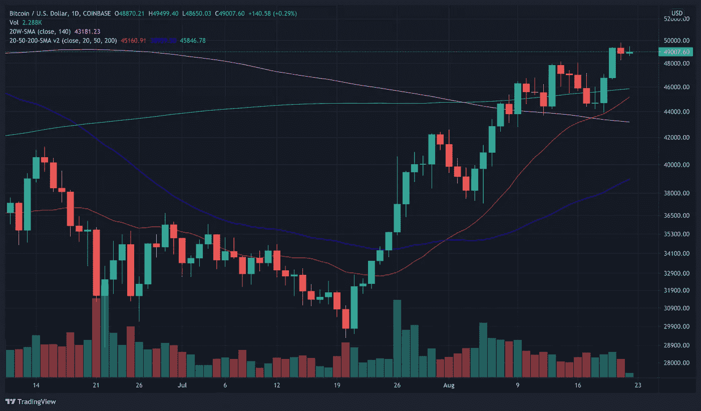
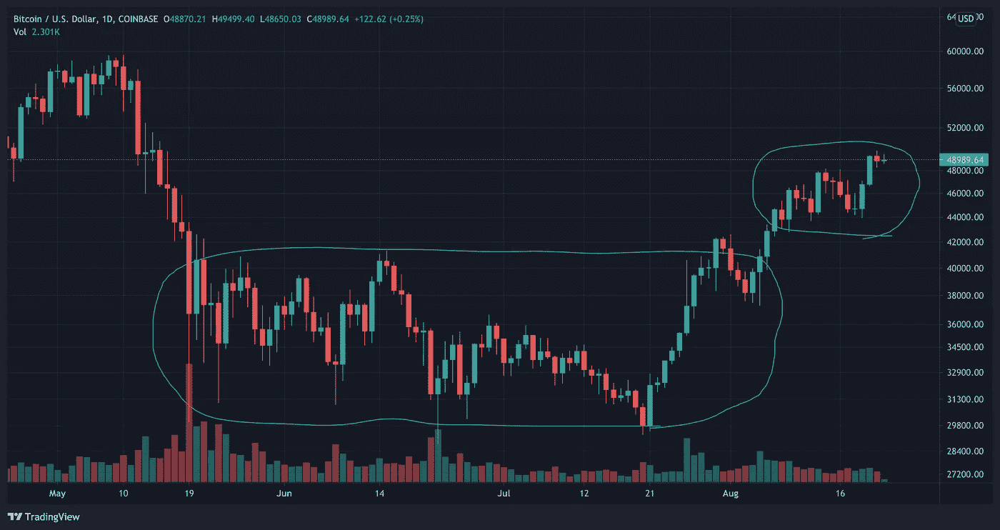
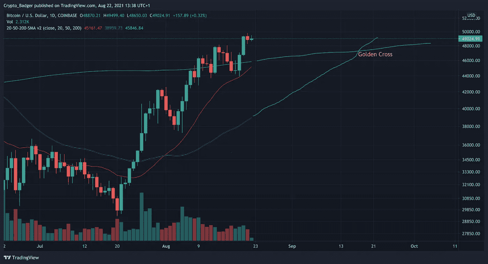

# 2021 年比特币会达到 10 万美元吗？

> 原文：<https://medium.com/coinmonks/is-bitcoin-going-to-reach-100k-usd-in-2021-6d65676b2cb7?source=collection_archive---------0----------------------->

在比特币从 2020 年末到 2021 年 4 月相当壮观、似乎几乎不可阻挡的运行，以及随后在 2021 年 5 月几乎同样壮观的崩溃之后，每个人的问题都是:比特币和加密市场的其余部分接下来会怎样？

毕竟，大多数(如果不是全部的话)著名的加密 YouTubers 都宣称，在今年年底之前，或者最早在今年夏天，比特币的价格会在 10 万到 30 万之间。即使是现在，你仍然可以在 YouTube 和 Twitter 上找到声称 100k 比特币将在年底前到来的人。

# 那么，今年比特币会冲击 100k 吗？

嗯，简而言之，不，我不这么认为。

当然，没有人能 100%准确地预测市场会做什么或不会做什么，但比特币在今年年底前达到 10 万或更多的可能性非常小。事实上，我不明白怎么会有人声称这仍然是可能的。现在，不要误解我——总体而言，我非常看好比特币。我的投资组合中大约有 50%是比特币，我毫不怀疑在这个市场周期中它将达到 100k +。我只是不认为它会像一些人期望的那样快。

# 这是为什么呢？

简而言之，这是比特币价格上涨所需投入的资金量。按照目前的价格(撰写本文时约为 49k)，比特币的市值略低于 9240 亿美元。

为了达到每枚硬币 100k 左右，我们需要价格增加到略高于 x2，这将使市值达到近 2 万亿美元。这是额外的 1 万亿美元，必须来自某个地方。

如此大量的资金要么需要大量的机构投资，要么需要巨额的散户投资。(还记得特斯拉买了价值 25 亿的比特币吗？这只是所需数量的 2.5%。)

> 这样的资金流入当然是可能的，但目前，我认为这是非常不可能的，特别是大量的零售投资进入 NFTs 和游戏。

尽管如此，在过去的一个月里(准确地说是从 7 月 21 日开始)，比特币一直在持续上涨，特别是在过去的 2 周里，它成功突破了一些关键的阻力位——20 周 SMA 和 200 天 SMA(下图中分别是紫色和绿色的线)。

The purple line is 20 week SMA and the green line is 200 day SMA

虽然这显然是一个非常看涨的信号，但也很明显，价格在过去 2 周内基本上一直在横盘整理。当然，我们打破了 30-40k 的沙盒，但我们会在 42-50k 的沙盒中呆多久还有待观察。

42–50k range highlighted above may seem more like a slow uptrend but I think it’s too early to draw such a conclusion, especially as 49–50k level shows very strong resistance.

重要的是要记住，价格在很大程度上是由市场情绪决定的。尽管最近情况确实有所改善，但仍有很多人持谨慎态度。一些今年才进入市场的人可能正在亏损，或者只有非常微薄的利润。在过去的 3 个月中，我们很少看到 30 出头的低点，甚至低至 27k，所以可以理解的是，这种情绪与我们持续上涨几周甚至几个月的时候有所不同。

最近的上升趋势是一个积极的迹象，但我们不会有另一个(适当的)牛市，直到比特币能够牢固地建立 20 周 SMA 作为支撑位(目前刚刚超过 43k)。这在历史上一直是比特币牛市的关键支撑线/阻力线。我们在 5 月 15 日跌破了它，尽管我们在 8 月 9 日设法超过了它，而且到目前为止我们还停留在它之上，现在说这是我们新的支撑位还为时过早。我们需要几周的持续上涨或者测试 20 周的 SMA 和反弹。如果我们的周收盘价低于它，那么我们可能会经历一个更大的下跌(可能到 30 多岁)，然后在我们再次上涨之前再横盘几周。

值得一提的是，我预计至少还需要 1-2 周的战斗才能突破 50k(并保持在 50k 以上)。我正在等待的下一个指标是黄金交叉——50 天均线超过 200 天均线(下图中蓝色和绿色的线)——这表明短期价格比长期价格上涨得快，或者换句话说，市场变得更加看涨。如果比特币的价格继续以目前的速度上涨，我们可以预计它将在 9 月中旬左右发生(抱歉，下图不是非常科学的近似值；).

This very rough estimate shows that the golden cross may occur around 18–19 September

# 比特币会涨到多高？

纵观之前的市场周期(2013 年、2017 年)，我们可以看到周期越来越长，投资回报递减。当然，数字越来越大，但如果我们看百分比(从周期底部或从减半计算)，投资回报率在每个周期都较低。

基于这一信息，我预计比特币将在 2022 年春末或夏季达到这一市场周期的顶部，价格约为 12 万英镑。周期越长，它可能达到的价格越高，但无论如何，我预计这个市场周期将在 2023 年底结束(在下一次减半之前，这可能发生在 2024 年 5 月)。如果周期确实如此之长，我预计比特币的价格将达到 15 万至 17 万英镑左右。

> 总而言之，是的，我预计比特币将达到并超过 100k，我只是认为这不会在今年年底前发生。如果我不得不做出一个有根据的猜测/可疑的猜测或你想称之为什么的话，我会说比特币将在今年年底前达到 70-85k，并将在 2022 年春天达到 120k 左右的市场周期峰值。

市场会做什么当然是任何人的猜测，但现在，我的交易是基于上述假设。我将在今年年底前和 2022 年春夏前后再次重温这篇文章，看看有多接近(或不接近！)我与我的预测；-)

你的想法是什么——这个市场周期什么时候结束？是今年还是以后？而比特币会达到什么价位？

如果你觉得这篇文章很有趣，请随时查看我的新 YouTube 频道。我贴了一些关于加密基础的教程和我对市场的想法。或者在[推特](https://twitter.com/iamcryptobadger)上关注我。

— —

## 放弃

本文涵盖的内容不应被视为投资建议。

我不是财务顾问。这些只是我自己的推测性观点、想法和理论。

不要纯粹根据本文提供的信息进行交易或投资。

在投资或交易之前，一定要做好自己的研究和尽职调查。我永远不会告诉你如何处理你的资本、交易或投资。我也永远不会建议你购买、出售、做多或做空任何资产、商品、证券、衍生品或加密货币相关工具，因为风险极高！

在交易或投资任何加密货币相关产品之前，您应该始终咨询专业/持牌金融顾问。

> 加入 [Coinmonks 电报频道](https://t.me/coincodecap)，了解加密交易和投资

## 另外，阅读

*   [尤霍德勒 vs 科恩洛 vs 霍德诺特](/coinmonks/youhodler-vs-coinloan-vs-hodlnaut-b1050acde55a) | [Cryptohopper vs 哈斯博特](https://blog.coincodecap.com/cryptohopper-vs-haasbot)
*   [币安 vs 北海巨妖](https://blog.coincodecap.com/binance-vs-kraken) | [美元成本平均交易机器人](https://blog.coincodecap.com/pionex-dca-bot)
*   [如何在印度购买比特币？](/coinmonks/buy-bitcoin-in-india-feb50ddfef94) | [WazirX 审核](/coinmonks/wazirx-review-5c811b074f5b) | [BitMEX 审核](https://blog.coincodecap.com/bitmex-review)
*   [比特币主根](https://blog.coincodecap.com/bitcoin-taproot) | [Bitso 回顾](https://blog.coincodecap.com/bitso-review) | [排名前 6 的比特币信用卡](/coinmonks/bitcoin-credit-card-bc8ab6f377c6)
*   [加密保证金交易交易所](/coinmonks/crypto-margin-trading-exchanges-428b1f7ad108) | [赚取比特币](/coinmonks/earn-bitcoin-6e8bd3c592d9) | [Mudrex 投资](https://blog.coincodecap.com/mudrex-invest-review-the-best-way-to-invest-in-crypto)
*   [WazirX vs CoinDCX vs bit bns](/coinmonks/wazirx-vs-coindcx-vs-bitbns-149f4f19a2f1)|[block fi vs coin loan vs Nexo](/coinmonks/blockfi-vs-coinloan-vs-nexo-cb624635230d)
*   [BlockFi 信用卡](https://blog.coincodecap.com/blockfi-credit-card) | [如何在币安购买比特币](https://blog.coincodecap.com/buy-bitcoin-binance)
*   [火币交易机器人](https://blog.coincodecap.com/huobi-trading-bot) | [如何收购 ADA](https://blog.coincodecap.com/buy-ada-cardano) | [Geco。一次审查](https://blog.coincodecap.com/geco-one-review)
*   [密码副本交易平台](/coinmonks/top-10-crypto-copy-trading-platforms-for-beginners-d0c37c7d698c) | [五大区块链替代方案](https://blog.coincodecap.com/blockfi-alternatives)
*   [信用贷款审核](https://blog.coincodecap.com/coinloan-review)|[Crypto.com 审核](/coinmonks/crypto-com-review-f143dca1f74c) | [货币融资融券交易](/coinmonks/huobi-margin-trading-b3b06cdc1519)
*   [顶级付费加密货币和区块链课程](https://blog.coincodecap.com/blockchain-courses) | [币安评论](/coinmonks/binance-review-ee10d3bf3b6e)
*   [在美国如何使用 BitMEX？](https://blog.coincodecap.com/use-bitmex-in-usa) | [BitMEX 评论](https://blog.coincodecap.com/bitmex-review)
*   [最佳免费加密信号](https://blog.coincodecap.com/free-crypto-signals) | [YoBit 评论](/coinmonks/yobit-review-175464162c62) | [Bitbns 评论](/coinmonks/bitbns-review-38256a07e161)
*   [OKEx 回顾](/coinmonks/okex-review-6b369304110f) | [Kucoin 交易机器人](/coinmonks/kucoin-trading-bot-automate-your-trades-8cf0ca2138e0) | [期货交易机器人](/coinmonks/futures-trading-bots-5a282ccee3f5)
*   [AscendEx Staking](https://blog.coincodecap.com/ascendex-staking)|[Bot Ocean Review](https://blog.coincodecap.com/bot-ocean-review)|[最佳比特币钱包](https://blog.coincodecap.com/bitcoin-wallets-india)