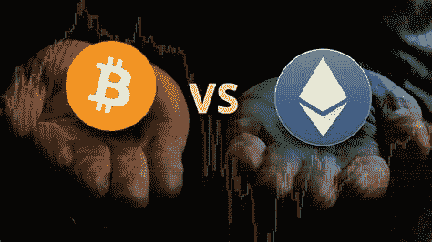

# 比特币是否正在将宝座拱手让给以太坊？

> 原文：<https://medium.com/coinmonks/is-bitcoin-losing-its-throne-to-ethereum-a211a9c69bb4?source=collection_archive---------6----------------------->

## 对下一轮牛市和泡沫破裂的猜测

根据 Vitalik Buterin 的说法，加密货币可能仍处于泡沫中，而比特币(BTC)可能会因其能源消耗而半途而废。在这篇文章中，我们仔细看看以太坊创始人的声明，并推测下一轮牛市可能会是什么样子…