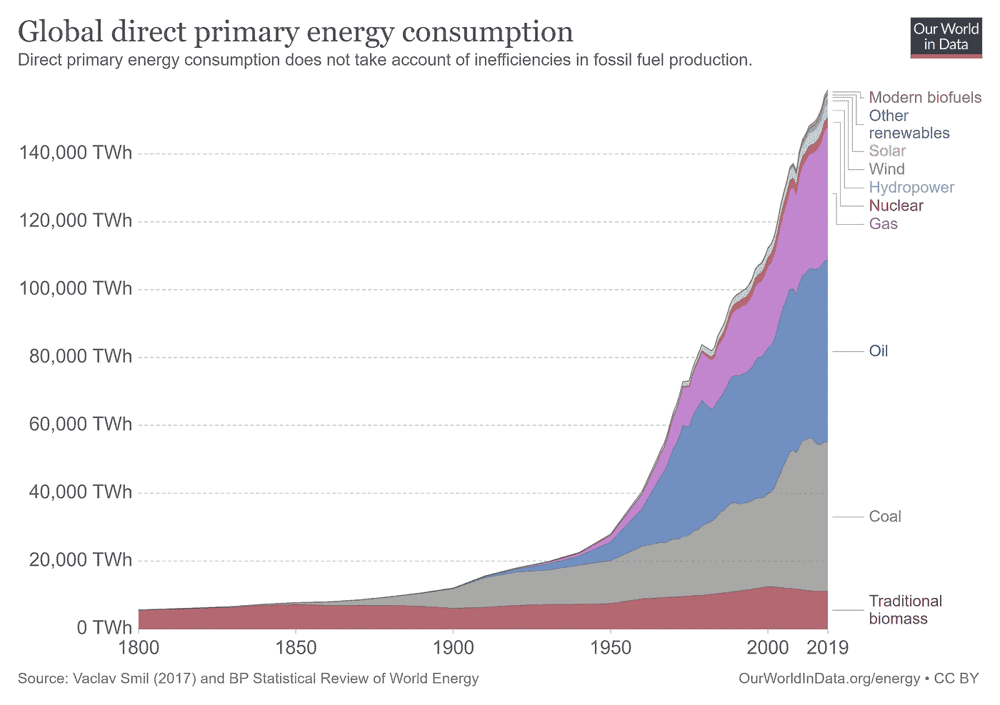
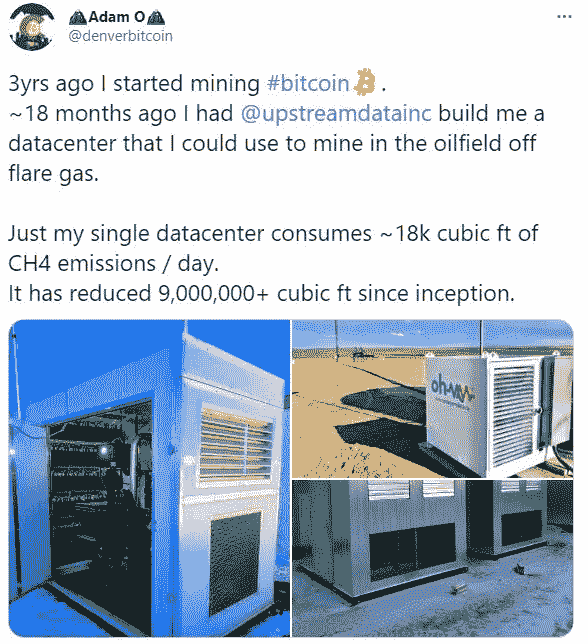
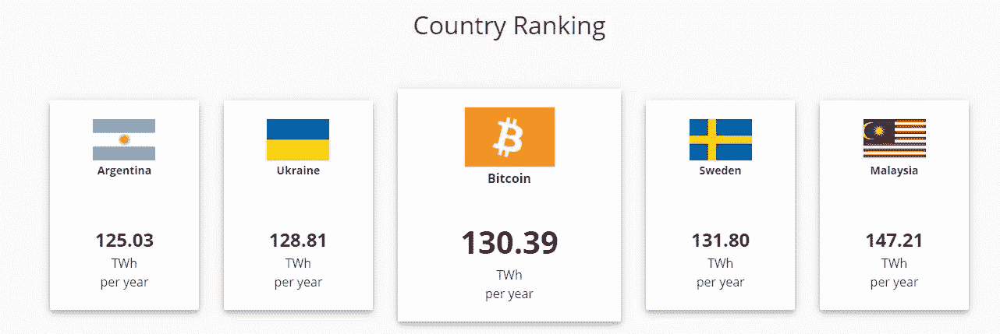
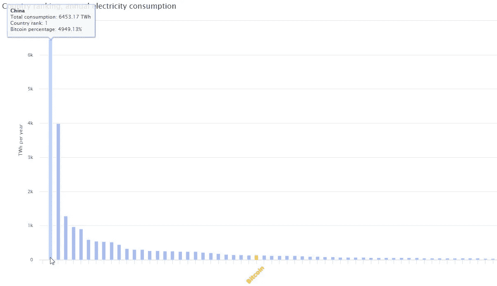
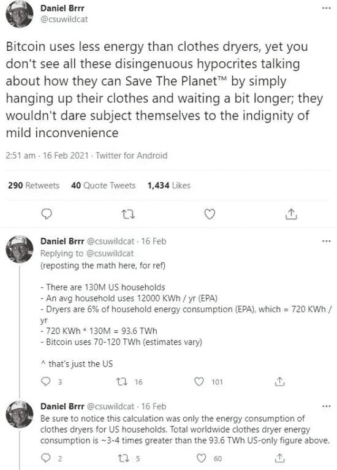
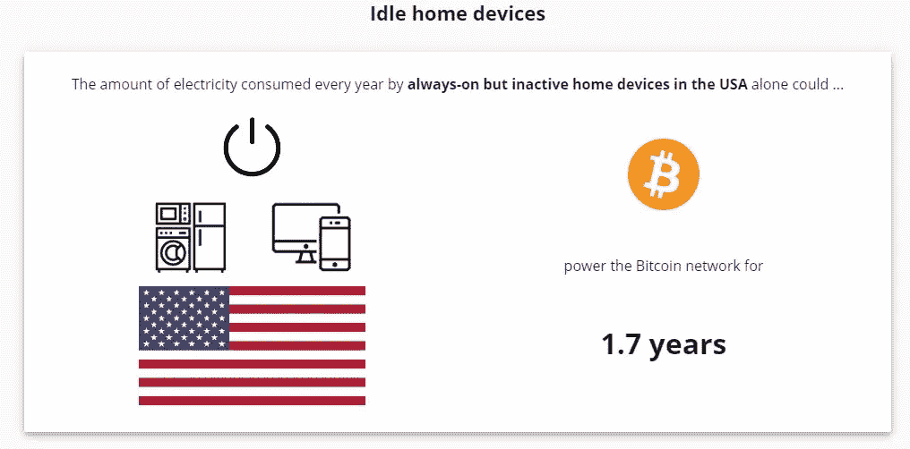

# 解决比特币能源消耗的争论

> 原文：<https://medium.com/coinmonks/is-bitcoin-really-a-climate-emergency-1f85e51687ab?source=collection_archive---------7----------------------->

## *比较比特币和其他能源浪费*

Are Christmas lights a waste of energy? Photo by [Elly Fairytale](https://www.pexels.com/@elly-fairytale?utm_content=attributionCopyText&utm_medium=referral&utm_source=pexels) from [Pexels](https://www.pexels.com/photo/photo-of-christmas-baubles-on-tree-branches-3811043/?utm_content=attributionCopyText&utm_medium=referral&utm_source=pexels)

比特币经常被吹捧为完全浪费能源，因此是气候紧急事件，尽管它确实消耗大量电力，但准确的数字并不容易准确计算，我们将在稍后讨论。比特币也是一个容易被攻击的目标，因为它的能耗可以从公开的哈希表中估算出来。事实上，能源消耗根本不是一件坏事，事实上，它是卡尔达舍夫等级所提出的文明进步程度的标志。随着人类的进步，我们已经使用越来越多的能源来驱动越来越多的设备。

As humans have progressed out energy use has only continued to rise.

认为未来我们将使用更少的能源是荒谬的。我们将会有更多具有更大计算潜力的设备需要更多的能力，尽管每台设备都变得更加高效。这个想法是，我们将从肮脏的能源转向清洁和可持续的能源，不会排放二氧化碳和其他可能有害的气体。有一天，甚至有可能利用整个星球的能量，通过戴森球为我们的恒星文明提供动力。

比特币不需要使用化石燃料来运行不像内燃机或喷气式发动机，例如，比特币可以并将最终依靠纯可再生能源运行。目前情况并非如此，因为可再生能源还不可靠，也不广泛可用。在大多数情况下，可用的电力来源及其成本基础通常由政府决定，所以不要责怪比特币矿工，而是责怪你的政府没有增加更多的可再生能源。矿商还希望尽可能高效地运营，以实现利润最大化，换句话说，这导致了新的私人太阳能农场和巧妙的减少能源浪费方法的发展，例如使用火炬气为采矿设备提供动力。

Otherwise flared gas is used to mine bitcoin saving 18k cubic ft of methane emissions per day

一般来说，争论归结于你是否认为比特币是一种很好的能源利用方式，这是主观的，正如你将看到的那样，有许多能源利用方式可能比全球分散的货币网络更浪费。比特币使用了世界电力消耗的 0.6%，当然很多，但我相信危言耸听者会让你相信远远不止这些。比特币消耗的能量比阿根廷、乌克兰和瑞典还多。是的，这是真的，虽然这种能源被用来确保超过 1 万亿美元的价值，当与这些国家的国内生产总值相比，这是一个不那么耸人听闻的标题。阿根廷 4450 亿美元，乌克兰 154 亿美元，瑞典 531 亿美元。如果你想用这些数据来说明什么，你可以厚着脸皮说比特币的效率比这些国家分别高 2.24 倍、6.49 倍和 1.88 倍。

[https://cbeci.org/cbeci/comparisons](https://cbeci.org/cbeci/comparisons)

除此之外，世界上最大的能源消费国中国目前消耗的能源是比特币的 49.5 倍，尽管其 GDP 仅为比特币市值的 14.3 倍。下面的比例也表明了与世界各国相比，比特币的能源使用实际上是多么不相关，这是使用 CBECI 对比特币能源消耗的保守估计。

[https://cbeci.org/cbeci/comparisons](https://cbeci.org/cbeci/comparisons)

现在，为了对世界各地的能源使用进行一些比较，丹尼尔·巴尔做了一个粗略的计算，将比特币的使用与干衣机进行了比较。他发现，仅在美国，烘干机每年就消耗 130 千瓦时的比特币能量，占比特币能量消耗的 72%。干衣机可以说是现代舒适的功能，你可以用零电来烘干你的衣服，把它们挂在阳光下，甚至在室内等一会儿。如果你的能源使用效率超高，你可以开采比特币在家里赚钱，这样你就不需要去上班了，然后如果你生活在寒冷的气候中，就可以使用家里产生的热量，或者/和用这种热量烘干你的衣服。

Bitcoin uses less energy than clothes dryers around the world

现代世界的另一个有争议的舒适特征是空调，我们不是在谈论加热或制冷，因为它们可能是现代生存所必需的。毫无疑问，我们在大型办公室和购物中心使用过多的空调来保持我们比其他地方稍微凉爽一些。这种空调消耗了大量的电力，事实上它大约占世界总能耗的 10%，也就是每年 2231.5 千瓦小时！。当你意识到人类已经在许多没有空调的炎热气候中生存并繁衍了数千年，这就更是一种浪费了。如果我们专注于使用各种方法建造设计良好的结构，在没有 electricity⁴.的情况下保持室内凉爽，今天甚至更有可能没有它

你知道你家里闲置的设备用了多少电吗？它们本身并不多，但加在一起就多得离谱了。CBECI 估计，仅在美国，这些闲置设备就消耗了多达 58%的比特币网络，这是从 2015 年开始的，当然，随着我们增加了从 Alexa 到 Ring 的家用设备数量，这一数字只会上升。这也只是在美国，加上其他发达国家，你只要让你的设备闲置在家里，就已经远远超过了比特币网络。

[https://cbeci.org/cbeci/comparisons](https://cbeci.org/cbeci/comparisons)

正如一些研究人员所提到的，上述来自 CBECI 的数据可能也不完全准确，公平地说，他们确实提供了一个范围作为这一估计的结果。这个估计问题不在于 hashrate 本身，因为它对所有人都是可见的，而在于产生 hashrate 的实际设备及其各自的功率消耗。计算哪些 ASIC 型号对当前 hashrate 有贡献最多只是一个估计，随着这些器件的效率随着每次迭代而提高，需要进行彻底的分析，否则最终会得到像 CBECIs 数据这样的大范围数据。Coinshares research 通过收集与生产超过 1000 台的 ASIC 型号、总部署数量、平均购买价格和生产批量相关的数据，解决了这一问题。他们得出的结论是，比特币网络使用了 41TWh，远低于 CBECI 对 130TWh⁵.的中值估计

> 世界上的 ps4、Xbox Ones 和任天堂 Wii Us 每年消耗的能量比比特币还多。

这个较低的数字使得上述使用 CBECIs 数据进行的比较对比特币信徒来说好了 3 倍以上，对比特币是消费猪的说法来说坏了 3 倍。然后，他们将其与全球 8500 万台 PlayStation 4、4000 万台 Xbox One 和 1500 万台任天堂 Wii U 游戏机进行比较，估计使用 40 英寸电视平均每天游戏时间为 4 小时，空闲时间为 20 小时。这总共每年吸引 4.9GW⁶或 42.9 万亿瓦时，比比特币网络用于确保 1 万亿美元价值的金额还要多。当然，这是假设所有这些设备都插着电源，但不包括仍在使用的老一代设备和桌面游戏电脑，这将大大增加这一数字。你认为玩游戏是浪费精力吗？有些人会说是，但许多人会说不是。

这篇文章的重点不是指指点点，说我们应该停止这样或那样做，一个“好”或“坏”的能源使用是主观的，不是世界上每个人都一致同意的。重点是反驳未经证实的说法，并澄清比特币的能源使用数据，因为媒体会让你相信它比实际情况糟糕得多。此外，谁来决定我们应该做什么，不应该做什么？这不应该由自由市场来决定吗？

[1]加密货币与区块链项目组， [**剑桥比特币用电指数**](https://cbeci.org/)

[2] IEA， [**冷却的未来**](https://www.iea.org/reports/the-future-of-cooling) (2018)

[3] IEA， [**电力信息:概述**](https://www.iea.org/reports/electricity-information-overview) (2020)

[4] A. Julien， [**如何在没有空调的情况下保持建筑凉爽——据可持续设计专家**](https://theconversation.com/how-to-keep-buildings-cool-without-air-conditioning-according-to-an-expert-in-sustainable-design-121004) (2019)

[5] C .本迪克森& S .吉本斯， [**比特币挖矿网**](https://coinshares.com/research/bitcoin-mining-network-december-2019) (2019)，Coinshares

[6] C .本迪克森， [**谨防偷懒考证**](https://coinshares.com/insights/beware-of-lazy-research-bitcoin-mining-update) (2018)，Coinshares

如果你喜欢这个分析，请关注我的 [**媒体**](https://lukabankovic.medium.com/) 和 [**推特**](https://twitter.com/bitcoinluka) 了解更多比特币和技术作品。