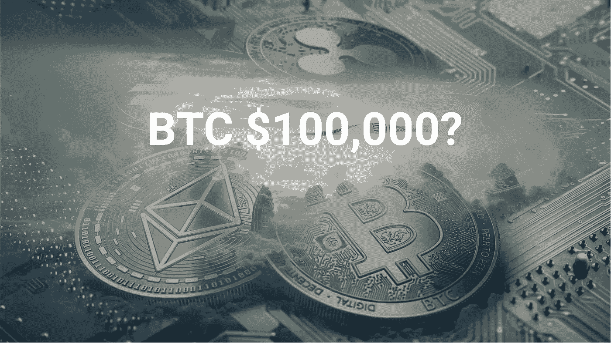
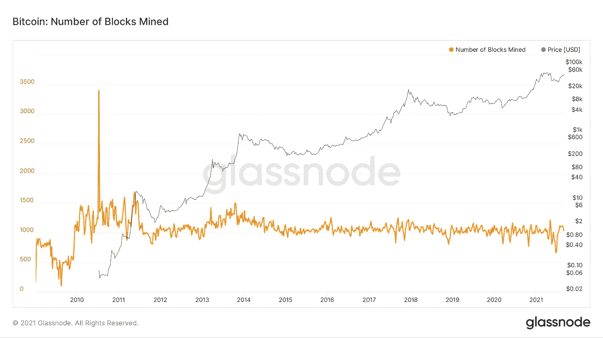
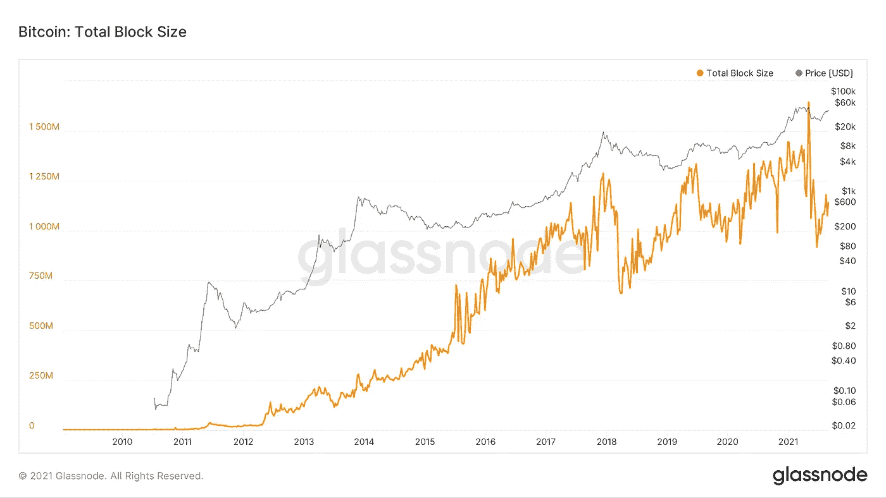

# 2021 年底前比特币还在破 100K 的路上吗？

> 原文：<https://medium.com/coinmonks/is-bitcoin-still-on-its-path-to-break-100k-before-the-end-of-2021-4716a56745ce?source=collection_archive---------2----------------------->

让我们首先想象一下，我们在一个有人(让我们称他们为 Xi)控制所有可用自然资源数量的星球上。现在，在一个随机的早晨，Xi 醒来，决定限制黄金的供应，并且每 4 年减少一半的数量。你认为接下来会发生什么？

Source: Pixabay

*   黄金将会变得稀缺，
*   很难获得，
*   开采更多的成本会增加，
*   因此，随着时间的推移，它的价值也会增加。

现在回到我们的世界，我们是否已经有了完全符合上述假设的东西；比特币？

*   其总供应量限定为 2100 万；不会再有了，
*   它是数字的，因此可以容易地携带和存储，
*   没有人能把它从你身边拿走(不像黄金/菲亚特)，
*   每开采 21 万个区块后，开采奖励减半，
*   因此，一个数字的稀缺性导致其价值的增加。

要了解它的价格是否会达到 10 万美元，我们首先必须了解它为什么会上涨。

# 比特币减半

由于我们大多数人都有一个基本的想法，即比特币遵循 4 年周期或每开采 21 万块后，开采奖励减半。上次发生这种情况是在 2017 年，当时比特币的价格达到了 19800 美元的历史高点，比之前的高点高出约 16 倍。嗯，那么我们能从中得出什么结论呢？

Number of Blocks Mined

*   **第一次减半:2012 年 11 月 28 日**

ATH:2011 年 6 月 6 日:18.72 美元

价格在 2013 年 11 月 25 日反弹至 953.14 美元

大约是之前 ATH 的 50 倍

*   **第二次减半:2016 年 7 月 9 日**

ATH:2013 年 11 月 25 日:953.14 美元

价格在 2017 年 12 月 11 日反弹至 19，179 美元

大约是之前 ATH 的 20 倍

*   **最近减半:2020 年 5 月 11 日**

ATH:2017 年 12 月 11 日:19179 美元

2021 年 4 月 14 日，价格反弹至 64，507 美元

大约是之前 ATH 的 3.3 倍

由于我们可以从上面的数据中看到，4 月份的高点仅比前一个高点高 3 倍，如果我们看看其他比特币周期的数据，我们可以观察到比特币的价格可以轻松反弹到 10 倍、20 倍甚至 30 倍。因此，我相信这不是牛市的结束，我们将很快看到更强劲的第二次反弹。

# 我们什么时候才能看到比特币破 100k？

在加密领域，数字资产的价格以闪电般的速度变化。事情可以在一天之内由好变好，也可以在几个小时之内由好变坏。

然而，有一件事我一直在观察，每当一个大实体/市场分析师/密码分析公司对市场进行价格预测时，它会比预期实现得更快。

例如，到 2016 年底，当时最准确的价格预测者 [Vinny Lingham](https://cointelegraph.com/news/vinny-lingham-bitcoin-price-will-reach-3000-in-2017) 表示，BTC 可能在 12 个月内达到 3k 美元。有趣的是，这个目标在 2017 年 6 月 05 日实现了。此外，BTC 继续上升，到 2017 年 12 月达到 19k 美元的 ATH，这大约是他预测的 6 倍。

看看一个类似的事件，在[彭博](https://www.bloomberg.com/professional/blog/bitcoin-on-track-for-100000-in-2025-historical-growth-guides/)2020 年的一篇文章中，有人预测到 2025 年比特币将涨到 100k。因此，根据任何市场预测的历史，我们可以比预测(可能是今年本身)更快地看到 100k。

# 我们到底要去哪里？

除了许多其他原因，埃隆和中国 FUD 成功推动了我们在 2021 年 5 月看到的重大调整，导致比特币价格下跌约 50%。

即使在我们今年经历了所有的 FUD 之后，牛市的第二阶段很可能很快就会开始，历史会重演。

# 我怎么会知道 ATH？

有一种方法我可以告诉你，就是通过观察玻璃节点上可用的挖掘数据。因为，只要矿商获得足够的回报，波动性就可以降低。然而，随着采矿奖励减半，稀缺性增加，比特币的价值最终也会增加。Glassnode 的下图显示了总块大小与 BTC 美元价格之间的相关性。

Source: Glassnode

在结束之前，让我再给你讲一个事件。LTC 的创始人查理·李在 2017 年牛市结束时出售了所有 LTC 霍德林。我引用他的话，

> 如果它在 24 小时内翻倍，那么这肯定是峰值，

许多人通常对上涨的价格感到非常兴奋和积极，以至于忘记了出售。因此，在他们意识到这一切很快颠倒过来之前，他们就陷入了加密的冬天。

# 那么，到底会发生什么呢？

老实说，没有人知道，它可以在一周，一个月，两个月，甚至明年达到 100k 大关。但有一点是肯定的，这不是牛市的结束，也不是你交易之旅的结束。所以耐心投资，只投入你能承受的损失。

喜欢这篇文章吗？试着读一下[我在大学本科时是如何开始投资加密的](https://blog.coincodecap.com/college-investor)。

*免责声明:本文没有任何金融建议，所有文章都是我的个人观点。因此，总是做你自己的研究，并相应地投资。*

> 加入 [Coinmonks 电报频道](https://t.me/coincodecap)，了解加密交易和投资。

**还有，读**

*   [尤霍德勒 vs 科恩洛安 vs 霍德诺特](/coinmonks/youhodler-vs-coinloan-vs-hodlnaut-b1050acde55a) | [Cryptohopper vs 哈斯博特](https://blog.coincodecap.com/cryptohopper-vs-haasbot)
*   [币安 vs 北海巨妖](https://blog.coincodecap.com/binance-vs-kraken) | [美元成本平均交易机器人](https://blog.coincodecap.com/pionex-dca-bot)
*   [如何在印度购买比特币？](/coinmonks/buy-bitcoin-in-india-feb50ddfef94) | [WazirX 审核](/coinmonks/wazirx-review-5c811b074f5b) | [BitMEX 审核](https://blog.coincodecap.com/bitmex-review)
*   [比特币主根](https://blog.coincodecap.com/bitcoin-taproot) | [Bitso 评论](https://blog.coincodecap.com/bitso-review) | [排名前 6 的比特币信用卡](/coinmonks/bitcoin-credit-card-bc8ab6f377c6)
*   [火币交易 Bot](https://blog.coincodecap.com/huobi-trading-bot) | [如何购买 ADA](https://blog.coincodecap.com/buy-ada-cardano) | [Geco？一次回顾](https://blog.coincodecap.com/geco-one-review)
*   [加密副本交易平台](/coinmonks/top-10-crypto-copy-trading-platforms-for-beginners-d0c37c7d698c) | [五大 BlockFi 替代方案](https://blog.coincodecap.com/blockfi-alternatives)
*   [信用贷款审核](https://blog.coincodecap.com/coinloan-review)|[Crypto.com 审核](/coinmonks/crypto-com-review-f143dca1f74c) | [货币融资融券交易](/coinmonks/huobi-margin-trading-b3b06cdc1519)
*   [Bybit vs 币安](https://blog.coincodecap.com/bybit-binance-moonxbt) | [StealthEX 点评](/coinmonks/stealthex-review-396c67309988) | [Probit 点评](https://blog.coincodecap.com/probit-review)
*   [顶级付费加密货币和区块链课程](https://blog.coincodecap.com/blockchain-courses)
*   [在美国如何使用 BitMEX？](https://blog.coincodecap.com/use-bitmex-in-usa) | [BitMEX 评论](https://blog.coincodecap.com/bitmex-review)
*   [最佳免费加密信号](https://blog.coincodecap.com/free-crypto-signals) | [YoBit 评论](/coinmonks/yobit-review-175464162c62) | [Bitbns 评论](/coinmonks/bitbns-review-38256a07e161)
*   [OKEx 回顾](/coinmonks/okex-review-6b369304110f) | [Kucoin 交易机器人](/coinmonks/kucoin-trading-bot-automate-your-trades-8cf0ca2138e0) | [期货交易机器人](/coinmonks/futures-trading-bots-5a282ccee3f5)
*   [AscendEx Staking](https://blog.coincodecap.com/ascendex-staking)|[Bot Ocean Review](https://blog.coincodecap.com/bot-ocean-review)|[最佳比特币钱包](https://blog.coincodecap.com/bitcoin-wallets-india)
*   [霍比评论](https://blog.coincodecap.com/huobi-review) | [OKEx 保证金交易](https://blog.coincodecap.com/okex-margin-trading) | [期货交易](https://blog.coincodecap.com/futures-trading)
*   [比特币基地赌注](https://blog.coincodecap.com/coinbase-staking) | [热点评论](/coinmonks/hotbit-review-cd5bec41dafb) | [库币评论](https://blog.coincodecap.com/kucoin-review)
*   [最佳加密交易信号电报](/coinmonks/best-crypto-signals-telegram-5785cdbc4b2b) | [MoonXBT 评论](/coinmonks/moonxbt-review-6e4ab26d037)
*   [Coinswitch 俱吠罗评论](/coinmonks/coinswitch-kuber-review-1a8dc5c7a739) | [电网交易机器人](https://blog.coincodecap.com/grid-trading) | [比特币基地收费](/coinmonks/coinbase-fees-831e77d4f2c5)
*   [Bitget 回顾](https://blog.coincodecap.com/bitget-review) | [双子 vs 区块链](https://blog.coincodecap.com/gemini-vs-blockfi) | [OKEx 期货交易](https://blog.coincodecap.com/okex-futures-trading)
*   [OKEx vs KuCoin](https://blog.coincodecap.com/okex-kucoin) | [摄氏替代品](https://blog.coincodecap.com/celsius-alternatives) | [如何购买 VeChain](https://blog.coincodecap.com/buy-vechain)
*   [币安期货交易](https://blog.coincodecap.com/binance-futures-trading)|[3 comas vs Mudrex vs eToro](https://blog.coincodecap.com/mudrex-3commas-etoro)
*   [如何购买 Monero](https://blog.coincodecap.com/buy-monero) | [IDEX 评论](https://blog.coincodecap.com/idex-review) | [BitKan 交易机器人](https://blog.coincodecap.com/bitkan-trading-bot)
*   [币安 vs 比特邮票](https://blog.coincodecap.com/binance-vs-bitstamp) | [比特熊猫 vs 比特币基地 vs Coinsbit](https://blog.coincodecap.com/bitpanda-coinbase-coinsbit)
*   [如何购买 Ripple (XRP)](https://blog.coincodecap.com/buy-ripple-india) | [非洲最好的加密交易所](https://blog.coincodecap.com/crypto-exchange-africa)
*   [非洲最佳加密交易所](https://blog.coincodecap.com/crypto-exchange-africa) | [胡交易所评论](https://blog.coincodecap.com/hoo-exchange-review)
*   [eToro vs robin hood](https://blog.coincodecap.com/etoro-robinhood)|[MoonXBT vs by bit vs Bityard](https://blog.coincodecap.com/bybit-bityard-moonxbt)
*   [Stormgain 回顾](https://blog.coincodecap.com/stormgain-review) | [Bexplus 回顾](https://blog.coincodecap.com/bexplus-review) | [币安 vs Bittrex](https://blog.coincodecap.com/binance-vs-bittrex)
*   [Bookmap 评论](https://blog.coincodecap.com/bookmap-review-2021-best-trading-software) | [美国 5 大最佳加密交易所](https://blog.coincodecap.com/crypto-exchange-usa)
*   [如何在 FTX 交易所交易期货](https://blog.coincodecap.com/ftx-futures-trading) | [OKEx vs 币安](https://blog.coincodecap.com/okex-vs-binance)
*   [如何在势不可挡的域名上购买域名？](https://blog.coincodecap.com/buy-domain-on-unstoppable-domains)
*   [印度的秘密税](https://blog.coincodecap.com/crypto-tax-india) | [altFINS 审查](https://blog.coincodecap.com/altfins-review) | [Prokey 审查](/coinmonks/prokey-review-26611173c13c)
*   [布洛克菲 vs 比特币基地](https://blog.coincodecap.com/blockfi-vs-coinbase) | [比特坎评论](https://blog.coincodecap.com/bitkan-review) | [币安评论](/coinmonks/binance-review-ee10d3bf3b6e)