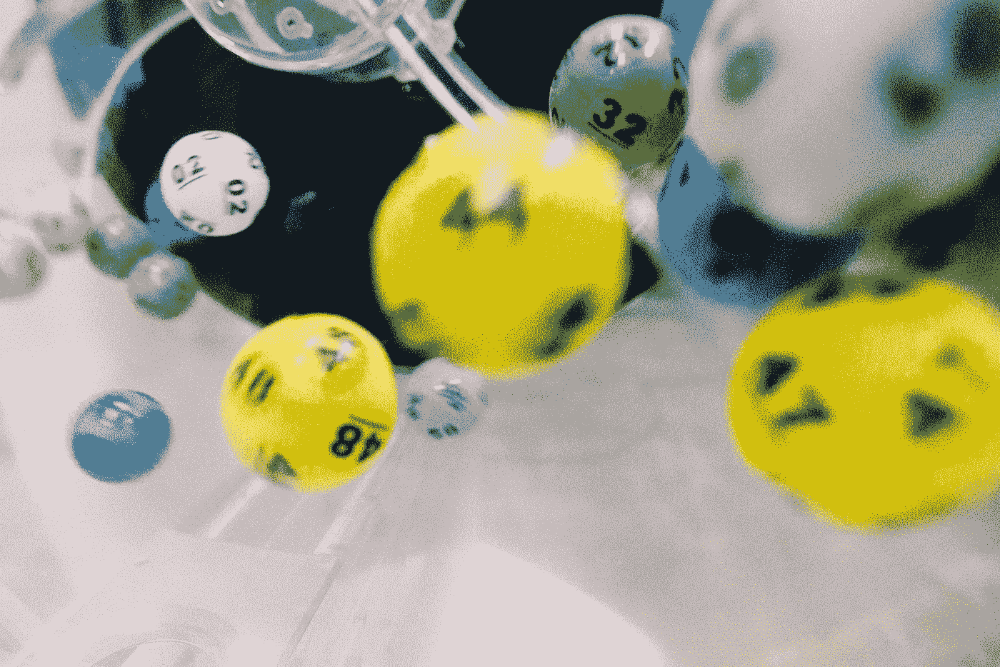
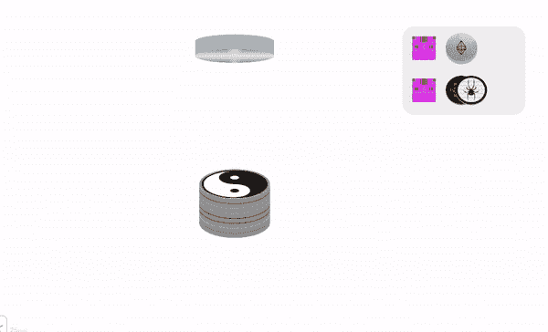

# block.blockhash(block.number-1)可以吗？

> 原文：<https://medium.com/coinmonks/is-block-blockhash-block-number-1-okay-14a28e40cc4b?source=collection_archive---------1----------------------->

Cover Photo by [dylan nolte](https://unsplash.com/photos/RSsqjpezn6o?utm_source=unsplash&utm_medium=referral&utm_content=creditCopyText) on [Unsplash](https://unsplash.com/search/photos/random?utm_source=unsplash&utm_medium=referral&utm_content=creditCopyText)

## 在我的以太坊游戏中，block.blockhash(block.number-1)对于 random 是否足够好？

TL；大卫:是的。:/

在以太坊上构建游戏时，你很快意识到链上的随机性是很棘手的。区块链是公开的确定性的，但是有一些技巧可以产生伪随机性。

其中一个技巧是获取前一个块的散列，但这意味着你已经知道随机数是什么。另外它由矿工控制。如果目标区块散列不能在你的游戏中产生想要的结果，他们可以选择扔掉一个区块。这看起来不狡猾吗？

让我们来看看目前在[DAppRadar.com](https://dappradar.com/)上排名前 15 的游戏，看看我们是否能了解它们是如何产生随机数的

#1.[CryptoKitties](https://dappradar.com/app/3/cryptokitties)——做基因混合的私人合同，未知随机

#2.[以太机器人](https://dappradar.com/app/26/etherbots)

They use the hash of the previous block.

#3.[加密城市](https://dappradar.com/app/61/cryptocities.net)——在[以太扫描](https://etherscan.io/)上没有源代码，没有游戏机制？

#4.[以太精灵](https://dappradar.com/app/23/etheremon) —没有真正的游戏机制，但是:

They use the previous blockhash plus a “private” salt.

#5.[以太工艺](https://dappradar.com/app/17/ethercraft)—[以太扫描](https://etherscan.io/)上没有源代码。还没有游戏机制，但他们已经承诺使用未来的块哈希。他们也把奖励限制在块奖励的数量上…稍后会有更多的介绍。

#6.[密码机器人](https://dappradar.com/app/39/cryptobots)——明目张胆的 KittieClone，私人基因混合器

#7.[以太探索](https://dappradar.com/app/183/ether-quest)

They use the previous blockhash with other things the miners can manipulate.

#8.[氪星战争](https://dappradar.com/app/29/kryptowar)——在[以太扫描](https://etherscan.io/)上没有源代码

#9.[天使之战](https://dappradar.com/app/31/angel-battles)

They use the previous blockhash plus a “private” salt.

#10.[以太方舟](https://dappradar.com/app/202/ether's-ark)——坏基蒂克隆，没有游戏机制

#11.[加密邮票](https://dappradar.com/app/124/cryptostamps) —可收藏，无游戏机制

#12.[隐斗士](https://dappradar.com/app/4/cryptofighters) s

They use a nonce with the timestamp. A miner could pick the timestamp that lets them win.

#13.[隐形车](https://dappradar.com/app/216/cryptocars)——没有游戏机制

#14.[隐城](https://dappradar.com/app/48/cryptocities)——没有游戏机制

对于第 15 条，我应该放弃声明*我写了这个合同*。不管怎样，我后悔我过度设计了随机性。**很明显，以前的 blockhash 对于休闲游戏来说工作得很好。**

#15. [Cryptogs](https://cryptogs.io) —我们使用提交/揭示方案来创建链上随机性。在 ETHDenver，我们决定使用一种比以前的 blockhash 更安全、矿工更难操纵的随机形式。

[Cryptogs.sol](https://github.com/austintgriffith/cryptogs/blob/master/Cryptogs/Cryptogs.sol) 使用一个 *future* blockhash 结合一个已提交然后公开的 hash。玩家可以放心，矿工是无法操纵结果的。很酷吧？不，不是真的。

我们从所有额外交易中学到的:**不值得。块奖励，加上黑客将不得不花费的时间来潜入合同的内脏，只是不值得偷我的 rad [8 球 pog](https://cryptogs.io/cryptog/251) 。**

> [直接在您的收件箱中获得最佳软件交易](https://coincodecap.com/?utm_source=coinmonks)

我们将建立一个延长的合同，以允许一个更便宜的游戏版本。我们还会在一些中央集权和国家频道里撒点，让用户体验更好。原来的，完全分散的，提交/揭示将永远提供给铁杆！

Play Cryptogs now at https://cryptogs.io