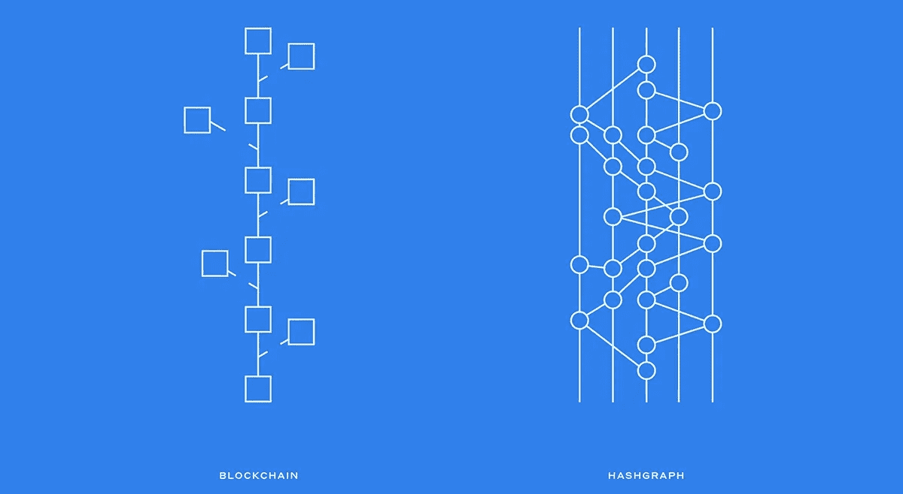
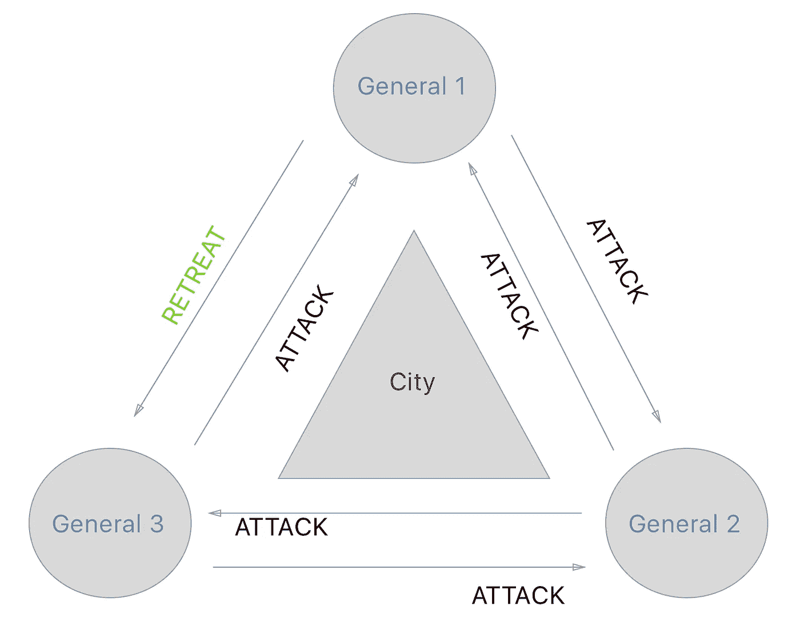
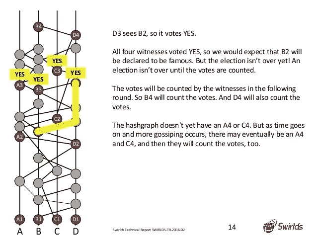
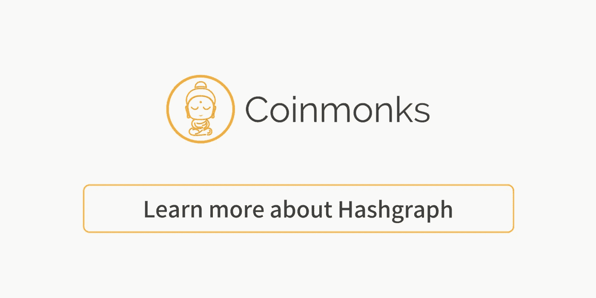

# 区块链替代 Hashgraph 真的是游戏改变者吗:初学者指南

> 原文：<https://medium.com/coinmonks/is-blockchain-alternative-hashgraph-really-a-game-changer-a-beginners-guide-a1bdadf959de?source=collection_archive---------0----------------------->

**大多数加密货币都是基于区块链**构建的。在[的这篇文章](/@marvinleemills/if-bob-marley-were-alive-today-i-think-he-would-be-hodling-bitcoin-1134498f0161)中，我讨论了为什么人们应该对区块链——而不是比特币——更感兴趣，因为分布式账本技术的力量。区块链只是*分布式账本技术的一个*例子。

Hashgraph 是另一个例子，它可能是对区块链的最大威胁。

Blockchain vs. Hashgraph

这里是对海德拉哈希图的描述，来自他们的网站:

*“Hedera hashgraph 平台提供了一种新形式的分布式共识；一种让互不认识或互不信任的人安全地进行在线协作和交易的方式，而不需要可信的中介。* ***这个平台非常快、安全、公平，而且不像一些基于区块链的平台，不需要大量的计算工作证明。*** *Hedera 让开发人员能够构建全新的分布式应用，这在以前是不可能的。”*

> [发现并回顾最佳区块链软件](https://coincodecap.com)

当我第一次听说 Hedera hashgraph 时，我立刻就被吸引住了。

第一个原因: *hashgraph 快*。第二:团队实现了 ***异步*拜占庭容错**。

嗯……那是什么？为什么它很重要？

让我们挖一点。

# 为什么“异步拜占庭容错”如此重要

要理解异步拜占庭容错，或者说 **aBFT** ，我们先来考虑*拜占庭将军的*问题，这个术语是受拜占庭军队启发而来的。**考虑一下这个**:

指挥一支军队的四个独立小组的四位将军。他们正在包围一座有四堵墙的城市。 ***目标是攻城*** *—或撤退—* ***协同作战*** *，有共识，无误会。*

**如果领头的将军让另外两个将军进攻，另一个撤退**，问题就可能出现了(这里的理解是所有四个小组需要一起进攻(或撤退)**才能成功)。**

**现在，回想一下电报和脸书之前，比如说 1710 年…**

**如果首领将军有一个**信使**，并且他把这个信使发送给所有其他将军，这个信使可能 A)被沿途的某人贿赂，B)被另一个将军贿赂，C)把消息给一个将军，然后在去其他将军的路上被杀死…**

**希望你明白我的意思。**

****在这种情况下，共识是一个难以解决的问题。****

**这里有一张图来说明。**

****

**General 1 is such a bad actor.**

**达成共识对分布式账本技术至关重要。**

****中本聪**，声名狼藉的 **—** ，隐形的 **—** 比特币**，**在[这封](https://www.mail-archive.com/cryptography@metzdowd.com/msg09997.html)邮件中提出了多年前解决这个问题的办法。解决方案:**工作证明**。这就是比特币和许多其他区块链项目用作共识协议的原因。**

**唯一的问题是，**工作证明需要很长时间才能起作用**。交易时间变得越来越慢。普遍的共识是，使用区块链很难进行扩展。交易费一度也是一个问题，[尽管在这一点上这些不是问题](https://bitcoinmagazine.com/articles/bitcoin-transaction-fees-are-pretty-low-right-now-heres-why/)。**

**Hashgraph 不使用工作证明。它使用虚拟投票。超级重要。**

**hashgraph 虚拟投票一致算法的发明者 Leemon Baird 博士对工作证明的利弊做了非常可靠和客观的解释。它值一块表:**

**或许**hash graph 会比区块链(以及市场上所有其他的 DLT 期权)更快——也更安全，**拥有虚拟投票共识协议。**

**请听 Leemon 解释虚拟投票:**

**应该注意的是，最近发布的备受期待的 [**闪电网络**](https://www.youtube.com/watch?v=rrr_zPmEiME) 希望解决比特币的速度问题，[以太坊的创造者也希望解决他们的缩放问题](https://www.computerworld.com/article/3245928/emerging-technology/ethereum-explores-a-fix-for-blockchains-performance-problem.html)。然而，让比特币或以太坊交易更快只是问题的一部分。安全性也很重要。**

**这就是拜占庭容错技术的用武之地。**

**在对[隐藏力量](https://www.hiddenforcespod.com/leemon-baird-hashgraph-distributed-ledger-technology-blockchain/)的采访中，李蒙·贝尔德博士讨论了 BFT:**

> ****拜占庭容错(BFT)意味着当你试图弄清楚事务的顺序时，有一个时刻你知道你已经达成了共识。最终，拜占庭容错(BFT)意味着三件事:1)我们将达成共识；2)当我们达成共识时，我们就会知道；3)我们永远不会错——你可以从数学上保证其他人会达成完全相同的共识。那是拜占庭式的。****
> 
> **BFT 可以是异步拜占庭式(aBFT)或部分异步拜占庭式。两者都有数学上的保证，区别在于你对你的环境的假设程度。aBFT[如在*hashgraph*中]会假设社区中存在邪恶的行为者，因为他们确实存在。然而，如果你做出错误的假设，比如世界上没有僵尸网络，这将是部分异步 BFT——因为僵尸网络在现实世界中确实存在。如果你通过假设世界上没有僵尸网络来开始一个数学证明，那么我真的不确定你的证明意味着什么，因为你生活在一个幻想的世界里。**
> 
> ****拜占庭容错(BFT)是结论。异步与部分异步拜占庭容错(aBFT)是开始时的假设。****
> 
> ****与其他系统不同， *hashgraph* 被证明是完全异步的 byzantine。这意味着它对信息在互联网上的传递速度不做任何假设，使其能够抵御 DDoS 攻击、僵尸网络和防火墙。只要不到三分之一的参与者是恶意的，Hashgraph 在数学上保证达成共识并且是安全的(这是 DLT 必须一直假设的)。****

**简单来说，Hedera hashgraph **假设会有不好的演员。** Leemon Baird 在这个《隐藏的力量》采访中做了更深入的探讨，包括他在这里讨论了为什么**比特币甚至没有资格成为 BFT** :**

> ****“…记住，使用比特币，每次得到确认，你都会变得更加自信。但是，你实际上从来没有达到绝对确定的时刻——你只是说，“在六次确认之后，我想我有足够的把握给顾客他刚买的东西”。或者，“也许他正在买一件非常大的东西，所以我会等十二次确认”，但是你永远不会真正达到百分之百确定的时刻。****
> 
> ****比特币不是拜占庭货币。在糟糕的假设下甚至不是拜占庭式的。在比特币中，你永远不会知道自己达成了共识，永远不会出错。随着时间的推移，你会变得更加自信，但这不是拜占庭式的。句号。”****

# **Hashgraph 及其八卦协议**

**Hashgraph 还利用了一种叫做*的八卦。*摘自 Hedera hashgraph 网站:**

> **使用 **gossip 协议**，节点高效快速地与社区中的其他节点交换数据。这使用**小说**“关于流言蜚语的流言蜚语”协议自动构建了一个 **hashgraph 数据结构**。这种数据结构是加密安全的，并且包含社区中的通信历史。**使用此作为输入，节点运行与其他节点相同的虚拟投票一致算法。**社区就订单和时间戳达成共识**而无需通过互联网进行任何进一步的沟通。**每个事件都有其创建者的数字签名。**

**所以你最终会得到这样的结果:**

****

**速度、安全性和扩展能力的结合非常重要，对于 Hedera hashgraph 来说，在实现闪电般快速交易的同时，实现**分布式账本技术领域迄今为止最高级别的安全性，至少是很特别的。****

***甚至更特殊的是因为* ***异步拜占庭容错*** *。***

**gossip 协议随着时间的推移创建的 hashgraph 看起来也很酷。**

**这个新平台会是世界现在需要的游戏规则改变者吗？**

# **Hedera Hashgraph 的一个用例(作为一个例子)**

**下面是 hashgraph 的一个有趣的用例: [**Intiva Health**](https://token.intivahealth.com/)**

**从他们的网站:**

> **Intiva Health Platform 目前允许有执照的医疗专业人员、机构和团体简化招聘、加快认证并保持合规性。Intiva Health 将通过**集成一个基于 Hashgraph 的自我审计解决方案**来彻底重新定义医疗认证流程，该解决方案将立即验证提供者的证书— **将几个月的处理时间缩短到几秒钟。**Intiva Token(NTVA)基于这一理念，奖励用户在我们平台上花费的时间。**

**在这段由 Cryptico News 制作并发布的视频中，Intiva Health 的内容经理伊万·佩雷斯讨论了他们为什么选择 hashgraph 而不是区块链:**

**一个需要一个月的过程现在只需要几秒钟，同时还拥有最高级别的安全性？为医疗保健领域贡献解决方案？**

**听起来不错，对吧？**

****在 Hedera hashgraph 之上还能创造出什么？**去年，Hashgraph 在 TechCrunch Disrupt 举办了一场 24 小时的黑客马拉松比赛，[一些团队在 24 小时内创建了快速、可用和分散的应用。](/hashgraph/teams-build-impressive-distributed-apps-on-hashgraph-in-24-hour-techcrunch-disrupt-hackathon-7daa00dae66f)**

**因为 hashgraph 是用 Java**创建的，开发人员能够(并且现在也能够)快速开始工作，因为这种语言被广泛使用。****

**看看**在 hashgraph** 的基础上创造出什么样的解决方案，以及**一旦成为现实，是否会随着时间的推移证明**是游戏规则的改变者，这将会很有趣。**

# **海德拉哈希图令牌**

**Hedera hashgraph 令牌是一个相当新的东西，但现在它正式成为一个东西了。**

****缺少代币或公共账本实际上是分布式账本/加密货币爱好者的一个担忧**。**有一个**，是因为对投资的兴趣和最初缺乏机会。没有的惊喜在那里。**

**此外，负责创建 hashgraph 的公司——*swildds——*拥有 hashgraph 算法的专利，并选择**而不是**开源代码，这一事实令许多人担忧。**

**然而，有一个 Hedera hashgraph 令牌，这是 Hedera hashgraph 给开发者的信息:**

> **您可以使用本地加密货币在 Hedera hashgraph 上构建全新的分布式应用程序。对于您为这些应用程序选择的许可，您将拥有完全的所有权和决定权。该平台将提供一个流动的生态系统和透明的代码库，并得到致力于免费教育的全球社区的支持。**

**我认为 Hedera hashgrpah 是游戏规则的改变者。你怎么想呢?**

**你可以在这里找到更多关于海德拉哈希图令牌[的信息。](https://www.hederahashgraph.com/token)**

**有关 hashgraph 的更多信息，请查看以下链接:**

*   **【https://www.hederahashgraph.com/】Hedera hashgraph 网站:**
*   ****今年 3 月在纽约举行的公司“发布”活动**:[https://www.youtube.com/watch?time_continue=5&v = JzFXZvTrEnI](https://www.youtube.com/watch?time_continue=5&v=JzFXZvTrEnI)**
*   ****福布斯对 hashgraph 的批判观点**:[https://www . Forbes . com/sites/jeffkauflin/2018/03/13/hedera-hash graph-thinks-it-can-one-up-bit coin-and-ether eum-with-faster-transactions/# 51ba 8362 abcb](https://www.forbes.com/sites/jeffkauflin/2018/03/13/hedera-hashgraph-thinks-it-can-one-up-bitcoin-and-ethereum-with-faster-transactions/#51ba8362abcb)**
*   ****隐藏势力访谈**——[https://www . hiddenforcespod . com/leemon-Baird-hash graph-distributed-ledger-technology-区块链/](https://www.hiddenforcespod.com/leemon-baird-hashgraph-distributed-ledger-technology-blockchain/)**
*   ****对于对建筑感兴趣的开发商【https://dev.hashgraph.com/】——****

> **[直接在您的收件箱中获得最佳软件交易](https://coincodecap.com/?utm_source=coinmonks)**

******

**Click to read more Hashgraph Stories****