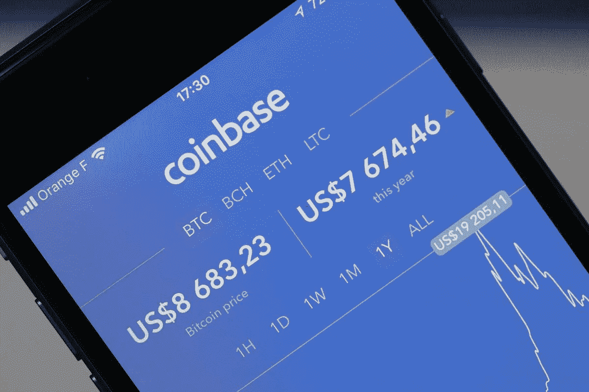
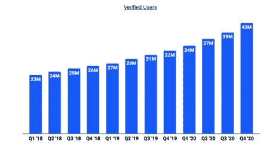
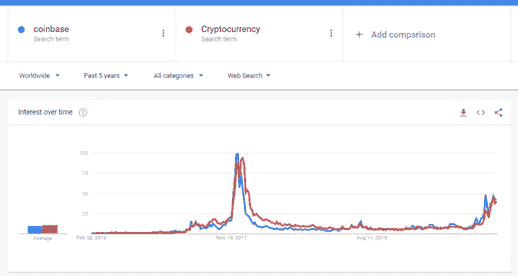
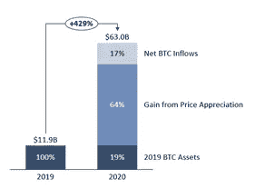
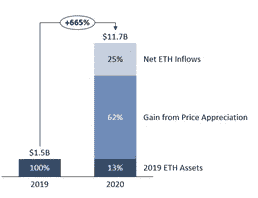
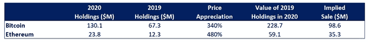
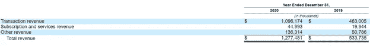
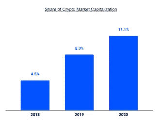
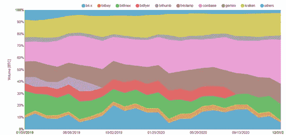
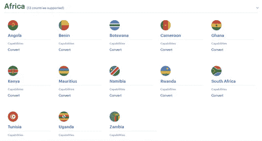

# 比特币基地真的值 1000 亿美元吗？

> 原文：<https://medium.com/coinmonks/is-coinbase-really-worth-100b-5e02efffb988?source=collection_archive---------2----------------------->

## 比特币基地 S-1 号的深潜

比特币基地，一家[加密交易所](/coinmonks/crypto-exchange-dd2f9d6f3769)，刚刚提交了 S-1 文件，准备通过直接上市的方式上市。这是在最近几个月加密货币大规模上涨、特殊目的收购公司狂热和市场泡沫日益增加的背景下出现的。

引起许多人关注的是比特币基地的**在过去一个月的估值翻倍。1 月下旬，该公司在一次私人二级股票发行中的估值约为 540 亿美元。现在，不到一个月后，它正在寻求 1000 亿美元的公开上市。**

**一些人声称，这是在一个定价过高的市场中估值延长的又一个例子。其他人则表示，比特币基地在快速增长的加密市场中的领导地位证明了其估值是合理的。**

**通过 S-1，潜在投资者获得了大量新数据。下面，我深入研究了这些数据，所以你不必这样做。**

# ****一些重要的数字****

**在过去几年中，比特币基地经历了快速增长。2020 年，收入同比增长 139%，净利润为正，从 2019 年的亏损 3000 万美元增长到 2020 年的利润 3.22 亿美元。(相比之下，Airbnb 和 Snapchat 都是超过 1000 亿美元的公司，还没有盈利)。**

**比特币基地拥有 4300 万已验证用户(截至 2020 年 12 月)，高于 2019 年的 3200 万。客户获取成本(CAC)低得惊人，只有 5.15 美元。如果我们想一想比特币基地在金融机构中所处的位置——从 Square 这样的数字化移动服务到摩根大通这样的传统银行——比特币基地似乎更接近数字化移动端。这种敏捷的、以软件为中心的商业模式意味着，随着收入的增长，比特币基地的利润将继续呈指数级增长(他们建立 exchange 基础设施的固定成本可能很高，但每增加一个用户的边际成本很低)。**

****

**From the Coinbase S-1**

**有趣的是，比特币基地的 CAC 在 2020 年有所增加，高于 2019 年的 4.02 美元。如果我们认为比特币基地与 Square 的 CashApp 处于类似的垂直领域(数字钱包，虚拟货币交换能力，等等)。)那么我们实际上可以预期，随着网络效应/口碑推动有机收购，CAC 最终会随着时间的推移而降低。**

**比特币基地在 2020 年增加的营销和销售支出可能是为了在加密领域获得市场份额，并向用户介绍比特币基地生态系统内的其他产品。鉴于越来越多的玩家进入加密领域，首先快速获得客户以建立强大的网络效应似乎很重要。在某种程度上，我们已经在比特币基地身上看到了这一点——自该公司 2012 年成立以来，超过 90%的零售用户已经发现了它们。话虽如此，如果比特币基地的 CAC 在未来几年再次下降，我也不会感到惊讶，因为口碑、比特币基地不断增强的品牌以及加密货币的更广泛采用继续加速有机增长。**

# ****收入流****

**比特币基地的 S-1 财务将收入分为三类:**

**1.交易收入(85.8%)**

**2.订阅和服务收入(3.5%)**

**3.其他收入(10.7%)**

## *****交易收入*****

**交易收入来自用户交易加密货币(你可以在这里看到整个费用结构)。该部门的收入大致遵循以下公式:**

**交易收入=(每笔交易的金额)*(交易数量)*(交易费用)**

**这个流的某些部分比其他部分更与加密周期相关。平均交易与价格波动密切相关——加密价格越高，平台上持有的资产的绝对值越大，每次交易的交易量也越大(平均购买价格往往会上升)。**

**交易数量(在某种程度上)与每月交易用户数(MTU)有关。我说有点是因为某些 MTU 可能每天交易，而其他 MTU 每月只交易一次或两次。S-1 指出，“MTU 开始变得与加密资产的波动性不那么相关了。”不清楚“相关性较低”实际上是什么意思——是现在只有 90%的相关性而不是 95%的相关性吗？我发现一个有趣的代理是相对于“加密货币”的“比特币基地”的谷歌搜索量在过去的五年里，这两个词在搜索量和兴趣方面几乎完全一致。**

****

**Data from Google Trends**

**搜索量与实际注册(或使用)一个比特币基地账户不是一回事，但它确实有助于反映社会对比特币基地教更广泛的兴趣、知名度和认知度。值得注意的是，我们现在看到的增长仍然只有 2017 年的一半。对我来说，这可能意味着两件事。首先，它可能表明当前的加密牛市还有很长的路要走；在搜索量达到(或超过)2017 年的水平之前，我们可能不会达到顶峰。或者，第二，这些搜索趋势可能表明，与 2017 年相比，社会对加密货币的认识/了解更加普遍。我更倾向于后者。**

**有趣的是，比特币基地的交易量作为平台上资产的倍数下降了。2019 年，交易量是平台上资产的 4.7 倍，而 2020 年，交易量仅为平台上资产的 2.1 倍。这可能标志着采用“钻石手”(即长期持有加密货币投资)的散户和机构投资者数量的增加。如果情况确实如此，比特币基地的订阅和服务产品在收入组合中所占的份额可能会增加。**

## *****订阅和服务收入*****

**根据 S-1，订阅产品和服务包括“存储、入股、储蓄、借入和借出”。2020 年，订阅收入同比增长 126%。比特币基地表示，他们正在积极尝试扩大其收入的订阅部分，因为订阅产品有助于减少收入波动(减少对交易量的依赖，降低与加密周期的相关性)。**

**这些产品“根据我们(比特币基地的)平台上参与产品或服务的资产的百分比来产生收入。”因此，两大因素推动了订阅收入:注册这些产品的用户数量和平台上的资产。**

**目前，只有 21%的认证用户(900 万用户)注册(至少)其中一项服务。值得注意的是，当零售用户开始使用非投资服务时，该用户的平均收入会上升 90%。比特币基地在 2020 年增加的营销和销售支出很可能部分致力于扩大这些服务的知名度/注册人数。**

**平台上的资产——订阅收入的另一个组成部分——更不稳定。从 2019 年 12 月到 2020 年 12 月，总资产从 170 亿美元增长到 900 亿美元！在这两个时期，70%的资产都是比特币(2019 年为 119 亿美元，2020 年为 630 亿美元)。在同一时期，比特币的价格上涨了约 340%(使用 2019 年 12 月 31 日和 2020 年 12 月 31 日的价格)。到 2020 年底，2019 年的 119 亿美元应该会升值到 524 亿美元，使比特币净流入量达到 106 亿美元。换句话说，新资本流入量——不仅仅是比特币价格升值带来的增加——从 2019 年到 2020 年几乎翻了一番。**

****

**同样，平台上的以太坊资产从 2019 年的 15.3 亿美元(9%)增长到 2020 年的 117 亿美元(13%)。在同一时期，以太坊的回报率为 480%，2020 年，由于价格上涨，该平台增加了价值 73 亿美元的以太坊。因此，2020 年以太坊的净流入约为 28.7 亿美元。**

****

**我认为比特币基地低估了订阅收入在更广泛的加密市场波动中的风险。过去一年的资产增长更多地来自比特币和以太坊价格的上涨，而不是资本流入，这意味着如果价格下跌，我们可能会看到资产大幅减少。**

## *****【其他】收入*****

**比特币基地认为，“其他收入”包括:**

> **"当我们是交易的委托人时，出售加密资产."**

**这一部分似乎包括任何与比特币基地资产负债表上的现金或现金等价物相关(或出售)的价格升值。不出所料，这些资产包括加密货币。截至 2020 年底，比特币基地拥有 11 亿美元的现金/现金等价物，其中 18%(1.879 亿美元)用于加密。2019 年，比特币基地拥有价值约 5.5 亿美元的现金/现金等价物，但不清楚加密货币占多大比例。如果我们假设比特币基地在 2019 年拥有相同的每种加密货币与总现金/现金等价物的比率，他们将在 2020 年出售价值约 1.34 亿美元的加密货币。**

****

**1.34 亿美元几乎正好是比特币基地记录的来自“其他”部门的收入:**

****

**如果比特币基地打算在未来将其加密持有量保持在现金等价物的 18%左右，那么这一部分也将面临更广泛的加密货币市场的波动。**

# ****市场份额****

**相对于加密货币行业的其他行业来看待比特币基地的增长也是有用的。900 亿美元的资产约占加密市场总资本的 11%，高于比特币基地 2019 年的 8.3%和 2018 年的 4.5%。**

****

**From the Coinbase S-1**

**同样，比特币基地在总交易量中的份额也在增加。在过去的两年里，比特币基地处理的比特币交易从 16.5%上升到了 37%。**

****

**Source: Bitcoinity**

**我们还看到交易所之间的整合，这表明强大的网络效应和战略收购的结合可能有助于比特币基地继续获得份额。比特币基地能否增长或保持其市场份额将是一个值得关注的领域。**

# ****那么，比特币基地值 1000 亿吗？****

**1000 亿美元的估值使比特币基地处于:**

**78 倍的市盈率**

**309 倍的市盈率**

**听起来很贵。1000 亿美元的估值可能是基于以下预期:(1)加密货币价格将继续升值，尤其是随着更多机构将其作为储备货币，(2)比特币基地可以扩大其产品供应，以创造更可持续的经常性收入流，以及(3)比特币基地将继续获得市场份额。**

**围绕比特币基地估值的如此多的困难和争论源于未知的巨大规模:比特币会被机构采用吗？如果会，这会对比特币的价格产生什么影响？加密货币真的会成为交易货币(比如法定货币)而不是储备货币(比如黄金)吗？哪里有增长的空间，比特币基地会是抓住这些机会的那个人吗？这种变化会多快发生？这些只是可能影响比特币基地未来的众多未知因素中的几个。**

**也就是说，我确实认为未来有很大的增长机会。我的猜测是，比特币基地将在 2021 年或 2022 年付出额外的努力来扩大他们在非洲的服务。目前，他们只服务于 13 个非洲国家。此外，比特币基地仅提供这些国家的法定货币和加密货币之间的转换能力——远远少于产品套件(存款、购买、出售、支付等)。)在许多北美和欧洲国家提供。**

****

**African countries that can access Coinbase services. Source: Coinbase**

**值得注意的是，尼日利亚——非洲人口最多的国家和加密活动的中心——没有出现。可以理解的是，尼日利亚的缺席可能是因为尼日利亚政府禁止了加密货币的交易——但这不正是分散金融应该帮助规避的吗？尽管如此，如果加密货币继续在全球获得牵引力，尼日利亚政府可能会被迫放松立场。**

**此外，比特币基地似乎正在开发一套类似银行的产品，从手机钱包到信用卡。如果(或何时)加密货币真的演变成一种更具交易性的货币，数字银行将有望从传统金融机构手中夺取市场份额。美国 15 家最大的消费银行目前的总市值为 1.76 万亿美元。比特币基地既是银行又是(加密)经纪公司的世界有助于解释 1000 亿美元估值的潜在合理性。**

**一些人批评比特币基地 1000 亿美元的估值，将它与整个加密市场的市值(约 1.5 万亿美元)相比较，并指出认为比特币基地价值 7%的加密市场是荒谬的。我认为这是一个有缺陷的视角。资金流动速度(在这种情况下，加密)比市值更重要——比特币基地的收入更多地来自交易量，而不是来自闲置资产的费用，在这种情况下，将比特币基地的估值视为总交易量的%更有意义。但即便如此，预测未来几年价格和交易量的变化也非常困难。**

**归根结底，比特币基地是否(或将会)值 1000 亿美元，取决于该公司几乎完全无法控制的因素。目前的价格比看起来很贵，但话说回来，亚马逊的估值几乎每一步都很贵。创新的早期阶段并不总是受到欢迎——马萨诸塞州禁止在苹果公司 IPO 时购买其股票，因为他们觉得这有风险，而且估值过高。当我们努力理解颠覆性创新的规模和速度时，很难对其进行估值。**

**所以，我留给你们这个:当破坏性的变化发生时，它通常是逐渐发生的，然后突然发生。比特币基地是否有助于引领这样的变化还有待观察。**

> **加入 Coinmonks [Telegram group](https://t.me/joinchat/EPmjKpNYwRMsBI4p) 并了解加密交易和投资**

## **另外，阅读**

*   **什么是[闪贷](https://blog.coincodecap.com/what-are-flash-loans-on-ethereum)？**
*   **最好的[密码交易机器人](/coinmonks/crypto-trading-bot-c2ffce8acb2a) | [网格交易](https://blog.coincodecap.com/grid-trading)**
*   **[3 商业评论](/coinmonks/3commas-review-an-excellent-crypto-trading-bot-2020-1313a58bec92) | [Pionex 评论](/coinmonks/pionex-review-exchange-with-crypto-trading-bot-1e459d0191ea) | [Coinrule 评论](https://blog.coincodecap.com/coinrule-review-a-perfect-trading-bot)**
*   **[AAX 交易所评论](/coinmonks/aax-exchange-review-2021-67c5ea09330c) | [德里比特评论](/coinmonks/deribit-review-options-fees-apis-and-testnet-2ca16c4bbdb2) | [FTX 交易所评论](/coinmonks/ftx-crypto-exchange-review-53664ac1198f)**
*   **[n ave 零点回顾](/coinmonks/ngrave-zero-review-c465cf8307fc) | [Phemex 回顾](/coinmonks/phemex-review-4cfba0b49e28) | [PrimeXBT 回顾](/coinmonks/primexbt-review-88e0815be858)**
*   **[Bybit Exchange 审查](/coinmonks/bybit-exchange-review-dbd570019b71) | [Bityard 审查](https://blog.coincodecap.com/bityard-reivew) | [CoinSpot 审查](https://blog.coincodecap.com/coinspot-review)**
*   **[3 commas vs crypto hopper](/coinmonks/3commas-vs-pionex-vs-cryptohopper-best-crypto-bot-6a98d2baa203)|[赚取加密利息](/coinmonks/earn-crypto-interest-b10b810fdda3)**
*   **最好的比特币[硬件钱包](/coinmonks/the-best-cryptocurrency-hardware-wallets-of-2020-e28b1c124069?source=friends_link&sk=324dd9ff8556ab578d71e7ad7658ad7c) | [BitBox02 回顾](/coinmonks/bitbox02-review-your-swiss-bitcoin-hardware-wallet-c36c88fff29)**
*   **[总帐 vs n 平均](https://blog.coincodecap.com/ngrave-vs-ledger) | [总帐 nano s vs x](https://blog.coincodecap.com/ledger-nano-s-vs-x)**
*   **[加密复制交易平台](/coinmonks/top-10-crypto-copy-trading-platforms-for-beginners-d0c37c7d698c) | [比特码复制交易](https://blog.coincodecap.com/bityard-copy-trading)**
*   **[Vauld 评论](https://blog.coincodecap.com/vauld-review) | [YouHodler 评论](/coinmonks/youhodler-4-easy-ways-to-make-money-98969b9689f2) | [BlockFi 评论](/coinmonks/blockfi-review-53096053c097)**
*   **最好的[加密税务软件](/coinmonks/best-crypto-tax-tool-for-my-money-72d4b430816b) | [CoinTracking 评论](/coinmonks/cointracking-review-a-reliable-cryptocurrency-tax-software-5114e3eb5737)**
*   **最佳[加密借贷平台](/coinmonks/top-5-crypto-lending-platforms-in-2020-that-you-need-to-know-a1b675cec3fa) | [杠杆代币](/coinmonks/leveraged-token-3f5257808b22)**
*   **[莱杰纳米 S vs 特雷佐 one vs 特雷佐 T vs 莱杰纳米 X](https://blog.coincodecap.com/ledger-nano-s-vs-trezor-one-ledger-nano-x-trezor-t)**
*   **[block fi vs Celsius](/coinmonks/blockfi-vs-celsius-vs-hodlnaut-8a1cc8c26630)|[Hodlnaut 评论](https://blog.coincodecap.com/hodlnaut-review)**
*   **[Bitsgap 审查](https://blog.coincodecap.com/bitsgap-review) | [Quadency 审查](/coinmonks/quadency-review-a-crypto-trading-automation-platform-3068eaa374e1) | [Bitbns 审查](https://blog.coincodecap.com/bitbns-review)**
*   **[埃利帕尔泰坦评论](/coinmonks/ellipal-titan-review-85e9071dd029) | [赛克斯斯通评论](https://blog.coincodecap.com/secux-stone-hardware-wallet-review)**
*   **[DEX Explorer](https://explorer.bitquery.io/ethereum/dex)|[w](https://explorer.bitquery.io/graphql)|[local bitcoins 评论](https://blog.coincodecap.com/localbitcoins-review)**
*   **最佳[区块链分析](https://bitquery.io/blog/best-blockchain-analysis-tools-and-software)工具| [赚比特币](https://blog.coincodecap.com/earn-bitcoin)**
*   **[加密套利](/coinmonks/crypto-arbitrage-guide-how-to-make-money-as-a-beginner-62bfe5c868f6)指南:新手如何赚钱**
*   **最佳[加密制图工具](/coinmonks/what-are-the-best-charting-platforms-for-cryptocurrency-trading-85aade584d80) | [最佳加密交易所](/coinmonks/crypto-exchange-dd2f9d6f3769)**
*   **[如何在印度购买比特币](https://blog.coincodecap.com/buy-bitcoin-app-india)？**
*   **[印度比特币交易所](/coinmonks/bitcoin-exchange-in-india-7f1fe79715c9) | [比特币储蓄账户](https://blog.coincodecap.com/bitcoin-savings-account)**
*   **了解比特币的[最佳书籍有哪些？](/coinmonks/what-are-the-best-books-to-learn-bitcoin-409aeb9aff4b)**

> **[直接在您的收件箱中获得最佳软件交易](/coinmonks/newsletters/coinmonks)**

****