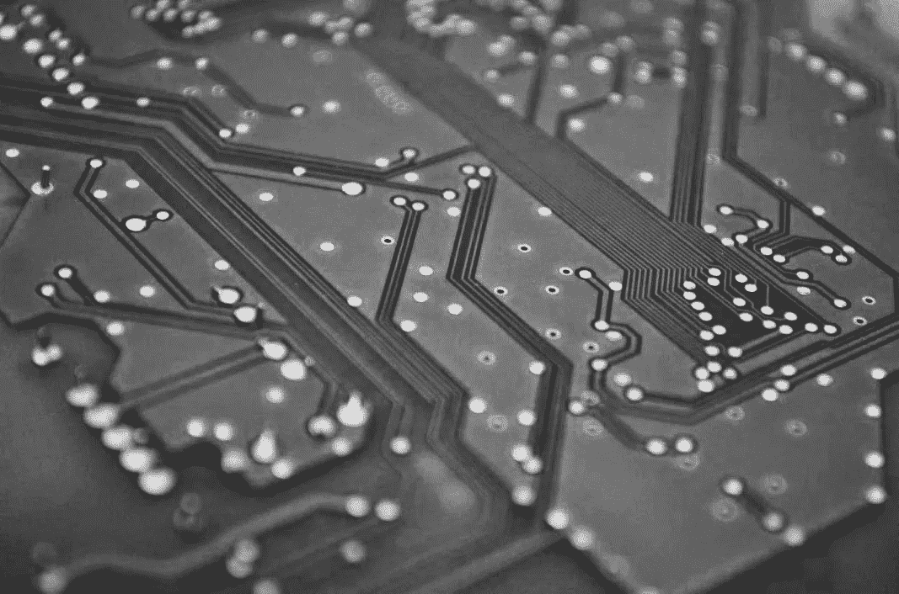

# 分散式 ASIC 生产可能吗？

> 原文：<https://medium.com/coinmonks/is-decentralized-asic-production-possible-eb5caece672c?source=collection_archive---------3----------------------->

*原载于* [*RelayNode 中国*](https://chinarelaynode.substack.com/p/evolution-path-to-decentralized-asics) *(03/11/20)*

最近关于 Nervos CKB 专用集成电路的消息出来了，截至发稿时，有四款专用集成电路公布，分别是[托德米纳 C1](https://minerstat.com/hardware/toddminer-c1) 、[托德米纳 C1 Pro](https://mp.weixin.qq.com/s/oon1I3R0VVTcbeErnqD6Fg) 、[比特大陆 K5](https://whattomine.com/miners/115-bitmain-antminer-k5) 和[PA miner](https://talk.nervos.org/t/paminer-p1-ckb-asic/4047)——首批 C1 于 3 月 9 日交付，K5 和 PA Miner 预计于 4 月交付，C1 Pro 于 5 月交付。