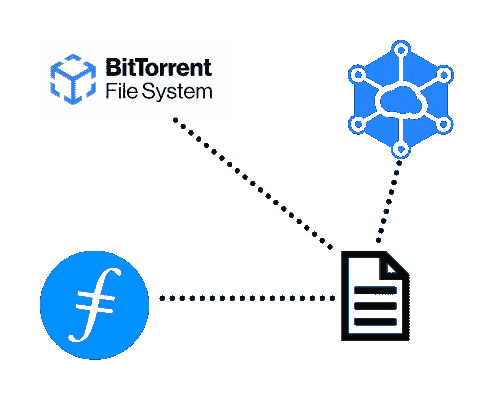

# 分散存储是未来吗？以下是你需要知道的！

> 原文：<https://medium.com/coinmonks/is-decentralized-storage-the-future-heres-what-you-need-to-know-ebea29c4b8b5?source=collection_archive---------3----------------------->

## Web3 正在为未来的互联网引入一系列去中心化协议。存储是一个迫切需要更多安全性和可靠性的领域。这里有一些解决这个问题的项目。

将存储从集中式实体手中拿走提供了一个更安全、更稳定的网络，同时奖励用户的参与。

集中式存储平台，如 Google Drive 和 Dropbox，提供了快速简单的存储解决方案。那我们为什么要调查其他事情呢？安全性和可靠性是我们需要分散存储的两个驱动因素。自从互联网出现以来，数据泄露就一直在发生，但像这样的集中式解决方案有可能更容易发生。你可以在这里查看本世纪最大的数据泄露事件。尽管这份清单上的内容并不都与存储相关，但它确实强调了对涉及用户数据的更多安全性的需求。

只有一个数据存放位置会产生潜在的故障点。然而，如果您使用对等协议来处理您的数据，它就不再是一个潜在的点。从本质上讲，这就是分散存储将解决的问题。

值得注意的是，大多数存储加密项目更像是一个激励层，而不是解决方案本身。例如，BitTorrent 仍然使用熟悉的 BitTorrent 点对点协议，但是奖励用户使用他们的本地令牌 BTT。

那么有哪些重要的存储项目需要关注呢？

## **Filecoin & IPFS**

Filecoin 是目前排名第一的存储加密软件。如前所述，它是星际文件系统的激励层。

IPFS 是一个对等存储网络，处理数据的方式与预期略有不同。IPFS 提供了一种将数据分割成多个片段并存储在多个节点上的方法。这大大节省了带宽，提高了分发文件的效率。

内容会定期镜像，以提供更高的可靠性，并有可能永久保存文件。它不是通过位置来识别内容，而是通过加密哈希来寻址。这增加了用户下载的安全性。哈希在这里帮助验证文件正是用户正在寻找的，而不是以任何方式被坏演员污染。

Filecoin 在这里将 IPFS 和区块链结合起来。它利用两种类型的证明。简而言之，空间证明验证文件在商定的时间内未被更改地存储，复制证明验证存储的拷贝数量是否正确。更深入地查看这两种证明可以在这里找到。

许多人可能会反对将加密技术引入 IPFS。就其本身而言，IPFS 是一个功能完善的文件存储网络。然而，它并没有为那些托管文件的人提供激励。这是 Filecoin 试图通过为文件存储付费来解决的主要问题。价格是由供求关系决定的，而不是一个固定的数量。

 [## 最佳免费加密交易机器人——前 16 名比特币交易机器人[2021]

### 2021 年币安、比特币基地、库币和其他密码交易所的最佳密码交易机器人。四进制，位间隙…

medium.com](/coinmonks/crypto-trading-bot-c2ffce8acb2a) 

## **BitTorrent**

我以前写过 BitTorrent 的原生令牌，以及它如何与众所周知的协议[联系在一起。所以，我不会在这里深入探讨，但是我们将看看 BitTorrent 文件系统，因为它与本文直接相关。](/coinmonks/bittorrents-dive-into-cryptocurrency-3dc80288fea7)

简单总结一下，BTT 在 BitTorrent 协议的基础上增加了种子种子文件的激励机制。有几种不同的赚钱方式，但它提供了一个激励协议的好方法。它增加的一个功能是 BitTorrent 文件系统，这个功能与 Torrent 有点不同。

BTFS 是 IPFS 的直接分支，功能非常相似。它为文件存储创建了一个分散的“服务器”,并使用 BTT 作为支付存储提供商提供的空间的货币。为了存储数据，文件被分成 30 个碎片，每个碎片存储在不同的主机上。只要主机能够保持在线并提供可靠的存储，文件就被安全地托管在网络上。

值得注意的是，自推出以来，Filecoin 的总体表现一直好于 BTT。尽管 BTFS 对存储开采的要求较低，但它需要一段时间才能获得存储合同，这使得目前的收入不可靠。

 [## 最佳 6 个加密交易信号电报通道

### 这是乏味的找到正确的加密交易信号提供商。因此，在本文中，我们将讨论最好的…

medium.com](/coinmonks/best-crypto-signals-telegram-5785cdbc4b2b) 

## **Storj**

Storj 分散式云存储(DCS)建立在我们一直在讨论的同一主题之上。默认情况下，网络上的所有文件都使用 AES-256-GCM 对称加密进行加密。上传数据的用户始终可以完全控制他们的文件，并可以随时撤销访问权限。

与其他文件非常相似，当文件上传时，它们被分成 80 个不同的文件，每个文件存储在不同的节点上。然而，当下载一个文件时，只需要 29 个片段来检索它。存储的额外部分考虑到了更多的安全性和可靠性。

目前，该网络在近 100 个国家拥有超过 10，000 个节点。但是节点是如何选择的呢？很大程度上，它们是随机选择的，但它们随后会根据整个网络的多样性进行加权。一旦它选择了一个节点池，就会尝试向这些节点上传文件，并选择池中最快的节点来存储文件。

平台的定价是合理的。有一个免费计划，允许多达三个项目，高达 150GB 的存储和带宽。标准计划将这些数字增加到 10 个项目，每月 4 美元/TB，每月 7 美元/TB 的带宽。这些费用可以用信用卡或 STORJ tokens 支付。

下一个重要方面是网络可靠性。当文件丢失太多部分时，通常是由于节点离线，网络将开始行动并开始修复过程。这种文件修复是让 80 个节点托管一个文件的重要之处。虽然单个节点可以脱机，但分散化的好处使得 80 个节点中损失 51 个节点的几率非常低。因此，丢失整个文件的可能性极小。

 [## BlockFi 评论 2021 —通过您的加密获得 8.6%的利率

### 让你的密码发挥作用，获得比特币和其他加密货币的最佳利率

medium.com](/coinmonks/blockfi-review-53096053c097) 

## **最终想法**

随着 Web3 的出现，分散存储显然是下一步。大公司提供的云存储通常会造成数据单点故障。这可以通过服务器离线或这些服务器上发生的代价高昂的数据泄露来证明。

Filecoin 是目前存储领域排名最高的加密技术，BTT 紧随其后。话虽如此，除了我在这里谈到的项目之外，还有很多其他项目。分散式存储确实是未来的趋势，所以值得关注它们，这样你才不会落在 Web3 的后面。

> 加入 [Coinmonks 电报频道](https://t.me/coincodecap)，了解加密交易和投资

## 另外，阅读

*   [尤霍德勒 vs 科恩洛安 vs 霍德诺特](/coinmonks/youhodler-vs-coinloan-vs-hodlnaut-b1050acde55a) | [Cryptohopper vs 哈斯博特](https://blog.coincodecap.com/cryptohopper-vs-haasbot)
*   [币安 vs 北海巨妖](https://blog.coincodecap.com/binance-vs-kraken) | [美元成本平均交易机器人](https://blog.coincodecap.com/pionex-dca-bot)
*   [MXC 交易所评论](/coinmonks/mxc-exchange-review-3af0ec1cba8c) | [Pionex vs 币安](https://blog.coincodecap.com/pionex-vs-binance) | [Pionex 套利机器人](https://blog.coincodecap.com/pionex-arbitrage-bot)
*   [我的密码交易经验](/coinmonks/my-experience-with-crypto-copy-trading-d6feb2ce3ac5) | [比特币基地评论](/coinmonks/coinbase-review-6ef4e0f56064)
*   [加密货币储蓄账户](/coinmonks/cryptocurrency-savings-accounts-be3bc0feffbf) | [赌注加密](https://blog.coincodecap.com/staking-crypto) | [窃取 x 评论](/coinmonks/stealthex-review-396c67309988)
*   [BigONE 交易所评论](/coinmonks/bigone-exchange-review-64705d85a1d4) | [CEX。IO 审查](https://blog.coincodecap.com/cex-io-review) | [Swapzone 审查](/coinmonks/swapzone-review-crypto-exchange-data-aggregator-e0ad78e55ed7)
*   [最佳比特币保证金交易](/coinmonks/bitcoin-margin-trading-exchange-bcbfcbf7b8e3) | [Bityard 保证金交易](https://blog.coincodecap.com/bityard-margin-trading) | [Prokey 点评](/coinmonks/prokey-review-26611173c13c)
*   [加密保证金交易交易所](/coinmonks/crypto-margin-trading-exchanges-428b1f7ad108) | [赚取比特币](/coinmonks/earn-bitcoin-6e8bd3c592d9) | [Mudrex 投资](https://blog.coincodecap.com/mudrex-invest-review-the-best-way-to-invest-in-crypto)
*   [WazirX vs CoinDCX vs bit bns](/coinmonks/wazirx-vs-coindcx-vs-bitbns-149f4f19a2f1)|[block fi vs coin loan vs Nexo](/coinmonks/blockfi-vs-coinloan-vs-nexo-cb624635230d)
*   [BlockFi 信用卡](https://blog.coincodecap.com/blockfi-credit-card) | [如何在币安购买比特币](https://blog.coincodecap.com/buy-bitcoin-binance)
*   [加密复制交易平台](/coinmonks/top-10-crypto-copy-trading-platforms-for-beginners-d0c37c7d698c) | [五大 BlockFi 替代品](https://blog.coincodecap.com/blockfi-alternatives)
*   [CoinLoan 点评](/coinmonks/coinloan-review-18128b9badc4)|【Crypto.com】点评 | [火币保证金交易](/coinmonks/huobi-margin-trading-b3b06cdc1519)

 [## 加密税务软件——五大最佳比特币税务计算器[2021]

### 不管你是刚接触加密还是已经在这个领域呆了一段时间，你都需要交税。

medium.com](/coinmonks/best-crypto-tax-tool-for-my-money-72d4b430816b)