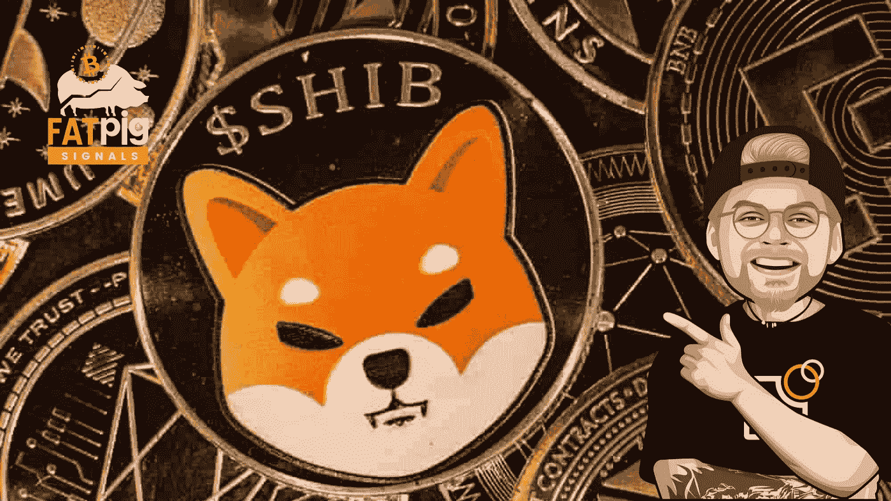

# 埃隆·马斯克会把 SHIBA 推到 1 分钱吗？

> 原文：<https://medium.com/coinmonks/is-elon-musk-pushing-shiba-to-1-cent-662920eb3368?source=collection_archive---------2----------------------->

埃隆·马斯克和罗宾汉都与柴犬的价格上涨没有任何关系，至少根据加密影响者尤里·莫尔昌的说法。

# 尽管马斯克发推特，柴犬表现出稳定性

在这方面，U.Today 的知名作者发表了 PAC 协议负责人 David Gokhshtein 的一份声明，他在声明中表示，来自…