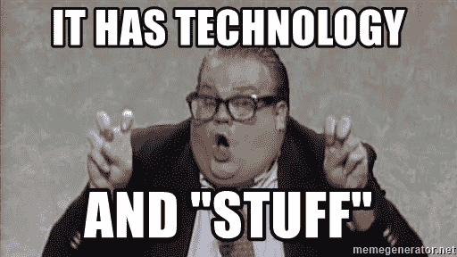
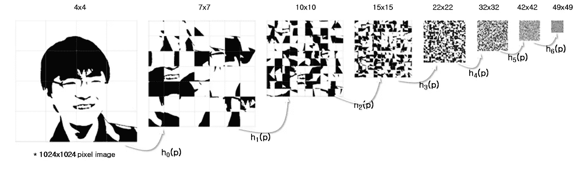
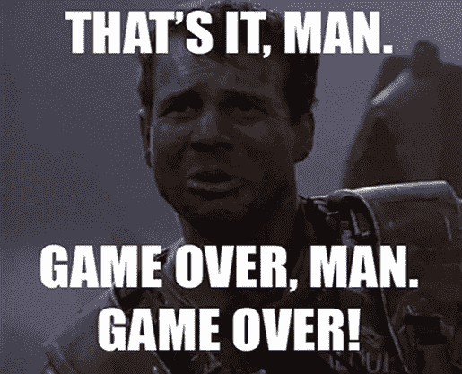

# GDPR 是区块链黑仔吗？

> 原文：<https://medium.com/coinmonks/is-gdpr-the-blockchain-killer-110eda7c11be?source=collection_archive---------7----------------------->

任何告诉你他们知道如何解决从区块链上擦除个人数据的 GDPR 合规性问题的人都是不诚实的。

Where I feel most articles and conference talks go when they talk about GDPR.

在过去的 45 天里，我参加了许多加密会议，包括纽约的 [Consensus 2018](https://www.coindesk.com/events/consensus-2018/) 和柏林的 [Blockshow Europe](https://blockshoweurope.com/) 。由于这 45 天是欧盟严格框架[【通用数据保护条例(GDPR)】](https://ec.europa.eu/commission/priorities/justice-and-fundamental-rights/data-protection/2018-reform-eu-data-protection-rules_en)5 月 25 日开始实施的准备期，所以谁在考虑遵守现有的法规，谁不遵守，这很有启发性。最大的挑战是应欧盟个人的要求解决删除个人数据的问题:删除的权利，监管者称之为被遗忘的权利。这在《GDPR 公约》第 17 条中有所描述。

除了会议之外，在同样的 45 天里，写了成百上千篇关于 GDPR 和区块链的文章，我不科学的评估是，其中很多都是垃圾。从一个希望以符合 GDPR 的方式利用区块链的开发商的角度来看，最糟糕的是那些从哲学上而不是实际上处理 GDPR 和区块链之间重叠的文章。如果文章中包含“分享许多目标”这句话，它很可能会被扔进垃圾堆。

目前，拥有个人数据的区块链无法遵守第 17 条。被遗忘的权利是一种抹去数据的权利，就其本质而言，数据不能从区块链中抹去。

您可以选择不将个人数据放在区块链上，这意味着您正在集中这些数据，以便您可以访问它们。您可以选择加密个人数据，但必须集中访问密钥管理和控制。你可能会选择把头埋在沙子里，这就是社区现在的样子。

Credit: [http://mrl.snu.ac.kr/research/ProjectLinklessOctree/index.html](http://mrl.snu.ac.kr/research/ProjectLinklessOctree/index.html)

一个有趣的争论是散列个人数据然后删除密钥是否构成擦除。论点总结为:哈希本质上是加密数据，扔掉加密密钥会使数据实际上不可读。其中的关键词是“有效地”，因为有一个数学结论，哈希仍然存在一些暴力攻击的小可能性。这是 1997 年成立的欧盟咨询机构第 29 条数据保护工作组在与 GDPR 无关的诉讼中的发现。它在数学上也是正确的。

除此之外，第 29 条工作组将数据散列作为一种假名形式。这种区别也包含在 [GDPR 本身](https://gdpr-info.eu/art-4-gdpr/)中，而单词 erasure 不是他们定义的一部分。很少有理由相信数据的散列会被视为构成擦除，并且随着计算能力的增加，这种理由会达到零。

GDPR 没有擦除的定义。这意味着此事将由法院来解决——区块链社区中任何一个已经、正在或将要进行象征性销售的人都非常熟悉这个领域。然而，这意味着在对如何管理隐私有一个明确的定义之前，许多公司将因侵犯隐私而在公共媒体上遭到嘲笑。结果可能令人不寒而栗，因为“等着瞧”的方法将使欧盟公民被排斥在技术创新之外，就像美国公民因监管延迟而在代币销售中成为*不受欢迎的人*一样。

另一个争论是识别数据控制器。这个论点是这样的:在一个去中心化的环境中，没有人控制数据。在 GDPR，数据控制者是“决定处理个人数据的目的和方法”的人。虽然“没有人控制数据”有点自鸣得意，但 GDPR 的冷观是，构建系统的人应该负责。他们不只是在定义中提到人。而是这样写的:

> “控制者”是指单独或与他人共同决定个人数据处理目的和方式的自然人或法人、公共机关、机构或其他团体

法人是“商业”的行话。自然人是“人类”的行话。这意味着可能会对建造 dApp 和区块链的个人征收罚款。

I feel bad for Bill Paxton. Not bad enough to not use this, though…

有时，这种争论演变成“没人能控制区块链！”或者“任何人都可能是公共区块链上的一个节点，因此缺乏对数据的控制是区块链本身固有的”，这种观点通常不会引起监管机构的共鸣。很少有监管者(和更少的立法者)有技术专家，更少的人自己是技术专家。这意味着立法者和监管者在他们的专业领域和知识范围内工作，通常是法律。

为了说明这一点，[第 17 条](https://gdpr-info.eu/art-17-gdpr/)第 2 款对这一问题的表述是:

> 如果控制方已经公开了个人数据，并且根据第 1 款有义务删除个人数据，则控制方应考虑可用的技术和实施成本，采取合理的步骤，包括技术措施，通知正在处理个人数据的控制方，数据主体已要求这些控制方删除与这些个人数据的任何链接、副本或复制件。

除了大部分责任落在最初的管制员身上之外，很难从其他方面理解这一点。是的，区块链上的任何节点本身都成为数据控制器，并伴随着所有的责任和权利。

一切都很严峻吗？现在，是的。在社区坦率地看待区块链的隐私和删除问题之前，每一家区块链公司都面临着不合规的风险。这使得令牌化平台除了在问题解决之前对区块链保密个人数据之外别无选择。

*关于达纳洛夫:我目前是两个 ico 的密码经济顾问:*[*eLocations*](https://elocations.io/)*和*[*Intellos*](http://intellos.com)*和总裁兼首席技术官，*[*Radpay*](https://radpay.com/)*的创始人。2011 年首次参与区块链工作，我拥有经济学博士学位(格拉斯哥大学，最高荣誉)、市场营销 MBA 学位(哈佛商学院，贝克学者)和物理学学士学位(里士满大学，Phi Beta Kappa)。自从我年轻时在 MORTRAN 和 ALGOL68G 开始编写代码以来，我已经与人共同创立了五家公司，其中四家成功退出，包括思科资本支持的 Metacloud 和华平投资支持的 Radnet，并领导了包括 GTE(现为威瑞森)、韵律互动(现为凯捷)和 ADC 在内的上市公司部门。我的研究方向是公共政策，最近的研究方向是区块链和大数据对新兴经济体的影响。我过去的一些工作包括构建第一个基于云的 ERP 系统(在 90 年代中期)，开发世界上第一个电信级 VoIP 和统一通信平台(在 GTE，现在的威瑞森)，以及大数据系统的早期工作(作为甲骨文的合作伙伴)。)我在大数据、机器学习、区块链和 VoIP 方面的工作已经在《连线》、甲骨文的《利润》杂志、《金融时报》和《电话》杂志上发表。*