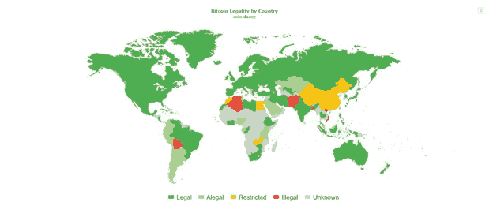

# 好的比特币监管是真的吗？

> 原文：<https://medium.com/coinmonks/is-good-bitcoin-regulation-real-cc4034f4b33d?source=collection_archive---------11----------------------->

今天，加密货币在世界上几乎所有国家都普遍使用。“人类的钱”已经给金融系统投下了相当大的阴影，政府只是被迫对当前形势做出反应(或假装如此)。他们在立法层面执行法律规范。一些国家就是这样引发了随之而来的崩溃。

Bitcoin legality by country

## **印度**

印度解除加密货币禁令。该国最高法院允许负有责任的实体向与比特币和其他数字货币相关的公司提供银行服务。

印度解除了储备银行(RBI)指令，禁止报告实体向加密货币公司提供银行服务。由于这一规定，许多本地交易所和初创公司被迫关闭或搬迁到另一个国家。现在，最高法院考虑了区块链工业代表的上诉，同意了他们的论点。

去年夏天，一家法院批评央行引入了这项禁令。监管机构必须证明其限制与数字货币相关的公司活动的决定是合理的。该规定自 2018 年 4 月起生效。

## **日本**

良好监管的一个典型例子是日本，它是第一个将数字货币等同于真实货币的国家。日本通过为加密交易所的活动制定规则，使其合法化，并因此为 ICOs 等程序创建了一个框架，但不是系统标准。

据立法者称，这使得对快速增长的加密货币基础设施的投资不断增加。

2020 年 5 月，管理该国加密货币流通的立法修正案在日本生效。

最初的交易所报价(IEO)是一个替代的 ICO 选项，与它不同的是，不是项目开发商为新的代币寻找投资者，而是加密货币交易所选择有前途的团队，并在其用户中推广他们的硬币。

## **德国**

在德国，比特币被官方认可为一种金融工具，它以数字形式表示任何货币价值。监管的法律规范几乎完全形成。

此外，2021 年 7 月 1 日，一项新法律生效，该法律允许德国投资基金将高达 20%的投资组合投资于加密货币。

这项法律的实施是欧盟的指令，这意味着来自其他欧洲国家的基金会可以获得同样的支持。

## **瑞士**

早在 2016 年 11 月，瑞士铁路服务公司 SBB 开始在火车站的收银机上出售比特币。购买虚拟货币，只需要有一个电话号码和一个支持加密货币的电子钱包。

五年前，楚格州当局允许用比特币按照当前兑法郎的汇率支付公用事业费用。现在人们可以用加密货币和税收支付。考虑到楚格早就获得了“加密谷”的名声，这是一个合乎逻辑的步骤:许多区块链初创公司和加密货币公司在那里工作或注册活动。

瑞士在 2021 年对多项立法进行了重要修订，这将为基于区块链技术的金融交易市场奠定坚实的法律基础。此外，在过去两年中，瑞士金融市场管理局(Finma)向两家瑞士加密银行、一家加密货币交易所和首个瑞士加密资产投资基金发放了许可证。

加密货币的“普及”旨在改善这种金融和银行技术不太令人满意的形象。

## **爱沙尼亚**

爱沙尼亚是首批通过法律监管加密货币的国家之一。爱沙尼亚当局认为区块链技术相当友好，认为它们是国家发展的优先领域。

此外，在爱沙尼亚，可以很快很容易地开办一家企业——这是电子居留和电子公证等领域非常先进的管辖权的结果。爱沙尼亚成为这个行业的中心，有超过 500 家密码公司在此注册。法律法规允许人们在世界各地开展业务。

在 2019 年通过丹斯克银行洗钱超过 2200 亿美元的丑闻发生后，它收紧了对此类公司的监管和注册规则。

## **结果是什么？**

这些国家的例子表明，各国已经准备好对比特币和其他加密货币进行良好的监管。确定加密货币的法律地位和硬币初始放置的过程为市场本身的参与者和玩家创造了保障，正因为如此，出现加密投资中心的先决条件出现了。

> 加入 Coinmonks [电报频道](https://t.me/coincodecap)和 [Youtube 频道](https://www.youtube.com/c/coinmonks/videos)了解加密交易和投资

## 另外，阅读

*   [比特币基地 vs 瓦济克斯](https://blog.coincodecap.com/coinbase-vs-wazirx) | [比特鲁点评](https://blog.coincodecap.com/bitrue-review) | [波洛涅克斯 vs 比特鲁](https://blog.coincodecap.com/poloniex-vs-bittrex)
*   [美国最佳加密交易机器人](https://blog.coincodecap.com/crypto-trading-bots-in-the-us) | [经常性回顾](https://blog.coincodecap.com/changelly-review)
*   [A-Ads 审查](https://blog.coincodecap.com/a-ads-review) | [Bingbon 审查](https://blog.coincodecap.com/bingbon-review) | [Mudrex 投资](https://blog.coincodecap.com/mudrex-invest-review-the-best-way-to-invest-in-crypto)
*   [最好的卡达诺钱包](https://blog.coincodecap.com/best-cardano-wallets) | [Bingbon 副本交易](https://blog.coincodecap.com/bingbon-copy-trading)
*   [印度最佳 P2P 加密交易所](https://blog.coincodecap.com/p2p-crypto-exchanges-in-india) | [柴犬钱包](https://blog.coincodecap.com/baby-shiba-inu-wallets)
*   [8 大加密附属计划](https://blog.coincodecap.com/crypto-affiliate-programs) | [eToro vs 比特币基地](https://blog.coincodecap.com/etoro-vs-coinbase)
*   [最佳以太坊钱包](https://blog.coincodecap.com/best-ethereum-wallets) | [电报上的加密货币机器人](https://blog.coincodecap.com/telegram-crypto-bots)
*   [交易杠杆代币的最佳交易所](https://blog.coincodecap.com/leveraged-token-exchanges)
*   [5 大最佳社交交易平台](https://blog.coincodecap.com/best-social-trading-platforms) | [瓦济克斯 NFT 印度](https://blog.coincodecap.com/wazirx-nft-india)
*   [10 本关于加密的最佳书籍](https://blog.coincodecap.com/best-crypto-books) | [英国 5 个最佳加密机器人](https://blog.coincodecap.com/uk-trading-bots)
*   [Koinly 回顾](https://blog.coincodecap.com/koinly-review) | [Binaryx 回顾](https://blog.coincodecap.com/binaryx-review) | [Hodlnaut vs CakeDefi](https://blog.coincodecap.com/hodlnaut-vs-cakedefi-vs-celsius)
*   [比斯勒评论](https://blog.coincodecap.com/bitsler-review)|[WazirX vs coin switch vs coin dcx](https://blog.coincodecap.com/wazirx-vs-coinswitch-vs-coindcx)
*   [7 大副本交易平台](https://blog.coincodecap.com/copy-trading-platforms) | [BuyCoins 点评](https://blog.coincodecap.com/buycoins-review)