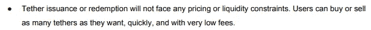
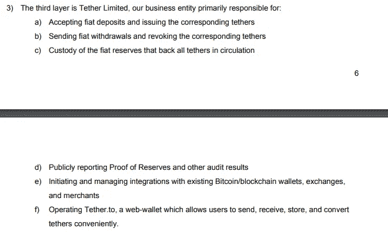
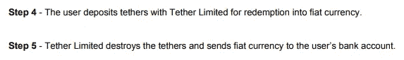
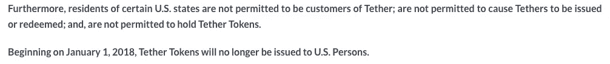

# 哈苏真的没有拴绳吗？

> 原文：<https://medium.com/coinmonks/is-hasu-really-un-tethered-fbdf7f21b9d7?source=collection_archive---------4----------------------->

这篇文章中有几个有严重缺陷的假设，导致了对 Tether 的风险状况的错误理解。

首先，我们来讨论一下系绳的“可兑换性”。这是可以理解的，有关于这个问题的困惑，因为系绳本身在他们的白皮书中提出的说法是不真实的。

所有这些都直接来自 Tether 白皮书，似乎表明有可能赎回和转换 Tether 的回到菲亚特，但事实稍微复杂一点。从分析系绳流来看，系绳流不是直接从系绳钱包流向各个“用户”，而是首先通过 Bitfinex 过滤，这似乎表明 Bitfinex 是白皮书中描述的唯一客户。我还想提请注意这里的第 5 步，他们声称摧毁系绳。这种情况并不常见。据我所知，这种情况只发生过一次，而且金额只有区区 3000 万美元。([这里是](https://www.omniexplorer.info/tx/24db40680654b8b505fda3e96be722ca10f341a129c99260509eb5d84655f1f0)发生在 Omni 区块链的交易。)此外，比较 Tether 和 True 之间的市值变化，您可以看到人们如何按照预期赎回 True，市值下降，而 Tether 持续上升。这似乎表明，绳索没有被赎回，因此我们确实需要质疑是否有可能赎回它们，到目前为止，完全没有人公开承认赎回绳索。既然围绕人民币有价证券的可兑换性存在这些严重的问题，我们现在不禁要问，当[哈苏](https://medium.com/u/90326a938400?source=post_page-----fbdf7f21b9d7--------------------------------)说“市场对人民币可兑换性的信任在历史上一直保持着近乎绝对的状态”时，这是什么意思。没有人相信它是可转换的，因为据我们所知，它不会被转换。

接下来，我们必须查看他们专有的流动性分析，其中他们准确地确定几乎每个 Tether 交易所都存在非法清洗交易，然而，这一点被忽略了，他们得出的结果是 Tether 是一个相对较小的 29%。但是，他们决定 Bitfinex 应该单独计算，因为他们(有时)允许提取美元。然而，Bitfinex 需要与 Tether 一起计算，即使他们使用的是 USD，因为一个带走 Tether 的事件可能会在同一时间带走 Bitfinex，所以这些流动性会一起蒸发。这让我们甚至将他们调整后的流动性数据提高到了更高的 55%。比特币基地和 Gemini 等合法交易所的法定交易量下降，加剧了这种风险。Diar 报告称，自 1 月份以来，比特币基地的交易量下降了 83%。在几分钟内消除任何流动性，尤其是超过一半的流动性，将意味着在一个疲软的市场中出现巨大的流动性紧缩。

他们构建危机的方式具有误导性，因为人们不会赎回。真正的潜在危机是信仰的丧失。这可能是因为监管机构查封了账户，起诉了主犯，或者发生了其他重大事件。作者意识到了这种风险，甚至说，“一个有限的偿付能力危机将对加密生态系统产生可怕的后果。价值高达 28 亿美元的系绳将变得一文不值，这不仅意味着非常重大的资本外流，还会引发极其严重的信心危机和抢购潮，因为大多数人预计 Bitfinex 将与系绳船一起沉没。”然而，他们声称，因为钱的存在，这种危机是不太可能的。然而，Tether 的最大风险不是由于缺乏资金而导致的资不抵债，而是由于监管机构的干预。然而，作者似乎考虑到了这种风险，他们得出结论说，“假设获得全额准备金，Tether 仍可能在未来被当局关闭，或者失去他们在来宝的银行牌照，这可能导致流动性危机。在最有可能和最合理的情况下，将给予系绳持有人 3-6 个月的时间将他们的 USDT 兑换为系绳有限公司的菲亚特储备。因此，对整个生态系统的信任可能会暂时受损，许多加密资产的持有者可能会退出他们的头寸，所有人都挤在同一个狭窄的平板门内。”在我看来，在经过漫长的法律和官僚斗争之前，限制持有者似乎不太可能获得该法令，即使到那时，许多人也可能无法索赔。在我看来，他们不太可能允许任何持有人立即提出索赔。此外，重要的是要记住，系绳 ToS 有一定的限制，谁应该使用系绳，包括这个花絮:

这向我表明，如果你是美国人，试图对菲亚特提出索赔，你会发现这相当困难。

此外，出于某种原因，作者似乎认为 Bitfinex 在 Tether 崩溃后生存下来没有问题，甚至可以说，“很难预测 Tether 关闭会对 Bitfinex 产生什么影响，但很难相信这是关键的。首先，它们是两家法律上独立的公司。”他们说的没错，从技术上讲，他们是两家独立的公司，拥有相同的原则(感谢天堂纸业)。Tether 和 Bitfinex 的财务状况可能与 Tether 崩溃导致 Bitfinex 崩溃的程度有关。

最后，我们需要处理作者最严重误解的部分。也就是说，“通过允许币安或 Bitfinex 等加密货币交易所支持类似法定货币的货币对，它们更容易在 KYC/反洗钱监管之外存在。”这是真的，这也是它可能失败的原因。如果不遵守这些法规，他们将面临监管行动，尽管 Tether 和 Bitfinex 以及 iFinex 都是外国公司(香港和英属维尔京群岛)，但他们使用 Noble Bank 进行银行业务，Noble Bank 是一家美国银行，使查封相对容易。他们在美国土地上银行的同时，却在炫耀美国的法规。这是一个灾难性的想法，其结局是可以预见的。

系绳完蛋了。如果你在参与加密货币领域时没有持续认识到风险，你就注定要失败。精明交易。

*   咳*自由储备*咳*

> [在您的收件箱中直接获得最佳软件交易](https://coincodecap.com/?utm_source=coinmonks)

