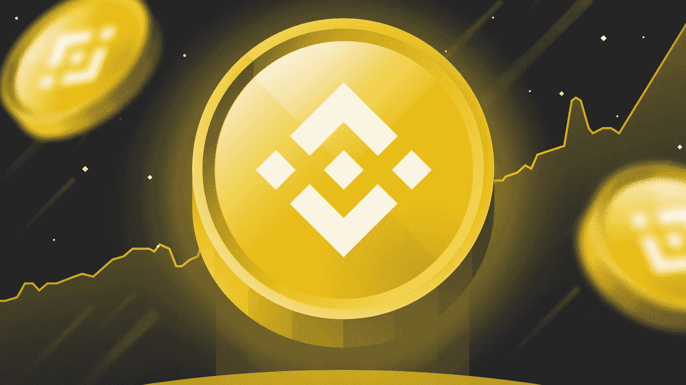

# 进入 BNB 还值得吗？

> 原文：<https://medium.com/coinmonks/is-it-still-worth-getting-into-bnb-d953d7235f18?source=collection_archive---------6----------------------->

今天 [**胖子信号**](https://www.fatpigsignals.com/) 和我来看看 BNB 令牌可能很快表现如何。

随着加密货币价格和 DeFi 量的稳定，币安硬币价格周三上涨了 10%以上。BNB 币交易价为 370 美元，比本周的最低价格高出约 16%。币安币现在的市值超过 620 亿美元，是全球第五大加密货币。