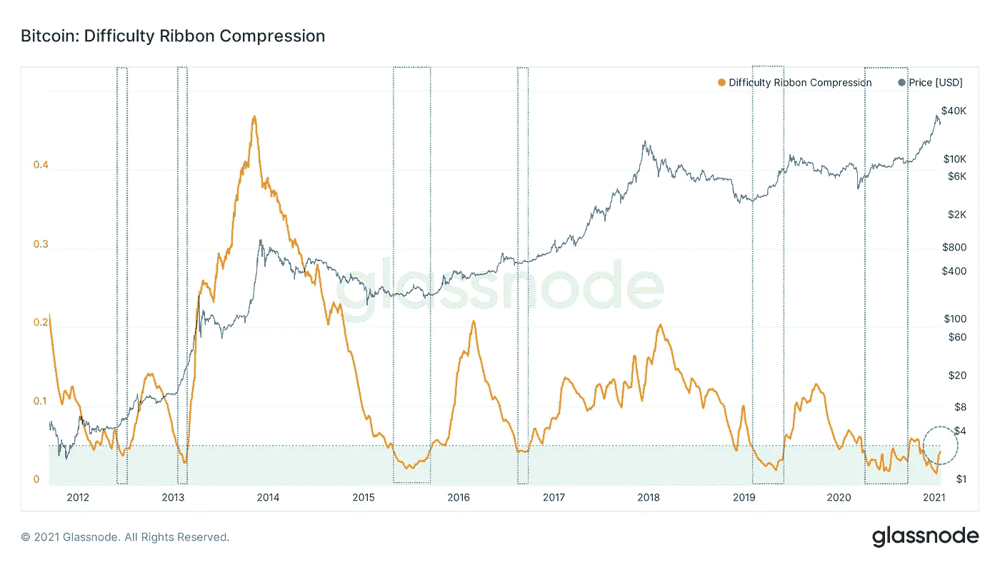
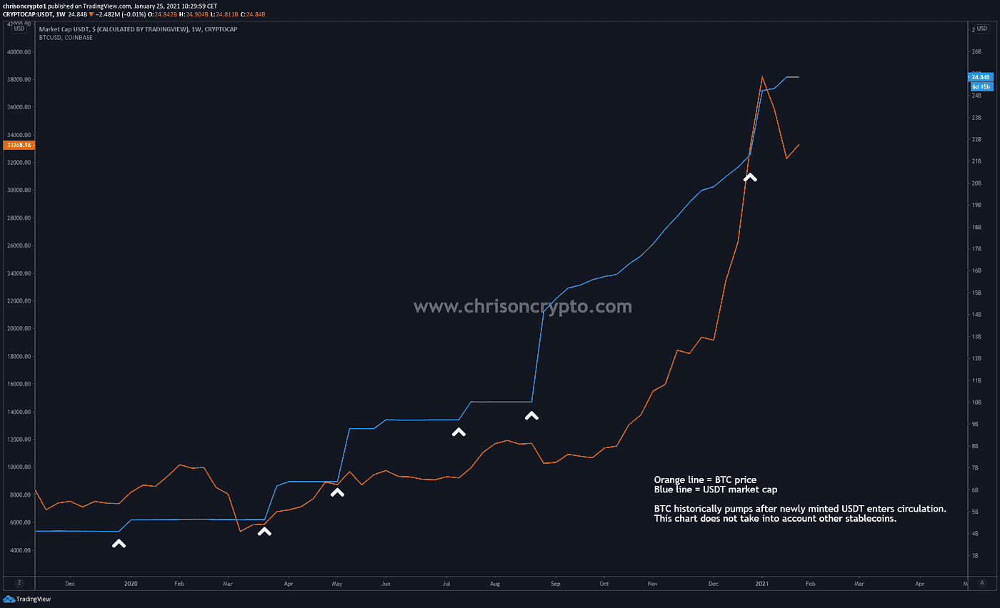
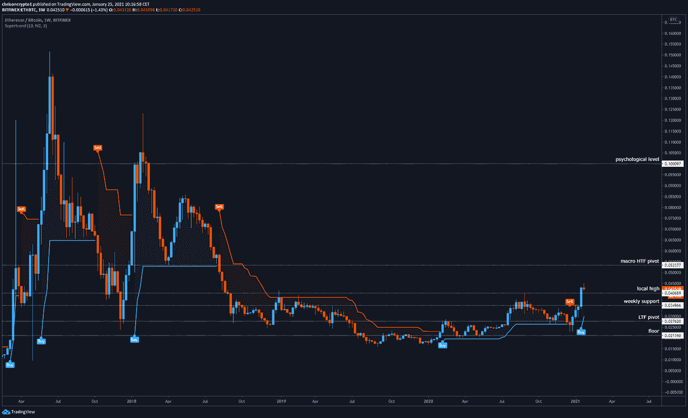
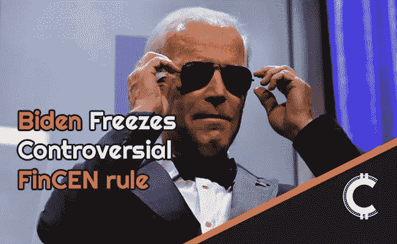

# 现在买比特币还来得及吗？

> 原文：<https://medium.com/coinmonks/is-it-too-late-to-buy-bitcoin-e49ba9bdddb3?source=collection_archive---------3----------------------->

比特币的长期困难压缩带表明，比特币在十年之交的纪念性场合可能会变得更大。

碰巧的是，自从我们去年 12 月的报道以来，以太坊已经取得了一定的进展。问题是:这对以太坊的未来意味着什么？

让我们开始吃吧。

# 现在买比特币还来得及吗？

这是比特币创造者和密码爱好者经常遇到的一个问题，而且理由充分。

事实上，越来越多的人意识到，当前的事件——如果放在一起看——对西方人眼中的“钱”是有害的。这种情绪不是空洞无物、充满陈词滥调的意识形态言论。相反，这是一种越来越普遍的直觉的结果，即我们的钱出了问题。

而这种直觉又因时事而加剧。

电晕病毒混乱的滚雪球效应、经济封锁、对某些讨论的全面审查以及金融市场和经济截然相反的结果似乎很奇怪，因为没有更好的词。这些看似永恒的问题暴露了我们现代货币体系中濒临灭绝的缺陷，这个体系在数十亿人被迫采取封锁措施之前就已经存在了。

更重要的是，为什么金融市场和经济增长会走向相反的方向？

这个问题和其他许多问题一样，现在已经成为主流。

去年，当时的美联储主席杰罗姆·鲍威尔(Jerome Powell)公开[承认](https://youtu.be/mrjoElG8KGI)公开让美元贬值——这是他的前任不愿提及的承认。这标志着一个转折点，形成了在全球范围内提高金融知识的基础，因为事实是杰罗姆·鲍威尔承认了金融界每个人都已经知道的事情:

**纸币可以无限流通。**

中央银行家知道这一点，政治家知道这一点，金融管理者知道这一点，现在其他所有人都知道这一点——或者正在知道这一点。

快进到 2021 年，这是同样的重新包装的故事。现在，我们已经习惯了没有经济并为此获得报酬的想法，美国总统乔·拜登承诺继续这一所谓的经济救助计划(也称为普遍基本收入)，承诺为金融市场再提供 2 万亿美元，为每个美国公民提供 1，400 美元的刺激拨款。

这以牺牲其他人的利益为代价，丰富了印钞机。

客观地看，去年在 1200 美元刺激计划下购买比特币的每个美国人都将现金变成了 5770 美元——增长了 380%。我怀疑那些没有陷入困境的美国人知道他们的下一笔拨款会花在哪里。

在这种背景下，我不禁要问:现在购买比特币是否为时已晚？

答案绝对是否定的。

***获取此新闻稿！*** [***订阅邮件列表***](https://chrisoncrypto.com) ***。***

# 技术上来说

## 比特币难度丝带暗示今年将继续大幅增加

从历史上看，比特币难度丝带一直是比特币表现的预测指标。今天，比特币的难度带状压缩再次从历史显著水平上升。

简而言之，Glassnode 的比特币难度带状压缩指标是从挖掘难度的两个简单移动平均值中得出的，这使得分析师可以了解和检测比特币难度的变化率。

这是比特币协议中控制挖掘难度的硬编码特性。挖掘难度与比特币生态系统的 hashrate 直接相关，也就是网络的计算能力。

矿工离开生态系统，网络难度下降，促使难度下降，丝带压缩。

在这一点上，留在生态系统中的财务强大的矿商没有什么动力出售大部分股份来维持业务。

这导致看涨价格行为的增加。

## 印钞机不会停止；菲亚特流入量增加

在加密牛市中，看加密/美元配对不如用比特币来看一切更有趣。毕竟，这是正在形成的“比特币标准”。

欧元正在失去购买力。不再深入细节，那些拥有印钞杠杆的人无意停止这个项目。

在一个法定货币流动性只会上升的市场中——根据下面的 USDRT 市值表——ALT/BTC 配对变得更加有趣。

## ETH/BTC 在周线图上反转看涨

上周三，我们讨论了以太币以美元计价创历史新高的可能性，这发生在周一凌晨，当时以太币达到 1480 美元。

目前，以太坊在 1400 美元以下盘整，因为加密市场准备为本周定下基调。然而，更有趣的故事是瑞士联邦理工学院/BTC 图表，在每周的时间框架翻转看涨。

在牛市中，对 ETH/BTC 组合的看涨势头历来会导致接下来几周和几个月的大幅上涨。自 2018 年创下历史新高以来，以太坊对美元和比特币都经历了三年的熊市。

然而，在[12 月](https://mailchi.mp/6aa5f136b67b/another-bitcoin-baptism-of-fire-as-ethereum-nears-all-time-highs?e=[UNIQID])，看涨势头发生了转变，从那时起以太坊相对于比特币持续走强。根据上面的图表，这对组合形成了更高的低点，直到最终在周时间框架内形成了更高的局部高点(0.045 点)。

以太坊公牛队正在前进。

在出现某种形式的灾难性全行业挫折(如比特币跌至 20 周均线)之前，以太坊已经进入了比特币的中长期牛市。

这绝不意味着以太坊只会垂直上升，认为这是天真的。牛市中的调整是正常的，但现在的总体基调比几周前更加清晰。

下次再见。

**在你的社交网站上分享这些内容。非常感谢你的支持。
加入** [**电报**](https://t.me/chrisoncryptochannel) **频道进行实时交易更新！
关注我的** [**多嘴多舌**](https://gab.com/chrisoncrypto) **和下面的社交门户了解更多。
引荐，商机，反馈也很棒。**

# 阅读更多:美国总统拜登冻结有争议的 FinCEN 钱包提案

[https://chrisoncrypto.com/blog/f/us-president-biden-freezes-controversial-fincen-wallet-proposal](https://chrisoncrypto.com/blog/f/us-president-biden-freezes-controversial-fincen-wallet-proposal)

[http://www.chrisoncrypto.com/](http://www.chrisoncrypto.com/)

发送
你是经常阅读的人吗？给我小费！
T21BTC
到此地址:**3 eydseypjhn 68 axkncuqbb 7 ebqcxrejamr**

*原载于*[*https://mailchi . MP*](https://mailchi.mp/6f69e1bd6901/is-it-too-late-to-buy-bitcoin-on-chain-data-reveals-the-answer)*。*

> 加入 coin monks[Telegram group](https://t.me/joinchat/EPmjKpNYwRMsBI4p)学习加密交易和投资

## 另外，阅读

*   什么是[闪贷](https://blog.coincodecap.com/what-are-flash-loans-on-ethereum)？
*   最好的[密码交易机器人](/coinmonks/crypto-trading-bot-c2ffce8acb2a)
*   [3 商业评论](/coinmonks/3commas-review-an-excellent-crypto-trading-bot-2020-1313a58bec92) | [Pionex 评论](/coinmonks/pionex-review-exchange-with-crypto-trading-bot-1e459d0191ea) | [Coinrule 评论](https://blog.coincodecap.com/coinrule-review-a-perfect-trading-bot)
*   [AAX 交易所审查](/coinmonks/aax-exchange-review-2021-67c5ea09330c) | [德里比特审查](/coinmonks/deribit-review-options-fees-apis-and-testnet-2ca16c4bbdb2) | [FTX 密码交易所审查](/coinmonks/ftx-crypto-exchange-review-53664ac1198f)
*   [n 零审核](/coinmonks/ngrave-zero-review-c465cf8307fc)
*   [Bybit Exchange 审查](/coinmonks/bybit-exchange-review-dbd570019b71) | [Bityard 审查](https://blog.coincodecap.com/bityard-reivew)
*   [3Commas vs Cryptohopper](/coinmonks/3commas-vs-pionex-vs-cryptohopper-best-crypto-bot-6a98d2baa203)
*   最好的比特币[硬件钱包](/coinmonks/the-best-cryptocurrency-hardware-wallets-of-2020-e28b1c124069?source=friends_link&sk=324dd9ff8556ab578d71e7ad7658ad7c)
*   [总账 vs 平均](https://blog.coincodecap.com/ngrave-vs-ledger)
*   [密码本交易平台](/coinmonks/top-10-crypto-copy-trading-platforms-for-beginners-d0c37c7d698c)
*   [莱杰纳诺 s vs x](https://blog.coincodecap.com/ledger-nano-s-vs-x)
*   [Vauld Review](https://blog.coincodecap.com/vauld-review)|[you hodler Review](/coinmonks/youhodler-4-easy-ways-to-make-money-98969b9689f2)|[BlockFi Review](/coinmonks/blockfi-review-53096053c097)
*   最好的[加密税务软件](/coinmonks/best-crypto-tax-tool-for-my-money-72d4b430816b) | [硬币追踪评论](/coinmonks/cointracking-review-a-reliable-cryptocurrency-tax-software-5114e3eb5737)
*   最佳[加密贷款平台](/coinmonks/top-5-crypto-lending-platforms-in-2020-that-you-need-to-know-a1b675cec3fa)
*   [莱杰 Nano S vs 特雷佐 one vs 特雷佐 T vs 莱杰 Nano X](https://blog.coincodecap.com/ledger-nano-s-vs-trezor-one-ledger-nano-x-trezor-t)
*   [block fi vs Celsius](/coinmonks/blockfi-vs-celsius-vs-hodlnaut-8a1cc8c26630)|[Hodlnaut Review](https://blog.coincodecap.com/hodlnaut-review)
*   [Bitsgap 审查](/coinmonks/bitsgap-review-a-crypto-trading-bot-that-makes-easy-money-a5d88a336df2) | [四种货币审查](/coinmonks/quadency-review-a-crypto-trading-automation-platform-3068eaa374e1)
*   [埃利帕尔泰坦评论](/coinmonks/ellipal-titan-review-85e9071dd029) | [赛克斯斯通评论](https://blog.coincodecap.com/secux-stone-hardware-wallet-review)
*   [区块链评论](/coinmonks/blockfi-review-53096053c097) |在你的密码中赚取高达 8.6%的利息
*   [DEX Explorer](https://explorer.bitquery.io/ethereum/dex) 和[区块链 API](https://explorer.bitquery.io/graphql)
*   [加密套利](/coinmonks/crypto-arbitrage-guide-how-to-make-money-as-a-beginner-62bfe5c868f6)指南:新手如何赚钱
*   最佳[加密制图工具](/coinmonks/what-are-the-best-charting-platforms-for-cryptocurrency-trading-85aade584d80)
*   了解比特币最好的[书籍有哪些？](/coinmonks/what-are-the-best-books-to-learn-bitcoin-409aeb9aff4b)

> [直接在您的收件箱中获得最佳软件交易](/coinmonks/newsletters/coinmonks)

