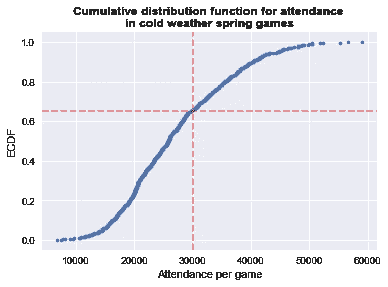

# 天气冷的时候，MLB 每场比赛的上座率有显著的不同吗？

> 原文：<https://medium.com/coinmonks/is-mlb-attendance-per-game-significantly-different-when-its-cold-793a3553132c?source=collection_archive---------13----------------------->

在以前的帖子中，我们已经[定义了温度是否影响美国职业棒球大联盟比赛上座率的问题](/@jordanbean/whats-the-deal-with-declining-mlb-attendance-part-1-62a0f39ba0b0),[探索了数据](/@jordanbean/analyzing-mlb-attendance-and-temperature-6cb2b1af2bd4),[试图模拟](/@jordanbean/can-temperature-predict-attendance-at-mlb-games-d0b6a50217e0)温度和上座率之间的关系。

在本系列的最后一篇文章中，我们将从统计学的角度来处理这个问题([这里是完整的 Python 代码](https://nbviewer.jupyter.org/github/jordanbean/MLB-Weather-Attendance/blob/master/MLB%20Weather%20Attendance%20Final.ipynb))。

在本帖中，我们要问的问题是: ***当每个城市的月平均气温高于或低于当月的中位数时，寒冷天气城市的每场比赛的上座率是否有统计学上的显著差异？***

为了回答这个问题，我们需要首先切割我们的数据以匹配规定的细分(寒冷天气团队，春季月份)，对新数据进行一些基本的探索性分析，取每个集合的平均值(高于和低于中值)，将其与样本平均值进行比较，然后运行均值差异分析，以在两个变量之间没有差异的假设下生成 p 值。

**数据分割和探索性分析**

在我们之前的探索性工作中，我们已经有了一个名为“cold_spring_teams”的数据集，该数据集确定了天气寒冷(四月平均气温低于 55.0 度)的团队，因此我们可以创建一个该数据集的副本来开始这一部分。

因为我们不再关心球队或其他变量，我们也可以将数据精简为“每场比赛的出勤率”和“低于中位数”变量。

*(注:之前的分析使用了“低于平均值”变量，而本次分析使用了中值温度)*

然后，我们将数据的平均温度取为低于中值(“below _ median”= 1)和等于或高于中值(below_median = 0)，并发现两组之间实际上存在大约 1，000 个风扇或大约 3.5%的显著地表差异。

我们继续用累积分布图来可视化数据集中的数据。此图的目的是了解数据如何分布在每场比赛的出席率值范围内。解读该曲线的方式是，*在红色虚线的交叉点，大约 65%的数据点处于或低于每场比赛 30，000 名球迷*。

**统计显著性**

为了从统计学的角度理解这种差异，我们将采用一系列替换的样本数据点，并计算这些点的平均值，然后绘制这组平均值在直方图上的分布情况。在下面的图表中，我们可以看到样本均值是如何分布的，以及数据的 95%置信区间，以及低于中值和高于中值在该谱中的位置。

从数字上看，我们基于样本数据的真实平均值的 95%置信区间(紫色条)为(26，605.5，27，754.5)，而低于中位数的平均值为 26，691.8(绿色)，高于中位数的平均值为 27，621.3(金色)。因为我们的两个变量都在 95%的置信区间内，虽然很窄，但我们不能从这个分析中说均值在统计上不同于样本均值 27，173.8。

**经济情况调查差异**

为了进一步强调这一点，我们测试两个平均值之间的差值是否不等于 0，零假设是差值为零。为了做到这一点，我们将再次采取一系列随机抽样的数据，这一次没有使用置换测试替换。

排列分布将数据视为来自单个分布，方法是获取每个不同的输入序列，对值进行混排，这样就有了一个没有标签的新的单个数据集，并计算所需的统计数据(在这种情况下，是均值差)。这种方法的优点是，在计算检验统计量时，假设两个序列之间没有差异，从而与我们的零差异假设一致。

在本项目中，这意味着中值以上和中值以下的平均温度被认为来自同一分布，因此平均差值为 0。

从我们的数据中随机抽取 10，000 个样本，我们生成以下值的直方图:

我们观察到的差异约为 930 个风扇，如本节开头所述，该值在上图中用绿线标出。

使用 10，000 个随机样本中的置换值，我们可以计算出一个 p 值，该值将给出至少与我们观察到的值一样极端的值的百分比(约 930 个粉丝)。如果这个值小于或等于 0.05，我们可以说在 95%的置信阈值下，我们拒绝了两个分布是偶数的零假设。否则，我们无法拒绝零假设。

这样做时，我们得到的观测 p 值为 0.057。虽然这非常接近我们的 0.05 阈值，但我们不能拒绝零假设。

**结论、局限性和后续步骤**

这一切意味着什么？这意味着，在分析的 27 年时间里， ***我们不能用统计数据来证明温度对每场比赛*** 的上座率有意义的影响，即使是在赛季早期天气寒冷的城市。

我们通过图形分析、建模和统计显著性测试得出了这个结论。我们的散点图显示这两个变量之间的关系很小，而像团队这样的变量之间的差异更大。

在建模中，使用城市、月份和温度换算成标准化值，我们看到温度系数为正(意味着每场比赛的上座率随着温度的增加而增加)并且有些影响，但是移除温度和 below_median 变量仅将我们的 MAE 从大约 5，895 增加到大约 5，914，这表明当移除该因素时预测能力变化很小。

在这篇文章中，我们通过对数据进行一系列统计测试来探索结果的统计意义，包括通过对数据进行重新采样来应用 bootstrap 统计，以及置换每场比赛出席人数中位数上下的均值差异。虽然结果接近显著性，但它们没有达到我们的阈值，因此我们无法得出存在统计学显著性差异的结论。

与任何分析和预测一样，既有改进现有技术的空间，也有增加更多数据的机会。在预测每场比赛的上座率时，我们可能会以几种不同的方式改善结果。我们可以运行我提到的每一年的 scrape，并获得温度、出席率和游戏统计数据的微观游戏细节，并查看极端天气游戏的变化(即低于 45 度或高于 90 度)。

然后，我们可以为客队添加变量(例如，红袜队在坦帕湾可能比明尼苏达双城队作为客队吸引更多的球迷)。

我们还可以为落后的一年增加一个获胜次数的变量，无论球队是否进入了季后赛，赢得了他们的分区，联盟或世界大赛，想法是更成功的球队将吸引更多的球迷。同样，我们可以添加一个变量来表示在每个观察到的比赛点或球队是否在季后赛中的累计胜场数。

所有这些都可能有助于提高我们的模型性能，以及这里使用的变量。然而，这项分析特别关注天气(和团队)对出勤率的预测能力。

最后，我们必须考虑我们分析的一些局限性。其中最大的问题是“每场比赛的上座率”通常是以一场比赛售出的门票数量来衡量的，而不是实际到场的人数。在波士顿寒冷的夜晚，毫无疑问，有些买了票的人永远不会出现，或者他们很早就离开了，体育场在比赛的大部分时间里并没有坐满。同样，一些门票在二级市场上萎靡不振，从未售出。

其他限制包括无法量化项目，如棒球场所在社区的安全程度，比赛日体验的愉快程度，或城市中存在的对比赛的热情。

通过我们的分析，我们发现虽然温度是每场比赛上座率的一个因素，但它不是一个有意义的预测变量。虽然赛季初的比赛可能会很冷，但它们也代表着另一个赛季开始时的兴奋。也可能是球队里出现了新的新秀或者球员，球迷吵着要看，球票有时候比仲夏比赛还便宜。

或者，以波士顿红袜队为例，该队创下了连续 820 场主场比赛门票售罄的记录，这座城市就是喜欢棒球运动。