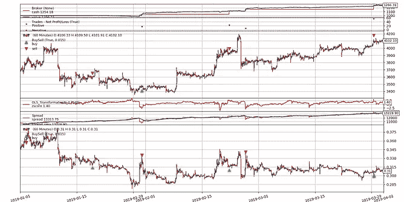
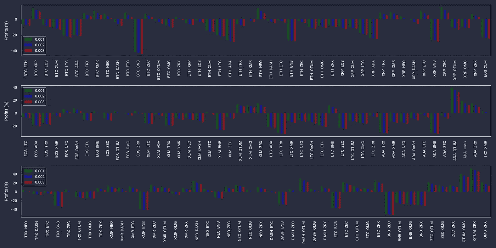

# 密码对交易中的统计套利介绍(八)

> 原文：<https://medium.com/coinmonks/is-pairs-trading-profitable-in-crypto-part8-fba698abcd6f?source=collection_archive---------1----------------------->

*查看我最新的 app—*[***trading ym***](https://tradinggym.app)*。这是一个交易模拟器，帮助你用更快的反馈/学习循环和最小的前瞻偏差来练习交易。打开应用程序后，您将看到一个图表，其中包含随机时间点的随机资产。进行交易和快进时间，看看结果如何。*

*这是多部分系列的第 8 部分:*

*   [***第一部分***](/@deandree/can-you-profit-in-crypto-markets-with-basic-strategies-773a7262346a) *:基本策略，入门，设置，测试 vs 6-7 月行情。*
*   [***第二部分***](/@deandree/can-you-profit-in-crypto-markets-with-not-so-basic-strategies-part2-6cbc97a5f960) *:高级策略以及在哪里找到它们，测试 vs 6-7 月市场。*
*   [***第三部分***](/@deandree/can-you-profit-in-crypto-markets-august-update-part-3-de43970a5128) *:基础和高级策略测试 vs 八月行情。*
*   [***第四部分***](/@deandree/can-neural-networks-beat-the-crypto-market-of-september-part-4-66547b5fe415) *:神经网络策略描述及针对 9 月行情的回测。*
*   [***第五部分***](/@deandree/can-neural-networks-beat-the-crypto-market-of-october-part-5-89714e61a925) *:针对 10 月行情的神经网络策略回测。*
*   [***第六部分***](/@deandree/did-neural-network-strategies-predict-november-14th-price-drop-cebfc168c34) *:神经网络策略预测 11 月 14 日价格下跌了吗？*
*   [***第七部分***](/@deandree/crypto-trading-2018-in-review-17-advanced-15-neural-net-strategies-tested-part-7-d308963d13e9) *:密码交易 2018 年回顾:17 项高级+ 15 项神经网络策略测试*
*   [***第八部分***](/@deandree/is-pairs-trading-profitable-in-crypto-part8-fba698abcd6f) *:密码对交易中的统计套利简介*
*   ***【新】*** [***第九部分***](/@deandree/crypto-trading-2019-half-year-review-17-advanced-15-neural-net-strategies-tested-part-9-1b737b93490f)*:****密码交易 2019 年半年回顾:17 项高级+ 15 项神经网络策略测试***

在这一部分，我开始探索植根于数学和统计学的更高级的策略。当你寻找真正的量化策略时，首先出现的是配对交易，统计套利的子集。有些人可能会认为这不是真正的量化策略，但与基于指标的策略相比，这仍然是一个进步。

多年来，pairs trading 的业绩一直在稳步下滑(就像大多数上市后的策略一样)，一些消息来源声称 pairs 在 2000 年中期之前的业绩还不错。但是，由于 Crypto 是一个新的不太成熟的市场，一些规则在这里并不适用，至少目前还不适用。**所以这篇文章的问题是——我们是否还能看到市场中的一些低效率，这些低效率可以被配对交易所利用？**

已经有很多对交易站了，这一个有什么不同？嗯，首先，他们大多数都非常注重数学方面，深入解释了*协整* / *Hurst/ADF/etc* ，这很好，但我真的很想看到回溯测试的实际结果。此外，许多帖子简单地跳过了一些现实生活中的限制/要求，以实际执行这一点，例如——你实际上可以做空哪些硬币？

你可能会问，为什么需要更多的高级策略？当你像我一样进行了大量的回溯测试后，你开始注意到基于指标的策略看似随意，却缺乏积极的结果。有一段时间你一直在想"*我只需要找到带有魔法参数 a & b* 的魔法指示器 X "，但随后你意识到没有。

如果你知道所有关于配对交易的数学/统计，并且只是想看结果/图表，滚动到底部("*结果概述*")。

> 另请阅读:[最佳加密交易机器人](/coinmonks/whats-the-best-crypto-trading-bot-in-2020-top-8-bitcoin-trading-bot-c16adeb13317)

# 什么是配对交易？

在成对交易中，我们假设(基于过去和数学测试)两种资产的价格以某种方式联系在一起，它在某个均值附近徘徊，上下偏离某个量，因此形成一个可以利用的均值回复关系。有时，这种背离(也称为价差)变得足够大，足以提供一个交易机会——你打赌价格比率会回到均值。你可以通过做空表现出色的资产，做多表现不佳的资产来做到这一点。

简单来说，这是一个典型的配对交易策略:

*   以资产领域为例。
*   对每项资产和其他资产进行数学测试，找出与*联系最紧密的资产。*
*   把它们画在格子里。
*   取*连接最多的*个，目测价格/价差。
*   交易你选择的一对(或一对)。

# 寻找配对进行交易/数学测试

你是如何找到“*相连的*对的？有很多测试，有很多关于它们的帖子，所以我只简单解释一下，给你看看结果和一些需要注意的事情。

*   ***协整*** —来自 [statsmodels lib](https://www.statsmodels.org/stable/generated/statsmodels.tsa.stattools.coint.html) —告知 2 个时间序列的比率是否均值回复。这是配对交易的核心，也是最常用的一个。其余都是补充。
*   ***ADF*** —来自 [statsmodels 库](https://www.statsmodels.org/stable/generated/statsmodels.tsa.stattools.adfuller.html)。用于测试单个时间序列的平稳性(在成对的情况下，这意味着比率)，这意味着序列均值和方差随时间保持不变。简单来说，这意味着它正在回归均值。交易者喜欢均值回归的东西。从数学/统计的角度来看，平稳时间序列有许多有用的统计特性。如果你想更多地了解这个话题，我强烈建议你查看的[这些](/auquan/cointegration-and-stationarity-f4d14e1b3aef) [文章。](/pit-ai-technologies/non-stationarity-and-memory-in-financial-markets-4b8d1200667c)
*   ***赫斯特比*** —检验时间序列是趋势性的、随机的(*几何布朗运动*)还是均值回复。我[找到了](https://pypi.org/project/hurst/) [多个](https://stackoverflow.com/questions/39488806/hurst-exponent-in-python) [实现](https://www.quantstart.com/articles/Basics-of-Statistical-Mean-Reversion-Testing)并全部运行，但结果总是非常接近 0.5，这意味着随机。
*   ***半衰期*** —如果系列是均值回复，多久回复一次均值？这非常重要，因为你可能不想等 5 年才能完成交易。这个函数听起来很棒，我[找到了多个](https://quant.stackexchange.com/questions/25086/calculating-half-life-of-mean-reverting-series-with-python)[实现](/bluekiri/simple-stationarity-tests-on-time-series-ad227e2e6d48)，但是结果之间的差异太大了，在图表中看起来不像什么，所以我决定不使用它。

## 理解协整和 p 值

理解协整检验的结果是很重要的。它始于一个**零假设，即不存在协整**。它返回多个值，其中一个是 *p_value* 。关于 *p_value* 及其含义有很多常见的误解，所以可能会很误导人。首先，理解什么是 *p_value* 而不是很重要:

*   较低的*p _ value***而非**是否意味着比较高的 *p_value* 更强的协整
*   较低的 *p_value* 是否意味着较高的 *p_value* 有更高的协整机会

维基百科的官方定义很混乱，我觉得[这个](https://machinelearningmastery.com/statistical-power-and-power-analysis-in-python/)更容易理解:

> p-value =假设零假设为真，观察到结果的概率，而不是相反，这是误解的常见情况。

那么，我们如何在 *coint* 测试的上下文中解释 *p_value* ？来自 [statsmodels lib](https://www.statsmodels.org/stable/generated/statsmodels.tsa.stattools.coint.html) 的官方定义:

> 零假设是不存在协整关系，替代假设是存在协整关系。如果 pvalue 很小，**低于一个临界大小**，那么我们可以拒绝没有协整关系的假设。

我们需要*的 p 值*有多小？越低越好。0.05 通常被用作显著性的临界值，有时甚至是 0.01，但是这取决于你运行了多少测试用例——用例越多，它应该越低。尽管如此，由于它输出的是概率，所以什么也没有给出——我们必须一个接一个地观察结果。

如果你想深入了解 *p_values* 和统计显著性，我建议[这些](http://strata.uga.edu/8370/lecturenotes/pvalueconfidenceintervals.html) [文章](https://blog.minitab.com/blog/adventures-in-statistics-2/how-to-correctly-interpret-p-values)。如果你想要更简单的数学解释，[我发现这个](https://www.vox.com/science-and-health/2017/7/31/16021654/p-values-statistical-significance-redefine-0005)和*无罪直到被证明有罪*非常相似。

## 运行测试

以下是 2018 年 5 月 1 日至 2019 年 1 月 1 日***期间的结果(*协整/Hurst/ADF* )。***

我用的是 ***相同的顶币来自*** [***之前的部分***](/@deandree/can-you-profit-in-crypto-markets-with-basic-strategies-773a7262346a) ***(共 17 枚)。***


这里没什么需要注意的。最大的协整发生在较低的 altcoin 地区。大硬币显示几乎没有。ZRX 似乎奇怪地与所有事物整合在一起，这在统计学上没有多大意义。

赫斯特很难得到决定性的结果。首先，所有 3 个版本的算法给出了不同的结果。其次，`lag`参数也改变了画面。我最终使用了`lag=150`，因为它给出了最广泛的结果(`0.4–0.9`，但是我没有对它们进行太多的分析。

*ADF* 显示了与协整的相似之处，这是应该的。

从现在开始，我将关注协整结果，因为这是配对交易的核心，我只是想给其他人看一个例子。

让我们看看一些配对+它们的比率，看看结果是否有意义。让我们从`p_value in 0.1 — 0.2`范围— *BTC-ZRX / ETH-DASH / XLM-ZEC 开始。*


现在让我们来试试`p_value < 0.01` :*ETH-OMG/EOS-LTC/QTUM-OMG。*


现在让我们来看一下`p_value > 0.8`:*BTC-ETH/XRP-ETH/XLM-QTUM*


正如我们所见，测试结果是不确定的。你不能拿你所有的数据，违背算法，取最低的 *p_value* 然后说——我要交易这个，因为测试说这是最协整的一对。

旁注:pair 可能是完美的均值回复，但当佣金包括在内时，它回复的金额可能太小而无利可图。

现在我们有了协整结果，接下来呢？我们需要解决一些技术难题，使配对回测成为可能。首先，我们需要一个执行平台。

# 平台

由于配对交易需要一些相对高级的功能，所以并不是所有的平台都支持。需要的两个主要特性是:

*   **做空**——押注价差回归均值，你做多一个硬币，做空另一个硬币。不能做空，就不能交易对。
*   **多资产**——原因显而易见。

事实证明，这是非常罕见的。

[你可能知道，我之前专门写过几篇关于 Gekko 回溯测试](/@deandree)的文章，但是 Gekko 缺乏做空所需的两个特性，所以我们需要别的东西。

所以我在一个小平台上搜索。

## **量子连接/精益**

用 C#写的。非常复杂，大量的代码，这意味着定制源代码要困难得多。但是代码非常干净。Crypto 主要针对更传统的资产进行了优化，是后来才想到的。因为是 C#，所以在 Windows 下运行最好。我可以让它在 Ubuntu 上用 Mono 运行，但这是一个挣扎+性能损失+没有非 Windows 用户界面。也支持 Python strats，但是由于是多语言平台，带来了调试困难。很棒的文档，但是有点支离破碎。大量的免费/公共策略。非常自定义的数据格式，很难强制使用数据库中的数据。支持多资产/宇宙选择，这是巨大的。支持做空。

## **反向交易者**

有很棒的文档，有一些有趣的笑话和非常干净的代码。功能最丰富的平台之一。这是最简单易用、最快速上手的工具之一，非常重要。有相对较好的图表，虽然不是交互式的。虽然有一个散景插件，但我还没试过。有实时交易，但[加密需要外部引擎](https://github.com/Dave-Vallance/bt-ccxt-store)，没有尝试过，但似乎是合法的，从[这个帖子](https://community.backtrader.com/topic/623/anyone-use-backtrader-to-do-live-trading-on-bitcoin-exchange/19)判断。支持多资产。支持做空。唯一的问题是——太慢了。

## **催化剂**

基于 Zipline，用于加密。太慢了。我发现几乎没有免费/公共的策略。支持做空，至少在纸面上是这样。我发现这款手机缺少一些功能。

## **回溯测试. py**

我很少在任何地方看到有人提到这一点，但我发现了它，它对我来说很棒。最好的开箱即用图表，超级可扩展，如果你是一个编码器。超级快。非常短和干净的代码，做很少的基本事情，做得很好。不支持做空，但因为它是如此简约——很容易发展自己。如果您不想开发自己的平台，这可以作为一个很好的起点。

补充说明:这些平台都没有像 Gekko 这样的公开可用策略。

还有很多其他平台，但大多数都没有得到积极开发。这是你感兴趣的列表。大部分都没亲自试过。

*   https://github.com/backtrader/backtrader#alternatives
*   【http://statsmage.com/backtesting-frameworks-in-python/ 
*   [https://medium . com/@ vladnevskii/crypto-trading-bots-review-2018-312 cf 3 e 8145 c](/@vladnevskii/crypto-trading-bots-review-2018-312cf3e8145c)

每个平台都缺少对我来说非常重要的东西，但最终我选择了***【back trader】***——主要是因为易用性和快速上手的能力。

# 战略实施

我试着用默认的[*pairs-trading . py*](https://github.com/backtrader/backtrader/blob/master/contrib/samples/pair-trading/pair-trading.py)策略作为出发点，但是开箱对我来说并不奏效，所以我必须做一些调整。

**编辑(5 月 21 日):**我之前在这里进行了两次修复，涉及到对 *backtrader* 源代码进行修改，但是[u/mementix](https://www.reddit.com/user/mementix/)(*back trader*的作者)向我指出，在平台中有一种更好的做事方式——通过扩展而不是改变源代码。

首先， *ols.py* 文件中存在问题，该文件的 *statsmodels* lib 的 API 在策略创建后发生了变化。您应该复制`class OLS_Slope_InterceptN` 和`classOLS_TransformationN` 作为外部指示器，并固定该行，而不是更改源:

```
p1 = sm.add_constant(p1, prepend=*self*.p.prepend_constant,    has_constant=’add’)
```

接下来是关于 *comminfo.py* 的问题。尝试`int parse`所有的订单大小，但在 Crypto 中这是不现实的，因为你不会每次都购买 BTC 的整数，如果有的话。同样，你应该[创造自己的佣金方案](https://www.backtrader.com/docu/user-defined-commissions/commission-schemes-subclassing.html)，而不是改变来源。下面是我用过的一个:

```
class CommInfo_Crypto(bt.CommInfoBase): params = ( ('stocklike', True), ('commtype', bt.CommInfoBase.COMM_PERC), ('percabs', True), ) def getsize(self, price, cash):
    *return* *self*.p.leverage * (cash / price)
```

修复后，我玩了策略，觉得有些事情可以简化。总而言之，我所做的是:

*   OLS 传播计算非常慢，所以我不得不使用我自己的简化版本(检查 github 中的`SpreadZScore`)，它基本上是`spread = *self*.data0 / *self*.data1.`，虽然从技术上讲这不是传播通常的计算方式，但出于演示目的，我觉得它提供的结果足够好/接近。
*   订单大小计算。我简单地将现金分为资产和短/长:

```
*self*.order_target_percent(data=*self*.data0, target=0.5)
*self*.order_target_percent(data=*self*.data1, target=-0.5)
```

虽然技术上不正确(做空时你是在借入资金+你需要保证金账户+你需要为借款支付滚动利息)，但我认为就本文的目的而言，这是可以的。

你可以在[我的回购这里](https://github.com/deandreee/medium_pairs_p1)看到完整的代码。

# 哪些交易所支持做空？

为了做空硬币 X，必须有人愿意借给你硬币(这意味着利率往往被遗忘)，所以你可以现在卖掉它+买回来，以后当它有望更便宜时再还给你。

可以想象，从技术上讲，这对 exchange 和您来说都会带来一些额外的复杂性和风险。这意味着能够做空不是理所当然的事情，不是很多交易所都支持做空，而且只针对少数选定的硬币。**我做了一些研究，发现我测试的大部分硬币都是支持的，但是:**

*   没有一个交易所支持所有的硬币，大多数都支持少量(~5)硬币，而且大多是大硬币。

由于交易量小等原因，硬币一直被从保证金交易(做空)中摘牌。支持的列表一直在变化。

我发现了两个不错的汇编列表，有点旧(2018 年中期)，但仍然是一个很好的概述:

*   [bitcoin.stackexchange.com](https://bitcoin.stackexchange.com/questions/76139/which-cryptocurrencies-can-you-margin-trade-with-bitcoin)
*   [bitcointalk.org](https://bitcointalk.org/index.php?topic=5039828.0)

如果你想深入了解并找到最新支持的硬币，我已经编辑了一个包含交换信息页面的列表，描述了支持的内容:

*   [Bitmex](https://www.bitmex.com/app/perpetualContractsGuide)(*合约*下左侧)
*   [北海巨妖](https://www.kraken.com/features/fee-schedule)(切换到*保证金费用*页签)
*   [Bitfinex](https://www.bitfinex.com/stats) (滚动至底部“*保证金融资利率*”)
*   [好的](https://support.okex.com/hc/en-us/articles/360024573251-5x-Leverage-Available-to-BTC-ETH-BCH-LTC-and-EOS-Margin-Trading)
*   [火币](https://huobiglobal.zendesk.com/hc/en-us/articles/360000077872-Margin-Trading-Instruction)
*   [德里比特](https://www.deribit.com/pages/docs/options)
*   波洛涅克斯
*   [Cex.io](https://blog.cex.io/trading-tips/margin-trading-cex-io-17384)
*   [XBT 总理](https://primexbt.com/fees)

注意:我不能 100%确定所有这些都支持永久合同(而不是期货)。为了能够进行成对交易，你必须能够在任何时候退出，而不是像期货合约一样，在将来某个特定的固定时间退出。如果你想执行这种实时操作，你必须知道你选择的组合支持什么类型的合约，在什么交易所交易。

# 测试设置

17 个硬币等于 16 个！总共 136 对组合。

*   其中 40 人有`coint < 0.05`
*   其中 20 个有`coint < 0.01`

**我不是只对低 *coint p_value 的对进行回溯测试，而是对它们都进行测试，稍后向您展示较高和较低*p _ value*的利润/亏损之间的差异。***

尝试模拟现实生活并尽可能避免前瞻偏差:

*   我将从 2018 年 5 月 1 日到 2019 年 1 月 1 日**运行 *coint* 测试**(已经在“*运行测试*”部分完成)****
*   **但是回溯测试将从**2019 年 1 月 1 日**到**2019 年 4 月 1 日** (3 个月)**

**[策略](https://github.com/deandreee/medium_pairs_p1)中涉及 2 个主要变量:**

*   ****点差周期** —计算点差 *ZScore* 的周期(在我的例子中—硬币之间的比率)**
*   ****阈值** —当 *ZScore* 越过该水平(上/下)时，启动信号反转当前位置**

**我不会试图预先为每个值选择一个值，而是创建一个可能值的网格并运行它们，以查看哪些组合给出了最佳结果:**

*   **`spread period = [ 5d, 7d, 10d, 15d ]`**
*   **`threshold = [ 0.5, 0.7, 1.0, 1.5, 2.0, 2.5, 3.0, 3.5, 4.0]`**

# **结果概述**

**首先，这里是总体平均利润百分比，按`COIN1`和`COIN2` 分组(基本上是成对)。包括所有期间/阈值，并对利润进行平均。**

****

**看起来不错。虽然平均来说我们是负的，但请记住这是所有硬币(无论什么*硬币 p_value* )和所有参数(*周期/阈值*)。我们来拆分一下，看看哪些时期/阈值比较好看。以下是按`spread period + threshold`分类的结果。**

****

**看起来更短的周期(5/7d)和更小的阈值(0.5/0.7/1.0)带来更多的利润。**

**现在让我们更进一步，将协整引入博弈。请记住(正如我在开头所描述的)降低 p_value！=更多协整。但是，让我们通过 *p_value* 过滤，看看它对利润有什么影响。我现在将创建先前图表的两个版本——一个只有带`p_value < 0.05`的对，另一个带`p_value < 0.01`。滚动回“*运行测试*部分，查看之前计算的所有对之间的 *p_values* 。**

********

**太好了，这正是我们想要的和期望的——更低的成本 p_value = >更多的利润。让我们合并图表，以便更好地了解情况。**

****

**作为最后的测试，让我们看看散点图上 *coint p_value* 和*利润*之间的相关性:**

****

**不能说有太多的相关性，在不同的 *p_values* 中，盈亏比看起来非常相似。随着 *coint p_value* 变低，我只能看到轻微的优势。让我们放大到`p_value < 0.01`**

****

**还是不多。让我们从上面的图表中选取特定的*周期+阈值*对，以便再次检查我们的结果。`5d + 3.5`看起来是个不错的选择，因为*和*之间有很大的差异。**

****

**好了，现在说得通了——差异显而易见。让我们继续前进。**

# **结果分析(反向交易图表)**

**现在让我们来看一些单独的结果。**

**让我们采取一些良好的表现对像`ADA-QTUM`(平均+40%)。**

************

**不幸的是，大部分利润来自于 3 月 15 日的巨大异常峰值。在现实生活中，你很有可能在交易中没有发现这一点，这就是为什么总是目视检查结果如此重要。如果我们滚动回整体图表，我们可以看到当涉及到`QTUM`时，会出现许多最佳结果。现在我们知道原因了。**

**让我们试试不涉及`QTUM`的好东西——`XRP-ZEC`(平均+18%)**

************

**现在`BTC-XRP`(平均+16%)**

************

**接下来是- `NEO-DASH`(平均得分+28%)**

************

**这些数字看起来很不错，但是你应该注意到一个可疑的地方。这就引出了我们的下一个问题和下一个部分。**

# **最重要的问题**

**我被不和谐地问了很多问题，他们通常听起来像:**

*   ***哪个 NN lib 最好？conv net 4 岁了，该不该转 Tensorflow？***
*   ***您使用了哪些参数进行神经网络优化？我敢肯定他们都错了，你只是没有找到正确的。***
*   ***你用了多少训练数据？你需要用 X 年的训练数据重新测试神经网络策略，然后它将完全受益。***

**当你查看其他人的结果时，有一个非常基本且重要得多的问题要问，那就是— ***你用的是什么佣金？正如我将要展示的，它改变了一切。*****

**在之前的所有结果中，**我使用的是 0.1%的佣金**。虽然在纸面上是可能的(例如，币安为 0.1%，Bitmex 为 0.075%)，但现实生活会带来一些隐性成本(如存款/取款费、滑点等)，从而增加交易的实际成本。这听起来不多，但当你实际计算时，有意义的差异。所以让我们增加它，看看会发生什么。我将用 **0.2%** 和 **0.3%** 的佣金重新测试，并与 **0.1%** 的结果进行比较。**

## **新佣金**

**让我们从总体结果开始，按硬币分组。既然有 17 个！(对)x 3(佣金)= 408 个结果，为了更好的可读性，我将它们分成 3 行。**

****

**这看起来没那么糟。平均而言，我们看到小幅下降，可能是 1-5%。没有戏剧性的变化。但让我们尝试另一个角度—按传播周期+阈值分组:**

****

**左侧的差异相当大——成功的策略变成了失败的策略！为什么只在左边？结果首先按价差期排序，其次是阈值，较小的值迫使更多的交易，因此更多的现金花在佣金上。**

**让我们试着只过滤`p_value < 0.01`处的配对，看看这是否会让我们的一天变得更美好:**

****

**是的，平均看起来好多了。但是这里有一件非常重要的事情需要注意。记得上一节的结论，我写道:**

> **看起来更短的周期(5/7d)和更小的阈值(0.5/0.7/1.0)带来更多的利润。**

**形势有些逆转。虽然`5/7d spread period`看起来仍然不错，但当选择更现实的佣金时，`0.5/0.7/1.0 threshold`显然不是正确的选择。**

# **结论**

**那么，在所有这些图表和统计数据之后，我们是否可以过滤掉一些合理的默认值，并查看实际结果的摘要？**

**我认为这些是合理的筛选值:**

*   **`p_value < 0.01`**
*   **`spread_period in [5d, 7d]`**
*   **`threshold in [3.0, 3.5, 4.0]`**
*   **`commission in [0.2%, 0.3%]`**

**这是最终结果。佣金在单独的图表中。看起来相当平等，因为它是没有那么多交易的较长时期/阈值。**

********

**该策略总体可用吗？现在，这看起来不错，但对我来说，在投入使用之前需要更多的研究:**

*   **加上滚动利息费用。每个交易所和硬币的价格都不一样，但它们可能会对利润产生巨大影响。例如，[北海巨妖每 4 小时 0.01%](https://support.kraken.com/hc/en-us/articles/206161568-What-are-the-fees-for-margin-trading-)。**
*   **测试更多/更长的时间段(这里我们只有 3 个月的数据)。**
*   **测试同一时期以前部分的高级 Gekko 策略，以进行比较。**
*   **1 月 1 日-4 月 1 日期间相对中性，因为我们在最近几周有一个巨大的峰值，将是很好的补充，看看在这种市场上的配对交易会发生什么。**
*   **尝试更高级的 pairs 实现，比如 *OLS /卡尔曼/ Copula* 。**

**我就不说了。和往常一样，如果你想运行这个测试，请确保你运行你自己的测试。祝你好运！**

***想讨论我的结果或有问题吗？在不和谐中找到我——迪安卓#7313。***

> **加入 Coinmonks [电报频道](https://t.me/coincodecap)和 [Youtube 频道](https://www.youtube.com/c/coinmonks/videos)获取每日[加密新闻](http://coincodecap.com/)**

## **另外，阅读**

*   **[复制交易](/coinmonks/top-10-crypto-copy-trading-platforms-for-beginners-d0c37c7d698c) | [加密税务软件](/coinmonks/crypto-tax-software-ed4b4810e338)**
*   **[网格交易](https://coincodecap.com/grid-trading) | [加密硬件钱包](/coinmonks/the-best-cryptocurrency-hardware-wallets-of-2020-e28b1c124069)**
*   **[密码电报信号](http://Top 4 Telegram Channels for Crypto Traders) | [密码交易机器人](/coinmonks/crypto-trading-bot-c2ffce8acb2a)**
*   **[最佳加密交易所](/coinmonks/crypto-exchange-dd2f9d6f3769) | [印度最佳加密交易所](/coinmonks/bitcoin-exchange-in-india-7f1fe79715c9)**
*   **[面向开发人员的最佳加密 API](/coinmonks/best-crypto-apis-for-developers-5efe3a597a9f)**
*   **最佳[密码借贷平台](/coinmonks/top-5-crypto-lending-platforms-in-2020-that-you-need-to-know-a1b675cec3fa)**
*   **[SmithBot 评论](https://coincodecap.com/smithbot-review) | [4 款最佳免费开源交易机器人](https://coincodecap.com/free-open-source-trading-bots)**
*   **[比特币基地僵尸工具](/coinmonks/coinbase-bots-ac6359e897f3) | [AscendEX 审查](/coinmonks/ascendex-review-53e829cf75fa) | [OKEx 交易僵尸工具](/coinmonks/okex-trading-bots-234920f61e60)**
*   **[如何在印度购买比特币？](/coinmonks/buy-bitcoin-in-india-feb50ddfef94) | [瓦济克斯审查](/coinmonks/wazirx-review-5c811b074f5b)**
*   **[加密交易机器人](/coinmonks/crypto-trading-bot-c2ffce8acb2a) | [Probit 审查](https://coincodecap.com/probit-review)**
*   **[隐料斗替代品](/coinmonks/cryptohopper-alternatives-d67287b16d27) | [HitBTC 审查](/coinmonks/hitbtc-review-c5143c5d53c2)**
*   **[CBET 评论](https://coincodecap.com/cbet-casino-review) | [库科恩 vs 比特币基地](https://coincodecap.com/kucoin-vs-coinbase)**
*   **[折叠 App 回顾](https://coincodecap.com/fold-app-review) | [Kucoin 交易机器人](/coinmonks/kucoin-trading-bot-automate-your-trades-8cf0ca2138e0)**
*   **[免费加密信号](/coinmonks/free-crypto-signals-48b25e61a8da) | [加密交易机器人](/coinmonks/crypto-trading-bot-c2ffce8acb2a)**
*   **[杠杆代币的终极指南](/coinmonks/leveraged-token-3f5257808b22)**