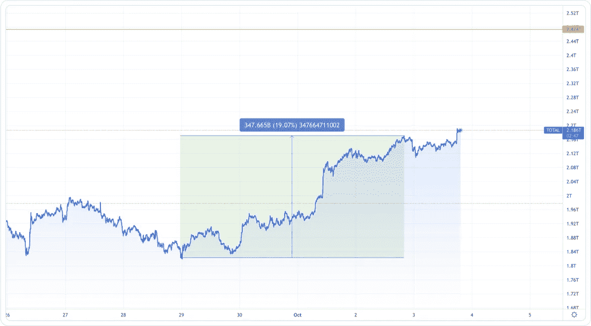

# 总统会监管密码市场吗？

> 原文：<https://medium.com/coinmonks/is-potus-going-to-regulate-the-crypto-market-9b6e3f3d8398?source=collection_archive---------15----------------------->

## 分析密码市场概述。

> *本文基于 Delta。θ报告*

The Crypto Market Cap. Source: Delta.Theta

正如你在图表上看到的，9 月 30 日，市值开始了一个相当急剧而稳定的增长。因此，到本周末，市值增加了约 19%，达到 2.14 万亿美元，并继续保持这些价值。