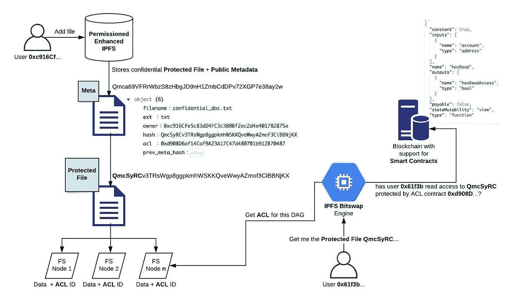
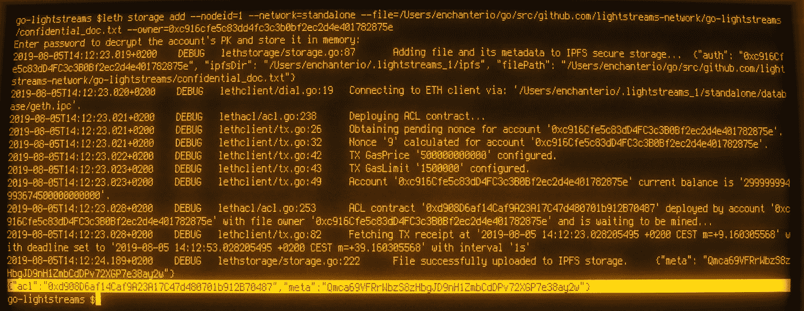
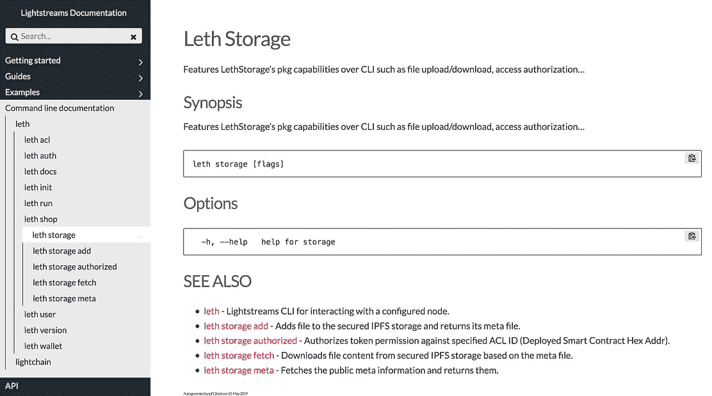
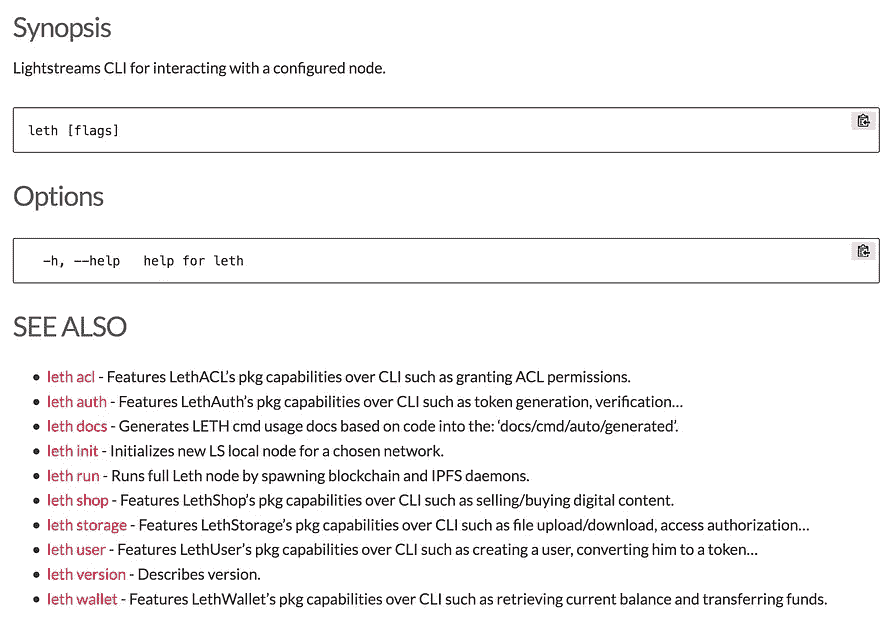

# 在 IPFS 上存储加密文件够好吗？

> 原文：<https://medium.com/coinmonks/is-storing-encrypted-files-on-ipfs-good-enough-21e050d9de0?source=collection_archive---------0----------------------->

## 智能保险箱，存储机密 DApp 文件的替代方案。


区块链透明度很大，但是对于很多涉及用户数据的用例来说，[隐私和保密](/lightstreams/smart-contracts-privacy-vs-confidentiality-6fb90c731fde)是必不可少的。

当构建任何应用程序时，不管它是集中的还是分散的，迟早都需要持久化用户数据。

在 IPFS 公开加密和存储敏感数据**已经成为项目的一种流行方法——实质上是让每个人都能获得加密的数据！不要误会，**加密绝对重要。**然而，如果**加密的**数据只**被授权方**访问，不是更安全吗？**

**还有别的办法吗？**

# **智能保险库**

> **与区块链有关的 IPFS 协议。**

**数据是在需要知道的基础上被访问的，并且可以被永久擦除。**访问由包含访问控制列表(ACL)的可编程智能合约控制。**这提供了透明、公开和可验证的访问，无需中央控制器。**控制权始终掌握在数据所有者**、智能合约作者手中，这意味着默认情况下它符合 [GDPR](/lightstreams/gdpr-for-companies-in-2019-163b338b62cd) 。**

## **它是如何工作的？**

****

**让我带你看一个潜在的**去中心化 Google Drive 应用**的例子，其中两个用户(对等体)在彼此之间共享一个机密文档。**

**第一，爱丽丝在她的智能保险箱里储存了一份机密文件**

*   **一个 ACL 智能合同部署在区块链上**
*   **文档被添加到权限增强的 **IPFS 存储器****
*   **[**IPFS 默克 DAGs**](https://github.com/ipfs/specs/tree/master/merkledag) **链接到 ACL** 智能合约**
*   **生成公共可共享文档引用**元数据文件及其散列****

****#2，Alice** 想要与她的同事 Bob 共享该文档，因此**她使用 ACL 智能合约授予他读取权限****

*   **Alice 与 Bob 共享文档引用(元数据的散列)**

****#3，Bob 试图获取并打开**文档**

*   **Bob 的智能保险库向所有对等方执行**读取请求****
*   **IPFS 协议解析持有文档的对等方，即 Alice 的节点**
*   **在分发内容之前，Alice 的 Smart Vault 会根据机密文档的 ACL 执行授权检查**
*   **Bob 已被授予访问权限，因此授权成功**
*   **Alice 的智能保险库将文档发送给 Bob**
*   **鲍勃打开文档**

****#4，**文件现在存储在**两个分散的智能保管库**，用同一个 ACL 保护**

## **添加文件**

**对于代码爱好者来说，这是内部的实际情况:**

****

**Adding a file to Smart Vault**

# **您的项目现在如何开始使用 Smart Vault？**

**为了让开发人员只关注真正重要的东西，**DApp 业务逻辑**，我们将所有技术存储细节抽象成一个开发人员友好的 SDK， **Leth** 。**

**根据您的项目需求， **Leth** 允许您以多种方式与 Smart Vault 进行交互。将 Leth 作为 Go 库导入。执行 CLI 命令或执行 HTTP 通信。**

**需要一个前端集成？使用 **Leth JS SDK** 包装 HTTP 调用，在客户端(浏览器/手机)直接签署 ACL 事务，并使用智能合约 **ABI** 和 **web3.js** 库广播到区块链。**

## **HTTP 用法示例**

```
curl -X POST \
  http://localhost:9091/storage/add \
  -H 'Content-Type: multipart/form-data' \
  -F owner=0xa92e3705e6d70cb45782bf055e41813060e4ce07 \
  -F password=$PWD \
  -F file="@/tmp/secret_file.txt"

{
"meta":"QmZYSewpHNvdW1TTgska792QAT7Yd6yxZAoybpYFskTZSf",
"acl":"0xc2DBC8CdAba2df432C821639B80302f0675D6f74"
}
```

## **CLI 使用示例**

```
leth storage add --nodeid=1 --network=mainnet --owner=0xa92e3705e6d70cb45782bf055e41813060e4ce07 \
--file=/tmp/secret_file.txt
```

## **可用命令的完整列表**

********

**Leth CLI Docs**

**Smart Vault 目前处于 alpha 阶段，更多要求的功能正在开发中！**

# **让我总结一下**

****要使用 Smart Vault，我必须使用 Lightstreams 区块链吗？****

**也可以用以太坊连接。**

****智能金库是云存储吗？** 正如 IFPS 所说，智能金库不是云存储。**它是点对点存储。**文件在被请求时被分发到其他设备。使用我们修改版的 IPFS，文件只能与授权的计算机共享。在理想的分散世界中，每个用户都运行自己的 Smart Vault 节点。**

****原所有者离线后，新的授权用户可以访问文件吗？****

**是的，只要至少有一个已经拥有该内容的授权用户在线。如果多个内容持有者在线，内容将同时从所有对等体中播种，以便在由 IPFS 比特交换协议支持的类似种子的风格中获得最佳性能。**

****我还可以用 Smart Vault 做什么？****

**电子商务。几周前，我们发布了关于项目如何构建销售数字内容的应用程序以及用户如何无需任何中介即可购买内容的文档！[点对点电子商务教程](https://docs.lightstreams.network/products/smart-vault/guides/ecommerce)。**

**我还有几个问题，可以问谁，在哪里问？**

**首先感谢大家的关注！在下面留言，加入我们的[电报](https://t.me/LightstreamsDevelopers)群或者在 LinkedIn 上 [DM 我。](https://www.linkedin.com/in/llukac/)**

# **结论**

**Smart Vault 是开发人员友好的可编程存储，适用于分散式应用程序。**让你的用户拥有并控制他们的数据。****

**[https://docs . light streams . network](https://docs.lightstreams.network/)**

> **[直接在您的收件箱中获得最佳软件交易](https://coincodecap.com/?utm_source=coinmonks)**

**[](https://coincodecap.com/?utm_source=coinmonks)**