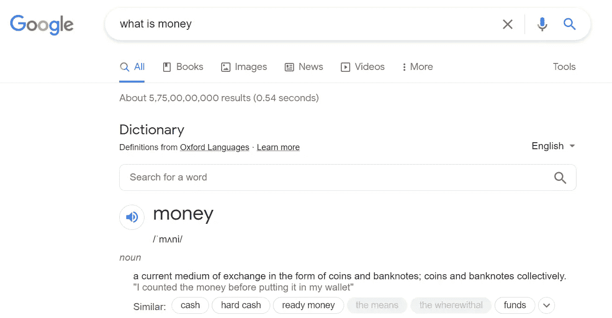
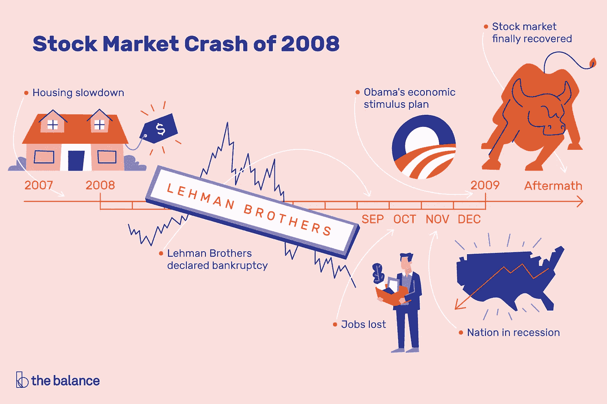
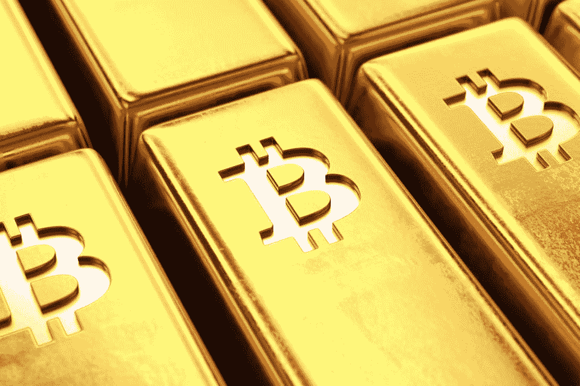

# 你钱包里的 100 美元是钱还是没有价值的东西？

> 原文：<https://medium.com/coinmonks/is-the-100-bill-in-your-wallet-money-or-something-that-has-no-value-99263e8dfba6?source=collection_archive---------1----------------------->

## 第一种官方货币被认为是在公元前 600 年由吕底亚(现在是土耳其的一部分)的国王阿利亚特斯创造的。然而，目前的货币体系前途未卜。让我们试着找出原因？

从钱包里拿出一张 10 美元的钞票，仔细观察。看看它由多细的纤维组成。它可以穿过灰尘、水；可能是某些国家的防撕。但还是一篇论文。

What is money?

事实上，我把一张 100 美元的钞票称为货币，而不是金钱，这背后是有原因的。1973 年 6 月 5 日，由于美国的黄金储备即将耗尽，理查德·尼克松总统宣布美元将不再与黄金挂钩。

也就是说，你拥有的一美元钞票不会有任何附加价值，政府可以想印多少就印多少。所以从价值这个术语来说，我的意思是它只是一张纸，你可以用来支付商品和服务，仅此而已。你会用它，因为你的政府这么说。

现在的问题是，作为一个个体，如果给你一台机器，让你想印多少就印多少，并且一直印下去，你会怎么做。你会印更多。因此，你的政府在做什么？他们会准备好放弃印刷更多货币的权力吗？

*我猜没有*

# 当政府控制货币时会发生什么？

在第二次世界大战期间，即从 1939 年到 1945 年，德国人发现并杀害了该国所有的犹太人。当时，德国的银行还在运营，每个拥有资产的人都会把资产存在银行以获得额外的安全保障。

Jews During WWII (Source: [AnneFrank.Org](https://www.annefrank.org/en/anne-frank/go-in-depth/netherlands-greatest-number-jewish-victims-western-europe/))

随着战争爆发，希特勒开始镇压犹太人，他们不得不逃跑。但是他们能去哪里呢？他们被剥夺了财产权。银行在希特勒的统治下，所以他们不能提取他们一生的积蓄。

因此，他们不能逃跑，因为他们拥有的一切都在德国，要逃跑，你需要付钱给某人，而德国人已经没收了。所以最后，他们没有别的地方可去。

# *钱是什么？*

根据谷歌的说法，货币是一种交易媒介，以 T4 硬币和纸币的形式存在。但是我们刚才不是说，一个政府提供的货币没有价值，直到政府这么说吗？你认为不是这样吗？听说过什么叫去货币化吗？

# 金钱这个词在当今时代是什么意思？

到目前为止，我们的整个金融生态系统都是围绕银行经营的*债务/信用*模式建立的。所以基本上，是银行在操纵世界。银行实际上做的是，通过信贷，扩大货币供应。

假设你在银行有 100 万美元，而我有 0 美元。现在，我需要 50 万美元启动资金。银行将向我提供贷款，现在，我可以支付价值 50 万美元的商品和服务(同时向银行支付约 10%至 14%的利息)，你可以开出价值 100 万美元的支票。因此，货币总供应量为 150 万美元。

听起来很有趣，对吧？但是如果出了问题呢？如果贷款人想要回他们的钱，而借款人无法以同样的速度归还，该怎么办？接下来会发生什么？

*还记得 2008 年的经济灾难吗？这就是系统失灵的后果。*

2008 Financial Crisis (Source: [The balance](https://www.thebalance.com/stock-market-crash-of-2008-3305535))

## 失败的后果

我们之前确实说过，政府可以印更多的钱，想印多少就印多少。因此，为了解决银行倒闭的问题，政府继续印刷更多的钞票，这样情况就能保持稳定。

接下来会发生什么？**好古老的*通货膨胀。***

富人已经很少接触菲亚特，而中产阶级/贫困阶层受害最深，然后看到他们一生的积蓄被耗尽。

所以，不能完全依赖一个可以耗费人一生积蓄的东西。货币只是一种工具，让我们向个人/实体支付商品和服务，然后这个个人再用它来支付其他东西。在我们人类使用它来交换这些商品和服务之前，它将一直存在。

那么问题来了，我们应该寻找菲亚特的替代品吗？我想是的，所以让我们看看我们应该在替代方案中寻找什么东西。

# 你为什么想要过渡到别的东西呢？

因为法币是一种通货膨胀的货币，而黄金又很难运输。我们需要更好的东西，能够符合以下几点(包括许多其他方面)的东西:

*   随着时间的推移保持其价值的东西(菲亚特是通货膨胀的)。
*   *单一实体对其没有控制权(政府控制菲亚特)。*
*   它的供应量有限，所以我们无法生产更多的货币(我们可以尽可能多地印刷货币)。
*   *易于储存、携带并被广泛接受的东西(如金、银等硬金属的运输成本。，太过分了)。*
*   没有人有权力把它从你身边拿走(政府可以没收你的所有资产，包括你银行账户里的货币。此外，任何人都可以用枪指着你的头，拿走你的黄金储备。
*   如果它是数码的，它应该足够安全，所以除了你没人能访问它。

可能肯定会有许多其他的点，但在郊区移动，这是基本的想法。

Bitcoin vs Gold (Source: [Forbes](https://www.forbes.com/sites/bobhaber/2020/12/14/the-great-gold-vs-bitcoin-debate-currency-debate/?sh=e2f657a716e0))

# 菲亚特的替代品有哪些？

我们可以排除黄金，因为它太难从一个地方带到另一个地方。此外，一旦其储量接近尾声，人类往往会发现更多，因此保持供应不变。

数字法币也不在此列，因为每一种法币都有一个序列号，并且是独一无二的；但是，你的 1 美元数字货币和我的一模一样；因此，它比菲亚特更糟糕。

比特币可能是答案；它的供应量限制在 2100 万。易于存放和携带。它是由加密技术保护的，因此没有人能把它从你那里拿走。你可以记住你钱包的种子短语，没有人能从你那里偷走它，即使有枪。没有政府能控制你头脑中的代码。

Bitcoin in Making

# 加密货币改变了什么？

我们正在观察一场革命；有人称之为技术革命，我更愿意称之为金融革命。区块链技术(加密资产背后的技术)仍处于起步阶段，因此随着时间的推移，它正以前所未有的速度增长。甚至当我正在打字，你正在阅读这个故事的时候，加密生态系统中的事情正在发生变化。重要的是我们是否能够跟上世界的变化。

回到我们的话题，各国政府控制菲亚特。此外，全球所有银行的工作原理都是一样的，这更容易形成垄断。我不是说我们不民主，但我可能是想说，在财政上，我们不是。

比特币为你提供了这种财务独立；没有一个实体拥有/管理它。没有任何权威可以支配它的命运；他们当然可以禁止它，但他们无法控制它。它为人民而存在，群众控制着它。

[Statue of Satoshi](https://www.statueofsatoshi.com/) (Creator of Bitcoin)

# 是不是波动太大？是的。会一直这样吗？

大多数鄙视比特币的人站出来声称，比特币太不稳定，不能被接受为商品或服务交换的法定货币。他们忘记了一件事，比特币已经存在了十多年，而银行的概念是在 14 世纪首次提出的。

锡耶纳银行是 1472 年在托斯卡纳城市锡耶纳成立的第一家银行。自那时以来，我们走过了漫长的道路；银行有大约 600 年的发展时间。与此同时，我们正在判断一场只有 10 年历史的新金融革命。

# 那么最后会发生什么呢？

比特币已经存在；早在 2008 年中本聪首次发布白皮书之前，这份白皮书就已经酝酿了很长时间。我们正处于一场金融革命之中，我相信前进的旅程会有很多起伏。然而，最终，大众总是会选择一些能让他们更好地控制自己资产的东西。最后，所有政府和银行害怕比特币的原因是，它剥夺了他们的垄断地位，即货币。

感谢阅读；如果你一直呆在这里，并且喜欢这篇文章，请鼓掌表达你的爱。此外，如果你不喜欢任何部分，或者有其他想法，请到我的邮箱来，我们一定可以谈谈。

[推特](https://twitter.com/prabxat) | [领英](https://www.linkedin.com/in/praxhat/)

> 加入 [Coinmonks 电报频道](https://t.me/coincodecap)，了解加密交易和投资

**同样，阅读**

*   [2021 年底前比特币还在破 100K 的路上吗？](/coinmonks/is-bitcoin-still-on-its-path-to-break-100k-before-the-end-of-2021-4716a56745ce?source=user_profile---------0----------------------------)
*   [我是如何在大学本科阶段开始投资 Crypto 的？](https://praxhat.medium.com/how-did-i-start-investing-in-crypto-as-a-college-undergrad-ac9635d9d6b3?source=user_profile---------1----------------------------)
*   [币安 vs 北海巨妖](https://blog.coincodecap.com/binance-vs-kraken) | [美元成本平均交易机器人](https://blog.coincodecap.com/pionex-dca-bot)
*   [如何在印度购买比特币？](/coinmonks/buy-bitcoin-in-india-feb50ddfef94) | [WazirX 评论](/coinmonks/wazirx-review-5c811b074f5b) | [BitMEX 评论](https://blog.coincodecap.com/bitmex-review)
*   [比特币主根](https://blog.coincodecap.com/bitcoin-taproot) | [Bitso 点评](https://blog.coincodecap.com/bitso-review) | [排名前 6 的比特币信用卡](/coinmonks/bitcoin-credit-card-bc8ab6f377c6)
*   [双子座 vs 比特币基地](https://blog.coincodecap.com/gemini-vs-coinbase) | [比特币基地 vs 北海巨妖](https://blog.coincodecap.com/kraken-vs-coinbase)|[coin jar vs coin spot](https://blog.coincodecap.com/coinspot-vs-coinjar)
*   [印度加密交易所](/coinmonks/bitcoin-exchange-in-india-7f1fe79715c9) | [比特币储蓄账户](/coinmonks/bitcoin-savings-account-e65b13f92451) | [Paxful 审核](/coinmonks/paxful-review-4daf2354ab70)
*   [杠杆代币](/coinmonks/leveraged-token-3f5257808b22) | [最佳密码交易所](/coinmonks/crypto-exchange-dd2f9d6f3769) | [AscendEX 评论](/coinmonks/ascendex-review-53e829cf75fa)
*   [Godex.io 审核](/coinmonks/godex-io-review-7366086519fb) | [邀请审核](/coinmonks/invity-review-70f3030c0502) | [BitForex 审核](https://blog.coincodecap.com/bitforex-review) | [HitBTC 审核](/coinmonks/hitbtc-review-c5143c5d53c2)
*   [Crypto.com 费用](/coinmonks/binance-fees-8588ec17965) | [僵尸密码审查](/coinmonks/botcrypto-review-2021-build-your-own-trading-bot-coincodecap-6b8332d736c7) | [替代方案](https://blog.coincodecap.com/crypto-com-alternatives)
*   [有哪些交易信号？](https://blog.coincodecap.com/trading-signal) | [比特斯坦普 vs 比特币基地](https://blog.coincodecap.com/bitstamp-coinbase)
*   [ProfitFarmers 回顾](https://blog.coincodecap.com/profitfarmers-review) | [如何使用 Cornix Trading Bot](https://blog.coincodecap.com/cornix-trading-bot)
*   [MXC 交易所评论](/coinmonks/mxc-exchange-review-3af0ec1cba8c) | [Pionex vs 币安](https://blog.coincodecap.com/pionex-vs-binance) | [Pionex 套利机器人](https://blog.coincodecap.com/pionex-arbitrage-bot)
*   [我的加密副本交易经历](/coinmonks/my-experience-with-crypto-copy-trading-d6feb2ce3ac5) | [比特币基地评论](/coinmonks/coinbase-review-6ef4e0f56064)
*   [CoinFLEX 评论](https://blog.coincodecap.com/coinflex-review) | [AEX 交易所评论](https://blog.coincodecap.com/aex-exchange-review) | [UPbit 评论](https://blog.coincodecap.com/upbit-review)
*   [AscendEx 保证金交易](https://blog.coincodecap.com/ascendex-margin-trading) | [Bitfinex 赌注](https://blog.coincodecap.com/bitfinex-staking) | [bitFlyer 点评](https://blog.coincodecap.com/bitflyer-review)
*   [麻雀交换评论](https://blog.coincodecap.com/sparrow-exchange-review) | [纳什交换评论](https://blog.coincodecap.com/nash-exchange-review)
*   [加密货币储蓄账户](/coinmonks/cryptocurrency-savings-accounts-be3bc0feffbf) | [赌注加密](https://blog.coincodecap.com/staking-crypto)
*   [BigONE 交易所评论](/coinmonks/bigone-exchange-review-64705d85a1d4) | [CEX。IO 审查](https://blog.coincodecap.com/cex-io-review) | [交换区审查](/coinmonks/swapzone-review-crypto-exchange-data-aggregator-e0ad78e55ed7)
*   [最佳比特币保证金交易](/coinmonks/bitcoin-margin-trading-exchange-bcbfcbf7b8e3) | [比特币保证金交易](https://blog.coincodecap.com/bityard-margin-trading)
*   [加密保证金交易交易所](/coinmonks/crypto-margin-trading-exchanges-428b1f7ad108) | [赚取比特币](/coinmonks/earn-bitcoin-6e8bd3c592d9) | [Mudrex 投资](https://blog.coincodecap.com/mudrex-invest-review-the-best-way-to-invest-in-crypto)
*   [WazirX vs coin dcx vs bit bns](/coinmonks/wazirx-vs-coindcx-vs-bitbns-149f4f19a2f1)|[block fi vs coin loan vs Nexo](/coinmonks/blockfi-vs-coinloan-vs-nexo-cb624635230d)
*   [BlockFi 信用卡](https://blog.coincodecap.com/blockfi-credit-card) | [如何在币安购买比特币](https://blog.coincodecap.com/buy-bitcoin-binance)
*   [火币交易机器人](https://blog.coincodecap.com/huobi-trading-bot) | [如何购买 ADA](https://blog.coincodecap.com/buy-ada-cardano) | [Geco？一次审查](https://blog.coincodecap.com/geco-one-review)
*   [加密复制交易平台](/coinmonks/top-10-crypto-copy-trading-platforms-for-beginners-d0c37c7d698c) | [五大 BlockFi 替代品](https://blog.coincodecap.com/blockfi-alternatives)
*   【Crypto.com 评论】|[|](/coinmonks/crypto-com-review-f143dca1f74c)|[信用交易](/coinmonks/huobi-margin-trading-b3b06cdc1519)
*   [Bybit vs 币安](https://blog.coincodecap.com/bybit-binance-moonxbt)|[stealth x 回顾](/coinmonks/stealthex-review-396c67309988) | [Probit 回顾](https://blog.coincodecap.com/probit-review)