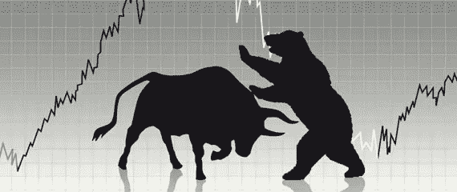
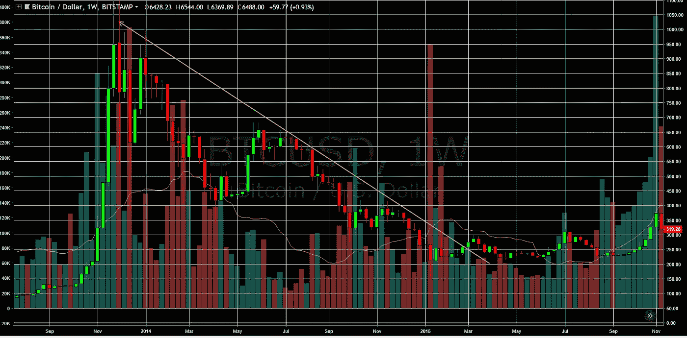
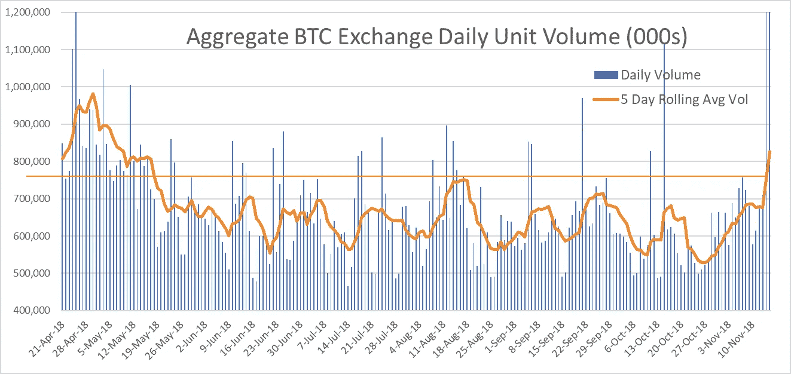
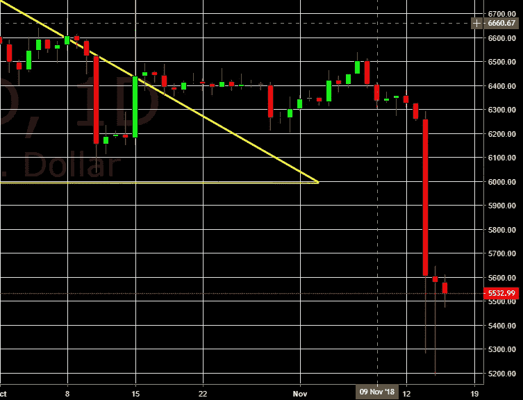
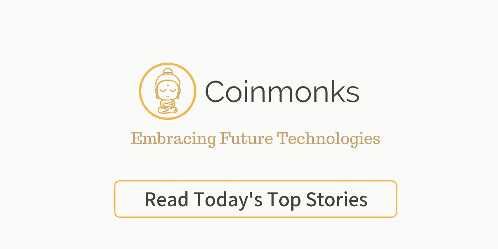

# 比特币已经触底了吗？可能不会，但我们终于接近了！

> 原文：<https://medium.com/coinmonks/is-the-bottom-in-for-bitcoin-probably-not-but-were-finally-getting-close-250d385e2d2?source=collection_archive---------0----------------------->

我们已经有一段时间没有做适当的 BTC 价格更新了，但我们认为我们已经接近隧道的尽头。我们一直在等待两件事的发生——成交量上升和下跌时的投降式抛售。我们看到 BTC 的交易量终于上涨(在许多头部假上涨之后)，我们开始在这一块工作，然后从 6300 美元大幅下降到 5200 美元。当前的下跌可能还没有结束，但我们认为我们终于看到了我们一直在等待的熊市触底过程的两个要素。

> [发现并回顾最好的比特币软件](https://coincodecap.com)

自 3 月以来，我们一直看跌并呼吁 BTC 重新测试 6K 美元水平。6 月，我们发表了这篇关于如何发现比特币熊市底部的文章。我们的方法是通过记录我们在华尔街工作时观察到的经历 2000 年科技泡沫和 2008 年信贷泡沫的因素，为你提供发现底部的工具。需要注意的是，并非所有的熊市，尤其是熊市中这些因素出现的时间都是一样的，当然，基本面是会变化的。

**时间:**熊市需要时间来消化累积的过剩——所有因 FOMO 而晚进场的弱手都需要卖出他们的头寸。在试图判断我们在当前熊市中处于哪个阶段时，我们认为将当前熊市与 2014 年熊市进行比较是有用的。在 2018 年的熊市中，BTC 在 10 个月后(10 月 15 日)打破了其熊市下降趋势线，而 2014 年的低迷期为 17 个月(见下图)。2015 年 9 月，BTC 摆脱了熊市，重新开始了上升轨迹，这意味着当前的熊市还剩下大约 3 个月。请注意标志着 2015 年 9 月和 10 月牛市重生的烛台。这些是教科书式的看涨蜡烛——带有小灯芯的绿色大蜡烛，体积越大，尺寸越大。这是我们最终希望看到的，但我们也注意到，在 2015 年 6 月，我们看到了类似的蜡烛，结果是一个头部假货。

Weekly BTC — 2014 bear market

正如我们在[“如何发现底部”](/coinmonks/btc-sentiment-is-still-too-bullish-were-going-below-6k-and-here-s-how-to-spot-the-bottom-e14ca0b0dfd3)中所描述的，以下是我们认为在 BTC 找到底部之前需要具备的要素:

> 总之，寻找底部是情绪和时间的函数，我们认为如果没有一些改变游戏规则的基本面消息，底部不会是 V 形的。以下是需要注意的迹象，特别要注意音量:
> 
> *1。* *随着我们接近底部，市场情绪需要变得更加悲观(“恐惧和厌恶”)，伴随着剧烈的恐慌性抛售。*
> 
> *2。接下来是一段时间(可能是几个月)沉闷而稳定的低量盘整，伴随着一些令人沮丧的头部假反弹，这将导致大多数投资者失去兴趣。*
> 
> *3。* *最后，当没有人注意时，随着价格开始缓慢而稳定地上涨，交易量会悄悄地增加，下一个牛市将会诞生。*

**我们将带着我们更新的想法仔细检查上述每个要素:**

**情绪:**变得更加悲观，人们变得冷漠，我们认为很多人已经对加密失去了兴趣。我们在湾区参加许多秘密会议和聚会，出席人数和活动数量都在下降。Crypto Twitter 非常安静，人们已经接受了过去几个月的熊市。就投降而言，我们已经看到人们降低了 25，000-10 万美元的 2018 年底价格目标，我们也看到美国消费者新闻与商业频道的秘密报道减少了。

**成交量:**我们已经看到了几个月非常无聊/稳定的低成交量盘整，还有一些小头假反弹。事实上，在 10 月的后半月，BTC 的波动变得如此之低，以至于 BTC 的图表开始看起来像美元系绳图了！现在我们看到成交量上升，似乎正在突破自 5 月以来陷入的成交量区间。在下面的成交量图中，橙色线是 5 天滚动平均成交量，而我们添加了黄线，以显示我们现在高于该范围的顶部。我们关注的是总交易量，因为交易所之间的份额发生了巨大变化，即币安和 Bitmex 获得了巨大的市场份额。

Aggregate Exchange Volume from coinmarketcap.com

**最后的恐慌性抛售下跌:**我们相信我们终于看到了投降式的“恐慌性下跌”抛售。当然，这并不意味着未来不会有更多的低迷，当前的恐慌下行可能不会结束。我们的想法是，我们知道这是反直觉的，**这种恐慌性抛售越猛烈，规模越大，成交量越高，我们就越有信心这是底部。**

Coinbase 1D Bitcoin Price

**价格走势:**我们一直在等待的正是 2H 10 月份(左图)以道吉(小而紧)烛台为标志的波动性和盘整的消失以及“偷偷摸摸”的成交量回升。技术人员说 6K 美元以下没有支撑，我们的价格会低很多，但他们说每次我们低于 6K 美元时。

**我们还能指望什么:**一旦恐慌性抛售风消退，我们预计成交量将继续缓慢稳定增长，波动性将降低。我们并不是说成交量不会有一点上下波动，但我们关心的是，如果 5 天滚动平均 BTC 交易量回落到我们刚刚突破的区间的低端。

虽然我们有记录地表示，我们不认为 BTC 熊市的复苏会是 V 型的，但我们确实认为，最终的恐慌性抛售下跌可能会像 2014 年一样是 V 型的。此外，在牛市重生之前，预计会出现一些虚假的反弹，这是非常谨慎的。

**风险:**当然，总会有大头假反弹或双底的风险。真正的**成交量，具体来说，成交量的稳步增长，是从现在开始需要关注的关键指标，这可以让我们确信底部已经到位。**

再次提到 2014 年的比较，2014 年的峰谷跌幅在 85%的范围内，而在当前的熊市中，我们接近 75%的峰谷跌幅。我们并不是在寻找完全相同的下降，而是更多地将其作为一种明智的检查。因此，如果我们将 85%的峰谷跌幅应用到 2018 年，我们会看到 BTC 在 3K 美元区间触底，这是一个显著的下行趋势。

BTC 面临的另一个风险是基本面，我们认为基本面没有改善。对于一个没有现金流的金融工具来说，找到底部尤其困难(BTC 实际上是在用现金换取矿业回报)。

BTC 对支付的使用持续减少，在我们的最后一篇文章[中，我们认为比特币的杀手级应用是更大的傻瓜交易或投机。这很好，但是，如果这是主要的用例，那么交易所需要清理他们的行为，这将引导我们进入下一点。](https://blog.goodaudience.com/how-hodling-has-killed-bitcoin-as-a-digital-peer-to-peer-electronic-cash-system-1-2-6e34b50225f9)

密码交换欺诈和操纵继续猖獗，没有任何改善的迹象。这将赶走新的资金，并有可能扼杀比特币。而且，在我们看来，新 BTC 衍生品或未来交易所是负面的。这是因为它们进一步分割了市场，增加了无法套利的流动性池，而这正是操纵者和高频交易者希望看到的。

ICO 融资停滞不前——尽管人们对此持负面看法，但我们认为这是一个好处，因为进入市场的加密货币减少了，这意味着“挤出”了原本会流入比特币的投资美元

我们认为监管环境正在改善，但我们仍面临 200 多名证交会成员的巨大压力，一些刑事调查正在进行中。这些正在进行的调查承诺会有大量负面新闻流动，然而，负面新闻似乎对价格没有太大影响，这是我们接近底部的另一个指标。

> [直接在您的收件箱中获取最佳软件交易](https://coincodecap.com/?utm_source=coinmonks)

