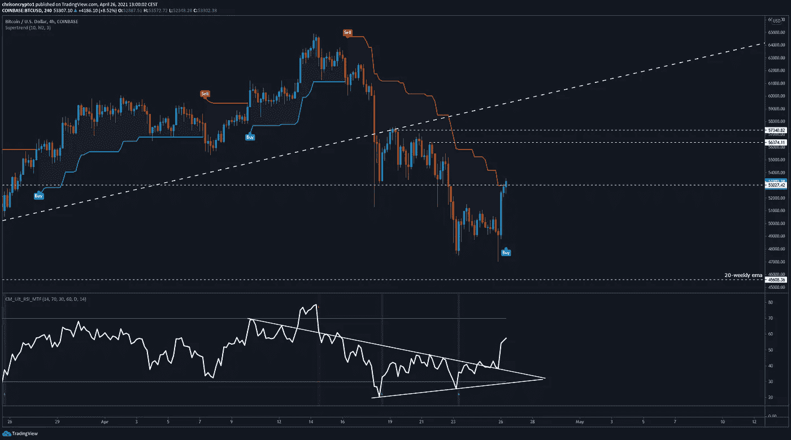
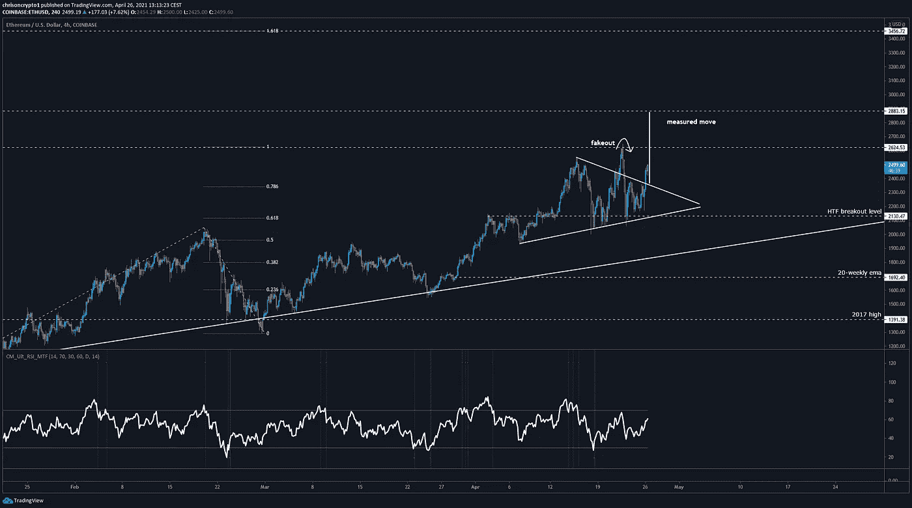

# BTC 触底了吗？这些数据点提示是！

> 原文：<https://medium.com/coinmonks/is-the-btc-bottom-in-these-data-points-suggest-that-it-is-4a95a73a9a5c?source=collection_archive---------2----------------------->

在这一期，我们深入探讨了链上和技术数据，当综合起来看时，这些数据表明[比特币](https://blog.coincodecap.com/a-candid-explanation-of-bitcoin)可能已经触底。

咱们挖吧。

## BTC 连锁分析显示 BTC 多头没有被花掉

看一看链上指标，特别是比特币的调整后支出产出利润率(aSOPR)，表明这一调整的大部分已经结束。事实上，长期的 aSOPR 表明，这一趋势仍然存在。

**查看** [全篇点击这里](https://chrisoncrypto.com/blog/f/btc-on-chain-analytics-suggests-bulls-are-not-spent) **！**

## 比特币见底了吗？

BTC/美元在 47，000 美元的本地低点后不久交易于 53，000 美元上方。

如[电报频道](https://t.me/chrisoncryptochannel)所述，4 小时相对强弱指数(RSI)背离表明抛售压力达到相对短期峰值。然而，BTC/美元还没有走出困境。

为了让看涨的信心重新进入市场，必须收复关键点位，并坚定不移地守住。截至发稿时，这对组合正在 53，000 美元的阻力位上角力。

如果救援反弹显示出希望，激进的多头将在潜在降温前将流动性水平锁定在 56，000 美元至 57，000 美元之间。

另一方面，从 53，000 美元拒绝/伪造将重新打开下行目标，即 20 周均线(45，000 美元)和潜在的更低水平(由于大规模平仓事件)。

也就是说，在目前的情况下，在没有测试这条均线的情况下，这对组合继续上涨也不是不可能的。

如前所述，通常标志反转的重要环比指标已经重置，因此除非 BTC/美元进入熊市区域，否则继续走高的可能性更大。由于新的熊市需要根本性的转变，这一点并不明显，因此像往常一样对待这些数据是有用的。

此外，[加密恐惧和贪婪指数](https://twitter.com/ChrisOnCrypto1/status/1386613315485544448)显示市场信心在两个月内从未如此之低。虽然它不是特别可靠，但在极端情况下，这个指数是一个有用的计数器指标，它提供了与其他数据点的汇合点。

## **以太坊准备好 3000 美元了吗？**

与此同时，迄今为止，ETH/USD 成功避免了灾难性的崩盘。

几个月来，我们一直高度看好以太坊(Ethereum ),它还没有走上抛物线。

与打破市场结构的比特币不同，以太在低迷时期保持在 2130 美元(突破水平)上方，多次测试颈线。

随着 ETH/USD 在看涨的三角旗结构上方印出更高的价格，这种伪造/背离也在很大程度上被重新捕捉。盘整模式往往会向其形成的方向发展，因此，既然整个市场正在复苏，那么从技术上来说，预计价格会上涨是合理的。

根据测算，ETH 的价格为 2883 美元(目前为 2517 美元)。考虑到在价格高度看涨的情况下更广泛的 fib 延伸趋势，那么 ETH/USD 可能触及 1.618 fib 延伸至 3456 美元。

另一方面，如果价格重新进入三角旗结构，那么更广泛的趋势线是多头的下一个兴趣点(1850 美元)。

自然，这不是一门科学，也不存在无风险资本收益这种东西。不过，截至周一上午，市场似乎正在享受一轮强劲的反弹，这可能会发展成为一个更大的趋势反转。一旦 BTC 果断地取出 58000 美元，我们就可以永远戴上我们的牛帽子了。

不管怎样，牛市还没有结束，耐心是一种美德。

下次再见。

**加入** [电报](https://t.me/chrisoncryptochannel) **频道，实时更新&设置！
关注我** [推特](https://twitter.com/ChrisOnCrypto1) **&** [多嘴多舌](https://gab.com/chrisoncrypto) **下面还有我的社交门户。**

[https://www.paypal.com/donate?hosted_button_id=C9VRLGTBHQX2N](https://www.paypal.com/donate?hosted_button_id=C9VRLGTBHQX2N)

## 阅读更多:BTC 连锁分析表明 BTC 多头没有被花掉

[https://chrisoncrypto.com/blog/f/btc-on-chain-analytics-suggests-bulls-are-not-spent](https://chrisoncrypto.com/blog/f/btc-on-chain-analytics-suggests-bulls-are-not-spent)

[http://www.chrisoncrypto.com/](http://www.chrisoncrypto.com/)

你也可以用比特币支持我！
**BTC** 地址:**3 eydseypjhn 68 axkncuqbb 7 ebqcxrejamr**

最诚挚的问候，
**克里斯托弗·阿塔尔德**
克里斯对加密的创始人
投稿人[www.cityam.com](https://www.cityam.com)
直接接通:[电报](https://t.me/chrisoncrypto)

*最初发布于*[*https://mailchi . MP*](https://mailchi.mp/f43c23ded1b2/is-the-btc-bottom-in-these-data-points-suggest-that-it-is?e=[UNIQID])*。*