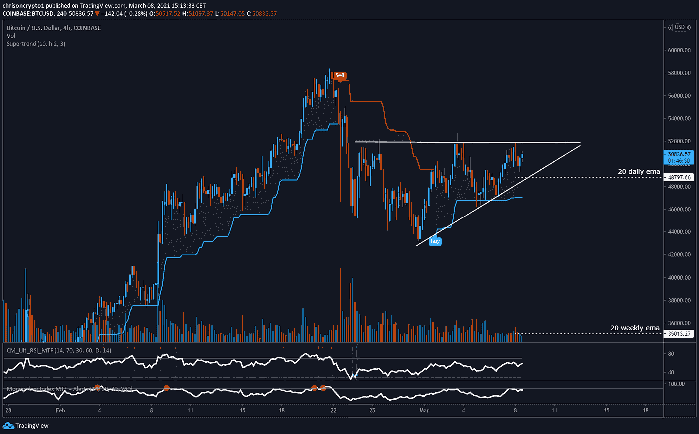

# 修正结束了吗？BTC 公牛队三月份的目标是 60，000 美元

> 原文：<https://medium.com/coinmonks/is-the-correction-over-btc-bulls-target-60-000-in-march-5fcb0c9ac6ca?source=collection_archive---------11----------------------->

随着比特币显示出强劲的迹象，更多的上市公司开始披露他们的加密货币持有量，这可能标志着超级比特币化的加速。

让我们开始吃吧。

# 中国应用美图收购价值 4000 万美元的 BTC 和瑞士联邦理工学院

中国照片编辑公司美图(Meitu)在其资产负债表上计入了价值 4000 万美元的比特币和以太网，成为最新一家加入机构加密购买热潮的公司。

值得注意的是，这家上市公司是除比特币之外第一个购买以太坊的公司，这证明了以太坊作为“Web 3.0 的基础层”的强大潜在叙事。这一决定可能受到以太坊即将转变为通缩资产这一事实的影响。

[点击这里查看完整故事](https://chrisoncrypto.com/blog/f/chinese-app-meitu-buys-40-million-of-btc-and-ethereum)。

无论是[亚马逊的](https://twitter.com/ChrisOnCrypto1/status/1367027145315389441)以太坊代言，即将发布的 [EIP-1559](https://chrisoncrypto.com/blog/f/major-ethereum-gas-fee-update-eip-1559-scheduled-for-july) 还是[乐观](https://chrisoncrypto.com/blog/f/scaling-coming-to-ethereum-in-march-with-optimism-mainnet-launch)扩展解决方案，[以太坊](https://chrisoncrypto.com/blog/f/grayscale-steps-on-the-gas-accelerating-ethereum-accumulation)似乎并不缺少持续增长的顺风。

# 技术上来说

## 这周 6 万美元的比特币？

比特币交易在 20 日均线上方，看涨的价格结构在冷却期后重新出现。

从较低的时间框架来看，价格正在略低于 52，000 美元的水平盘整，这已被证明是 2 周大部分时间的强阻力。

在整个价格波动过程中，各交易所的交易量一直在下降，这表明整合没有任何决定性的方向。鉴于这是在一个更大的牛市趋势中发生的，除非关键水平被突破，否则假设较低的目标还为时过早。

正如上一期简讯所述，[链上指标](https://mailchi.mp/198a9a2db63c/market-dynamics-reset-as-btc-hovers-above-50000)也已重置，不再闪烁明显的警告信号。

本质上，市场抛售似乎或多或少已经完成，即相对底部可能就在眼前(43，000 美元)。这一想法与上市公司关于新收购的比特币控股公司的新公告不谋而合——无论是 MicroStrategy，中国的美图还是挪威工业巨头 Aker，今天宣布购买价值 5800 万美元的比特币。

**要观看的关卡**

*   每日收盘价高于 52，000 美元，这是向 60，000 美元迈进的信号
*   每日支持 48，700 美元(20 EMA)
*   4 小时 47000 美元超趋势支撑。在牛市继续之前，这可能是一个快速清算事件。如果价格徘徊在 20 日均线之下，那么很可能是 LTF 趋势反转。
*   20 周均线 35000 美元支撑。这是一个中期“全押”信号。

不用说，交易加密货币风险很大，绝大多数人最好购买并持有比特币和以太坊。

然而，当我们试图在这个勇敢的新世界中一瞥极乐世界时，那些勇敢(或愚蠢)的少数具有高度痛苦和风险承受力的人可以跟随我们。

下次再见。

**加入** [电报](https://t.me/chrisoncryptochannel) **频道进行实时更新！
关注我的** [Gab](https://gab.com/chrisoncrypto) **和我下面的社交门户。**

[https://www.paypal.com/donate?hosted_button_id=C9VRLGTBHQX2N](https://www.paypal.com/donate?hosted_button_id=C9VRLGTBHQX2N)

# 阅读更多:中国应用美图收购价值 4000 万美元的 BTC 和以太

[https://chrisoncrypto.com/blog/f/chinese-app-meitu-buys-40-million-of-btc-and-ethereum](https://chrisoncrypto.com/blog/f/chinese-app-meitu-buys-40-million-of-btc-and-ethereum)

[www.chrisoncrypto.com](http://www.chrisoncrypto.com)

你也可以用比特币支持我！
**BTC** 地址:**3 eydseypjhn 68 axkncuqbb 7 ebqcxrejamr**

最诚挚的问候，
**克里斯托弗·阿塔尔德**
克里斯对密码的创始人
贡献者[www.cityam.com](https://www.cityam.com/)对
直接接通:[电报](https://t.me/chrisoncrypto)

*最初发布于*[*https://mailchi . MP*](https://mailchi.mp/936859828b9d/is-the-correction-over-btc-bulls-target-60000-in-march?e=[UNIQID])*。*