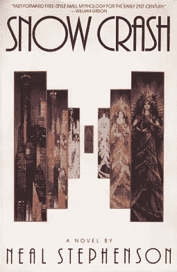

# 元宇宙是 Y 世代的丝绸之路吗？

> 原文：<https://medium.com/coinmonks/is-the-metaverse-gen-ys-silk-road-fb0465e26a6a?source=collection_archive---------7----------------------->

Image Credit: [Toni Verdú Carbó](https://www.flickr.com/photos/tonivc/)

“元宇宙”这个词最近变得家喻户晓，这要归功于脸书，它已经将自己重新定位为 Meta！现在，品牌重塑已经完成，马克·扎克伯格和他的团队显然可以通过创建一个被称为元宇宙的去中心化和不受监管的虚拟天堂来追求他们真正想做的事情。谁知道呢？你会问，元宇宙到底是什么？

Image Credit: [Wikipedia](https://en.wikipedia.org/wiki/Snow_Crash)

通俗地说，元宇宙是一个虚拟世界，你作为用户，以匿名的身份参与虚拟生活。这不是一个新概念。事实上，我在 30 年前就接触了这个术语，只是因为我是一个狂热的读者。像其他数百万 90 年代的美国人一样，我阅读了“科幻”小说*，作者尼尔·斯蒂芬森对一个去中心化的数字世界接管物理世界的愿景。他对未来元宇宙的展望令人十分不安。*

*然后是[第二次生命](https://secondlife.com/)。也许你还记得 2003 年推出的“元宇宙”游戏概念/平台，它被科技媒体誉为下一个重大的科技事件，但实际上从未成为什么？今天，它更像是一个虚拟的商品市场，而不是元宇宙。从 UX 的角度来看,《第二人生》太过笨重，无法吸引大量用户，而且说实话，它非常无聊。它是空的。*

*幸运的是，我们不太可能很快就住在为我们的生活编码的储物柜里，就像 Meta 的未来元宇宙发布会导致的*雪灾*中的公民一样。脸书团队也不会用《第二人生》那样糟糕的 UX 把我们烦死。然而，我们正在看到一个不确定的数字金融未来，这将涉及所有数字货币的集中化和去中心化之间的斗争，其中像 Meta 这样的新兴元宇宙平台将发挥核心作用。怎么会？*

*想象一个数字平台，称之为元宇宙，在这里你的虚拟形象的匿名性是最重要的，当你购物、易货和交易潜在的高价物品时，你的加密钱包全天候运行。你的任何交易都不会被跟踪或征税，你可以随意转移资金。除去货币集中，监管和税收，元宇宙是洗钱者的天堂，对吗？也许天堂已经存在？*

*让我来介绍一下，[decentland](https://decentraland.org/)，这是一个以区块链为燃料的元宇宙，在这里你可以，除了其他事情之外，买卖 NFT，虚拟财产和其他数字“创造”*

**

*分散土地自称为*有史以来第一个由用户拥有的虚拟世界*，但它实际上完全是使用以太坊和其他相关的区块链支持的加密货币进行无管制的高价值 NFT 和虚拟财产的买卖，所有这些都保证了用户的匿名性。分散化的更好的标签可能是，*就像第二人生，但是是为了洗钱，*或*就像丝绸之路，对于 Y 世代，有很酷的化身！我不是在开玩笑。机会就是这么明显。然而，世界各地的加密货币支持者仍然想知道为什么政府继续推动集中化。这完全是关于非法资金的洗钱！**

**

*Image Credit: [Dean Terry](https://www.flickr.com/photos/16262447@N00/454863427)*

*目前，UX 分散化的体验就像 2003 年的《第二人生》一样乏味。我知道是因为我报名参加并尝试了一下。因为我在一家咖啡店里用笔记本电脑，没有鼠标可用，所以我的触控板成了一个糟糕的操纵杆。我无法进入站台上任何我想去的区域，比如龙城、维加斯城和时尚街。*

*我在分散式大厅里站了 30 分钟，看起来就像《第二人生》中迷失的浮华化身，之后我退出了这个项目。我打算买一个鼠标，稍后再试一次，但那是一次痛苦的初始用户体验。*

*如果“分散之地”真的想吸引大额采购的买家和卖家，它就必须大幅改善用户体验，并消除那些非计算机工程师的摩擦。它应该是一种无缝、简单而优雅的体验。那些试图清洗大量非法资金的人无法通过糟糕的 UX，他们只会用老办法通过他们的空壳公司购买实物房地产资产或艺术品。也许你错过了最近的[潘多拉文件发布](https://www.icij.org/investigations/pandora-papers/)？*

*如果没有发生在元宇宙的来自大款玩家的大笔交易，分散的土地注定会失败。然后，即使它和脸书的未来 Meta 一起取得了令人振奋的成功，它在美国和其他国家的快乐用户日的窗口也相当短。不管你喜不喜欢，数字货币及其支撑平台的集中化和监管正在到来。也许不是今天，但它即将到来。*

*[瑞士和隐谷](/coinmonks/crypto-deep-dive-europe-and-the-uk-9c81aeace147)人们可能会有不同的看法，但历史证明，无论反叛的方式如何，政府总是集中货币并对其征税，并优先考虑对那些试图流通和清洗不义之财的人定罪。在一天结束的时候，你可能犯下了一大堆可怕的罪行，但有一项指控永远不会改变，那就是洗钱。当一切都失败的时候，它得到了最好的。*

*幸运的是，对于我们人类来说，像斯蒂芬森这样不受监管的元宇宙永远不会存在。他的理论中有一个很大的缺陷，那就是假设公司会倾向于分权而不是集权，这是永远不会发生的。银行会立即关闭这些公司，对于那些公开上市的公司，华尔街也会这么做。不过这是一本很棒的科幻小说！而且喜欢一个去中心化的元概念，纯幻想！*

*   *结束*

> *加入 Coinmonks [电报频道](https://t.me/coincodecap)和 [Youtube 频道](https://www.youtube.com/c/coinmonks/videos)了解加密交易和投资*

## *另外，阅读*

*   *[莱杰 vs n rave](/coinmonks/ledger-vs-ngrave-zero-7e40f0c1d694)|[莱杰 nano s vs x](/coinmonks/ledger-nano-s-vs-x-battery-hardware-price-storage-59a6663fe3b0) | [币安评论](/coinmonks/binance-review-ee10d3bf3b6e)*
*   *[Bybit Exchange 审查](/coinmonks/bybit-exchange-review-dbd570019b71) | [Bityard 审查](https://blog.coincodecap.com/bityard-reivew) | [CoinSpot 审查](https://blog.coincodecap.com/coinspot-review)*
*   *[3 commas vs crypto hopper](/coinmonks/3commas-vs-pionex-vs-cryptohopper-best-crypto-bot-6a98d2baa203)|[赚取加密利息](/coinmonks/earn-crypto-interest-b10b810fdda3)*
*   *最好的比特币[硬件钱包](/coinmonks/hardware-wallets-dfa1211730c6) | [BitBox02 回顾](/coinmonks/bitbox02-review-your-swiss-bitcoin-hardware-wallet-c36c88fff29)*
*   *[BlockFi vs Celsius](/coinmonks/blockfi-vs-celsius-vs-hodlnaut-8a1cc8c26630)|[Hodlnaut 点评](/coinmonks/hodlnaut-review-best-way-to-hodl-is-to-earn-interest-on-your-bitcoin-6658a8c19edf) | [KuCoin 点评](https://blog.coincodecap.com/kucoin-review)*
*   *[Bitsgap 审查](/coinmonks/bitsgap-review-a-crypto-trading-bot-that-makes-easy-money-a5d88a336df2) | [Quadency 审查](/coinmonks/quadency-review-a-crypto-trading-automation-platform-3068eaa374e1) | [Bitbns 审查](/coinmonks/bitbns-review-38256a07e161)*
*   *[密码本交易平台](/coinmonks/top-10-crypto-copy-trading-platforms-for-beginners-d0c37c7d698c) | [Coinmama 审核](/coinmonks/coinmama-review-ace5641bde6e)*
*   *[iTop VPN 审查](https://blog.coincodecap.com/itop-vpn-review) | [曼陀罗交易所审查](https://blog.coincodecap.com/mandala-exchange-review)*
*   *[40 个最佳电报频道](https://blog.coincodecap.com/best-telegram-channels) | [喜美元评论](https://blog.coincodecap.com/hi-dollar-review)*
*   *[折叠 App 审核](https://blog.coincodecap.com/fold-app-review) | [StealthEX 审核](/coinmonks/stealthex-review-396c67309988) | [Stormgain 审核](https://blog.coincodecap.com/stormgain-review)*
*   *[购买 PancakeSwap(蛋糕)](https://blog.coincodecap.com/buy-pancakeswap) | [俱吠罗评论](/coinmonks/coinswitch-kuber-review-1a8dc5c7a739)*