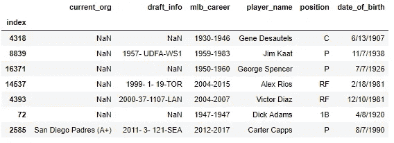
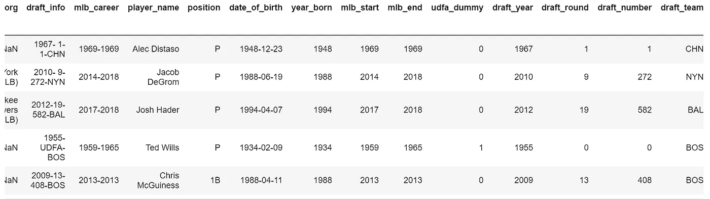
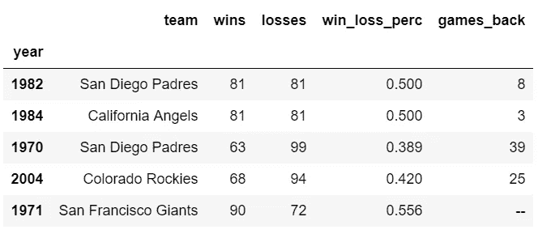

# MLB 的游戏质量在下降吗？

> 原文：<https://medium.com/coinmonks/is-the-quality-of-play-in-mlb-decreasing-ea0d69c09d17?source=collection_archive---------8----------------------->

**上下文:**

我们之前已经确定，MLB 奥运会的上座率平均来说正在下降。该分析的[核心问题](/@jordanbean/whats-the-deal-with-declining-mlb-attendance-part-1-62a0f39ba0b0)是气温是否对每场比赛的上座率有影响(例如，平均气温较低的月份每场比赛的上座率是否也会下降？).在[探索](/@jordanbean/analyzing-mlb-attendance-and-temperature-6cb2b1af2bd4)、[分析](/coinmonks/is-mlb-attendance-per-game-significantly-different-when-its-cold-793a3553132c)、[建模](/coinmonks/can-temperature-predict-attendance-at-mlb-games-d0b6a50217e0)近 30 年的 MLB 比赛和天气数据后，得出的结论是，no、温度和上座率总体上并没有显示出有意义的关系。

**目标:**

知道出席人数在减少，温度变量不是一个重要的相关因素，我们将使用数据来寻找其他潜在的影响因素。在这个由三篇文章组成的迷你系列中，我们将尝试为一个高层次的模糊变量— *游戏质量—* 创建数据支持的度量，并使用 Python 中的一系列分析技术来寻找有意义的差异。

比赛的质量可以有多种形式，我欢迎你对其他变量的想法。对于这些帖子，我决定分成两个不同的部分。第一个([代码在这里](https://github.com/jordanbean/Project_Quality/blob/master/Project_Quality_Analysis.ipynb))是探索进入联盟的球员的变化，而第二个([代码在这里](https://github.com/jordanbean/Project_Quality/blob/master/Project_Quality_Standings.ipynb))是挖掘与球队随着时间的推移最终排名和表现相关的指标。

我们将关注与新秀进入联盟相关的各种因素——年龄、在小联盟的时间、选秀轮数等等——看看是否有任何有意义的变化可以让我们深入了解比赛质量。我想在这里明确说明*这个变量的本质是探索性的，而不是解释性的。*

这是因为我们关注的变量并不能从本质上告诉我们球员的素质，而是关于他们 MLB 之旅的其他人口统计因素。我将提供一些我自己对潜在或潜在根本原因的想法，但概括地说，我们将寻找的是*是否*发生了任何变化(知道出勤情况发生了变化)，如果是这样，*什么*发生了变化，而不是*这些变化如何影响出勤。*

第二篇文章将更加具体，因为它使用了可验证和可消化的历史数据——MLB 球队的输赢。在那次分析中，我们将关注一些与胜率差异和联赛领先者与落后者之间差距相关的变量。

**流程**

这项分析将需要两套广泛的数据集，并辅之以一系列一次性需求。首先是进入大联盟的球员的数据集，包括像选秀年份和在大联盟的时间长度这样的变量。第二个数据集是特定时间段内的 MLB 结果。然后，我们将使用各种格式和变量对数据进行分割，以寻找有意义的结果。

**收集数据**

学习编程语言的有趣之处在于，你不会被公开的聚合和发布的数据集所束缚，你可以创建自己的数据集。我确信互联网上有各种各样的数据集，其中有一些或大部分是我正在寻找的，但只是为了实践，因为这是有益的，我决定自己制作一个。

我发现了一个[网站](http://www.thebaseballcube.com)，它跟踪并存储了自 1871 年以来所有进入大联盟的球员。早些年的数据有时会丢失或有缺口，但我不需要追溯那么久。

因此，[我编写了代码](https://github.com/jordanbean/Project_Quality/blob/master/player%20_scrape)来收集他们数据库中的每个球员，并存储他们的姓名、位置、出生日期、在大联盟的时间、选秀信息和状态(当前、退役、小联盟等)。).

我需要的第二个数据集是大联盟赛季的历史结果列表。我做了一些搜索，但最终决定[也对这些数据做一次网络搜集](https://github.com/jordanbean/Project_Quality/blob/master/standings_scrape),因为你永远得不到足够的实践。我找到了 baseball-reference.com 每个季度的数据。由于他们构建每一页的方式，我能够从 1970 年开始提取数据进行分析，尽管他们的数据可以追溯到更早。

关于数据收集，我要做的第三个快速说明是，我需要一个小的数据集来计算联盟中每年的球队数量(因为 MLB 在分析的时间段内扩大了球队数量)。这是另一个练习抓取网页的机会，尽管从网上找到并复制/粘贴网页并不困难。为此，[我从维基百科上刮了一张表格，上面有团队及其成立年份，然后用来计算每年的团队数量。](https://github.com/jordanbean/Project_Quality/blob/master/wikipedia_team_scrape)

我还在一两个实例中使用了我从前一个项目中收集的一些数据。

**数据清理**

*球员数据*

使用预先准备好的数据集的好处在于，有人已经…准备好了数据。构建自己的数据集时，数据是脏的。对于来自棒球立方体的数据，这是行的随机抽样:

有很多缺失的值。有些球员有选秀信息，有些没有。draft_info 列有三种不同的可能格式，在某些列中有一个随机的“UDFA”。mlb_career 列不是非常有用，因为它是一个字符串范围，但是我们不能过滤字符串值，所以如果我们想使用数字年份值，就必须将其拆分。

在代码中可以找到的一系列数据清理技术之后，最初清理的新数据集如下所示:

我们删除了 draft_info 的所有空白值，将 mlb_career 变量拆分为开始和结束变量，将 date_of_birth 变量转换为 pandas datetime 对象。我们还将 draft_info 列分为年份、选秀轮次、选号和选秀团队。最后，随机的“UDFA”变量被赋予了虚拟值，如果为真则为 1，如果不为真则为 0(“UDFA”代表“未选秀的自由球员”，这意味着该球员没有在正式选秀中被选中，而是在另一个时间被签下)。

我们通过探索性图表发现了一些额外添加的列和一些删除的坏数据，这些可以在代码中找到，其中一些将在后面的帖子中涉及。

*游戏数据*

游戏数据集从一开始就相当干净，主要是因为我只需要少数几个列，而且数据在输入时非常简单。

唯一值得注意的元素是 games_back 列中的“—”字符。这个字符的出现表明该队赢得了他们的分组(因此落后 0 场)，所以一个简单的替换解决了这个问题。唯一的其他次要格式包括将年份索引转换为日期时间以便绘图。

**接下来是**

好了，现在我们已经定义了问题，收集了数据，并将其转换成可用的格式，有趣的事情开始了。[下一篇](/@jordanbean/the-changing-look-of-mlb-rookies-ebbb650d7c01)将对球员数据集做探索性分析。