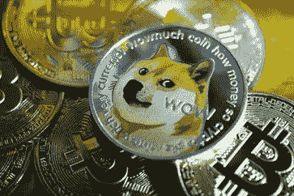
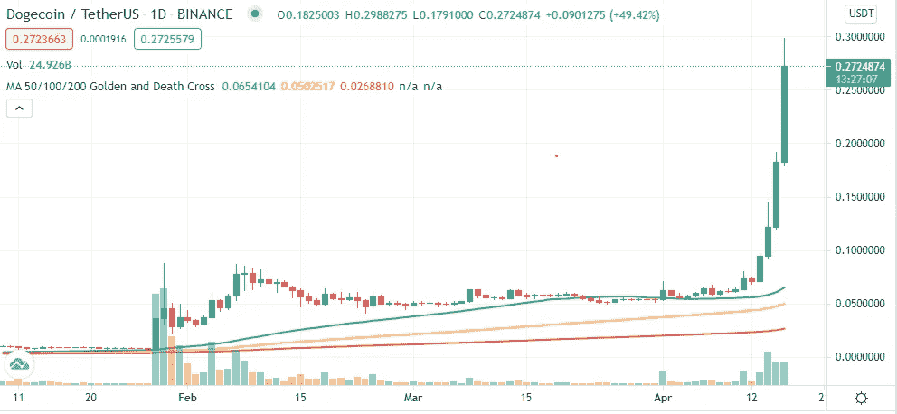
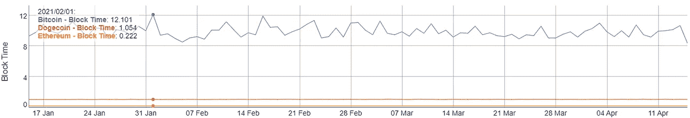
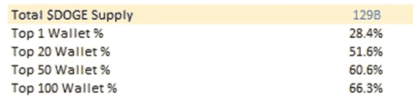
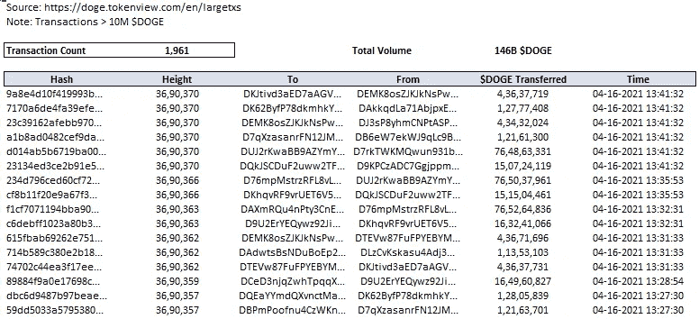
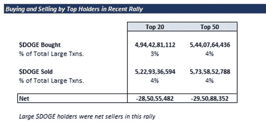
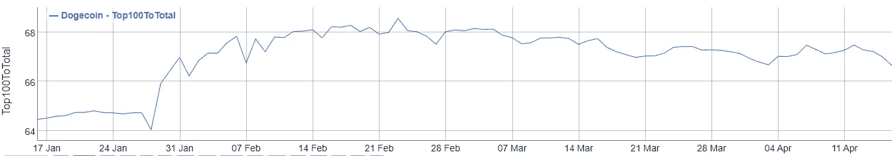

# 终极迷因币是认真的吗？在最近美元上涨的掩盖下

> 原文：<https://medium.com/coinmonks/is-the-ultimate-meme-coin-getting-serious-under-the-hood-of-the-recent-doge-rally-dc41c32e1797?source=collection_archive---------2----------------------->

*我们的分析可以在这里找到:*【https://tinyurl.com/bjzhdzxa】T2

**概述**

在撰写本文时，$DOGE 的价值在过去的 72 小时内增长了约 200%。对于那些自 2020 年以来一直持有$DOGE 的人来说，这代表着年初至今 2，800%的回报率。这个始于 2013 年的迷因币，今年经历了两次重大反弹，从 Redditors 到 Elon Musk 的所有人都在不同点上支持它的反弹。

最近这波涨势令人好奇的是，它已经超过了所有以前的高点，没有埃隆·马斯克通常的接二连三的推文，也没有像 2 月 21 日周期那样在 Reddit 上喋喋不休。这就引出了一个问题:是现有的$DOGE 鲸鱼在抽取硬币，还是我们开始看到对这种迷因硬币的真正的分布式需求？

*1-day $DOGE Price Chart*

**$DOGE-nomics**

对$DOGE 最大的批评之一是，它的供应是无限的，理论上，随着时间的推移，这可能会有意义地稀释硬币持有者的价值。然而，当你在引擎盖下看的时候，故事有点不同。Dogecoin 目前有大约 129 亿代币在流通。虽然$DOGE 的供应量是无限的，但供应量的年增长率估计约为 50 亿美元/年(每开采一个区块需 1 万美元 DOGE)。这代表了约 4%的年通胀率，与美元 2-3%的年通胀率相差不远。

因此，虽然$DOGE 不会像比特币一样成为价值储存手段，但鉴于$DOGE 的通胀率，它可能会成为一种交换媒介。这就引出了一个问题:“人们在任何地方都使用$DOGE 进行交易吗？”用例越多(当前的或潜在的)，潜在的需求就越大。

对于$DOGE 来说，除了在某些网站上给小费之外，目前还没有很多具体的使用案例。然而，这并不意味着这种情况不会改变，特别是考虑到$DOGE 的阻塞时间明显低于比特币等同行。正如我们在以太坊中看到的，即使有更快更便宜的解决方案，人们也会涌向拥有最大社区的网络/协议。

Block Time, BTC vs. DOGE vs. ETH

谁持有$DOGE？

$DOGE 历史上一直是一个相对集中的社区，前 20 名持有 28%的供应量，前 20 名持有 51%的供应量。这就引出了一个问题，即最近的周期是否是由顶级股东推动的，或者是否有一个有机社区开始在$DOGE 左右发展。

$DOGE Supply Concentration

**谁把$DOGE 放出来了？**

从 2 月 21 日的价格飙升到现在，美元兑日元的价格下跌有限，这表明美元兑日元的持有者一直在抛售，这意味着在最近的价格飙升之前，大多数天然供应已经离开了系统。在这种情况下，通常不需要太多需求就能推高价格。本轮反弹的真正问题是，需求是来自现有的顶级持有者推高了价格，还是这是有机的。

为了理解这一点，我们从提取过去 36 小时内的所有大额交易(> 1000 万美元)开始。

Transactions >10M $DOGE in the past 36 hours

令我们惊讶的是，目前前 50 名代币持有者几乎没有参与这次反弹。事实上，他们是净卖家(尽管不是很多)。

Rally Participation from the Current Top 50 $DOGE token holders

这一点也得到以下事实的证实，即总供应量中前 100 名持有人的权重在这次反弹中相对没有变化。

Source: Bit Info Charts

我们的下一个问题是:“这次上涨是由那些可能试图通过抛售美元来操纵市场的新鲸鱼引起的吗？”我们再次惊讶地发现，在最近的反弹中，**前 10 名买家仅占超过 1000 万美元的购买量**的约 16%。

**结论**

一些人将价格上涨归因于比特币基地的上市，而另一些人则将其归因于埃隆·马斯克在 4 月 15 日发布的一条推特。然而，其他主要硬币在比特币基地上市后没有经历过类似的持续上涨，这一事实证明这不太可能是主要原因。埃隆·马斯克的推文也不太可能单独导致价格飙升。甚至他在 2 月 21 日连珠炮似的推文也没能产生这样的效果。最终，这两个因素可能都发挥了一定的作用，但尚不清楚到底是什么导致了这一峰值。

仅有的两个可能具有有意义价值的假设是:1)市场范围内对“低质量硬币”如$XRP 和$DOGE 的空头头寸的平仓，或 2)对$DOGE 可能存在一些有机需求的可能性。如果是后者，这可能会产生一些非常有趣的长期影响。

当然，在$DOGE 的供应变得更加分散、更加广泛之前，它的基本面价值仍然有限。然而，开始持有 DOGE 的人的网络如果持续下去，将很难被忽视。最终，正如埃隆·马斯克(Elon Musk)所说，最有趣的结果可能不会像我们曾经认为的那样不切实际。无论最终结果如何，有一件事是肯定的:总督不再是一个笑料。

在推特上关注我们 [@ClearChainCap](https://twitter.com/ClearChainCap)