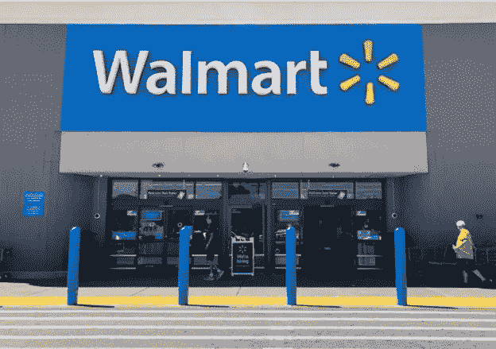

# 沃尔玛准备好接受加密货币了吗？

> 原文：<https://medium.com/coinmonks/is-walmart-ready-to-accept-cryptocurrency-4676eef3c09e?source=collection_archive---------7----------------------->

Walmart. Largest retail store in the U.S

最近有消息称美国最大的零售商沃尔玛将与莱特币加密货币合作。据新闻报道，沃尔玛应该很快开始接受加密货币支付。

# 沃尔玛的新支付方式

零售巨头沃尔玛正在采取措施接受加密作为支付手段。该公司最近在其网站上发布了一个新的[职业列表](https://www.cnet.com/tech/walmart-wants-to-hire-a-digital-cryptocurrency-product-lead/)，招聘数字货币和加密货币产品主管。成功的候选人将负责制定数字货币战略和设计产品路线图。申请人将与产品和设计领域的其他领导者合作，并寻找与加密相关的投资和合作机会。这一职位空缺表明，沃尔玛正寻求通过数字货币扩大其支付选择。

# 与莱特币没有合作关系

沃尔玛解释说，虽然它正在研究其他支付方式，但它不接受莱特币作为其商店的支付方式。这份声明看起来非常真实，以至于许多媒体都报道了这件事。甚至推广使用莱特币的 Twitter 账户也与该帖子相关联。随后，货币[升值](https://coinmarketcap.com/currencies/litecoin/)超过 30%。

然而，沃尔玛发表声明称该消息不实。金融领域最新的东西，也是最老的投资者的游戏之一，是经典的抽逃策略。有人开始发布假新闻，并利用围绕加密货币的炒作来抬高莱特币的价格，然后沃尔玛驳斥了这一发布。

证券律师表示，毫无疑问，美国证券交易委员会(sec)将展开调查，并可能对这些虚假信息背后的人提出指控。这种行为是涉及公共问题的虚假陈述。这是美国证券交易委员会的管辖范围。这也可能导致对加密行业进行更严格监管的呼吁，该行业在交易所市场的交易量高达数十亿美元。

这种泵送和倾倒方案并不少见。最近，SEC 主席加里·詹斯勒(Gary Gensler)呼吁国会授予监管机构更多监管加密产品和交易所的权力。

Trading on the exchange floor

# 哄抬股价

该消息最早由环球新闻网发布。全球新闻专线为公司提供了一个发布公告的平台。一个国家在声明中指出，它迅速采取行动，撤回了由欺诈性账户发布的新闻稿。它进一步强调，这是第一次，他们将采取进一步措施防止今后发生这种情况。该通讯社还同意与有关当局合作，对此事进行更深入的调查。

在记者致电沃尔玛证实一些新闻机构的账户已经发布了基于该新闻稿的信息后，沃尔玛才得到消息。他们拒绝提供信息，称他们与 Litecoin 没有合作关系。他们坚持认为这种信息是假的。同样，莱特币相对来说不像其他加密货币那样受欢迎，那么沃尔玛为什么要与它合作呢？加密货币的选择很奇怪。

这使得它成为了新闻传播者的一个可能的选择，也使得它成为了大型零售商沃尔玛的一个不可能的选择。这种恶作剧偶尔会发生。回想 2010 年，有另一份新闻出版物发布了一份虚假新闻稿，称通用磨坊是联邦调查的对象。这些信息会对相关公司的股票产生影响。

股票经纪人有时散布虚假消息来操纵几家上市公司的股票。大多数大型企业新闻机构都有安全的系统，允许公司提交新闻稿向公众发布。他们通常有一个过程，在新闻稿发布给公众之前对其进行核实。

# 货币的未来

加密迷将比特币、以太坊和 Dogecoin 视为全球货币的未来。区块链技术允许 crypto 创建记录交易的数字账本。这些交易是一种安全的货币形式，是可以被任何中央机构操纵或控制的票据，因为它们是分散的。

此外，还出现了一些旨在利用公众利益的抽水转储计划，同时为骗子赚了大钱。它们通常涉及影响者，这些影响者通过推广代币来提升代币的价值，从而获得激励和股份。当价值上升时，他们抛售硬币，其他人看到他们的投资贬值。最终，他们发现他们持有的代币毫无价值。

这些方案标志着加密货币变化故事的最新转折。这让一些人一夜暴富，同时也让其他人破产。甚至 Dogecoin ，一种以玩笑开始的迷因加密货币也获得了主流关注，主要是因为像 Elon Musk 这样的高调人物与该社区有关联。尽管如此，时间会告诉我们这种泡沫会持续多久，因为没有基本面因素。这只是一个笑话。

【https://youtu.be/gxJOzDeUdf8】T2 埃隆·马斯克小组讨论

也就是说，我喜欢这个社区，因为它不太把自己当回事。此外，有许多聪明人与这个项目有关。所以，让我们看看这个怎么样。事实上，马斯克在最近的一次聊天中承认，他会加油，但不会倾倒。如果 Dogecoin 的价格下跌，就会影响到他。因此，这就存在利益冲突。人们应该小心谁会影响他们的财务决策，因为他们很可能有既得利益。

# 避免泵送和倾倒方案

抽水和倾倒是一个证券骗局。骗子制造虚假的股票炒作，以产生兴趣。一旦不知情的投资者开始购买股票，股票价格上涨，然后他们选择一个抛售股票的点，导致价格突然下跌。由于担心错过机会，投资者在投资资产之前进行研究是很重要的。

当你按下购买键的时候，你已经晚了。你错过了公共汽车。入境点太高，因此他们返回的可能性非常低。

这通常是通过不和谐的渠道或论坛或社交媒体完成的。所有者也可以让有影响力的人推销硬币，以换取代币形式的激励。有时，在某些圈子里，泵送和倾倒计划被称为地毯拉。

当有影响者敦促你随机购买代币时，你需要小心。他们通常通过社交媒体宣传来推广代币，并向追随者赠送数千枚免费硬币，并承诺其他一些激励措施，只是为了制造宣传，在不知不觉中抓住容易上当的人。

> 加入 Coinmonks [电报频道](https://t.me/coincodecap)和 [Youtube 频道](https://www.youtube.com/channel/UCbyDhTbOiKh2iUMKBi4-4Zg)了解加密交易和投资

## 也阅读

 [## 最佳加密交易所| 2021 年十大加密货币交易所

### ICON _ PLACEHOLDEREstimated 预计阅读时间:28 分钟加密货币交易所的加密交易需要知识…

blog.coincodecap.com](https://blog.coincodecap.com/crypto-exchange)  [## 2021 年 10 大最佳加密贷款平台| CoinCodeCap

### 当谈到加密货币贷款时，大量因素等同于良好的收入状况。此外，借款的一部分…

blog.coincodecap.com](https://blog.coincodecap.com/crypto-lending)  [## 2021 年最佳免费加密交易机器人

### 2021 年币安、比特币基地、库币和其他密码交易所的最佳密码交易机器人。四进制，位间隙…

medium.com](/coinmonks/crypto-trading-bot-c2ffce8acb2a)  [## 最佳 4 个加密交易信号电报通道

### 这是乏味的找到正确的加密交易信号提供商。因此，在本文中，我们将讨论最好的…

medium.com](/coinmonks/best-crypto-signals-telegram-5785cdbc4b2b)  [## BlockFi 评论 2021:利弊和利率| CoinCodeCap

### 今天，我们提出了一个全面的 BlockFi 评论，这是一个成立于 2017 年的加密贷款平台，拥有其…

blog.coincodecap.com](https://blog.coincodecap.com/blockfi-review)  [## 如何在印度购买比特币？2021 年购买比特币的 7 款最佳应用[手机版]

### 如何使用移动应用程序购买比特币印度

medium.com](/coinmonks/buy-bitcoin-in-india-feb50ddfef94)  [## 加密税务软件——五大最佳比特币税务计算器[2021]

### 不管你是刚接触加密还是已经在这个领域呆了一段时间，你都需要交税。

medium.com](/coinmonks/best-crypto-tax-tool-for-my-money-72d4b430816b)  [## 存储比特币的最佳加密硬件钱包[2021] | CoinCodeCap

### 保管您的数字资产很容易，但找到正确的存储方式却是一项繁琐的任务。在线钱包有一个风险…

blog.coincodecap.com](https://blog.coincodecap.com/best-hardware-wallet-bitcoin)