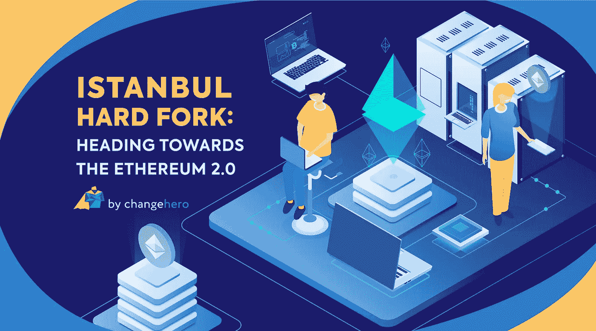

# 伊斯坦布尔硬分叉:走向以太坊 2.0

> 原文：<https://medium.com/coinmonks/istanbul-hard-fork-heading-towards-the-ethereum-2-0-ced7f3018911?source=collection_archive---------0----------------------->

以太坊释放了区块链的全部潜力，彻底改变了加密领域。它通过支持开发人员在链上构建 DApps 实现了重大突破，并为第二代区块链奠定了基础。该网络已经升级了一次又一次，但其可扩展性仍然是一个问题。

以太坊的伊斯坦布尔 Hardfork 将于 12 月 7 日举行。尽管“Hard fork”这个术语对一些人来说听起来很可怕，但也没什么好担心的。在这篇文章中， [ChangeHero](http://changehero.io/) 试图澄清关于即将到来的以太坊硬叉子的事情。

## 什么叉子！

硬分叉通常被误解为区块链分道扬镳的过程，但它也可以用于升级当前网络。在过去，由于像比特币现金、莱特币和以太坊经典这样的硬分叉，很少有从现有链创建新链的实例，在臭名昭著的道黑客之后也出现了。伊斯坦布尔会议是一次有计划的分支会议，将集中在升级区块链的几个方面，以提高性能和效率。第八次网络升级将在编号为 9069000 的区块进行，预计在本周进行。

以太坊此前已经成功批量推送更新到平台。拜占庭和君士坦丁堡——大都市升级的子部分就是一个令人印象深刻的例子。以太坊已经决定采取同样的做法，把叉子分成两部分。伊斯坦布尔硬分叉是以太坊改进提案(EIPs)驱动的。首先，EIP 是提供新特性信息的设计文档，包括核心协议规范、客户 API 和合同标准。

第一部分将包括六个与代码修改相关的 EIP，它们将于今年 12 月升级。

*   **EIP-152:** 在合约中加入 Equihash PoW，使以太坊能够与 Zcash 进行中继和原子互换交易。
*   **EIP-1108:** 降低了昂贵的 zk-SNARKs 价格，减少了天然气成本，并实现了更便宜的扩展和构建面向隐私的应用。
*   **EIP-1344:** 为合同添加 ChainID 操作码，以跟踪正确的状态和等离子体链。它还可以防止不同链之间的重放攻击。
*   **EIP-1884:** 调整 EVM 操作码的价格，以匹配特定操作所需的计算。它还可以防止垃圾邮件攻击和平衡块。
*   **EIP-2028:** 通过降低交易中调用数据所需的天然气价格，使 zk-SNARKs 和 zk-STARKS 更便宜。
*   **EIP-2200:** 调整 EVM 仓储成本的计算。降低了汽油成本，并增加了新功能，如再入锁和相同合同多次发送。

事件的最初版本不会对以太产生重大影响。用户不需要采取任何额外的措施来储存或交易乙醚。节点运行者必须将他们的软件升级到 fork ready 版本。

## 期待已久的续集

伊斯坦布尔的第二部分预计将于 2020 年第一季度举行。到目前为止，约有 8 个 EIP 已被接受用于分叉的第二部分，包括最受期待的向 PoS 共识的转变。这就解决了伸缩问题，并且每秒可以处理更多的事务。

此外，ProgPoW 预计也将在 fork 的第二阶段推出。通过引入这种新协议，以太坊降低了 AISCs 的有效性，并使传统的 GPU 能够用于采矿。这将确保每个人都有平等的机会开采乙醚。

## 以太坊 2.0 之路

以太坊给了区块链世界必要的突破。它是仅次于比特币的第二大最有价值和最受欢迎的加密货币。虽然以太坊轻松领先于替代硬币包，但其他项目正在赶上技术进步。以太坊 2.0 预计将于 2020 年推出，采用新的令牌和 PoS 共识协议。它将对协议进行微调，使其具有更高的可扩展性、稳定性和安全性。伊斯坦布尔硬叉是以太坊急需的升级，让他们在与他人的比赛中保持领先。

关注 [Twitter](https://twitter.com/Changehero_io) 、[脸书](https://www.facebook.com/Changehero.io/)和 [Medium](/@changehero) 上的 [ChangeHero](https://changehero.io/) ，获取更多关于 crypto 的此类信息丰富的文章和激动人心的优惠。

> [直接在您的收件箱中获得最佳软件交易](https://coincodecap.com/?utm_source=coinmonks)

