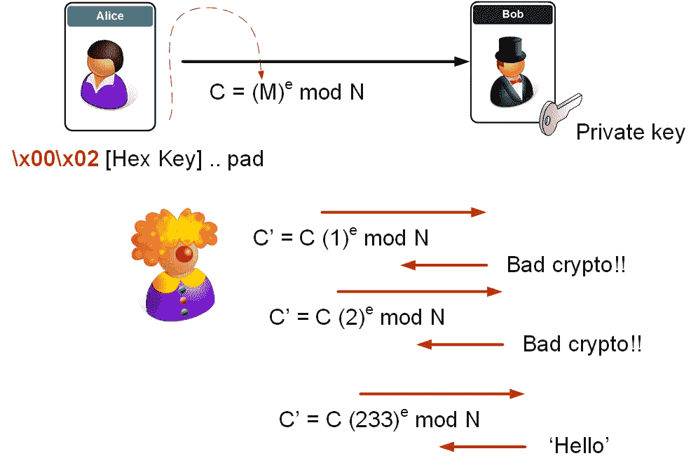

# 它已经存在 20 年了…但它仍然是个问题

> 原文：<https://medium.com/coinmonks/it-has-been-around-for-20-years-and-its-still-a-problem-373ae142fac1?source=collection_archive---------7----------------------->

Bleichenbacher 的攻击[ [here](http://archiv.infsec.ethz.ch/education/fs08/secsem/Bleichenbacher98.pdf) ]已经为人所知 20 年了，并且一直是对 SSL 的许多攻击的核心。它在 2017 年以机器人的形式回归(布莱肯巴赫的甲骨文威胁【https://robotattack.org/[的回归】)。](https://robotattack.org/)

这里的[展示了这些原则。](https://asecuritysite.com/encryption/c_c3)

# 概述