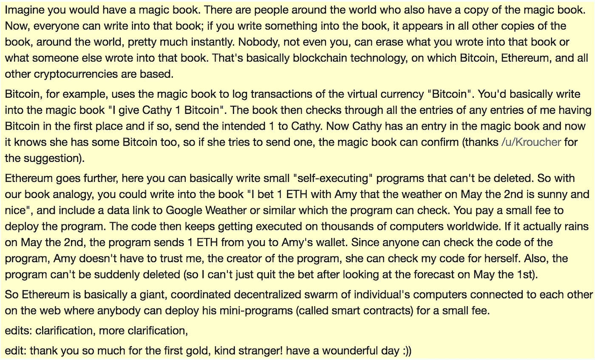
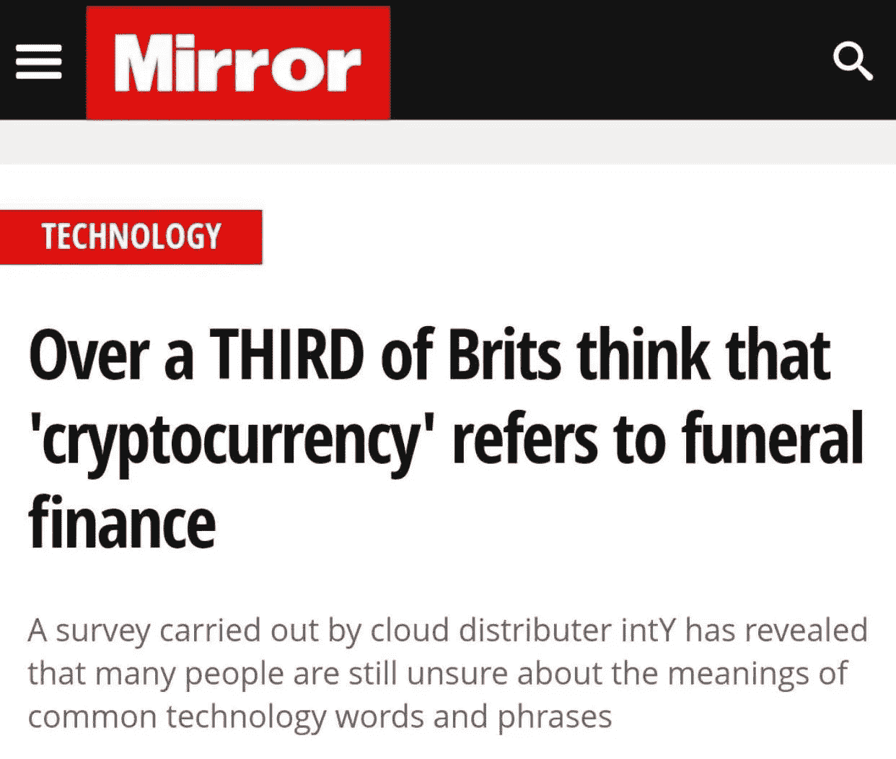
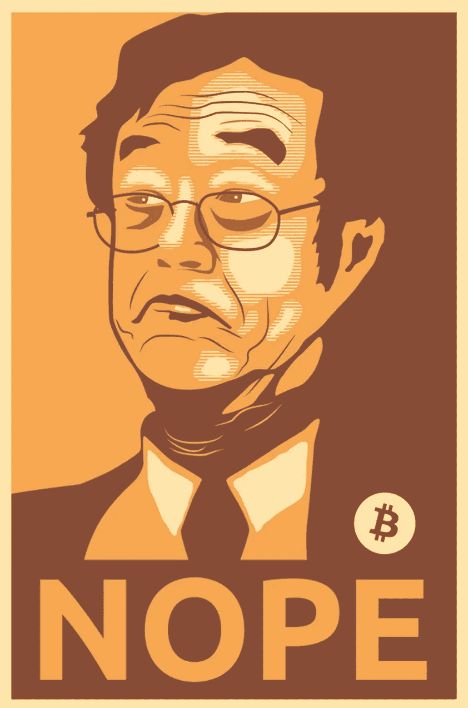
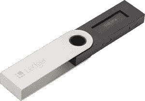
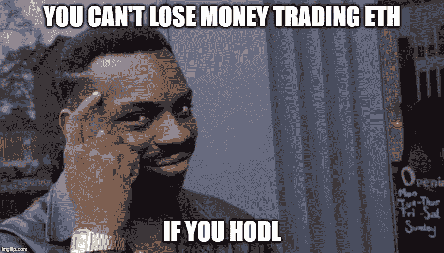

# 这是区块链宝贝，好了，现在一步一步来

> 原文：<https://medium.com/coinmonks/its-blockchain-baby-okay-now-baby-steps-539f208da02c?source=collection_archive---------9----------------------->

免责声明:这不是财务建议，我也不认可撰写/拍摄/讲述这些内容的人的所有原则、做法或观点。

所以你想加入#crypto 是🤔嗯，❗️**be**warned❗️有时候，这个市场就像过山车一样，甚至是横向上升/下降。在你开始之前，有一些事情你需要知道，比如好的资源在哪里，听谁的，所有的行话是什么意思，如何得到一些密码，最后是保护你的资金的最好方法。在这篇文章中，我的目标是涵盖这一切，甚至更多！

**说到这里，让我们开始吧，但首先是坏消息:**

## **坏消息**

*   投资加密货币可能不会让你发财💸
*   你可能会因为没有密切关注而立即损失金钱。
*   月球上没有兰博基尼🏎🌚😑

## 好消息

*   区块链和加密货币所涉及的社区令人惊叹，令人捧腹。
*   改善人民生活和调整我们世界目前不平等状况的可能性是巨大的。
*   会有很多很多的猫。还有彩虹和乘坐宇宙飞船的骆驼的猫，所有这些都将被生动地印在 t 恤上，让你穿着愉快🐈🌈👕

Credit: Vitalik Amaze

O 我告诉人们开始的第一个地方是 **Reddit，**现在我知道你在说什么了*“Reddit 就像一个黑洞，我怎么能找到任何东西呢？”*

有一些漂亮的小线程叫做“子线程”。下面是我最喜欢的:[r/区块链](https://www.reddit.com/r/BlockChain/)r/加密货币 r/以太坊。实际上，我在为这篇解释区块链交易实际上是如何运作的文章收集资料时，在 Reddit 上发现了这个很好的类比:

Credit [Reddit:](https://np.reddit.com/r/ethtrader/comments/6gkd6v/welcome_to_rethtrader_new_people_let_me_save_you/dir6ah6/)

看到没那么复杂，*这只是神奇的* 🧙🏽‍严肃地说，尽管让人们(你)理解此刻正在发生的事情以及相关各方的利害关系是非常重要的，但毫无疑问，巨大的变化正向我们走来。

*有很多关于加密的错误信息，所以弄清事实很重要，这最近发表在英国镜报上……*

Please don’t be one of these people 🤦🏻‍

# 你会说🗣区块链语

以下列表将帮助您熟悉基本的区块链术语。要更深入地探究术语，或者当你遇到让你说“这到底是怎么回事”的单词时，请看[解密](https://decryptionary.com/) 🛠

*   **区块链:**一个廉洁的经济交易数字账本，可以通过编程不仅记录金融交易，还可以记录几乎所有有价值的东西，[更多关于区块链。](https://blockgeeks.com/guides/what-is-blockchain-technology/)
*   **节点:**使用客户端连接到区块链网络的计算机，执行验证和转发交易的任务。
*   **挖掘:**是用于保护区块链网络和验证交易的过程本质上是 24/7 计算机会计，称为“验证交易”，[更多关于挖掘。](https://www.lifewire.com/cryptocoin-mining-for-beginners-2483064)
*   **Web3.0:** 是很多东西，但主要是指网络的彻底改造，[更多关于 Web3.0 的内容。](https://www.lifewire.com/what-is-web-3-0-3486623)
*   **DApp:** 是运行在对等网络上的*分散式应用*的缩写，[更多是在 DApps 上。](https://ethereum.stackexchange.com/questions/383/what-is-a-dapp)
*   **道:**是*去中心化自治组织的简称。*其决策由书面计算机代码或通过其成员投票以电子方式做出的企业或组织。
*   **分权:**如[韦伯斯特](https://www.merriam-webster.com/dictionary/decentralization)“职能和权力的分散或分配”所描述的，但是这个定义已经发展到包含比权力更广泛的领域，我推荐阅读[更多关于分权的内容](/@VitalikButerin/the-meaning-of-decentralization-a0c92b76a274)，并真正了解它的全部内容。

记住，你读得越多，你知道的就越多( *tweets 不算*)，在这个领域，你掌握的知识越多，你对交易、投资和市场变化的了解就越多。把这想象成把你的脚趾浸在池子里，因为它几乎没有碰到水面。

# **这里谁是谁**

现在你知道什么是什么，你需要知道谁是谁。我喜欢从极具文化价值的[维塔利克·布特林](/@VitalikButerin)开始，他是[以太坊街区](https://ethereum.org) n 的创始人。他以惊人的服装和对 ICO 和其他他不支持的项目的无情批评而闻名，见 [twitter go wild。](https://twitter.com/VitalikButerin/status/916667785664589825)

BBC 甚至和他以及以太坊项目的其他一些人一起制作了一个很好的“加密入门”视频！

BBC Talks Blockchain

关于 Vitalik 的更多技术介绍，请看这个 [Techcrunch 采访](https://www.youtube.com/watch?v=WSN5BaCzsbo)。

第二个引人注目的人物是淖本聪。

Satoshi 创造了第一种被称为[比特币](https://bitcoin.org/en/)的数字货币。目前，截至 2018 年 4 月 26 日，比特币的市值达到惊人的 151，640，096，037 美元，是所有硬币中市值最高的。这个你可以自己去[币市帽查。](https://coinmarketcap.com/)

问题是，没有人真正知道谁是“淖本聪”，因为他从来没有公开透露他的身份。许多人认为是照片中左边的那个人，但他坚决否认。

有很多关于他/他们是谁的阴谋论，但是为了不跑题，我只给你这个。

然而，也有很多人很乐意为他们的工作邀功，比如推特上的明星[安德里亚斯·安东诺普洛斯](https://twitter.com/aantonop)，奥马尔·巴姆又名 [Crypt0News](https://twitter.com/crypt0snews) 和[贝蒂娜·沃伯格](https://medium.com/u/1f0df1cc1ac0?source=post_page-----539f208da02c--------------------------------)。

下一个主题是存储和交换，它们是什么，使用哪一个以及如何保护自己免受政府的危害😇

你需要知道的第一件事是，如果你使用一个网站(又名交易所)来存储你的硬币，那么你就把它们置于风险之中。交易所是巨大的目标，它们总是被黑客攻击。你想自己拿着钥匙，我建议弄个 [Ledger Nano](https://www.ledgerwallet.com/r/d663?path=/products/ledger-nano-s&tracker=MY_TRACKER) S，就是个硬件钱包。这是迄今为止最安全的方法来存储和隐藏你的密码，只是要确保你备份得很好。你将得到一串 24 个单词，你需要把它们存储在安全的地方..理想情况下，你把它们放在两个安全的地方！

Ledger Nano S

**接下来，市场:**

就像我上面提到的，把你的硬币长期放在交易所里不是一个好主意，但是当你需要的时候，市场对于交易/出售货币是必要的。

我知道不是每个人都可以享受生活，尽管我希望他们能。

最快的开始方式是开一个[双子](https://gemini.com/)账户。存款现金，然后购买瑞士联邦理工学院/BTC/…无论你选择。然后，当你准备好开始交易的时候，去找 Bittrex 。你必须建立一个账户，注册你的身份和一切，所以准备好你的文件。此外，请确保您设置了 2FA 安全登录，这是一个附加的登录代码，通常会发送到您的手机或电子邮件。请记住，所有这些交易现在都在国税局登记，所以你应该“可能”在某个时候咨询税务代理。

如果你想不记录在案，避免交易，那么像[localbitcoins.com](http://localbitcoins.com/)这样的东西是一个不错的选择，同样 **reddit** 是你的朋友:问问题，阅读其他人的发现，甚至走出去，找到其他想从你这里购买货币的人。这将达到 3 个目的:

1 号帮你逃税(这是违法的，我永远不会建议你这么做…🤫)

#2 允许你从你的投资中获得一些利润，这减少了你的损失。

**#3 将其他人带入了加密领域，为我们所有人拓展了市场！**

Think about it…..

此时，你需要问自己的问题是，*“为什么我需要知道这些？”答案因人而异。*

我选择参与 crypto 是因为在那个工作满意度低、对新奇事物的渴望高的时期，它看起来令人兴奋和有趣。这可能不是你继续前进的足够好的理由，但是我建议弄清楚你是否有一个理由，并把它写下来。这里的事情发展得非常快，有无限量的兰博迷因和 ICO 丑闻，提醒自己来这里是为了什么很重要。关于这种去中心化运动到底是怎么回事，有很多思想流派，所以自己决定吧。

最强大的动力是你自己的意志力:如果你相信某件事，你就能克服重重困难去实现它。

## 泰勒:博士

> “加密是有风险的，所以只有风险资金你才能输..不是因为货币会崩溃(我认为不会)，而是因为存储和处理数字货币并不像它应该的那样容易，如果你搞砸了，就没有客户服务部门。你的钱不见了。100%的损失是很常见的，因为用户的错误。尽快加入，但要格外小心。”~格里夫绿色

最重要的是要聪明，不要投资那些看起来*【好得不像真的】***(自己做研究)✌🏼**

**资源**

*   **Reddit:**threads[r/区块链](https://www.reddit.com/r/BlockChain/)r/加密货币 r/ethe the um。
*   **影响者:**[Andreas Antonopoulos](https://twitter.com/aantonop)，Omar Bham AKA [Crypt0News](https://twitter.com/crypt0snews) 和 [Bettina Warburg](https://medium.com/u/1f0df1cc1ac0) 在 [Twitter 上。](https://twitter.com/BWarburg)
*   [**维塔利克·布特林**](/@VitalikButerin) **:** 创立[以太坊区块链](https://ethereum.org)，热爱独角兽和彩虹🌈🦄✨
*   创立比特币的，可能不是一个真实的人…

*感谢* [*克里斯·德科特*](https://medium.com/u/f56581bbe1a7?source=post_page-----539f208da02c--------------------------------) *的编辑和* [*格里夫·格林*](https://medium.com/u/a2b8809e4b0f?source=post_page-----539f208da02c--------------------------------) *的知识。有时我会在* [*推特上说些有趣的东西*](https://twitter.com/yalormewn) *，只是说🤪*