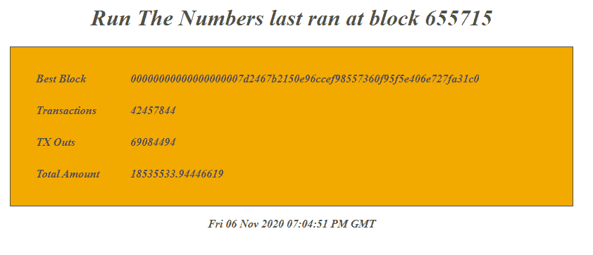

# 该是计算数字的时候了

> 原文：<https://medium.com/coinmonks/its-time-to-run-the-numbers-e741f2a8a3fb?source=collection_archive---------1----------------------->

## 定期自动运行比特币的 gettxoutsetinfo

作者@ vicariousdrama

655466–655718

# 介绍

2020 年 8 月初，有人对独立审计以太坊供应的能力提出了一些严重的问题。相比之下，任何运行节点的人都可以通过调用一行命令**bit coin-CLI gettxoutsetinfo**来审计比特币的供应。

经过推特上的热烈交流， [Nunya Bidness](https://twitter.com/bennd77) 提议，比特币节点运营商和以太坊节点运营商在未来选择一个街区，运行这些数字，并在他们的基础上比较各自的供应量，以确保一致性。为了支持这项工作， [BashCo](https://twitter.com/bashco_) 创建了一个简单的脚本[运行，等待目标块高度，并报告输出。在方框 650，000 处，对比特币和几十个(几百个？)的节点运营商在 twitter 上发布了他们的结果，标签为](https://github.com/BashCo/RunTheNumbers) [#RunTheNumbers](https://twitter.com/search?q=%23RunTheNumbers&src=typed_query) 。

# 增强脚本

这种功能的另一个版本[现在可以使用了，它可以持续运行，并且每隔几个块就会审计一次供应、报告结果。](https://github.com/lucasmoten/runthenumbers)

在高层次上，数据流可以描述如下

(1)比特币一如既往地运行，处理区块、交易、内存池。

(2)与原始脚本一样，runthenumbers 将调用比特币来请求 gettxoutsetinfo。它通过利用比特币 cli 并作为比特币用户运行来实现这一点。

脚本顶部有配置选项，允许设置呼叫频率和睡眠时间。我用于测试的一个激进设置是每 5 个街区运行一次数字。这将导致每 45 分钟到一小时更新一次。

(3)使用从比特币捕获的结果，runthenumbers 服务然后将这些结果保存到指定的文件夹。每次运行时，都会创建三个文件

*   _numbers_latest.txt
*   _numbers_latest.htm
*   _numbers_{block-number}。txt(例如 _numbers_655690.txt)

(4)你，即用户，在你的网络浏览器中访问一个页面以获得最新的结果

(5) Nginx 从文件夹中检索文件并返回给你进行渲染

# 将数字作为服务运行

运行数字的脚本以及 systemd 服务配置在这里[可用](https://github.com/lucasmoten/runthenumbers)。

遵循这一指导可以在像 Stadicus Raspibolt 这样的节点上快速实现这一操作。

我可以在 https://raspberrypi.local:1839/看到最近一次跑步的结果

我还可以通过制定检索特定文件的请求，有选择地检索以前运行的 JSON。例如

【https://raspberrypi.local:1839/the_numbers_655405.txt 号

# 后续步骤

**UI 清理**——正如您在上一节中看到的，我的电脑上没有安装 HTML 渲染输出所引用的字体。这可以通过安装字体或修改以下位置的 runthenumbers 脚本以用其他字体扩充来解决

**以前运行的链接—** 如果有一种简单的方法可以点击“上一个/下一个”来获得可用的结果，或者向用户请求要检索的特定块高度，那么对用户来说会更方便。

不过总的来说，我对目前的结果很满意。

## 另外，阅读

*   最好的[密码交易机器人](/coinmonks/crypto-trading-bot-c2ffce8acb2a)
*   [密码本交易平台](/coinmonks/top-10-crypto-copy-trading-platforms-for-beginners-d0c37c7d698c)
*   最好的[加密税务软件](/coinmonks/best-crypto-tax-tool-for-my-money-72d4b430816b)
*   [最佳加密交易平台](/coinmonks/the-best-crypto-trading-platforms-in-2020-the-definitive-guide-updated-c72f8b874555)
*   最佳[加密借贷平台](/coinmonks/top-5-crypto-lending-platforms-in-2020-that-you-need-to-know-a1b675cec3fa)
*   [最佳区块链分析工具](https://bitquery.io/blog/best-blockchain-analysis-tools-and-software)
*   加密套利指南:新手如何赚钱
*   最佳[加密制图工具](/coinmonks/what-are-the-best-charting-platforms-for-cryptocurrency-trading-85aade584d80)
*   [莱杰 vs 特雷佐](/coinmonks/ledger-vs-trezor-best-hardware-wallet-to-secure-cryptocurrency-22c7a3fd391e)
*   了解比特币的[最佳书籍有哪些？](/coinmonks/what-are-the-best-books-to-learn-bitcoin-409aeb9aff4b)
*   [3 商业评论](/coinmonks/3commas-review-an-excellent-crypto-trading-bot-2020-1313a58bec92)
*   [AAX 交易所评论](/coinmonks/aax-exchange-review-2021-67c5ea09330c) |推荐代码、交易费用、利弊
*   [Deribit 审查](/coinmonks/deribit-review-options-fees-apis-and-testnet-2ca16c4bbdb2) |选项、费用、API 和 Testnet
*   [FTX 密码交易所评论](/coinmonks/ftx-crypto-exchange-review-53664ac1198f)
*   [n 零审核](/coinmonks/ngrave-zero-review-c465cf8307fc)
*   [Bybit 交换审查](/coinmonks/bybit-exchange-review-dbd570019b71)
*   [3Commas vs Cryptohopper](/coinmonks/cryptohopper-vs-3commas-vs-shrimpy-a2c16095b8fe)
*   最好的比特币[硬件钱包](/coinmonks/the-best-cryptocurrency-hardware-wallets-of-2020-e28b1c124069?source=friends_link&sk=324dd9ff8556ab578d71e7ad7658ad7c)
*   最佳 [monero 钱包](https://blog.coincodecap.com/best-monero-wallets)
*   [莱杰 nano s vs x](https://blog.coincodecap.com/ledger-nano-s-vs-x)
*   [bits gap vs 3 commas vs quad ency](https://blog.coincodecap.com/bitsgap-3commas-quadency)
*   [莱杰纳米 S vs 特雷佐 one vs 特雷佐 T vs 莱杰纳米 X](https://blog.coincodecap.com/ledger-nano-s-vs-trezor-one-ledger-nano-x-trezor-t)
*   [block fi vs Celsius](/coinmonks/blockfi-vs-celsius-vs-hodlnaut-8a1cc8c26630)vs Hodlnaut
*   Bitsgap 评论——一个轻松赚钱的加密交易机器人
*   为专业人士设计的加密交易机器人
*   [PrimeXBT 审查](/coinmonks/primexbt-review-88e0815be858) |杠杆交易、费用和交易
*   [埃利帕尔泰坦评论](/coinmonks/ellipal-titan-review-85e9071dd029)
*   [SecuX Stone 评论](https://blog.coincodecap.com/secux-stone-hardware-wallet-review)
*   [BlockFi 评论](/coinmonks/blockfi-review-53096053c097) |赚取高达 8.6%的加密利息