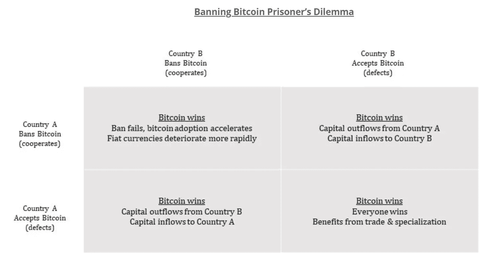

# 现在阻止比特币已经太迟了

> 原文：<https://medium.com/coinmonks/its-too-late-to-stop-bitcoin-2e74cacbaacf?source=collection_archive---------1----------------------->

## 政府可以尝试，但是他们的机会之窗已经被焊接关闭

Bitcoin is an erupting unstoppable volcano. Photo by [Clive Kim](https://www.pexels.com/@clive-kim-2523249?utm_content=attributionCopyText&utm_medium=referral&utm_source=pexels) from [Pexels](https://www.pexels.com/photo/volcano-erupting-at-night-under-starry-sky-4220967/?utm_content=attributionCopyText&utm_medium=referral&utm_source=pexels)

> *“他们先不理你。然后他们嘲笑你。然后他们攻击你，想要烧死你。然后他们为你建造纪念碑。”尼古拉斯·克莱因*

现在，比特币网络的价值超过了 1 万亿美元，世界各地的许多人开始意识到它的主张。[这是在多年来称其为欺诈，将其与郁金香泡沫相提并论，并明确表示“行不通”之后才出现的。这只能说明你不能把任何一个人的话作为自己真理的基础。为了完全理解任何事情，你必须对这个话题深入研究，并消耗所有偏见的来源，以发展你自己的明智的观点。虽然这需要时间和努力，这也是为什么大多数人不这样做，只是鹦鹉学舌单一的“专家”的表面水平的想法，有明显的偏见。](https://www.forbes.com/sites/billybambrough/2020/05/30/jp-morgan-bitcoins-biggest-enemy-suddenly-appears-to-be-going-all-in-on-crypto/?sh=1bb1dd0d23a6)

2020 年是比特币成熟的一年，3 月份的市场崩盘和随后几轮历史性刺激，加上负利率和债券收益率远低于实际通胀水平，导致许多人在传统市场之外寻找替代品。这种动荡是 Microstrategy 的迈克尔·塞勒(Michael Saylor)确定地决定将公司的全部现金储备余额转换为比特币的主要原因。没有人想成为第一个行动者，但 Saylor 将其规范化，以至于其他几家主要公司紧随其后，即 Square，当然还有特斯拉。这也引发了比特币交易所交易基金和其他专业投资工具的兴起，这在几年前是不可能的，尽管有很多尝试。

> 政府很可能(如果不是已经)发现不可能在不伤害自身和经济的情况下禁止比特币

除此之外，从 Fold 到 Moon 到 Blockfi，比特币相关服务的零售量和数量都在大幅增长，不管你喜不喜欢，比特币现在正以越来越快的速度被越来越多的人采用。比特币行业现在价值数万亿美元，不包括比特币市值本身，仅比特币基地就价值近 1000 亿美元。随着这一数字的持续增长，以及参与者的经济影响力的持续增长，西方政府可能会发现，如果不是已经发现，在不伤害自身和经济的情况下，禁止比特币是不可能的。比特币现在太大而不能倒，我们在实践中看到银行也是如此，但由于其全球化和去中心化的网络，它从根本上变得更加强大。

甚至政府调查 CBD 的行为也是我们走向世界进一步比特币化的标志。尽管各国央行希望你相信，他们的数字货币将取代对比特币的需求，但事实上，它们是比特币的广告。中央银行只会被用作完全控制货币的工具，这是国际清算银行行长毫不含糊地告诉你的。

Agustín Carstens, General Manager of the Bank for International Settlements

这并不是说政府不会试图禁止比特币，[这并不是什么新鲜事](https://www.buybitcoinworldwide.com/bitcoin-bans/)而且在实践中，它对阻碍网络几乎没有什么作用，事实上它所做的只是进一步向那些公民宣传他们为什么需要比特币。正如 Nic Carter 所说的“*国家不禁止比特币。他们只禁止自己进入比特币网络*”。当政府像尼日利亚、印度或巴基斯坦那样禁止比特币时，我们看到的是 [P2P 交易迅速增加](https://www.inbitcoinwetrust.net/governments-can-ban-bitcoin-but-that-wont-stop-its-adoption-by-the-people-2abb4c82e454)，节点数量增加，大笔资金、初创公司和企业转移到海外，这个国家被落在了世界其他国家的后面。类似于没有提供价值的过高税率如何鼓励所有人，除了那些没有能力这样做的人，将他们的资金和企业转移到更有利的地方。

> 他们甚至不能有效地关闭一个中央索引网站，更不用说它背后的 BitTorrent P2P 网络了

比特币并不是第一个受到政府攻击的 P2P 网络，BitTorrent 文件共享网络从一开始就是政府的目标。虽然共享文件不能有效地成为非法，但共享版权材料却是政府无法阻止的。Jason Deane 通过引用难以捉摸的种子索引网站海盗湾，以及尽管被世界各国政府盯上，它如何运作至今，提出了这一点。这使得政府成功控制比特币的可能性更小，因为他们甚至无法有效地关闭一个中央索引网站，更不用说背后的 BitTorrent P2P 网络了。

当然，政府可以通过迫使所有银行遵守严苛的法律，在银行层面禁止比特币，但他们不能在个人层面禁止比特币，因为它基本上是一个点对点的网络。他们可以禁止互联网本身或关闭电网，但话说回来，他们的整个经济直接进入了黑暗时代，比特币也可以作为最后的手段通过卫星或无线电使用，节点可以由小型便携式太阳能电池板供电。他们可以屏蔽某些 IP 地址或互联网服务，但正如我们看到的，中国的防火墙无法阻止人们通过简单的 VPN 或代理访问谷歌、脸书或比特币交易所。

> 如果主要国家决定协调他们的禁令，将会有其他人看到工业在他们自己的经济中繁荣的机会

让世界各国政府一致同意禁止比特币是不可能的，因为历史上他们从未能够就任何事情达成一致，以最近十年的气候协议为例。如果主要国家决定协调他们的禁令，将会有其他人看到工业在他们自己的经济中繁荣的机会。历史一次又一次地告诉我们，不可能禁止一群人天生认为是好的或有价值的东西，不管大多数人是否这样认为。我们也看到，当政府试图完全控制他们的公民时，他们迟早会以惊人的方式失败。《被解放的资本》的帕克·刘易斯写了一篇关于为什么不能禁止比特币的精彩文章，他在文章中用囚徒困境分析了禁止比特币的可能后果。本质上，比特币不可能因为政府的禁令而亏损。

[Bitcoin Cannot be Banned. P. Lewis.](https://unchained-capital.com/blog/bitcoin-cannot-be-banned/)

政府在比特币问题上取得成功的唯一有争议的方法是提供一个更好、更自由、更开放的体系，其货币供应不会稀释到零，从而导致贫富差距和贫困加剧。这不太可能，因为央行已经把自己陷入了一个深坑，如果不进行大规模去杠杆化，他们就无法走出这个坑，而大规模去杠杆化是他们根本不会考虑的事情。因此，相反，他们加倍推出更多刺激措施、负利率、更多债券和证券购买，向银行注入更多资本，试图刺激借贷，从而刺激一切事物的支出和消费，以维持虚假经济。**比特币是这场作弊游戏的出路。**

政府成功禁止比特币的时代已经一去不复返了，也许他们唯一可能成功的时候是在早期，当时只有少数密码朋克在他们的个人电脑上进行挖掘，或者丝绸之路和代理比特币首次引起联邦调查局的注意。当时的节点数量、散列值、容量和行业规模都只是其当前规模的一小部分，即使是小政府也很容易控制。现在，比特币消耗的能源比几个国家都多，并且拥有价值数万亿美元、拥有数百万用户的蓬勃发展的全球产业，这扇窗户已经完全关闭了。

如果你喜欢这个，请关注我的 [**Medium**](https://lukabankovic.medium.com/) 和 [**Twitter**](https://twitter.com/bitcoinluka) 以获取更多比特币和技术信息。

> 加入 Coinmonks [Telegram group](https://t.me/joinchat/EPmjKpNYwRMsBI4p) 并了解加密交易和投资

## 另外，阅读

*   [什么是融资融券交易](https://blog.coincodecap.com/margin-trading)
*   最好的[密码交易机器人](/coinmonks/crypto-trading-bot-c2ffce8acb2a) | [网格交易](https://blog.coincodecap.com/grid-trading)
*   [3 商业评论](/coinmonks/3commas-review-an-excellent-crypto-trading-bot-2020-1313a58bec92) | [Pionex 评论](/coinmonks/pionex-review-exchange-with-crypto-trading-bot-1e459d0191ea) | [Coinrule 评论](/coinmonks/coinrule-review-2021-a-beginner-friendly-crypto-trading-bot-daf0504848ba)
*   [AAX 交易所评论](/coinmonks/aax-exchange-review-2021-67c5ea09330c) | [德里比特评论](/coinmonks/deribit-review-options-fees-apis-and-testnet-2ca16c4bbdb2) | [FTX 交易所评论](/coinmonks/ftx-crypto-exchange-review-53664ac1198f)
*   [n 零复习](/coinmonks/ngrave-zero-review-c465cf8307fc) | [Phemex 复习](/coinmonks/phemex-review-4cfba0b49e28) | [PrimeXBT 复习](/coinmonks/primexbt-review-88e0815be858)
*   [Bybit Exchange 审查](/coinmonks/bybit-exchange-review-dbd570019b71) | [Bityard 审查](/coinmonks/bityard-review-7d104239be35) | [CoinSpot 审查](https://blog.coincodecap.com/coinspot-review)
*   [3 commas vs Cryptohopper](/coinmonks/3commas-vs-pionex-vs-cryptohopper-best-crypto-bot-6a98d2baa203)|[赚取加密利息](/coinmonks/earn-crypto-interest-b10b810fdda3)
*   最好的比特币[硬件钱包](/coinmonks/the-best-cryptocurrency-hardware-wallets-of-2020-e28b1c124069?source=friends_link&sk=324dd9ff8556ab578d71e7ad7658ad7c) | [BitBox02 回顾](/coinmonks/bitbox02-review-your-swiss-bitcoin-hardware-wallet-c36c88fff29)
*   [总账 vs n 平均](/coinmonks/ledger-vs-ngrave-zero-7e40f0c1d694) | [总账 nano s vs x](/coinmonks/ledger-nano-s-vs-x-battery-hardware-price-storage-59a6663fe3b0)
*   [密码本交易平台](/coinmonks/top-10-crypto-copy-trading-platforms-for-beginners-d0c37c7d698c)
*   [CoinLoan 审查](/coinmonks/coinloan-review-18128b9badc4) | [YouHodler 审查](/coinmonks/youhodler-4-easy-ways-to-make-money-98969b9689f2) | [BlockFi 审查](/coinmonks/blockfi-review-53096053c097)
*   最好的[加密税务软件](/coinmonks/best-crypto-tax-tool-for-my-money-72d4b430816b) | [硬币追踪评论](/coinmonks/cointracking-review-a-reliable-cryptocurrency-tax-software-5114e3eb5737)
*   最佳[加密借贷平台](/coinmonks/top-5-crypto-lending-platforms-in-2020-that-you-need-to-know-a1b675cec3fa) | [杠杆代币](/coinmonks/leveraged-token-3f5257808b22)
*   [block fi vs Celsius](/coinmonks/blockfi-vs-celsius-vs-hodlnaut-8a1cc8c26630)|[Hodlnaut Review](/coinmonks/hodlnaut-review-best-way-to-hodl-is-to-earn-interest-on-your-bitcoin-6658a8c19edf)
*   [Bitsgap 审查](/coinmonks/bitsgap-review-a-crypto-trading-bot-that-makes-easy-money-a5d88a336df2) | [Quadency 审查](/coinmonks/quadency-review-a-crypto-trading-automation-platform-3068eaa374e1) | [Bitbns 审查](/coinmonks/bitbns-review-38256a07e161)
*   [埃利帕尔泰坦评论](/coinmonks/ellipal-titan-review-85e9071dd029) | [赛克斯斯通评论](/coinmonks/secux-stone-hardware-wallet-review-15-discount-coupon-2020-7577032faa6e)
*   [本地比特币审核](/coinmonks/localbitcoins-review-6cc001c6ed56) | [加密货币储蓄账户](https://blog.coincodecap.com/cryptocurrency-savings-accounts)
*   最佳[区块链分析](https://bitquery.io/blog/best-blockchain-analysis-tools-and-software)工具| [赚比特币](/coinmonks/earn-bitcoin-6e8bd3c592d9)
*   [加密套利](/coinmonks/crypto-arbitrage-guide-how-to-make-money-as-a-beginner-62bfe5c868f6)指南| [如何做空比特币](/coinmonks/how-to-short-bitcoin-568a2d0b4ae5)
*   最佳[加密制图工具](/coinmonks/what-are-the-best-charting-platforms-for-cryptocurrency-trading-85aade584d80) | [最佳加密交易所](/coinmonks/crypto-exchange-dd2f9d6f3769)
*   [如何在印度购买比特币？](/coinmonks/buy-bitcoin-in-india-feb50ddfef94) | [瓦济克斯审查](/coinmonks/wazirx-review-5c811b074f5b)
*   [印度比特币交易所](/coinmonks/bitcoin-exchange-in-india-7f1fe79715c9) | [比特币储蓄账户](/coinmonks/bitcoin-savings-account-e65b13f92451)
*   [CoinDCX 评论](/coinmonks/coindcx-review-8444db3621a2) | [加密保证金交易交易所](https://blog.coincodecap.com/crypto-margin-trading-exchanges)

> [直接在您的收件箱中获得最佳软件交易](/coinmonks/newsletters/coinmonks)

