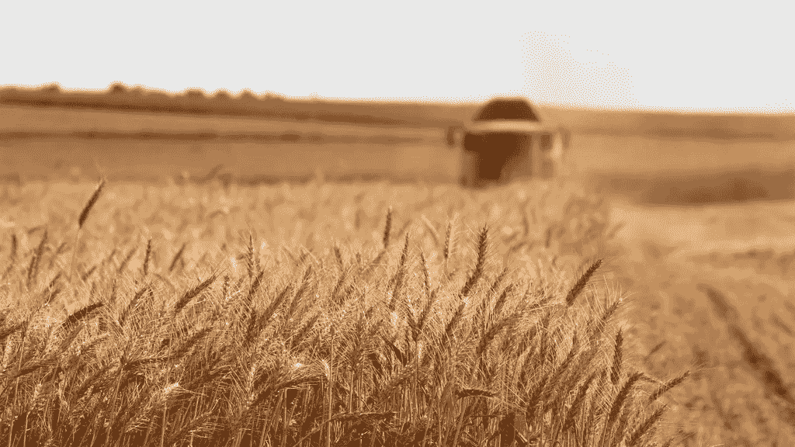

# 在过去的两周里，我在分散融资农业产量上损失了 5000 美元。这是我的故事。

> 原文：<https://medium.com/coinmonks/ive-lost-5000-over-the-last-two-weeks-in-decentralized-finance-farming-yield-here-s-my-story-346bc3b79c8a?source=collection_archive---------0----------------------->

Decentralized finance has just redefined “farming”

在过去的几个月里，去中心化金融一直是一个大肆宣传的话题，两周前，在我朋友的一再催促下，我终于决定尝试一下。这是我在高产农业上损失了大约 5000 美元后学到的东西。

# 高产农业