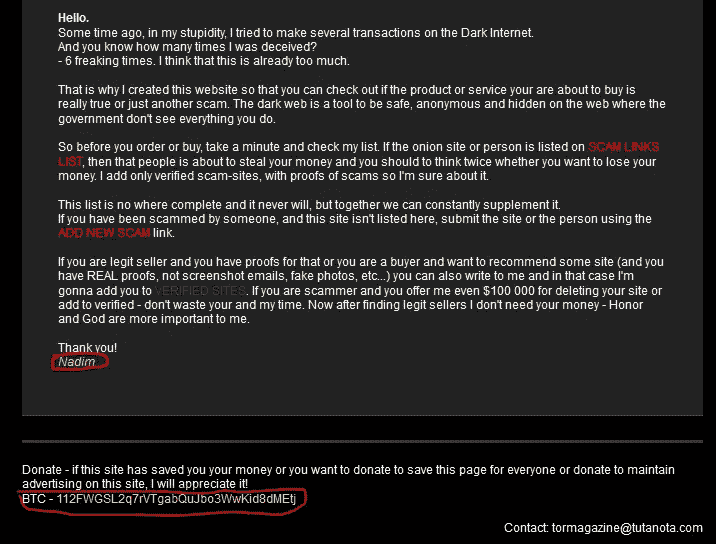

# 万金油——骗子的故事

> 原文：<https://medium.com/coinmonks/jack-of-all-trades-tale-of-a-scammer-uncovering-a-stealthy-network-of-scam-markets-on-dark-web-3aff94671ab0?source=collection_archive---------3----------------------->

## 在暗网和深网上发现一个隐秘的诈骗市场网络

这篇文章揭露了黑暗网络中最受欢迎的骗子之一**,他通过在黑暗网络上建立有利可图、前景广阔的网站，向黑暗网络的网民提供各种攻击性服务**。骗子**总是使用视觉欺骗技术**来诱骗访问者访问网站，最终促使他们为“**宣传的**的恶意服务付费。因此，对于欺诈者来说，这是最不具攻击性的加密方法，因为骗子不直接针对任何人，而是利用公众的弱点让弱者上当。

**结果，这个骗子/集团在 8 个月的时间内收集了₹2.5cr(34.4 万美元)！**

**Scammers keep an Eye on various fields to defraud (Hellequin by Genzoman | Image Source: DeviantArt)**

在黑网上冲浪时，我们经常会遇到各种攻击性服务，如**黑客服务(HaaS)、恶意软件商店、DDoS 攻击面板租赁、数据库交易、毒品市场、勒索软件联盟、儿童色情流**等。尽管很少有真正的(攻击性的)服务运行在黑暗的网络上，但用一双新鲜的眼睛很难跟踪欺诈性的服务。

一个如此吸引人的服务激起了我滑下兔子洞的兴趣，这个兔子洞在黑暗的网络上打开了许多所谓的服务之门。

**亨廷顿银行——出售银行日志**

> 在地下市场出售银行凭证(日志)是日常活动之一。一家历史悠久的信用卡市场 **Joker's Stash** 宣布将于 2020 年 2 月 15 日停止使用区块链 DNS 网站。bazar 站点)和 Tor 网络由于欧洲刑警组织的多次干预而被关闭，因此在被逮捕前准备安全逃脱。

该服务提供各种银行登录凭证，如**花旗、大通、巴克莱、加拿大皇家银行、PNC** 等，价格适中，余额较高。但是这个服务绝对是欺诈性的骗局，在接下来的互动中会暴露出来。

在继续购买列表中的任何东西时，您将看到欺诈者的比特币地址。

**Payment Page**

现在，我们来盘点一下这个地址的区块链活动。在绘制地址图时，发现欺诈者在 7 个月的时间内毫不费力地从暗网访问者那里勒索了 12，000 多美元。

**Wallet Info**

> **注意**:交易中发现的 IP 地址与诈骗者无关。它是一个传递交易的比特币节点，因此不能归因于此人。

**在分析了金额(因为 12K 美元不是一个小数目)后，可以认为，由于该网站并不太受欢迎，因此整个金额并不是通过一次“银行日志”诈骗活动勒索来的。可能还有更多。**

所以，我们可以把这个**比特币地址作为一个锚点**，在黑暗网络上展开这个连锁骗局系列的其余部分。

**泰陵比特币地址**

通过映射**112 fwgsl 2 q 7 rvtgabqujbo 3 ww kid 8d metj**地址，搜索结果并没有返回太多有价值的信息。检查各种黑名单服务或阻止列表，了解到**地址尚未被任何人(ATTOW)报告**，因此增加了欺诈者在黑暗网络上通过更多广告骗局服务勒索金钱的机会。

**Wallet Network Activity**

通过深入挖掘，发现第一个受害者的交易于 2020 年 7 月 21 日进入欺诈者的区块链，最近一次交易是在 2021 年 2 月 7 日进行的，这凸显了行为人每天都在不断获得更多牵引力的事实。

**当比特币的地址被输入到搜索页面时，这一系列的诈骗活动才开始展开:**

**List of Fraudulent Services listed via BTC Address Query**

**深入兔子洞——追踪比特币动向**

以下是与我们的基本地址直接关联的各种比特币地址(仅限频繁节点)的详细分类

**Bitcoin Transaction Chain**

**注:为了不显得笨拙，每个比特币地址都以 3-4 个字母开头。**

> 总共找到 13 个比特币地址，直接链接到"**亨廷顿银行日志**"骗子比特币*地址:112 fwgsl 2 q 7 rvtgabqujbo 3 ww kid 8d metj*

他们是

> 112 fwgsl 2 q 7 rvtgabqujbo 3 ww kid 8d metj:$ 15187.08(热钱包)
> **3p2g qmykdfckryrl 9 eakkgaknyybpwj:$ 60463.11(私冷)**
> **3c FDE 4 F5 u 1 hm 3 ytitovcsglmgjst 1 vwwjk:$ 1122288.36****(私冷)【T24**

***注*** *:需要注意的是，上面列出的地址只是基地址的常用联系人列表中的地址。一些是***(钱存放的地方)，而另一些是* ***热钱包*** *(钱像交换一样在钱包间转移)。突出显示(粗体)的地址是冷钱包地址。**

****注 2*** *:同样有趣的是，有 2 个地址收到了来自* ***币安热钱包 1 ndyjtntjmwk 5 pnhjgamu 4 hdhigtobu 1s****官方地址的来电交易。这两个地址是:-**

> *1 kvvcbvcrc 9 vfbj 2 pvan 2 yq 83 swcquraz
> 1 h8 dygdqck 6 ECN 97 qdwgft 8 nem w4 nnm x6e*

****注 3*** *:可以认定骗子曾直接关联币安进行过任何退货交易的任何交易手段，目前尚不清楚。**

*同一个骗子使用的另一个钱包地址是:**1 qatskw 4 lgvjhfb 5 upzwiyvlkp 9 zdpckir**，它在 1 个月内收获了 800+美元，这将在即将到来的案例研究中揭开。*

> *在 8 个月内，从这些商店中收集的总金额为 344，000 多美元。也就是 8 个月后的₹2.5Cr！*

***深挖——分析“欺诈性”诈骗服务***

*在输入单个比特币地址时，发现该行为人与暗网市场上各种各样的骗局有关联。其中一些是*

> *ECash 出售:[satangroup@tutanota.com](mailto:satangroup@tutanota.com)
> 专业黑客团队:[satangroup@tutanota.com](mailto:satangroup@tutanota.com)
> BitStore-出售小工具:[bitcoinking @ tuta . io](mailto:bitcoinking@tuta.io)
> BTC 购买:[Hackedbtcwlalets @ pm . me](mailto:Hackedbtcwlalets@pm.me)
> 获利货币市场:[legitseller 2020 @ proton mail . ch](mailto:legitseller2020@protonmail.ch)
> 预付卡:[authentic 21 @ tuta . io](mailto:authentic21@tuta.io)
> 万事达卡 VISA:
> 吴，CC:[authentic 21 @ tuta . io](mailto:authentic21@tuta.io)
> Whatsapp Hack:
> 脸书 Hack:[【satangroup@protonmail.com](mailto:satangroup@protonmail.com)
> 最佳市场—亚马逊登录:[black Market 21 @ tuta . io](mailto:blackmarket21@tuta.io)
> 黑客专区:
> MatchFix:
> 比特币挖矿:[smarthacker2012@protonmail.com](mailto:smarthacker2012@protonmail.com)
> 接受捐赠
> 比特币钱包破坏者——黑掉任何一个 BTC 钱包
> 商店卡——卖卡
> BuyPrivKey——购买被黑掉的加密钱包
> 智能币——BTC 翻倍
> 钱包 Get——被黑掉的 BTC 钱包——[bitcoinging @ tuta . io](mailto:bitcoinking@tuta.io)
> 雇佣网络黑客——服务——[satangroup@tutanota.com](mailto:satangroup@tutanota.com)
> 银行黑客软件——[satangroup@tutanota.com](mailto:satangroup@tutanota.com)
> 幽灵黑客———
> DXELITE 市场—[legit seller 2020 @ proton mail . ch](mailto:legitseller2020@protonmail.ch)
> Kuganzo 店铺—[authentic 21 @ tuta . io](mailto:authentic21@tuta.io)
> Grove Drugs—[authentic 21 @ tuta . io](mailto:authentic21@tuta.io)
> 西联—[authentic 21 @ tuta . io](mailto:authentic21@tuta.io)
> 论坛验证卖家—[authentic 21 @ tuta . io【T99](mailto:authentic21@tuta.io)*

***注:如果想查看洋葱列表，可以参考** [**这里**](https://paste.ee/p/5RWIA) **。***

**

***Card Shop by Scammer: 2xgjz4warswhkhjx.onion/cards.html***

*现在发现行为人是**用 11 个邮箱 id**维护 40+个不同用途的活跃洋葱站点(可能不止这个)，为个人/群体在暗网上获取暴利开辟了大量收入流。*

*同样值得注意的是，演员还通过电报渠道提供支持，即*

> *ATN 4 ever
> tor verified
> Rio verified*

***披着羊皮的狼——接受公益捐赠***

*值得注意的是，该演员还主持了类似于**洋葱名单**、**骗局名单**和**慈善计划**的公益网站，宣传**同一个比特币地址**，以捐赠的形式收取款项。*

**

***“Scam” List setup by Scammer:** [**rzlezauifnvacale.onion/index.html**](http://rzlezauifnvacale.onion/index.html)*

*上面列出的网站是专门用于举报暗网上诈骗网站的**。当然，他的网站没有一个出现在这个列表中。从网站上，我们可以假设这个人的名字是 NADIM(可能是假名，也可能是真名)。***

*在黑暗网络的慈善平台上，这位演员已经建立了一个名为 [BuiltWithBitcoin](https://builtwithbitcoin.org/#about) 的钓鱼网站，这是由 Paxful 领导的**全球慈善计划倡议**，旨在支持使用比特币的非洲学校，以吸引黑暗网络访问者。*

**

***Phishing Site: sdkrnt5yo3whmltw.onion***

***诈骗顾问**是 Trip Advisor 的衍生产品，具有相似的字体和徽标，由同一诈骗者使用。*

**

***Another Site running by same Scammer: l5jcgrava4h2joxfcnyas7qvkqjdzeywnsqntrmwqpfq7u4rz2iwjzyd.onion***

**

***Offered Service by Scam Advisor***

*但列出的比特币地址有区别:**1 qatskw 4 lgvjhfb 5 upzwiyvlkp 9 zdpckir**。那我们怎么找到这两者之间的联系呢？*

*在这里…*

*注册的电子邮件地址是:[dwverified@protonmail.com](mailto:dwverified@protonmail.com)(已经存在于我们的地址库谁运行[万事达卡](http://mlkobvuan2duh37r.onion)骗局揭露旧 BTC 地址**112 fwgsl 2 q 7 rvtgabqujbo 3 ww kid 8d metj**)。因此，清楚地表明两个 BTC 地址属于同一个人/团体。*

**

***深度网络市场:揭露表面网络商店***

*由于我们已经在暗网上看到了许多由同一个骗子(亨廷顿银行日志)运行的洋葱诈骗网站，让我们来了解一下深网活动。*

*在调查过程中，发现骗子在 surface web 上经营各种 surface web 商店。让我们深入了解细节:-*

## *案例 1: Toring.store*

*该网站在电子邮件 dorking 的帮助下被发现: [bitcoinking@tuta.io](mailto:bitcoinking@tuta.io) (已经在我们的观察名单中)。*

**

***Homepage of Toring.store***

*该网站自 2020 年 11 月以来一直活跃。通过检查托管提供商数据，发现以下数据:-*

**

*正如我们现在所知的 IP 地址，通过反向 IP 搜索，发现了 15 个托管在 62.182.86.39**的域名，这些域名被映射到**乌克兰。**他们是:-***

**

***Associated Sites***

*值得注意的是， **DarkWebFixedMatches** 也在之前出现在我们的观察名单中，因此可以假设同一个骗子/团体正在使用不同的比特币地址为列出的网站提供支持。[ **我们不会跟踪每个列出的网站，因为这些网站的工作方式是相同的，只是地址不同** ]*

> ***注** :-值得注意的是，流行的黑暗网络论坛，即“**darkwebforums”**和**“alten en**”也是由追踪到**62.182.86.39 的同一个骗子/团体备份的。**一个月前，在揭露这个大骗局之前，我也发了一条同样的推文。*

**

## *案例二:真钱网*

*这个网站是在电子邮件 dorking 的帮助下被发现的: [blackmarket21@tuta.io](mailto:blackmarket21@tuta.io) (已经在我们的观察名单中)。此外，同样的情况也出现在上述域名列表中。*

**

***Homepage of Truemoney.store***

*该网站自 2020 年 12 月以来一直活跃。*

**

***Domain Details***

*上面讨论的两个案例是直接从我们的监视列表中骗子的给定电子邮件地址获得的。目前我们不会深入研究其他网站。*

*从上面列出的表面域名，我们知道骗子感兴趣的是“**”。主要存储**顶级域名。*

***骗子的心态***

*在剖析任何骗局之前，了解骗子的心理很重要。没有一个骗子会在一次活动中停止他们的业务，因此一系列的骗局会接踵而至。为了锁定更多的受众，欺诈者会选择不同的兴趣/主题。毫无疑问，**比特币翻倍、比特币赠品、刷卡**和**黑客服务**名列榜首，因为这些是电脑知识有限的暗网访问者的最爱。在仔细研究此类服务的可能性之前，大多数访问者都被“**骗局**”登录页面的视觉吸引力所吸引。因为，**视觉表现为最终落入骗局的观众提供了一种真实感**。*

*从这个详细的调查中可以清楚地看出:尽管在暗网和明网上都有许多由骗子开设的商店，但被骗的钱最终会被引导到核心钱包地址(前面提到的冷钱包地址)。同样值得注意的是，骗子**最近注册了更多的新网站**，以便在不沉溺于任何严重犯罪的情况下获取最大利润，从而使其成为长期隐形犯罪网络之一。*

***外卖店***

> *网络罪犯可以大规模建立这样的**诈骗网站**，以筹集大量资金，而不会直接感染任何人勒索软件/其他恶意交付物。*
> 
> *如果一个**比特币地址**(在诈骗网站上找到)**有大量交易日志**(在区块链中查看)，那么骗子已经在暗网上设置了很多类似的服务。*
> 
> *对于网络罪犯来说，这也是一种被动收入形式，或者是一种长期投资政策，而不会引发危险信号。*
> 
> *犯罪分子使用**他们自己的替代商店/店铺/服务作为访问者网站上的广告**来为这些并行托管服务带来更多流量。*
> 
> *包括过去的银行黑客事件，在骗子的带领下，引诱像[这样没有经验的用户，](https://yyw2jm6pbjccanmr.onion.pet/blank-atm-hack/index.html)这样会提示访问者。*
> 
> ***谷歌并不总是寻找比特币地址的最好朋友**，可以依靠**洋葱搜索引擎**(如果你不使用任何工具的话)。*
> 
> *查看各种平台上列出的比特币地址黑名单活动，如**bitcoinwhowwho**或**比特币滥用。***
> 
> *做一个负责任的**信息安全贡献者，向上述平台标记恶意比特币地址**。*

***= = = = = = = = = = = = = = = = = = = = = = = = = = = = = = = = = = = = = = = =***

*如果你喜欢这篇文章，你可能也会喜欢这篇文章！只是，试一试:-)*

> *在 Twitter[上关注我](https://twitter.com/RakeshKrish12/)以获得有趣的 DarkWeb/InfoSec 简短发现！；-)*
> 
> ***注:- *本文纯属个人研究，未经作者同意，不得在任何地方使用/发表。****