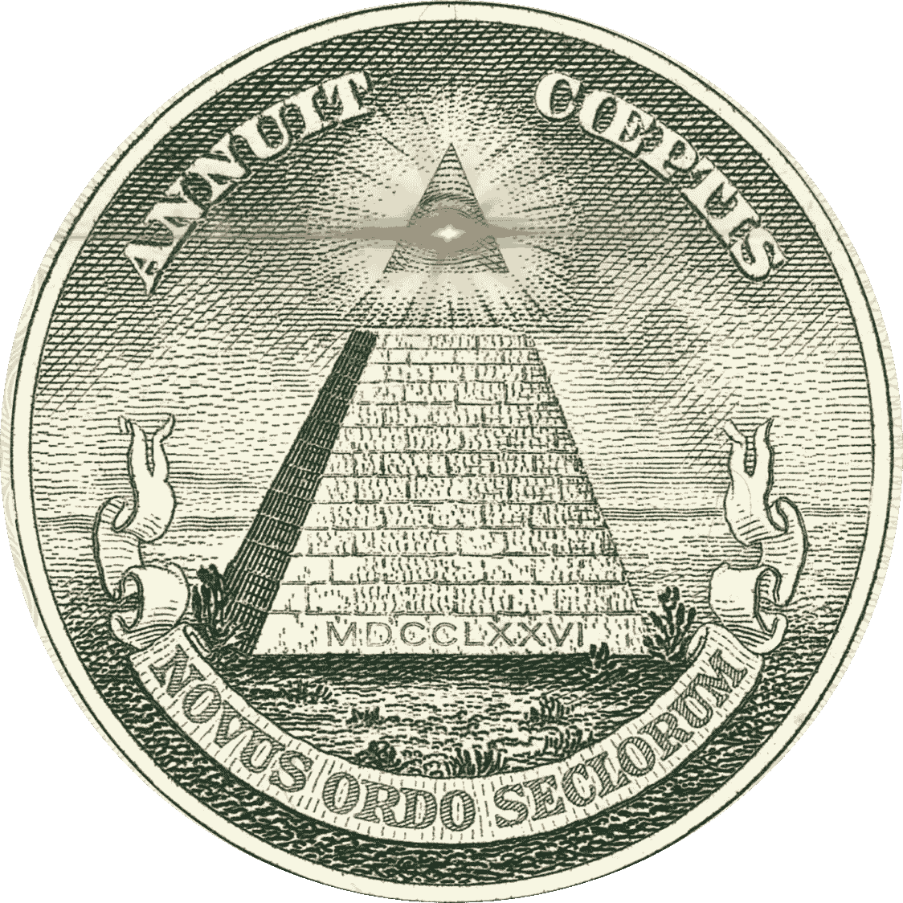
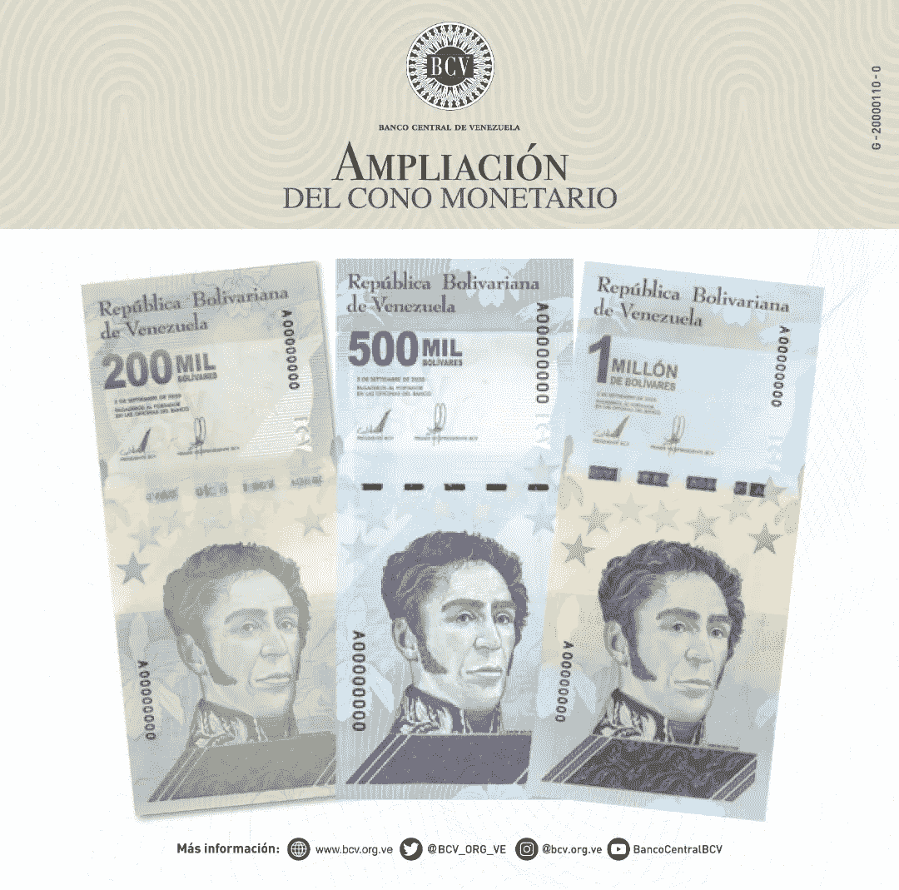
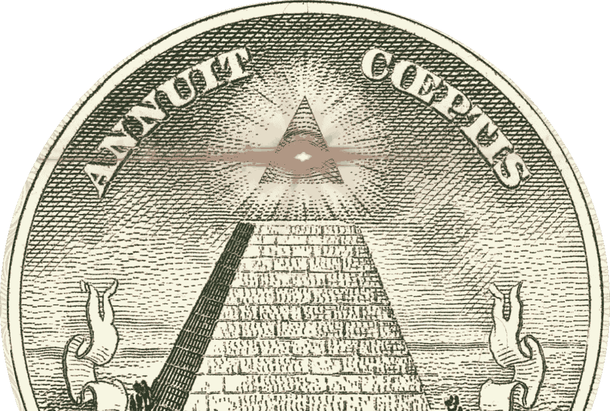

# 乔丹·彼得森和比特币

> 原文：<https://medium.com/coinmonks/jordan-peterson-and-bitcoin-df818fd153b5?source=collection_archive---------2----------------------->

## 比特币的宗教本质与乔丹·彼得森的兴趣

**ANNUIT COEPTIS NOVUS ORDO SECLORUM** ([Providence] favors our undertaking, new order of the ages)

在最近几集的莱克斯·弗里德曼播客中，莱克斯对比特币的讨论几乎同时指向了乔丹·彼得森。当然，人们可以简单地假设这些参考资料是关于莱克斯的，他的目标是和这位受人爱戴/鄙视的教授坐下来谈谈(他很乐意这样做)。但是，与此同时，你会感觉到这种联系有更多的东西，一些更深的东西，超越了表面的东西。或许比特币与彼得森博士的配对(在这几集和其他网络话语中)表明，彼得森对现实的宗教概念化反映了比特币的本质。由于彼得森单枪匹马地让神话和宗教的原型理想在智力上变得流行(至少比 100 年来的任何人都受欢迎)，也许在聪的思想中也存在着合理的虔诚成分。如果比特币具有宗教性质，那么彼得森的名字与比特币联系在一起也是理所当然的。因此，我在这里的目的是检验比特币本身的*准*——宗教性质(而不是比特币铁杆粉丝中现存的宗教原教旨主义)。为什么像乔丹·彼得森(Jordan Peterson)这样的人——也就是那些把目标指向尽可能高的价值的人——会觉得比特币很有吸引力？我的理由如下。

(*与普遍看法相反，本文并非由中本聪或彼得森博士赞助，也不构成财务建议)

## 信仰，宇宙的发动机

> "信是所盼望之事的实体，是未见之事的证据."希伯来书 11:1

信念是一个动词，不是一种感觉。信念是行动——朝着你相信是真实的事情努力——或者，在某些情况下，你*将*使之真实/真实的事情(这将是对你自己的信念)。信仰是所有人类创造、行动和努力的根本驱动力。凭着信心，米开朗基罗在大理石板上找到了他的大卫；通过信仰，企业家提出他或她的想法，从风险资本家那里获得资金(我们尊敬企业家的一个原因是因为他们的信仰是为了生产“好”的东西)；凭着信心，风险资本家为企业家提供资金；凭着信心，我可以带一张本杰明·富兰克林的彩色照片去麦当劳，用它换大约 26 个巨无霸。

信念也是所有科学努力的基本原则:假设是凭信念行动的理由(真实但尚未看到/知道的东西)。一旦付诸行动，假设反过来可以成为理论，其中一个人大约发现/创造(取决于你的哲学倾向)知识。任何科学的努力，不管在我们对现实的概念化中多么有用，都很少成为法律——也就是知识。甚至爱因斯坦的相对论(格外有用，不要误会)仍然是一种理论，或者说，是数学信仰。因此，我们四处奔波，在许多事情上(也许是所有事情上)凭着信心行事。我们开车是基于这样的信念:正时皮带不会突然断裂，活塞上了油，轮胎也能支撑住。我们通过每 60 公里换一次轮胎，或者换一次机油，或者检查一次同步带来获得近似的知识，但是我们仍然满怀信心地驾驶*——你永远不知道命运何时会召唤自己。*

货币交换也是一种信仰行为。凭着信念，我带着 100 美元去麦当劳，他们给了我 26 个巨无霸。我的信念(在这种情况下接近知识)是，他们会接受我漂亮的纸，或者更好的是，我的手机上的数字“100”神奇地被我的脸解锁；他们的信念在于美国保持全球主导地位，而不是过度印刷进入恶性通货膨胀或招致不稳定的无法支付的债务，维护国内地缘政治和平等。所有的货币交易都是如此:Facebook Marketplace、Venmo、在加油站使用 Visa 等等。我们真诚地使用这些工具，期望它们有用/被接受为足够的抵押品。因此，信仰是人类可用的最强大的工具，并且从根本上与货币(储值)密不可分。因此，不可否认的是，认识到你的信仰到底在哪里变得非常重要。正如信仰是所有现代货币交易的基础一样，比特币的本质也是如此。

2021 年 1 月，乔·维森塔尔(Joe Weisenthal)写道，比特币(第[篇文章](https://www.bloomberg.com/news/articles/2021-01-21/bitcoin-is-a-faith-based-asset-joe-weisenthal)至少读起来很有趣)是你*不得不*从信仰的角度考虑的东西——好像这是比特币与其他货币价值形式的独特区别。但现实是，我们必须从信仰的角度思考所有形式的金钱——我们认为这是理所当然的(见下图)。没错，比特币确实有相当虔诚的追随者，但比特币基于信仰的本质并不是独一无二的。*一切*金钱就是信仰。所有的交易都是信仰。事实上，如果交易不是基于信念，你会进监狱。是的，有人会说“至少公司赚了钱，生产了产品。”没错。但这种东西是基于这样一种信念生产出来的，即所说的钱在 10 年、20 年、30 年、50 年后仍然有价值。我再说一遍，所有的钱都是信仰。因此，人们必须将他们的货币信仰放在价值最高的系统中——至少乔丹·彼得森可能会这么说——放在最不可能腐败或在尽可能长的时间内解体的系统中。

(Current state of the Venezuelan Bolivar, 200k, 500k, 1 million)

这就是为什么金甲虫和比特币如此频繁地押韵、和谐和单一化。两大阵营都将货币的内在本质理解为基于信仰的交换:一个阵营专注于经得起数千年时间考验的资产(对这种资产的信任要容易得多，也就是规避风险)，另一个阵营则相信未来的数字化(高得多的风险，高得多的回报)。但两者都声称可靠的稀缺资产是足够多的人普遍想要的，以使它们有用。

从这个意义上说，乔丹·彼得森可能会发现比特币的吸引力，仅仅是因为它作为最公开的基于信仰的资产的价值——或者说，在所有其他货币系统中，比特币讲述了最好、最诚实的故事。比特币包含了最高的道德价值，至少在叙事方面是如此，因此它将自己置于所有货币交换的顶端——可验证的稀缺性、无限可分性，以及几乎所有人都能普遍获得，无论其社会地位、公民身份或在世界上的全球地位如何。因此，比特币变成了“希望之物的实体”，根植于忠诚的霍德勒的力量。

## 比特币中的宗教符号象征

现在让我们考虑一下比特币与宗教相关的更多符号特征。比特币协议规定，到 2140 年，所有比特币开采将最终完成，给世界留下总共 2100 万枚比特币。但为什么是 2100 万？

想想斐波那契数列，或者黄金比例， *proportio divina，*强调神性。数字 21 在从数字 1 开始的序列中占第七位:1，2，3，5，8，13，21。21 同样可以被 3 分成 7 部分——3 反映了三位一体的数字，7 是圣经中完美的数字，或者更确切地说，是完成的数字:“在*第七*天，上帝结束了他的工作”(创世纪 2:2)；那时，彼得进前来，对耶稣说，主阿，我弟兄得罪我，我当饶恕他几次呢。直到*七*次？”(这里彼得提出了一个完整的数字)“耶稣对他说，我不是对你说，直到*七*次，而是，直到*七十个七*”(《马太福音》18:21-22)。

除了数量上完美的数字符号，比特币也诞生于混沌之中。从 2009 年开始，该协议在全球流传，以应对 2008 年的次贷危机和对央行的普遍不信任。像圣经中创造的地球一样，比特币“没有形式，也是无效的；黑暗笼罩着深渊的表面”(创世纪 1:2)，直到神话般的、神化的中本聪宣布数字之光进入互联网。在大衰退的混乱中，比特币建立了最卑微的秩序，一种新秩序， *novus ordo seclorum —* 你可能会在乔丹·彼得森的 youtube 视频中听到类似的东西。

在他的新书中，彼得森写道“在创世纪对创造的解释中有一个深刻的伦理主张:在创造行为中从可能性领域出现的一切(可以说，无论是神还是人)都是好的，只要其创造的动机是好的。我不相信在所有的哲学或神学中有比这更大胆的论点:相信这一点，并付诸行动，是信仰的基本行为”(260)。没有人，即使是彼得·希夫叔叔也不会说比特币是由罪恶而生的。从金钱上来说，比特币的精神是“权力属于人民”，“成为你自己的银行”，“拥抱自由”，等等。犹太-基督教的基本价值观——西方社会的支柱乔丹·彼得森为拯救而牺牲。因此在这个意义上，比特币呼应了圣经中的“温顺的人是有福的，因为他们将继承地球”(马太福音 5:5)，因为穷人中最贫穷的人(如果你愿意，可以称为“最贫穷的人”)可以使用比特币，并有可能增加他们的货币福利；在某些情况下，早期的采纳者/预言家让这经文变得相当字面化。

## 比特币，宇宙的镜子

Photo by [Alexander Andrews](https://unsplash.com/@alex_andrews?utm_source=unsplash&utm_medium=referral&utm_content=creditCopyText) on [Unsplash](https://unsplash.com/s/photos/outer-space?utm_source=unsplash&utm_medium=referral&utm_content=creditCopyText)

豪尔赫·路易斯·博尔赫斯曾用以下比喻描述他的小说:“伟大飞行器的博学的博士们告诉我们，宇宙的本质特征是它的空虚。就这本书这一小部分宇宙而言，他们当然是正确的。绞刑架和海盗充斥着它的页面…但是在所有的风暴和闪电下，什么也没有。这只是表象，一个图像的表面——这就是为什么读者可能会喜欢它”(5)。比特币也是如此。不加掩饰地说，除了一连串的 1 和 0，比特币还能是什么？和宇宙一样，比特币在很大程度上什么都不是。但这才是重点。随着世界开始理解金钱本身的虚构性质——一种有用的虚构，当然是“T1”——许多人开始意识到，对其自身的虚无公开透明的虚构可能对这一代人最有用，在这一代人中，几乎没有什么是秘密/神圣的或缺乏透明度的。

因此，如果金钱是一种帮助我们导航现在和未来的有用故事，你必须找到最好的故事——比特币是最好的，这是一个强有力的论据。围绕比特币的叙述是如此强烈，以至于[本·亨特](https://www.epsilontheory.com/in-praise-of-bitcoin/)最近称之为艺术。我的意思是，如果我能在*拉斯梅纳斯*或*堂吉诃德*交易，我肯定会这么做。或许比特币在虚无中，就像一幅由线条和颜色组成的画，是一个很好的次要选择。

由于比特币反映了虚无的宇宙，其潜力的总体也在增长。虽然比特币本质上(除了一些例外)不构成任何东西，但它正迅速成为世界及其未来的一些最佳读者的一切(只需听巴拉吉说什么，5 分钟？).而比特币就像宇宙一样，即使在虚无中也是绝对美丽的。人们无法想象加密对改善世界的无限可能性(再一次，仅想想委内瑞拉)，就像人们无法看到没有光污染的夜空而不感到惊讶一样。宇宙是艺术(在很多方面无法解释)，我同意，比特币也是艺术。比特币作为一个故事，*本质上*，唤起了美好的事物，并着眼于人类在所有货币价值形式中的最高潜力。一些东西，至少根据他的著作，乔丹·彼得森会发现很有价值。

## 比特币和密码的宗教派别，未来

像所有好的宗教实践一样，总会有派别；一些，有时，取代其他人。比特币肯定是这种情况，或者更确切地说，我们可以在全球范围内称之为“密码主义”。随着 2009 年比特币的诞生，成千上万种不同的加密货币诞生在万维网的以太中，为任何人提供互联网接入和一美元+的能力来购买从 BTC 到 ETH 到 POOCOIN 的任何东西——这确实是一个相当巴洛克式的选择阵列。由于运行协议的人之间的分歧，比特币本身经历了几次“分叉”，或派系(信徒之间的派别)远离原始代码。这是因为比特币代表的一切都是有价值的(因此被迅速采用)，并且不可避免地渗透到我们不朽的人群中(各种垃圾/黄金项目)。自 2009 年以来，比特币的大量复制、改进和使用(由于其数字构成的性质，采用/试验的速度令人难以置信)表明我们在很大程度上重视它——特别是未来的几代人。通常不会讨论金钱的人现在有了激光眼，每个人似乎都觉得有必要声明自己是否拥有比特币——这是一种全球忏悔。比特币和加密货币未来何去何从，不得而知。但它最近越来越受欢迎，这肯定是一个迹象，表明这不是一个短暂的思想转变。随着世界被全球化、互联、数字化和自治所主导，对去中心化的追求也将增长。

考虑一下总督硬币的性质。大多数研究任何形式的货币/密码的人都知道，Doge coin 只不过是一个迷因，除了用空洞的笑声来填充世界之外，没有任何改善世界的目的。但是，如果总督硬币可以成为一个 1000 亿美元的笑话，让它成为一个预言，当人们用他们的钱为未来的最佳故事投票时，会发生什么。

如果你喜欢这个，请在 Twitter 上关注我。

脚注:

[【1】](#_ftnref1)我妻子喜欢讲下面这个故事:一个女人走进一家餐馆，坐下来急切地等着点菜。服务员来了，问她要饮料:“你有可乐吗？”"是的，我们有百事可乐，你觉得可以吗？"“是的，如果垄断资金对你有用的话。”这个笑话很有趣，因为这个故事背后的概念是钱不是真实的，或者至少它像大富翁中的钱一样真实——两种不同的游戏，有两种不同的规则，都以各自的方式任意行事。

如果你喜欢这个，订阅我的子栈(免费):posttenebras.substack.com

来源:

豪尔赫·路易斯·博尔赫斯。[【墨之镜】](https://www.amazon.com/Universal-History-Iniquity-Penguin-Classics/dp/0142437891/ref=sr_1_1?dchild=1&keywords=a+universal+history+of+iniquity&qid=1617918381&sr=8-1)**一部宇宙罪恶史。*安德鲁·赫利译，企鹅经典，2004 年，第 74–77 页。*

*彼得森乔丹。 [*超越秩序，十二更规则人生*](https://www.amazon.com/Beyond-Order-More-Rules-Life/dp/0593084640/ref=sr_1_2?crid=2A0C5TMSLP9ZB&dchild=1&keywords=beyond+order+12+more+rules+for+life&qid=1620997849&sprefix=beyond+order%2Caps%2C210&sr=8-2) 。企鹅，2021。*

**