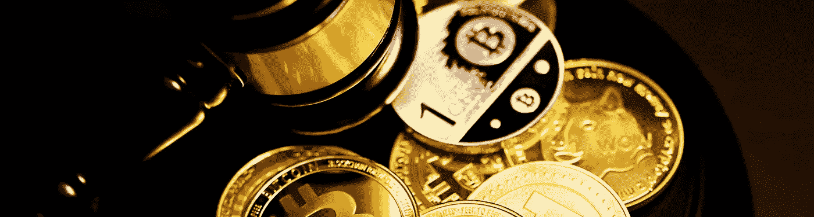
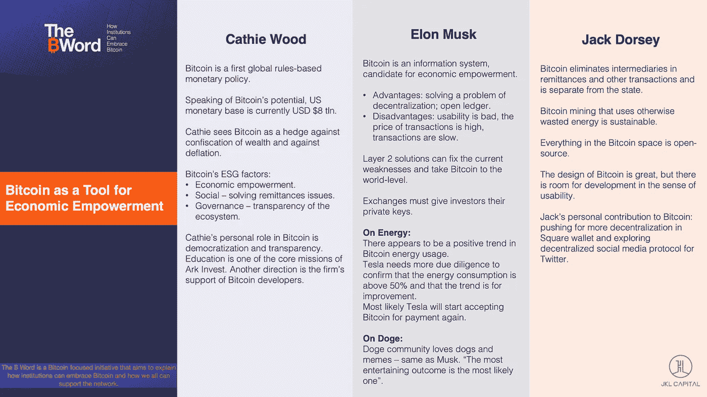
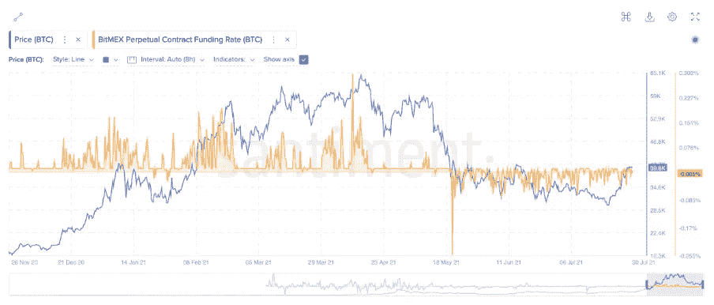
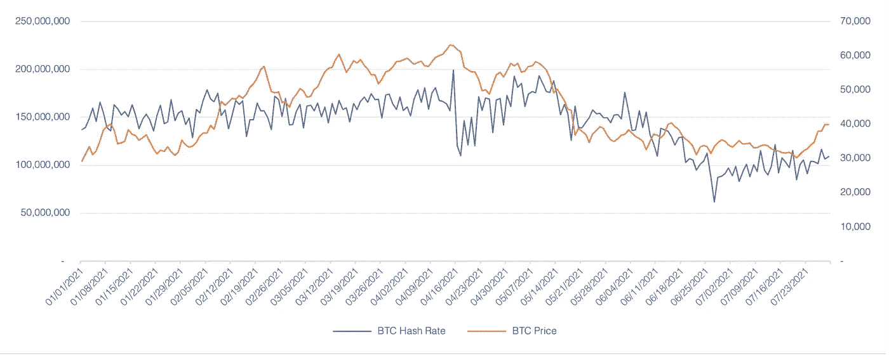
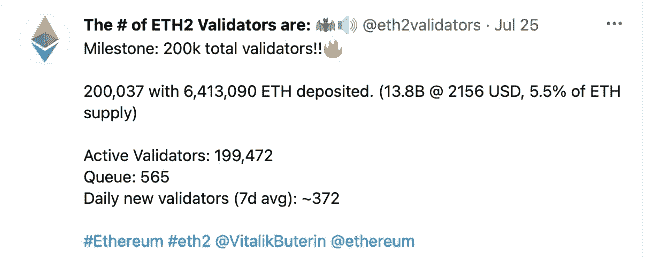
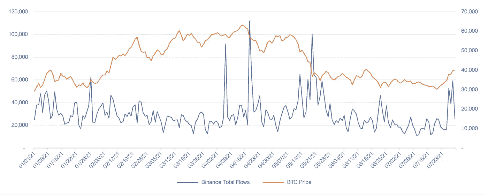

# 2021 年 7 月—加密新闻更新

> 原文：<https://medium.com/coinmonks/july-2021-crypto-news-update-17b5e8a439f6?source=collection_archive---------3----------------------->

## 您对数字资产世界的每月简报

> 文章作者 [Lesia M.](https://twitter.com/LesiaMrch)

Photo by [Executium](https://unsplash.com/@executium) | Unsplash.com

# 在本月的杂志中

*   比特币/以太坊概述
    -*' B 字'发布会
    - EIP 1559 升级*
*   加密新闻:金融机构
*   加密新闻:企业和定义
*   秘密新闻:监管机构
    - *稳定关注透明度
    -币安监管审查*

# **比特币概述**

在 29，000 美元到 41，000 美元范围内长期横向移动后，比特币终于在 7 月 21 日开始了突破性的一周，连续 8 根绿色日线蜡烛线(币安)。这是自 2021 年 3 月初以来最长的连续增长，从最近低于 3 万美元的下跌中迅速复苏。

总体而言，比特币在 7 月份上涨了约 14%，在 7 月 20 日触及 29，278 美元的最低价，然后在 7 月 28 日达到 40，900 美元的峰值。

那么，是什么引发了如此急剧的上涨呢？7 月 23 日，亚马逊发布了一份“数字货币和区块链主管”的工作清单。随后，越来越多的传言援引内部人士的话说，亚马逊将在今年年底前开始接受加密货币支付，但亚马逊很快驳斥了这些说法。([阅读更多](https://www.reuters.com/article/amazon-cryptocurrency/amazon-denies-report-of-accepting-bitcoin-as-payment-idUSL4N2P23OT))

## **‘乙字’大会**

另一个可能的触发因素是 7 月 21 日举行的期待已久的“B 字”会议，讨论比特币目前的应用和未来的潜在好处。会议邀请了一些知名发言人——包括凯西·伍德、杰克·多西和埃隆·马斯克——在社交媒体上推动了围绕 BTC 的积极讨论。其中，马斯克证实特斯拉持有比特币，根据该公司最近的 Q2 报告，其中有 13 亿美元。以下是对讨论主题的简短更新:

几周来，分析师们一直预测比特币市场将会出现空头紧缩。卖空者过于积极地押注价格会长期下跌。因为卖空者通过购买基础资产来退出头寸，平仓给 BTC 价格带来上行压力。随着标的价格的上涨，越来越多的空头头寸被迫平仓。7 月 25 日，总计约 9 亿美元的空头加密头寸被清算。([阅读更多](https://www.theblockcrypto.com/linked/112437/crypto-short-liquidation-bitcoin-btc-39000))

在分析市场时，我们喜欢使用的一个指标是主要的永久融资利率。长时间的正融资利率创造了一个看跌的案例，因为多头交易者向空头支付资金。另一方面，负的永久融资利率意味着空头支付多头，当长期出现时，通常是活跃市场中的看涨指标。自 5 月 20 日以来，永久融资利率一直主要为负值(甚至在最近的逆转中)，为即将到来的看涨趋势奠定了基础。

*Source: app.santiment.net*

在中国的打击行动之后，BTC 的采矿难度已经有所下降，7 月份以来一直在逐步上升。这是由于中国矿业设施迅速向海外转移，主要是转移到北美的托管地。([阅读更多](https://www.coindesk.com/mining-difficulty-expected-to-increase-for-the-first-time-since-china-crackdown))在风暴中保持活跃的矿工目前正准备赚取更高的利润，因为比特币代码重新调整后，采矿难度降低了 28%。对活跃的矿商来说，竞争的减少和难度的降低意味着更高的盈利能力。

*Source: app.intotheblock.com*

## **GBTC 解锁——FUD**

进入 7 月份，即将解锁约 5300 万美元的 GBTC 股票是最具争议的谣言之一，各方围绕其对比特币价格的潜在影响展开了争论。实际上，此次发行对基础数字资产的价格影响极小，BTC 股市迅速反弹。

GBTC 解锁后的 BTC 市场在突破 50 毫安(34，000)后，技术上已经开始看涨。下一站 100 毫安(41000)和 200 毫安(44600)

# **以太网概述**

通用密码市场自然紧随卖空交易。ETH 比 7 月份上涨了约 6%，7 月 20 日跌至 1，706 美元，7 月 30 日达到 2，450 美元的峰值。

此外，以太坊在 ETH 2.0 之前继续锁定 it 供应。存放到 ETH 2.0 的 ETH 总量现在约占总 ETH 供应量的 5.5%，随着区块链过渡到利益证明协议并继续缓慢限制供应量，该供应量可能会被锁定 1 年或更长时间。([阅读更多](https://u.today/59-million-eth-locked-in-eth-20-contract-totalling-508-of-ethereum-supply))

## **以太坊 EIP-1559**

以太坊‘伦敦’升级即将于 8 月 3-5 日推出([阅读更多](https://bitcoinexchangeguide.com/ethereum-london-upgrade-confirmed-eip-1559-going-live-in-less-than-3-weeks/))，以太坊改进提案(EIP) 1559 是最令人期待的一个。这一升级旨在提高网络吞吐量，并通过燃烧基本费用而不是奖励给矿商来改变费用结构。燃烧基本费用激活了一个减少乙醚总供给增长的机制，并创造了一个稀缺的叙事。([阅读更多](https://static.coindesk.com/wp-content/uploads/2021/06/EIP-1559-Ethereum-Fee-Market-Upgrade-Explained-1.pdf))

客观地说，燃烧基本费用在以太坊的矿工中不是很受欢迎，我们还没有看到这次升级对网络的最终影响。

# **加密新闻:金融机构**

摩根大通表示，以太坊的升级可能会推动价值 400 亿美元的赌博业。

[摩根大通](https://www.finews.com/news/english-news/47199-j-p-morgan-opens-crypto-fund-access-to-all-wealth-clients-finews-com)向所有财富客户开放加密基金。

-[美国银行](https://www.bloomberg.com/news/articles/2021-07-08/bofa-debuts-cryptocurrencies-research-team-led-by-alkesh-shah)在华尔街的最新推动下首次推出加密研究团队。

-[美国银行](https://www.coindesk.com/bank-of-america-approves-bitcoin-futures-trading-for-some-clients-sources)批准部分客户进行比特币期货交易。

-[高盛](https://blockworks.co/goldman-files-for-defi-and-blockchain-equity-etf/)申请 DeFi 和区块链股权 ETF。

[高盛:](https://www.bloomberg.com/news/articles/2021-07-21/bitcoin-btc-where-rich-family-offices-are-investing-goldman-survey-shows?utm_source=twitter&utm_content=crypto&utm_campaign=socialflow-organic&utm_medium=social)在推动了特殊目的收购公司的繁荣之后，超级富豪们开始转向加密技术。

# **加密新闻:企业& DeFi**

签证称 2021 年上半年加密卡的使用量将超过 10 亿美元。

□方[方](https://www.coindesk.com/square-to-build-bitcoin-hardware-wallet)打造比特币硬件钱包。

-[Capital Group](https://decrypt.co/75793/capital-group-buys-12-stake-bitcoin-heavy-microstrategy)部门收购以比特币为主的 MicroStrategy 公司 12%的股份。

标准普尔道琼斯指数推出标准普尔加密货币广义数字市场指数。

道琼斯公司又推出 5 个加密指数；一个追踪 240 枚硬币。

-[gray Investments](https://www.globenewswire.com/news-release/2021/07/13/2261970/0/en/Grayscale-Investments-Forges-Agreement-with-BNY-Mellon-to-Provide-Asset-Servicing-and-ETF-Services-for-Grayscale-Bitcoin-Trust.html)与 BNY 梅隆公司达成协议，为 gray bit coin Trust 提供资产服务和 ETF 服务。

—[灰度投资](https://www.coindesk.com/grayscale-defi-fund-coindesk-index)推出了 DeFi 基金。

灰度的主要加密基金变成了一个 [SEC 报告公司](https://www.theblockcrypto.com/linked/111043/grayscales-main-crypto-fund-becomes-an-sec-reporting-company)。

数字货币公司[圈定](https://www.cnbc.com/2021/07/08/digital-currency-company-circle-to-go-public-via-spac-at-4point5-billion-valuation.html)经由特殊目的收购公司上市，估值 45 亿美元。

[看好](https://cryptobriefing.com/bullish-public-with-9-billion-spac-merger/)以 90 亿美元并购特殊目的收购公司上市。

—[FTX 完成了](https://www.prnewswire.com/news-releases/ftx-trading-ltd-closes-900m-series-b-round-largest-raise-in-crypto-exchange-history-847881913.html)9 亿美元的 B 轮融资——加密交易所历史上最大的融资。

# **监管机构:**

德国[的一项新法律](https://zerocap.us17.list-manage.com/track/click?u=287cd3513c9a6346f9388e404&id=9c56d86202&e=c11ff945bc)为来自特别基金的高达 4150 亿美元的加密投资提供了机会。

阿根廷的立法者提出了一项工人工资加密的法案。

-巴西批准[拉丁美洲首只以太坊 ETF](https://zerocap.us17.list-manage.com/track/click?u=287cd3513c9a6346f9388e404&id=8bf6304941&e=c11ff945bc) ，由文克莱沃斯 Gemini 托管。

—[英国广告](https://www.theblockcrypto.com/linked/110934/uk-advertising-watchdog-crack-down-crypto-firms)监管机构收紧针对误导性加密广告的规定。

[巴拉圭提出比特币法律](https://www.coindesk.com/paraguay-bitcoin-law-crypto-mining-registration)包括加密注册。

通过[加密税](https://www.coindesk.com/new-infrastructure-bill-looks-to-raise-30b-through-crypto-taxes)筹集 300 亿美元的新基础设施法案。

## **Stablecoins:透明度问题**

﹍[Tether 高管](https://www.bloomberg.com/news/articles/2021-07-26/tether-executives-said-to-face-criminal-probe-into-bank-fraud)称将面临银行欺诈的刑事调查。

——系绳放:信用违约互换的加密等价物？

美联储主席杰罗姆·鲍威尔声称稳定货币[需要监管](https://zerocap.us17.list-manage.com/track/click?u=287cd3513c9a6346f9388e404&id=150910f71f&e=c11ff945bc)，因为耶伦本周将很快与银行监管者会面[讨论稳定货币规则](https://zerocap.us17.list-manage.com/track/click?u=287cd3513c9a6346f9388e404&id=538df1b76b&e=c11ff945bc)。

Gensler 说股票代币和[与安全挂钩的稳定债券](https://www.theblockcrypto.com/linked/112105/gensler-says-stock-tokens-and-security-pegged-stablecoins-need-to-report-to-the-sec)需要向 SEC 报告。

## **币安监管审查**

最近几个月，全球交易量最大的交易所币安接受了监管机构的一些审查。一系列监管禁令和调查始于英国金融行为监管局(Financial Conduct Authority)发布的一份声明，声明称，币安集团中没有一家实体“持有任何形式的英国授权、注册或执照，可以在英国从事受监管的活动”。值得一提的是，加密货币交易本身在英国不受监管。然而，交易金融产品——如衍生品——需要金融当局的批准。([阅读更多](https://edition.cnn.com/2021/06/27/business/binance-uk-ban/index.html))迫于监管压力，巴克莱银行和桑坦德银行在英国禁止向币安付款。([阅读更多](https://news.bitcoin.com/barclays-santander-bank-blocks-payments-to-binance-uk-customer-protection/))

为了给这种情况提供一些色彩，我们想将目前币安的打击与英国《公平竞争法》近年来对利差交易经纪公司的打击进行比较。这些经纪公司迎合散户投资者，隐含杠杆高得危险。一些息差押注公司允许外汇对的杠杆高达 100 倍。FCA 认为这种做法本质上是赌博，而不是投资或交易，实际上对不发达或不老练的投资者非常有害。

从我们的角度来看，FCA 可能认为在已经高度波动的资产类别上进行杠杆交易过于危险，而针对币安的行动是监管机构保护散户投资者，而不是打击加密。从长期来看，这些措施很可能是积极的，为该行业带来更多的监管和更多的保护。

监管打击的另一个问题涉及币安提供证券代币交易，这可能属于金融证券法规的范畴。港方警告称，股票代币应受到香港证监会([阅多](https://www.coindesk.com/hong-kong-next-to-issue-binance-warning))的监管，德国联邦金融监管局([阅多](https://www.reuters.com/technology/germanys-financial-watchdog-warns-crypto-exchange-binance-over-stock-tokens-2021-04-29/))和美国证交会([阅多](https://www.bloomberg.com/news/articles/2021-07-21/sec-s-gensler-issues-warning-as-fake-stocks-bloom-on-blockchains))也发布了类似警告。

许多其他国家发布了警告并开始了针对加密交易所的调查:[意大利](https://www.reuters.com/world/china/crypto-exchange-binance-not-authorised-italian-regulators-say-2021-07-15/)，香港，立陶宛，泰国，日本，德国，美国，开曼群岛，新加坡([阅读更多](https://www.coindesk.com/state-of-crypto-binance-is-firmly-in-the-regulatory-crosshairs))。

作为对监管措施的回应，币安方面已经开始将交易所的杠杆上限从 100 倍下调至 20 倍，“以保护消费者”。随着监管机构加强对加密交易所的控制，另一家衍生品交易所——FTX——宣布了杠杆交易的类似变化。([阅读更多](https://www.coindesk.com/binance-starts-cutting-leverage-limit-to-20x-following-similar-move-by-ftx))

此外，crypto exchange 从 7 月 16 日起停止其股票代币交易活动，并承诺在 10 月 15 日前结清所有头寸。([阅读更多](https://www.coindesk.com/binance-to-end-support-for-stock-tokens))

币安首席执行官赵昌鹏宣布，他正在寻找一位具有强大监管背景的继任者来取代他。此举来自 CZ 希望改善币安与监管机构的关系。([阅读更多](https://www.reuters.com/technology/binance-says-wants-be-licensed-everywhere-2021-07-27/))

全球对币安的监管压力从 6 月底开始全面显现。值得注意的是，监管机构对主要加密交易所的打击力度越来越大，但这并没有对加密价格和交易活动产生重大影响。本月前 3 周，币安的总流量(进出该交易所的流量之和)保持在 1.1 万至 2.7 万 BTC 之间，与用户离开该交易所相比，这表明市场相当疲软。在 7 月的最后一周，币安总流量突破了 5 万 BTC 的数字，反映出市场活动的上升。

*Source: app.intotheblock.com*

**免责声明** *私人和机密
仅限收件人*

*本材料严格保密，仅供专业投资者使用(根据开曼群岛金融管理局不时的定义)。未经 JKL Digital Capital Limited(“JKL”)的书面同意，不得出于任何目的复制、重新分发、传递给任何其他人或出版其全部或部分内容，并且必须在 JKL 要求时返还。虽然本材料中包含的信息是从据信可靠的来源汇编的，但 JKL 不代表或保证本材料中包含的信息的准确性、完整性或可靠性。*

*本材料的内容未经任何监管机构审查。建议您对本材料的内容保持谨慎。如果您对本材料的任何内容有任何疑问，您应该获得独立的专业意见。JKL 或其任何关联公司，或其任何或其各自的董事、高级职员、员工和代表都不会对因使用或依赖本材料中包含的任何信息而导致的任何直接、间接或后果性损失承担任何责任或义务。本材料不构成认购或购买任何金融产品的要约或邀请。其目的不是提供任何信贷或其他评估的基础，也不应被视为购买任何金融产品的建议。*

*JKL、其关联公司和/或任何或其各自的高级职员、董事、员工和代表可能不时在本材料中描述的产品或与产品相关的任何投资中，为他们的专有账户和/或他们管理的账户，和/或为客户拥有重大利益，这可能对产品的价值产生积极或消极的影响。*

> 加入 [Coinmonks 电报频道](https://t.me/coincodecap)，了解加密交易和投资

## 另外，阅读

 [## 2021 年 9 大最佳加密借贷平台

### 当谈到加密货币贷款时，大量因素等同于良好的收入状况。此外，借款的一部分…

blog.coincodecap.com](https://blog.coincodecap.com/crypto-lending)  [## 加密交易机器人——最佳免费加密交易机器人

### 2021 年币安、比特币基地、库币和其他密码交易所的最佳密码交易机器人。四进制，位间隙…

medium.com](/coinmonks/crypto-trading-bot-c2ffce8acb2a)  [## 最佳 6 个加密交易信号电报通道

### 这是乏味的找到正确的加密交易信号提供商。因此，在本文中，我们将讨论最好的…

medium.com](/coinmonks/best-crypto-signals-telegram-5785cdbc4b2b)  [## BlockFi 评论 2021:利弊和利率

### 今天，我们提出了一个全面的 BlockFi 评论，这是一个成立于 2017 年的加密贷款平台，拥有其…

blog.coincodecap.com](https://blog.coincodecap.com/blockfi-review)  [## 加密税务软件——五大最佳比特币税务计算器[2021]

### 不管你是刚接触加密还是已经在这个领域呆了一段时间，你都需要交税。

medium.com](/coinmonks/best-crypto-tax-tool-for-my-money-72d4b430816b)  [## Pionex 评论 2021 |免费加密交易机器人和交换

### Pionex 是为交易自动化提供工具的后起之秀。Pionex 上提供了 9 个加密交易机器人…

medium.com](/coinmonks/pionex-review-exchange-with-crypto-trading-bot-1e459d0191ea)  [## 存储比特币的最佳加密硬件钱包[2021]

### 保管您的数字资产很容易，但找到正确的存储方式却是一项繁琐的任务。在线钱包有一个风险…

blog.coincodecap.com](https://blog.coincodecap.com/best-hardware-wallet-bitcoin)