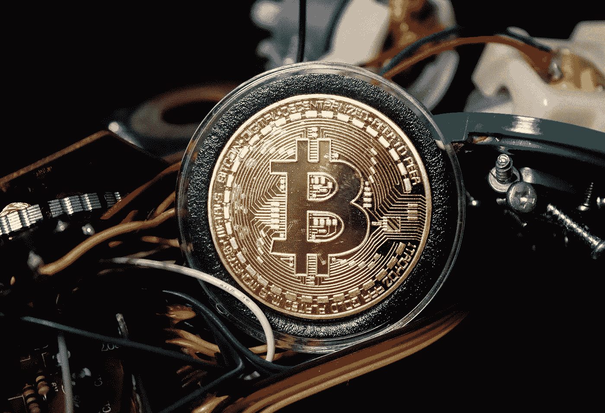
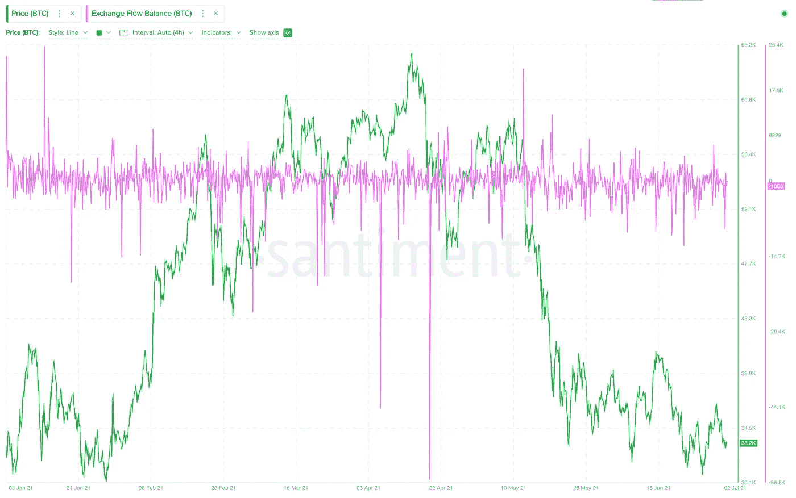

# 2021 年 6 月—每月加密新闻更新

> 原文：<https://medium.com/coinmonks/june-2021-monthly-news-update-1e3baafe4cd0?source=collection_archive---------4----------------------->

## 您对数字资产世界的每月简报

Photo by [Brian Wangenheim](https://unsplash.com/@brianwangenheim) on Unsplash.com

# 在本月的杂志中

*   市场概述
*   比特币 Taproot 升级被锁定
*   比特币迈阿密 2021
*   政府和法规
*   进一步采用加密技术

# **市场概述**

BTC 股市在 6 月份横盘整理，在 6 月 15 日的高点 41，330 美元和 6 月 22 日的低点 28，805 美元(币安)之间波动。在 Q1 股市大幅上涨、随后上月出现同样强劲的下跌之后，市场看起来相当疲软。

我们喜欢关注的一个指标是 BTC 的总汇兑流量余额，它显示了 BTC 进出汇兑钱包的数量差异。价值上升表明比特币正在被转移到交易所进行交易/出售，而价值下降表明 BTC 主要从交易所流入冷库，可能是为了霍德林。在 BTC 股市从 6 万英镑暴跌至 4 万英镑期间，流入资金大幅增加，但最近的净流量似乎为负值。这可以解释为投资者买入并持有。

*Source: Santiment*

# **比特币主根激活**

正如我们在之前的每月更新中所写的，taproot 最终被锁定在 2021 年 11 月激活。Taproot 是 4 年来比特币协议的最大升级，为加密货币带来了隐私和优化。比特币协议的三个不同升级是 Schnorr 签名、Taproot 和 Tapscript ( [阅读更多](https://river.com/learn/what-is-taproot/))。

# **比特币迈阿密 2021**

本月初，世界上最大的加密货币活动在迈阿密举行。比特币价格在今年早些时候同样强劲的反弹后暴跌，参与者的情绪非常激烈，BTD(买入下跌)、BTFD、“到月亮”和“我们不卖”是这一事件的基本叙事。

加密货币会议的最大亮点之一是迈阿密市的官员，他们对加密活动持最开放的态度，希望成为大型科技的新中心。NFT 也是一个大话题，一些担忧围绕最近的市场下跌重新出现。Upstream 的联合创始人亚历山大·陶博(Alexander Taub)认为，整个市场的 90%将毫无价值([阅读更多](https://www.nytimes.com/2021/06/05/technology/miami-worship-bitcoin.html))。

# **政府和法规**

## **更多通胀担忧**

美国总统乔·拜登提出了 2022 年 6 万亿美元的预算，这将意味着自二战以来最高的持续联邦支出水平。与此同时，在 2020-2021 年实施大规模量化宽松计划后，美国预算赤字迄今已超过 2 万亿美元。自量化宽松措施推出以来，美联储的资产负债表增加了 80%以上——从 2020 年 3 月的 4.31 万亿美元增加到 2021 年 3 月的 7.83 万亿美元。这些计划引发了对通胀水平的更多担忧，并支持了比特币“对冲通胀”的说法。

## **中国矿业镇压继续进行**

中国继续打击比特币。继上个月禁止非绿色采矿之后，中国监管机构现在已经果断关闭了中国内地的采矿活动，不管使用的能源是什么。超过 90%的比特币挖矿能力已被指示关闭，包括新疆、青海、四川等地的农场([阅读更多](https://www.globaltimes.cn/page/202106/1226598.shtml))。此次打击行动代表了全球约三分之一的比特币开采能力。

紧接着这个消息，二手矿用设备充斥市场。据估计，到本月底，大约 90%的矿电将离线，这是超过 50 万台矿机。采矿机器供应的急剧流入已经导致硬件价格下降了 30%。

被关闭的农场正在积极寻找搬迁方案。由于地理位置接近，哈萨克斯坦似乎是最受欢迎的方向之一，迦南( [Read More](https://www.coindesk.com/asic-maker-canaan-diversifies-into-bitcoin-mining-in-kazakhstan?utm_source=Sailthru&utm_medium=email&utm_campaign=NODE%20JUNE%2023%202021&utm_content=B&utm_term=The%20Node) )和比特矿业( [Read More](https://www.coindesk.com/chinese-bitcoin-mining-company-delivers-first-machines-to-kazakhstan) )已经转移了一些产能。与此同时，Wattum 正在与 Energix 合作，在哈萨克斯坦建立一个采矿设施，为机器提供 16 兆瓦的能源([阅读更多信息](https://www.coindesk.com/wattum-to-build-kazakhstan-mining-farm))。除了哈萨克斯坦，中国矿商正在考虑美国、加拿大、北欧和东欧。

然而，矿商并不是中国比特币禁令故事中唯一受影响的一方。中国的加密经纪人也在 mainland China 以外寻找提供加密交易的机会([阅读更多](https://www.coindesk.com/chinese-brokerages-look-overseas-to-offer-crypto-trading?utm_source=Sailthru&utm_medium=email&utm_campaign=NODE%20JUNE%201%202021&utm_term=Blockchain%20Bites))，许多加密影响者发现他们的社交媒体账户在审查工作中被暂停([阅读更多](https://www.theblockcrypto.com/linked/107373/bitcoin-slip-weibo-crypto-influencer-suspend))。

随着中国农场的关闭，目前比特币挖矿的速度已经下降到 73%。我们使用比特币难度估算网站来追踪当前的挖矿率:[https://diff.cryptothis.com](https://diff.cryptothis.com/)。由于生产放缓，市场上 BTC 的供应量低于当前困难时期的预期。就对 BTC 价格的影响而言，较低的供应实际上有可能推动长期上涨。

PBOC 已经召集顶级银行的官员来加强加密禁令。根据中国央行的声明，加密活动“扰乱了金融秩序，也滋生了非法跨境资产转移和洗钱等犯罪活动的风险”。

对 BTC 的这种打击发生在中国积极推出其国家数字货币之际，这将使中国政府对公民的储蓄和支出拥有前所未有的访问和控制。在政府最近对电子元的测试中，中国的银行推出了 3000 台可以将数字元转换成现金的自动取款机。

## **首个接受比特币作为法定货币的州**

萨尔瓦多成为首个将比特币视为法定货币的国家，为那些无法获得金融服务的公民提供了包容([阅读更多](https://www.wsj.com/articles/el-salvador-becomes-first-country-to-approve-bitcoin-as-legal-tender-11623234476))。因此，萨尔瓦多将自己定位为对比特币最友好的国家之一，并采取了一系列行动来验证这一立场。

因此，中美洲国家将向每个成年公民发放价值 30 美元的比特币，这大约相当于比特币全球用户数量增加 2.5%。萨尔瓦多也希望成为比特币开采中心，利用该国的可再生火山能源，以及比特币创新和 IT 发展中心，以吸引新的人才。

# **DeFi 新闻**

□FTX[成为 MLB 官方加密品牌。](https://genesisblockhk.com/ftx-becomes-official-crypto-brand-of-mlb/?utm_content=170633773&utm_medium=social&utm_source=twitter&hss_channel=tw-913325671388033024)

草间弥生 parachain 拍卖开始。

加密硬件钱包制造商 [Ledger](https://www.theblockcrypto.com/post/107775/ledger-380-million-series-c-raise-dan-tapiero-10t-fund) 获得 3.8 亿美元的 C 轮融资。

索拉纳筹集了多达 4 . 5 亿美元的新资金。

USDC 建筑圈从知名投资者那里筹集了 4.4 亿美元:富达、马歇尔·威斯、FTX 和其他投资者。

-[block fi](https://www.theblockcrypto.com/linked/107618/blockfi-fundrais-500-million-third-point-hedosophia)在新一轮融资中融资约 5 亿美元，投资前估值为 47.5 亿美元。

[银门银行](https://finance.yahoo.com/news/silvergate-bank-discontinue-binance-usd-223250572.html)停止币安美元存款和取款。

-[比特岛](https://www.theblockcrypto.com/linked/108602/bitdao-raise-peter-thiel-alan-howard-defi?utm_source=twitter&utm_medium=social)从彼得·泰尔、阿伦·霍华德和潘迪拉资本筹集 2.3 亿美元。

[Fireblocks](https://www.theblockcrypto.com/post/109277/staking-company-serves-fireblocks-with-a-lawsuit-over-private-keys-to-over-75-million-in-eth) 在 ETH 面临私人钥匙损失超过 7500 万美元的诉讼。

在恐慌性抛售中，Iron Finance 的巨头股票跌至接近零的水平。

-[chain analysis](https://www.theblockcrypto.com/linked/109515/chainalysis-valuation-hits-4-2-billion-after-100-million-series-e-fundraise)在 1 亿美元的 E 轮融资后，估值达到 42 亿美元。

# **机构收养**

## **银行/金融服务**

新加坡银行 [DBS](https://decrypt.co/72403/dbs-tokenized-bond) 发行 1130 万美元的区块链债券。

-[Standard Charted 和 BC Group](https://bc.group/press-release/standard-chartered-and-bc-group-partner-to-establish-europe-based-institutional-digital-asset-trading-venture/) 成立总部位于欧洲的机构数字资产交易公司。

花旗集团在财富管理部门推出数字资产部门。

高盛计划向客户提供期货和期权。

-银河数码作为高盛 BTC 期货的流动性提供者

西班牙银行 BBVA 向瑞士私人银行客户开放 BTC 交易服务。

—[互动经纪公司](https://www.cnbc.com/2021/06/09/interactive-brokers-will-offer-crypto-trading-by-the-end-of-the-summer.html)将在夏末提供加密交易。

[简化资产](https://www.thinkadvisor.com/2021/05/25/new-etf-would-invest-in-grayscale-bitcoin-trust/?cmp=share_twitter)宣布推出一只 ETF，通过 GBTC 在 BTC 投资高达 15%的净资产。

—[PayPal](https://decrypt.co/71982/paypal-users-send-bitcoin-off)允许用户向第三方钱包发送 BTC。

风险投资公司 Blockchain Capital 从 PaylPal 和 Visa 筹集了 3 亿美元。

安德里森·霍洛维茨推出 22 亿美元的加密基金。

□比特币基地[将 Visa 借记卡与 Apple Pay 和 Google Pay 连接。](https://www.theblockcrypto.com/linked/106825/coinbase-links-its-visa-debit-card-with-apple-pay-google-pay)

## **企业**

MicroStrategy 从债券销售中筹集[5 亿美元用于购买更多 BTC。](https://www.coindesk.com/microstrategy-raises-500m-from-bond-sale-to-buy-more-bitcoin)

o [卖出高达 10 亿美元的 1B 股票](https://finance.yahoo.com/news/microstrategy-sell-1b-stock-part-230226657.html)，用部分收益购买更多的 BTC。

[澳大利亚区块链公司](https://www.coindesk.com/austrian-blockchain-company-builds-platform-to-tokenize-solar-energy?utm_source=Sailthru&utm_medium=email&utm_campaign=First%20Mover%2C%20June%207%2C%202021&utm_term=First%20Mover)搭建太阳能令牌化平台。

亚马逊希望雇佣有 DeFi 经验的区块链员工。

福克斯娱乐公司向非技术人员的“创造者基金”投资 1 亿美元。

—[币安将推出 NFT 市场](https://www.theblockcrypto.com/linked/109312/binance-nft-marketplace-warhol-dali)，以沃霍尔和大理为特色进行销售。

# **免责声明**

*本材料仅供专业投资者(根据开曼群岛金融管理局不时的定义)使用。未经 JKL Digital Capital Limited(“JKL”)的书面同意，不得出于任何目的复制、重新分发、传递给任何其他人或出版其全部或部分内容，并且必须在 JKL 要求时返还。虽然本材料中包含的信息是从据信可靠的来源汇编的，但 JKL 不代表或保证本材料中包含的信息的准确性、完整性或可靠性。*

本材料的内容未经任何监管机构审查。建议您对本材料的内容保持谨慎。如果您对本材料的任何内容有任何疑问，您应该获得独立的专业意见。JKL 或其任何关联公司，或其任何或其各自的董事、高级职员、员工和代表都不会对因使用或依赖本材料中包含的任何信息而导致的任何直接、间接或后果性损失承担任何责任或义务。本材料不构成认购或购买任何金融产品的要约或邀请。其目的不是提供任何信贷或其他评估的基础，也不应被视为购买任何金融产品的建议。

*JKL、其关联公司和/或任何或其各自的高级职员、董事、员工和代表可能不时在本材料中描述的产品或与产品相关的任何投资中、为其专有账户和/或为其管理的账户和/或为客户拥有重大利益，这可能对产品的价值产生积极或消极的影响。*

 [## 加密交易机器人|最佳 16 款比特币交易机器人[免费和付费]

### 2021 年币安、比特币基地、库币和其他密码交易所的最佳密码交易机器人。四进制，位间隙…

medium.com](/coinmonks/crypto-trading-bot-c2ffce8acb2a) 

> 加入 [Coinmonks 电报频道](https://t.me/coincodecap)，了解加密交易和投资

## 另外，阅读

*   [尤霍德勒 vs 科恩洛 vs 霍德诺特](/coinmonks/youhodler-vs-coinloan-vs-hodlnaut-b1050acde55a) | [Cryptohopper vs 哈斯博特](https://blog.coincodecap.com/cryptohopper-vs-haasbot)
*   [币安 vs 北海巨妖](https://blog.coincodecap.com/binance-vs-kraken) | [美元成本平均交易机器人](https://blog.coincodecap.com/pionex-dca-bot)
*   [如何在印度购买比特币？](/coinmonks/buy-bitcoin-in-india-feb50ddfef94) | [WazirX 审核](/coinmonks/wazirx-review-5c811b074f5b) | [BitMEX 审核](https://blog.coincodecap.com/bitmex-review)
*   [比特币主根](https://blog.coincodecap.com/bitcoin-taproot) | [Bitso 回顾](https://blog.coincodecap.com/bitso-review) | [排名前 6 的比特币信用卡](/coinmonks/bitcoin-credit-card-bc8ab6f377c6)
*   [双子座 vs 比特币基地](https://blog.coincodecap.com/gemini-vs-coinbase) | [比特币基地 vs 北海巨妖](https://blog.coincodecap.com/kraken-vs-coinbase) | [硬币罐 vs 硬币点](https://blog.coincodecap.com/coinspot-vs-coinjar)
*   [印度加密交易所](/coinmonks/bitcoin-exchange-in-india-7f1fe79715c9) | [比特币储蓄账户](/coinmonks/bitcoin-savings-account-e65b13f92451) | [Paxful 审核](/coinmonks/paxful-review-4daf2354ab70)
*   [杠杆令牌](/coinmonks/leveraged-token-3f5257808b22) | [最佳密码交易所](/coinmonks/crypto-exchange-dd2f9d6f3769)
*   [Godex.io 审核](/coinmonks/godex-io-review-7366086519fb) | [邀请审核](/coinmonks/invity-review-70f3030c0502) | [BitForex 审核](/coinmonks/bitforex-review-c4bb28d9e271) | [HitBTC 审核](/coinmonks/hitbtc-review-c5143c5d53c2)
*   [Crypto.com 费用](/coinmonks/binance-fees-8588ec17965) | [僵尸加密审查](/coinmonks/botcrypto-review-2021-build-your-own-trading-bot-coincodecap-6b8332d736c7) | [替代品](https://blog.coincodecap.com/crypto-com-alternatives)