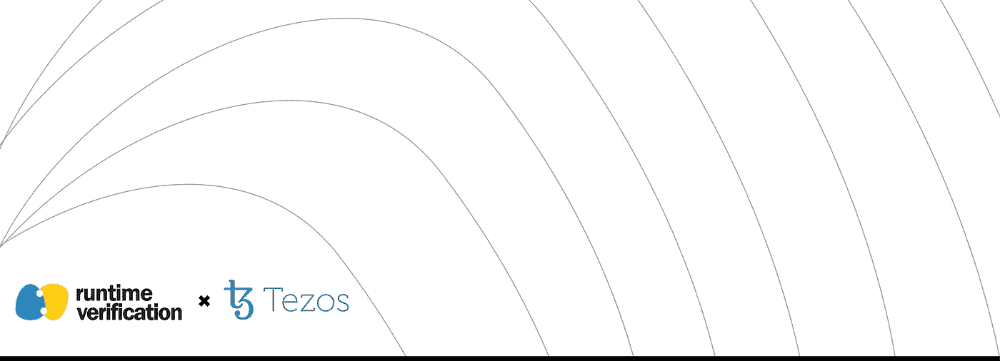
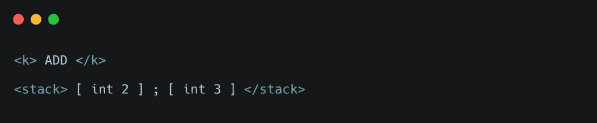
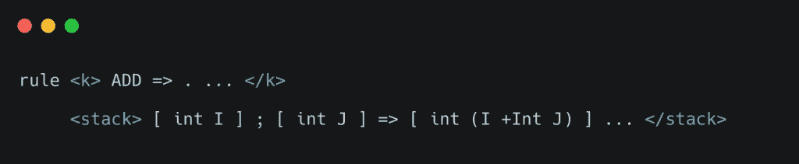

# K-Michelson:正式的可执行语言规范的案例研究(第 1 部分)

> 原文：<https://medium.com/coinmonks/k-michelson-a-case-study-on-formal-executable-language-specification-part-1-f9eea00a3bfc?source=collection_archive---------6----------------------->

## 斯蒂芬·斯凯里克

在之前的[帖子](/coinmonks/formal-verification-framework-for-michelson-9057202095a4)中，我们介绍了 K-Michelson 项目，这是一个用于 Michelson 智能合约的正式验证框架，并描述了我们的总体项目目标。在这个由两部分组成的系列中，我们将研究:

1.  理想的编程语言规范是什么样子的。
2.  这个理想的框架如何支持下一代程序测试。

在第一部分中，我们将重点限制在问题(1)上。那么，理想的编程语言规范应该是什么样的呢？我想到了几个特性:

*   **清晰**:应该是明确而直截了当的。
*   **完整性**:它应该是独立的，描述所有可能的程序是如何执行的。
*   **可测试性**:任意的程序都应该可以根据规范执行，看看它们的实际结果和预期结果是否一致。

大多数流行的语言规范都不满足这些标准中的至少一个。

**完整性**:在撰写本文时，除了它们的参考实现之外，Perl 和 Rust 还没有完整的、自包含的规范(但是由于[引导](https://en.wikipedia.org/wiki/Bootstrapping_(compilers))，将它们用作规范是循环的，除非您将它们的开发追溯到它们最初的非引导实现)。

**可测试性** : C++、C、Java、Go 和 Haskell 都有(假定的)完整的英语语言规范(有些还包括它们的标准库规范)，但是因为它们是用英语编写的，所以在上述意义上没有一个是可测试的，因为英语在任何有意义的意义上都是不可执行的。相反，我们要求我们的规范语言是可执行的。

更根本的是，我们认为编程语言的任何自然语言规范都不能满足以下意义上的清晰标准:人类语言天生就是不明确的。相反，我们要求我们的规范语言尽可能精确。

当然，这种讨论没有多大帮助，除非我们能提出一种替代的规范语言，使*满足我们的标准。*

我们认为计算的逻辑理论(换句话说，一种数学代码)应该作为我们的规范语言。既然是逻辑理论，就尽量精确。因为我们的理论代表了一个抽象的计算机，它有一个自然的可执行性的概念。

事实上，这种方法正是 K 框架所采用的方法。K Framework 是一个基于匹配逻辑设计编程语言的工具包。

换句话说，我们需要一个正式的——严格且符合逻辑的——定义来支撑我们的编程语言规范。当然，提供这样一个正式定义需要我们定义*计算*意味着什么。让我们首先解决定义计算的逻辑理论的问题，然后回到可测试性/执行的问题。

计算是关于*数据转换。*所以我们有两种抽象的对象:*数据(代表程序的状态，如堆栈、程序计数器和剩余气体)*和*数据转换规则*，它们定义了数据如何转换*(代表每个程序构造的语义，例如迈克尔逊的* `*ADD*` *指令)*。在 K 框架中，我们有以下等价关系:

> 数据=逻辑术语
> 数据转换规则=逻辑公理

由于 K 是基于匹配逻辑，我们特指匹配逻辑术语和公理。从语法上来说，K 使用一种叫做*配置*的概念，一种分层的、类似 XML 的符号来表示数据。这是迈克尔逊的一个例子:

这个配置表示一个迈克尔逊程序，它由一条指令 ADD 组成，在一个大小为 2 的堆栈上，堆栈的整数为 2 和 3。该配置可以通过以下*规则*进行转换(带有表示数据转换的箭头的配置):

其中(+Int)表示真正的整数加法。作为一个例子，使用这样的规则，我们已经明确地指定了迈克尔逊语言的语义。

关于这一点还有很多可以说的，但可以说的是，这种简单的配置和规则的形式主义允许非常精确和模块化的可执行编程语言规范，具有从 K 的匹配逻辑基础中导出的清晰的数学和逻辑语义。

这又回到了可测试性/可执行性的问题。使用 K 框架的 LLVM 后端，我们可以得到高效的解释器，让我们针对具体的程序测试我们的语言规范，而不像自然语言(甚至是基于纸张的数学)规范。这意味着我们可以自由地尝试不同的设计，直到我们找到满意的东西。

还有其他一些优势，我们在这里只强调一下。K 框架还有其他后端，让我们可以推导出用于程序执行推理的定理证明器，甚至是有界模型检查器。

总之，我们确信(1)正式的、可执行的语言规范有助于我们阐明程序的含义，测试语言设计，测试程序，并验证程序的正确性；(2)作为这种方法的一个实例，K 框架是一个高效而强大的编程语言规范工具。

下一次，我们将聚焦于 K 框架方法如何使我们能够进行形式验证。

注意，所有的逻辑理论都必须用自然语言来定义和教授，所以我们不能完全逃避这些基本的模糊性；然而，逻辑语言的简单性可以减少模糊性，因为它们需要更少的概念来定义。

注意，数据转换规则总是可以被*编码*为数据。然而，数据本身没有原始的执行概念；我们必须用一些基本的转换规则来引导自己。

## 另外，阅读

*   最好的[密码交易机器人](/coinmonks/crypto-trading-bot-c2ffce8acb2a)
*   [密码本交易平台](/coinmonks/top-10-crypto-copy-trading-platforms-for-beginners-d0c37c7d698c)
*   最好的[加密税务软件](/coinmonks/best-crypto-tax-tool-for-my-money-72d4b430816b)
*   [最佳加密交易平台](/coinmonks/the-best-crypto-trading-platforms-in-2020-the-definitive-guide-updated-c72f8b874555)
*   最佳[加密借贷平台](/coinmonks/top-5-crypto-lending-platforms-in-2020-that-you-need-to-know-a1b675cec3fa)
*   [最佳区块链分析工具](https://bitquery.io/blog/best-blockchain-analysis-tools-and-software)
*   [加密套利](/coinmonks/crypto-arbitrage-guide-how-to-make-money-as-a-beginner-62bfe5c868f6)指南:新手如何赚钱
*   最佳[加密制图工具](/coinmonks/what-are-the-best-charting-platforms-for-cryptocurrency-trading-85aade584d80)
*   [莱杰 vs 特雷佐](/coinmonks/ledger-vs-trezor-best-hardware-wallet-to-secure-cryptocurrency-22c7a3fd391e)
*   了解比特币的[最佳书籍有哪些？](/coinmonks/what-are-the-best-books-to-learn-bitcoin-409aeb9aff4b)
*   [3 商业评论](/coinmonks/3commas-review-an-excellent-crypto-trading-bot-2020-1313a58bec92)
*   [AAX 交易所评论](/coinmonks/aax-exchange-review-2021-67c5ea09330c) |推荐代码、交易费用、利弊
*   [Deribit 审查](/coinmonks/deribit-review-options-fees-apis-and-testnet-2ca16c4bbdb2) |选项、费用、API 和 Testnet
*   [FTX 密码交易所评论](/coinmonks/ftx-crypto-exchange-review-53664ac1198f)
*   [n 零审核](/coinmonks/ngrave-zero-review-c465cf8307fc)
*   [Bybit 交换审查](/coinmonks/bybit-exchange-review-dbd570019b71)
*   [3Commas vs Cryptohopper](/coinmonks/cryptohopper-vs-3commas-vs-shrimpy-a2c16095b8fe)
*   最好的比特币[硬件钱包](/coinmonks/the-best-cryptocurrency-hardware-wallets-of-2020-e28b1c124069?source=friends_link&sk=324dd9ff8556ab578d71e7ad7658ad7c)
*   最佳 [monero 钱包](https://blog.coincodecap.com/best-monero-wallets)
*   [莱杰 nano s vs x](https://blog.coincodecap.com/ledger-nano-s-vs-x)
*   [bits gap vs 3 commas vs quad ency](https://blog.coincodecap.com/bitsgap-3commas-quadency)
*   [莱杰 Nano S vs 特雷佐 one vs 特雷佐 T vs 莱杰 Nano X](https://blog.coincodecap.com/ledger-nano-s-vs-trezor-one-ledger-nano-x-trezor-t)
*   [block fi vs Celsius](/coinmonks/blockfi-vs-celsius-vs-hodlnaut-8a1cc8c26630)vs Hodlnaut
*   [bits gap review](/coinmonks/bitsgap-review-a-crypto-trading-bot-that-makes-easy-money-a5d88a336df2)——一个轻松赚钱的加密交易机器人
*   为专业人士设计的加密交易机器人
*   [PrimeXBT 审查](/coinmonks/primexbt-review-88e0815be858) |杠杆交易、费用和交易
*   [埃利帕尔泰坦评论](/coinmonks/ellipal-titan-review-85e9071dd029)
*   [赛克斯石评论](https://blog.coincodecap.com/secux-stone-hardware-wallet-review)
*   [BlockFi 评论](/coinmonks/blockfi-review-53096053c097) |从您的密码中赚取高达 8.6%的利息