# K-Michelson:形式化可执行语言规范的案例研究(下)

> 原文：<https://medium.com/coinmonks/k-michelson-a-case-study-on-formal-executable-language-specification-part-2-1e9a82102ce3?source=collection_archive---------5----------------------->

## 斯蒂芬·斯凯里克

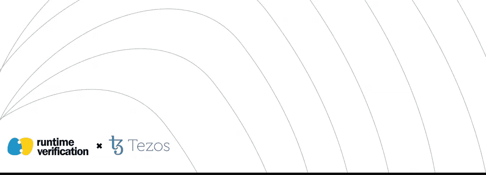

# *可达性逻辑的威力*

在[之前的一篇博文](/coinmonks/formal-verification-framework-for-michelson-9057202095a4)中，我们介绍了 K-迈克尔逊项目，该项目由[运行时验证](https://runtimeverification.com/)开发，并由[泰佐斯基金会](https://tezos.foundation/)慷慨资助。那么什么是 K-迈克尔逊呢？简单来说，它是迈克尔逊智能合约的正式验证框架；详见我们的[上一篇](/coinmonks/k-michelson-a-case-study-on-formal-executable-language-specification-part-1-f9eea00a3bfc)。在这个由两部分组成的系列中，我们将研究:

1.  理想的编程语言规范是什么样子的。
2.  这个理想的框架如何支持下一代程序测试。

在[系列的第一部分](/coinmonks/k-michelson-a-case-study-on-formal-executable-language-specification-part-1-f9eea00a3bfc)中，我们使用我们的 K-Michelson 工具作为一个具体的例子，考虑了 K 框架是第(1)点的一个例子。在第二部分中，我们更仔细地看看 K 如何处理点(2)，再次使用 K-Michelson 作为例子。

作为快速复习，上次我们讨论了 K 语言规范如何使用类似 XML 的模式存储数据，这些模式称为由单元组成的配置，以及数据转换规则，这些规则将带有变量的配置映射到这些变量的不同配置。我们上次看到的一个简单的例子:

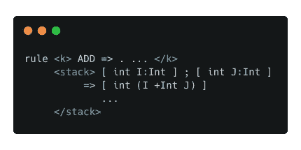

该规则描述了迈克尔逊加法指令对整数的操作，即，消耗当前延续中的加法指令和具有 int 类型的顶部两个堆栈元素，然后产生一个新的 int 值，该值是它们的和。省略号(…)表示这个规则没有触及的延续/堆栈的其余部分，变量 V 具有 V:VarType 形式的可选类型注释，为了清楚起见，我们添加了这种注释。正如我们上次讨论的那样，使用这样的语义规则让我们比任何人类语言更方便、更精确地描述编程语言的预期操作，同时仍然保持相当的可读性。

我们在这里试图回答的问题是:如何使用这种模式来表示我们的编程语言(例如，作为一种可信的操作语义的学术倾向)使我们能够更容易地进行验证？答案在于我们称之为可达性逻辑的底层验证的能力。

# K 框架程序验证方法

传统的程序验证方法涉及同一编程语言的两个或三个独立的规范――一个操作语义、一个霍尔逻辑和一个公理语义――它们都服务于不同的目的，并且都必须相互一致。构建每个不同的表示(以及使用它们的相关工具)需要大量的工作。

> 使用可达性逻辑，K 框架允许将 K 编程语言规范作为输入(即，可信操作语义)，并且无需额外的努力就可以导出构造正确的程序验证器。因此，我们之前必须构建的三个独立的表示和相关工具都包含在一个单一的表示和工具中，可以这么说，它让我们“无所不能”。

除了统一这三个独立的表示之外，可达性逻辑还进一步统一了系统表示(我如何表示我的系统，例如，编程语言)和属性表示(我如何表示我想知道的关于我的系统的内容，例如，特定程序如何运行)的典型不同概念。让我们看一个例子。这是一个叫做 loopsum 的迈克尔逊程序，它将 1 到 10 的数字相加:

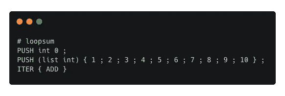

该程序是属性规范的一部分。它是不完整的，因为我们还没有定义程序应该做什么。类似地，我们上面看到的整数加法规则是迈克尔逊智能契约语言的系统规范的一部分。它也是不完整的，因为我们需要更多的规则来正式定义迈克尔逊语言。让我们展示运行这个例子所需的其他语义规则:

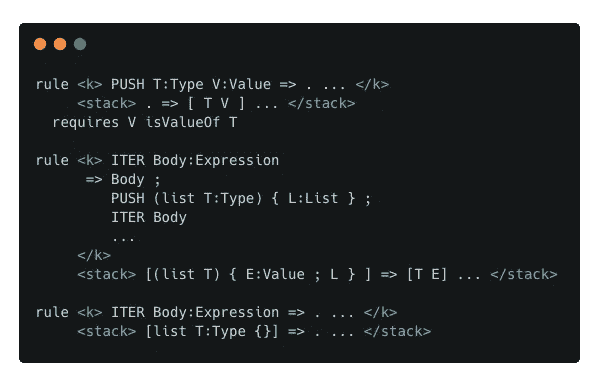

第一条规则描述了我们如何将一个即时常量压入值堆栈。第二条和第三条规则描述了 ITER 指令在两种情况下对循环的操作:迭代列表非空时和为空时。当然，这个系统规范还不完整，但是为了简单起见，我们省略了其他细节。

现在让我们重新看看我们的 loopsum 程序，看看我们如何完成我们的属性规范，也就是说，让我们定义一个描述 loopsum 程序应该如何运行的规则。看看这个程序，我们看到它是自包含的，从某种意义上说，这个程序可以在任何格式良好的迈克尔逊堆栈上执行，它将生成相同的迈克尔逊堆栈，并在顶部添加一个整数，这样整个结果堆栈就是格式良好的。这可以用下面的良构性声明来表达:

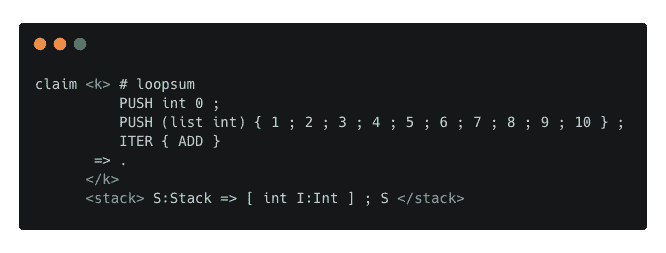

请注意，除了我们纯粹为了消除歧义而使用的单词 claim 之外，系统规范(一组可达性规则)和属性规范(一组可达性声明)之间没有什么不同。可达性逻辑完全统一了这两个概念。还要注意，上面的声明准确地陈述了我们在上面的文字中所写的堆栈转换属性。

但是我们可以做得更好。怎么会？我们在上面的声明中使用的整数变量 I:Int 有点不精确。我们可以通过用一个常数来代替这个整数变量来加强我们的性质，即从 1 到 10 或 55 的整数之和。因此，我们写出下面的完全正确的声明。

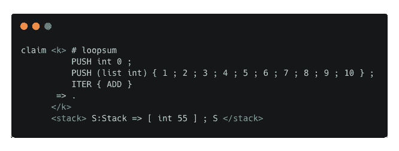

这一主张现在完全抓住了这一计划的预期效果。作为一个副作用，我们可以清楚地看到这个程序是常量，因此优化编译器可以用这个程序替换上面的整个程序:

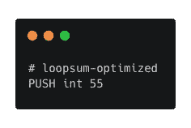

在任何情况下，能够在没有程序验证器可以证明的情况下编写这样的声明是没有多大用处的。幸运的是，使用 kprove 工具，我们可以做到这一点。这是 K 框架提供的用于程序验证的核心工具。关于使用该工具的教程超出了这篇博文的范围；更多详情见 [K 框架网站](https://kframework.org)。

# 用 K-迈克尔逊检验迈克尔逊程序

K-Michelson 不仅仅是 Michelson 智能契约语言的语义，它还是 Michelson 语言的一个正式验证框架。

> *本质上，我们可以将 K-Michelson 视为 K 框架之上的一种包装器，它有选择地将一些有用的功能打包在一个对 Michelson 开发人员来说更舒适的界面中。*

事实上，我们上面表示为可达性逻辑声明的两个属性也可以用。tzt 单元测试格式(K-Michelson 的输入文件格式)。这种格式的优点是它在精神上更接近标准的迈克尔逊程序。下面是我们如何重写我们的良构性声明:

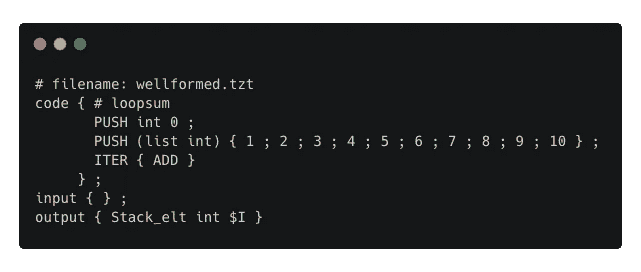

编写完全正确的声明更加简单，因为我们不需要引入任何变量语法，例如，我们上面看到的$I:

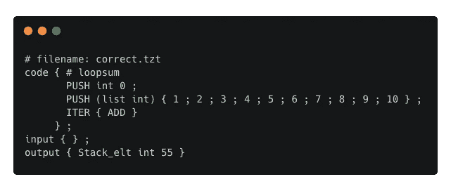

然后，我们可以使用 K-Michelson 运行我们的两个测试，方法是下载并构建工具，然后执行以下操作:

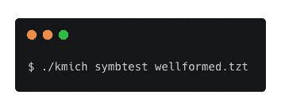

并且:

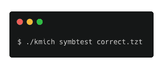

在这里，命令 symbolic test 代表符号测试。这只是意味着我们可能想要使用符号变量(比如$I)。

关于我们如何建设这些，有很多话要说。tzt 输入文件并使用它们；我们建议感兴趣的读者参考[K-迈克尔逊文档网站](https://runtimeverification.github.io/michelson-semantics)。

如果你能走到这一步，谢谢你陪我们走到最后。希望这篇博文提供了使用可达性逻辑、K 框架和我们的工具 K-Michelson 进行验证的一点经验。我们计划不断更新该工具，使其更加强大和用户友好。如果你对如何做到这一点有任何想法，请随时加入我们的 [GitHub 资源库](https://github.com/runtimeverification/michelson-semantics)的讨论和开发。

## 另外，阅读

*   最好的[密码交易机器人](/coinmonks/crypto-trading-bot-c2ffce8acb2a)
*   [Uniswap API](https://bitquery.io/blog/uniswap-pool-api) —如何获取 Uniswap 数据？
*   [德里比特评论](/coinmonks/deribit-review-options-fees-apis-and-testnet-2ca16c4bbdb2) |选项、费用、API 和 Testnet
*   [FTX 密码交易所评论](/coinmonks/ftx-crypto-exchange-review-53664ac1198f)
*   [Bybit 交换审查](/coinmonks/bybit-exchange-review-dbd570019b71)
*   最好的比特币[硬件钱包](/coinmonks/the-best-cryptocurrency-hardware-wallets-of-2020-e28b1c124069?source=friends_link&sk=324dd9ff8556ab578d71e7ad7658ad7c)
*   [密码本交易平台](/coinmonks/top-10-crypto-copy-trading-platforms-for-beginners-d0c37c7d698c)
*   [bits gap vs 3 commas vs quad ency](https://blog.coincodecap.com/bitsgap-3commas-quadency)
*   最好的[加密税务软件](/coinmonks/best-crypto-tax-tool-for-my-money-72d4b430816b)
*   [最佳加密交易平台](/coinmonks/the-best-crypto-trading-platforms-in-2020-the-definitive-guide-updated-c72f8b874555)
*   最佳加密贷款平台
*   [莱杰纳米 S vs 特雷佐 one vs 特雷佐 T vs 莱杰纳米 X](https://blog.coincodecap.com/ledger-nano-s-vs-trezor-one-ledger-nano-x-trezor-t)
*   [block fi vs Celsius](/coinmonks/blockfi-vs-celsius-vs-hodlnaut-8a1cc8c26630)vs Hodlnaut
*   Bitsgap 评论——一个轻松赚钱的加密交易机器人
*   为专业人士设计的加密交易机器人
*   [PrimeXBT 审查](/coinmonks/primexbt-review-88e0815be858) |杠杆交易、费用和交易
*   [alt ready 审查](https://blog.coincodecap.com/altrady-reivew)
*   [埃利帕尔泰坦评论](/coinmonks/ellipal-titan-review-85e9071dd029)
*   [赛克斯·斯通评论](https://blog.coincodecap.com/secux-stone-hardware-wallet-review)
*   [BlockFi 评论](/coinmonks/blockfi-review-53096053c097) |从您的密码中赚取高达 8.6%的利息
*   面向开发者的最佳加密 API
*   [最佳区块链分析工具](https://bitquery.io/blog/best-blockchain-analysis-tools-and-software)
*   [加密套利](/coinmonks/crypto-arbitrage-guide-how-to-make-money-as-a-beginner-62bfe5c868f6)指南:新手如何赚钱
*   顶级[比特币节点](https://blog.coincodecap.com/bitcoin-node-solutions)提供商
*   最佳[加密制图工具](/coinmonks/what-are-the-best-charting-platforms-for-cryptocurrency-trading-85aade584d80)
*   了解比特币最好的[书籍有哪些？](/coinmonks/what-are-the-best-books-to-learn-bitcoin-409aeb9aff4b)

> [直接在您的收件箱中获得最佳软件交易](/coinmonks/newsletters/coinmonks)

*原载于 2020 年 12 月 11 日 https://runtimeverification.com***。**