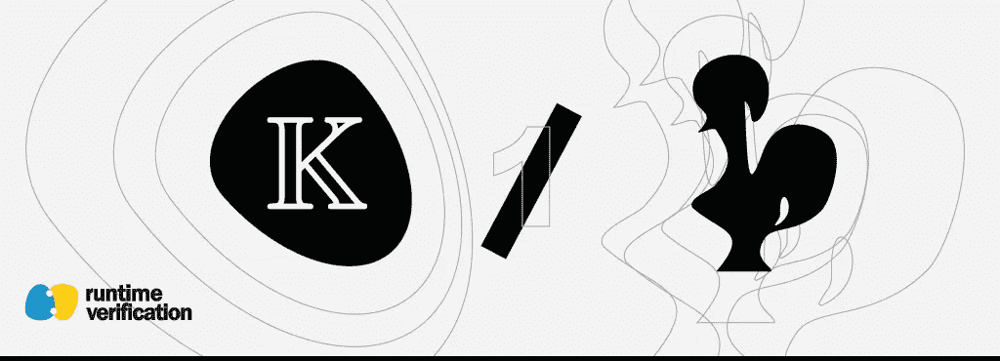
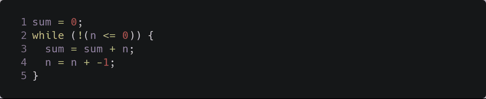
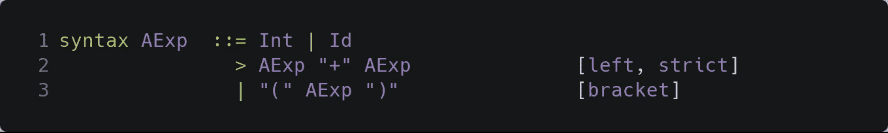
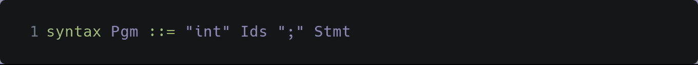
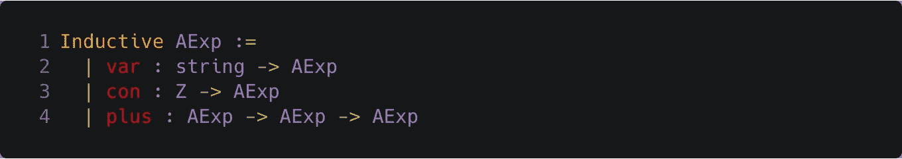
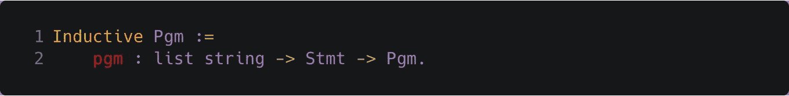
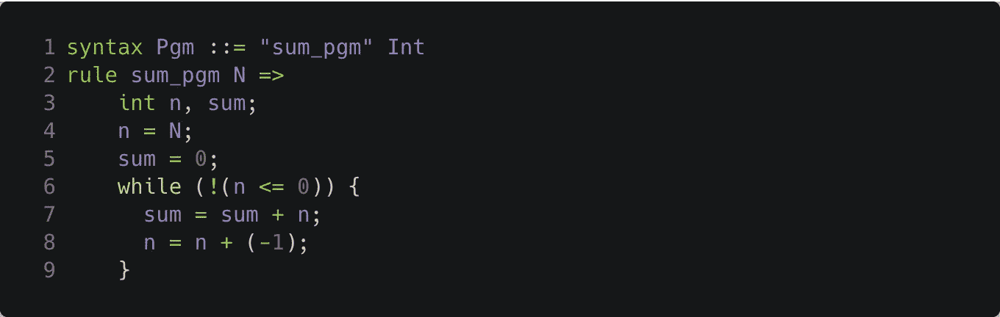
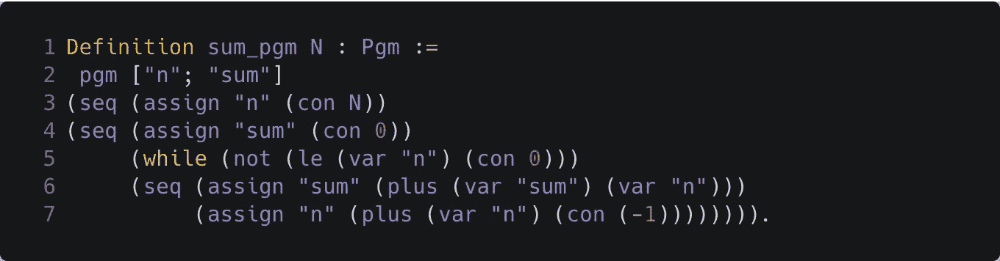

# k 与 Coq 作为语言验证框架(第 1 部分，共 3 部分)

> 原文：<https://medium.com/coinmonks/k-vs-coq-as-language-verification-frameworks-part-1-of-3-19ff603b4e91?source=collection_archive---------3----------------------->

## 作者:穆萨布·阿尔图基和布兰登·摩尔

形式验证程序，如验证区块链系统中的智能合同或验证嵌入式设备中的飞机飞行控制器，是确保正确性和增加系统可靠性的一种强有力的技术。在这种情况下，“为什么使用 [K](http://www.kframework.org) 而不是 [Coq](https://coq.inria.fr) 的问题？”在与可能不熟悉 K，但之前听说过或使用过 Coq 的同事讨论 K 时，似乎经常出现。在这一系列的文章中，我们试图通过一个工作示例来强调 K 和 Coq 作为语言的正式验证框架的一些重要区别。我们希望向读者传达为什么我们认为 K 在这种情况下更合适。在我们继续之前，我们想指出，作为用户和库/框架开发人员，我们对 Coq 有丰富的经验。

这一系列文章并不意味着对 K 和 Coq 进行基础的或详细的比较。事实上，这两个框架是非常不同的，并且是在不同的理念、目标和设计目标下开发的，针对不同的分析和验证方法。我们在这里关注一类特殊的应用程序，即验证用某种语言编写的程序，并通过这个镜头说明它们之间的差异。

# 运行时验证的 k 和 Coq

作为语言验证框架， [Coq](https://coq.inria.fr) 和 [K](http://www.kframework.org) 都非常有能力，我们在 [Runtime Verification](https://runtimeverification.com) 一直定期使用它们来提供我们的正式建模和验证服务。

最近基于 K 的开发的例子包括以太坊虚拟机 [KEVM](https://doi.org/10.1109/CSF.2018.00022) 和捆绑在 [Firefly 工具集](https://runtimeverification.com/firefly/)中的生成解释器和演绎验证器的语义，区块链语言 [IELE](http://hdl.handle.net/2142/100320) 的完整定义，[以太坊 2.0 信标链规范](https://github.com/runtimeverification/beacon-chain-spec)的具体模型，以及[KWasm](https://github.com/kframework/wasm-semantics):Web 程序集[的正式可执行语义](https://webassembly.org)，等等。

运行时验证中一些最近基于 Coq 的开发(不一定是基于语言的验证)包括 [Algorand 协议](https://arxiv.org/abs/1907.05523)的建模和验证其安全性，以及 [Casper](https://github.com/runtimeverification/casper-proofs) 中以太坊终结机制的建模和验证。我们还在 Coq 中开发了独立于语言的程序验证框架，我们在这里使用它作为本帖中描述的工作示例，在这里[会有更详细的解释](http://dx.doi.org/10.1007/978-3-319-89884-1_21)。

# 工作示例

因为我们在这里的目标是强调在使用 K 和 Coq 进行程序验证时的一些主要差异，所以我们使用一个非常简单但有意义的例子，它是下面的程序 SUM，用一种我们称为 IMP 的命令式类 C 语言编写:

*Our working example program SUM*

我们想要验证的关于 SUM 的一个重要属性是，在终止时，对于任何非负整数`n`，变量`sum`的值只能是(n + 1) n / 2(从 1 到`n`的整数值之和)。我们使用这个验证示例来说明 K 和 Coq 作为语言框架是如何进行比较和对比的，并让读者感受一下每个框架在这个过程中所涉及的工作流。

这个例子在 K 和 Coq 中的完整规范以及验证脚本都可以在[这里](https://github.com/runtimeverification/k-vs-coq-language-frameworks)获得。

# 我们需要什么

无论我们选择使用哪种框架，通常都需要以下三个工件来验证程序的正确性:

*   你想分析其程序的编程语言的语法和语义的正式模型。该模型需要是正式的，以便语法和语义被很好地定义和明确，并且使得它能够进行正式的推理。此外，它需要在一个抽象层次上，使得争论模型对语言的预期语义的忠实程度足够容易。本质上，从现在开始，L 将被认为是 IMP，而引用 IMP 构造的唯一方式是通过 L。
*   待分析程序模型中的一种形式表示。这通常是程序结构的模型，如抽象语法树(AST)或某种语言的程序编码。有了支持工具(即可以生成适当规范的词法分析器和语法分析器)，它也可以是程序文本本身。
*   验证程序所依据的属性的规范。取决于用于验证的模型和底层形式逻辑，这可以是例如一个或多个时态逻辑公式、可达性逻辑断言、霍尔三元组中的前置条件和后置条件，或者一阶逻辑或其他逻辑形式中的公式。

这对 SUM 来说意味着我们需要:

*   语言 IMP 的语义的正式模型，它精确地定义了语言的构造，如`while`和赋值`=`的含义(不考虑它们在程序中的使用位置)。
*   程序和结构的精确说明。
*   一种形式化的性质，即计算出的值确实是从 1 到`n`的整数之和。

# 语言框架与传统程序验证器

区分框架(如 Coq 和 K)和传统的程序验证器是很有见地的。传统的程序验证器是为特定的编程语言制作的，比如针对 C 语言的 [VCC](https://www.microsoft.com/en-us/research/project/vcc-a-verifier-for-concurrent-c/) ，针对可靠性的 [Verisol](https://github.com/microsoft/verisol) 等。，这意味着所选择的语言语义 L 是硬连线在工具本身中的。此外，传统的程序验证器通常还提供特定于语言的机制来从程序本身中提取程序结构 P，以及从对程序的用户友好的语法糖注释中提取规范 S。这些使得程序验证器更容易使用，对用户更友好，但代价是该工具本质上受限于特定的编程语言(版本)和属性形式主义。对编程语言的任何改变，例如从一个版本迁移到下一个版本，或者对属性形式的任何改变，例如添加新的逻辑或断言构造，都需要整个程序验证工具本身由它的开发者或维护者更新，如果仍然可用的话，并且工具的用户等待直到这完成，然后切换到本质上新的工具。

语言框架从根本上来说是不同的，因为工具本身的实现独立于它们所应用的语言。这种关注点的分离允许独立地开发和改进工具，同时将语言语义隔离为一个独立的形式工件，它本身是有价值的(例如，参见[EVM·杰洛帕](https://jellopaper.org)，它目前作为以太坊虚拟机语言的规范规范)。付出的代价是一种潜在的不太友好的正式符号。

因此，语言框架中的一般程序验证工作流主要由以下步骤组成:

1.  正式定义语言结构(语法),并用它来说明程序 p 的结构。
2.  定义语言的形式语义，使用开发的语言模型 L(语法和语义)探索程序的行为。
3.  指定属性 S，并验证属性 S 对于 L 中的 P 成立，或者表明它不成立。

这是三篇文章的第一部分。在第一部分的剩余部分，我们将展示如何在 K 和 Coq 中构建 IMP 和程序 SUM 的语法的正式模型(上述工作流的第一步)。定义 IMP 的语义和测试 SUM 的执行(第二步)在[第 2 部分](/@rv_inc/k-vs-coq-as-language-verification-frameworks-part-2-of-3-a98ce2592f65)中解释。第三步，即指定和验证正确性属性，在[第 3 部分](/@rv_inc/k-vs-coq-as-language-verification-frameworks-part-3-of-3-ea12e26be516)中描述。

# 定义 IMP 的语法

定义一种语言的形式模型的第一步是定义它的句法结构。下面，我们定义语言 IMP 的语法。

# K 中的语法定义

k 的底层逻辑[是匹配逻辑](http://matching-logic.org)，但它包含了几个专门为定义语言而设计的特性。首先，编程语言语法可以用标准的、被广泛接受的 BNF 格式给出，还有结构和语义注释，比如结合性和求值顺序注释。例如，IMP 的算术表达式是使用以下产生式规则定义的:

*Syntax in K of IMP’s arithmetic expressions*

规则为算术表达式指定了一个语法类别(使用`syntax`关键字引入)。终端以双引号字符串的形式给出，而非终端以大写字母开头的名称给出。`Int`和`Id`分别是整数和标识符的非终结符。

使用了几个注释:`>`表示操作符之间的优先级，`left`表示左关联二元操作符，`strict`表示指定求值顺序。注释`bracket`意味着圆括号`(` `)`仅用于分组表达式，不应该在解析树中为它们创建专用节点(更多细节参见 [K 教程](http://www.kframework.org/index.php/K_Tutorial))。注意，Coq 不需要这些类型的注释，因为 Coq 不处理解析。

布尔表达式`BExp`，如关系表达式，和程序语句`Stmt`，如条件和循环结构，使用相似的产生式规则定义。

最后，`Pgm`是 IMP 中程序的语法类别，每个语法上有效的 IMP 程序，像上面的 SUM 一样，在这个规范中都有`Pgm`作为它的分类(`Ids`是一个标识符列表):

*Syntax in K of IMP programs*

因此，IMP 中的程序由一系列变量声明和程序语句组成。

定义语言 IMP 语法的完整 K 模块可以在[这里](https://github.com/runtimeverification/k-vs-coq-language-frameworks/blob/master/k/imp.k#L4-L26)找到。

# Coq 中的语法定义

Coq 的底层逻辑是[归纳结构演算](https://hal.inria.fr/hal-01094195/)。因此，要定义 IMP，最自然的方法是使用归纳定义的数据类型指定 IMP 的语法，使用归纳定义的函数和关系指定其语义。

例如，IMP 中算术表达式的语法可以在 Coq 中使用下面的归纳类型声明来定义，该声明由关键字`Inductive`引入(`string`和`Z`是 Coq 中的字符串和整数类型):

*Syntax in Coq of IMP’s arithmetic expressions*

一般来说，IMP 中可以用来构建算术表达式的每个语言构造，例如变量，都是由指定其参数类型的类型`AExp`中的构造函数捕获的。例如，变量由应用于字符串(变量名)的构造函数`var`构造，而常量值由应用于整数的`con`构造。使用这个定义，例如，表达式`x + 2`由具有形式`plus (var "x") (con 2)`的类型`AExp`的 Coq 中的术语表示。

IMP 中布尔表达式和语句的语法也有类似的定义，分别是归纳类型`BExp`和`Stmt`。例如，while 循环语句`while : BExp -> Stmt -> Stmt`的构造函数有两个参数:作为布尔表达式的条件和作为语句的循环体。

类型为`Pgm`的 IMP 程序由`pgm`构建，它将一列字符串(被声明的变量)和程序语句作为参数:

*Syntax in Coq of IMP programs*

IMP(抽象)语法的完整 Coq 定义可以在[这里](https://github.com/runtimeverification/k-vs-coq-language-frameworks/blob/master/coq/imp.v#L19-L42)找到。

注意，将 IMP 程序编码成 Coq 中的术语对应于构建程序的解析树。然而，这种编码过程必须是手工的，因为 Coq 不提供将程序解析成归纳类型的特性(如 K 中的结合性或操作符优先注释)。此外，这些 Coq 术语(解析树)是纯语法的。在这个阶段，它们没有与之相关的语义信息。例如，在 Coq 中，没有 K 风格的简化来指定操作符的严格性或其他评估策略。

# 以 K 和 Coq 表示的总和的规格

用于指定 IMP 语法的 K 的 BNF 样式和所使用的注释能够将程序文本解析成明确定义程序结构的抽象语法树(AST)。因此，指定程序结构的繁重工作由 K 解析器自动负责，由 BNF 语法规范生成 IMP。这意味着程序文本本身可以直接用于执行、验证，或者被任何其他 K 工具使用。下面，我们给程序文本的`n`中的`sum_pgm`参数起一个名字:

*K Definition of SUM*

注意，上面的 K 规则是由关键字`rule`引入的，它定义了应用于整数值的术语`sum_pgm`的含义。例如，`sum_pgm 100`是变量`n`初始化为 100 的 SUM 程序。

然而，在 Coq 中，程序文本(比如上面的 SUM)不能直接使用，需要被解析成在 Coq 模型中有效的相应术语。对于像 IMP 和 SUM 这样的小型语言和程序，这个解析任务非常简单，但是对于更复杂的语言和更大的程序，这个过程通常需要开发外部解析器和 Coq 规范生成器，这可能是一个不小的任务。

在我们的 Coq 模型中，程序 SUM 作为类型为`Pgm`的项具有以下表示形式，我们如上所述将其命名为`sum_pgm`:

*Coq Definition of SUM*

构造函数`seq`和`assign`分别表示 IMP 中的排序和赋值语句(参见完整定义[这里的](https://github.com/runtimeverification/k-vs-coq-language-frameworks/blob/master/coq/imp.v#L1-L51))。

## 接下来:语义…

现在我们有了 IMP 语法的正式定义和 SUM 的正式表示，下一步是正式定义 IMP 的语义，并使用语义测试 SUM 的执行。这将在本帖的第二部分中描述。

*原载于 2019 年 12 月 12 日*[*【https://runtimeverification.com】*](https://runtimeverification.com/blog/k-vs-coq-as-language-verification-frameworks-part-1-of-3/)*。*

> [直接在您的收件箱中获得最佳软件交易](https://coincodecap.com/?utm_source=coinmonks)

