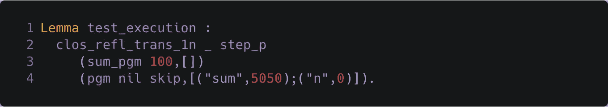

# k 与 Coq 作为语言验证框架(第 2 部分，共 3 部分)

> 原文：<https://medium.com/coinmonks/k-vs-coq-as-language-verification-frameworks-part-2-of-3-a98ce2592f65?source=collection_archive---------7----------------------->

## 作者:穆萨布·阿尔图基和布兰登·摩尔

在这篇文章的第 1 部分中，我们首先介绍了在一个语言验证框架中验证程序正确性的步骤，比如 K 和 Coq。然后，我们描述了第一步，定义语言语法和程序结构，是如何在 K 和 Coq 中完成的，这是我们在语言 IMP 中的工作示例程序 SUM，突出了两个框架之间的主要区别。

在这篇文章的第二部分，我们建立在前一部分介绍的定义的基础上，描述如何使用相同的示例 SUM 在 K 和 Coq 中实现语言的语义和测试语义，这是这个过程的第二步。本系列的第 3 部分解释了如何完成第三步(指定和验证属性)。

# 定义 IMP 的语义

定义一种语言的形式模型 L 的第二步是给它的构造赋予形式语义。下面，我们定义语言 IMP 的语义。

# K 中的执行规则

K 中的语义是通过重写称为配置的术语来指定的。一个配置由一组可能嵌套的单元组成，其中每个单元代表所指定语言的一个语义元素。一个基本单元是计算单元，它列出了一系列计算结构，这些结构定义了赋予程序语义的任务序列。还可以定义其他单元，比如绑定构造的命名环境、多线程语言的线程、动态内存分配的堆等等。要定义的特定配置是特定于语言的。例如，IMP 是一种简单的带有变量的顺序编程语言，因此只需要一个简单的配置，包括计算单元`<k/>`和状态单元`<state/>`，用于将变量映射到值:

*The (initial) K configuration of SUM*

这也定义了 IMP 程序的初始配置，其中`<k/>`单元包含要评估的整个程序(在 K 变量`$PGM`中)，而`<state/>`单元是空映射(由`.Map`表示)。

转换由 K 重写规则指定。利用配置的嵌套结构，可以在配置中应用 K 规则的地方本地指定 K 规则，并且仅提及规则所需的配置部分。配置抽象负责填充其他部分(参见 [K 教程](http://www.kframework.org/index.php/K_Tutorial))。例如，用变量的值替换变量的语义由以下规则给出:

*The K rule defining semantics of program variables*

当要评估标识符`X`时，该规则适用(计算单元`<k/>`中堆栈顶部的计算)。该规则将标识符与其在`<state/>`单元格中的对应映射进行匹配，并将`X`重写为其值`I`。

对于像 IMP 这样简单的语言，大多数规则甚至没有提到配置中的单元，只在要简化的计算结构上进行匹配。例如，IMP 中的`+`的语义由以下规则给出:

*The K rule defining semantics of* `*+*`

IMP 中算术符号的语义是使用 K 对整数的内置运算来定义的，比如`+Int`用于整数加法。

IMP 的所有构造的语义由 K 中总共 16 个规则指定(大致每个构造一个规则，只有 3 个规则明确提到单元格)，可以在这里找到。

# Coq 中的执行规则

因为 IMP 是确定性的，即每个 IMP 程序至多计算一个值，函数作为语言结构的表示就足够了。然而，关系更一般，能够表达计算的内部步骤，就像小步骤结构操作语义定义暴露了评估程序构造的各个步骤。更复杂的语言(如并发和多线程语言)更自然地使用关系来定义。例如，K 规则中的重写箭头`=>`定义了一个关系。

因此，在 Coq 中，IMP 中算术表达式的语义由状态上的二元转换关系捕获，其中状态是由算术表达式`AExp`和`Env`组成的一对`(AExp, Env)`，当前环境`AExp`将在其中被评估。环境由一组将字符串(变量名)关联到整数常量(IMP 中变量可以映射到的唯一值)的对来建模。

这个二元转换关系可以在 Coq 中定义为一个归纳定义的命题(Prop 类型)，`step_e`，它告诉我们一个给定的状态对是否属于该关系。以下是`step_e`定义的摘录(参见[完整定义](https://github.com/runtimeverification/k-vs-coq-language-frameworks/blob/master/coq/imp.v#L71-L92)):

*The Coq rules defining semantics of arithmetic expressions*

例如，`step_var`声明程序变量`var v`在环境`env`中一步计算出其值`con x`(`x`是从函数应用`get v env`中获得的整数值，`v`在`env`中映射到该值)，这适用于所有程序变量和环境(回想一下`con`是整数常量的构造函数)。另一个例子是`step_plus`的情况，它表示任何形式为`plus (con x) (con y)`的算术表达式，其中加法的操作数已经被计算为常数值，在一个步骤中计算为操作数之和的值，而不管当前环境如何(`Z.add`是整数加法运算)。注意`step_plus`、`cong_plus_r`和`cong_plus_l`是如何共同指定`plus`的按值调用语义的，这对应于上面突出显示的 K 的`strict`注释。

除了为算术表达式赋予语义的`step_e`之外，我们还定义了另外两个关系作为归纳定义的命题`step_b`和`step_s`，它们分别为 IMP 中的布尔表达式和语句赋予语义。它们的定义遵循与`step_e`相似的结构。`step_b`的定义使用`step_e`的定义，例如用于定义关系运算符的语义，而`step_s`的定义使用`step_e`和`step_b`，例如用于 IMP 的条件语句和迭代语句。

最后，为了给完整的 IMP 程序赋予语义(变量声明列表后面跟着用`pgm`构造的程序语句)，我们引入了另一个关系`step_p`，它是根据上面的关系`step_s`定义的。程序关系`step_p`首先通过用适当的映射增加状态环境来处理所有变量声明，然后使用`step_s`来执行程序语句。本质上，`step_p`定义了 IMP 的一步语义。

这些关系的完整定义见[此处](https://github.com/runtimeverification/k-vs-coq-language-frameworks/blob/master/coq/imp.v#L71-L139)。

# 测试 SUM 上的执行

在开始严格验证求和正确性属性之前，我们展示了这两个框架在测试程序执行方面的比较，这是建立对形式语言语义充分性的信心的必要步骤。

# 在 K 中测试

K 中的规范可以立即执行，提供了一种定义语言解释器的机制，这些解释器可以用来制作程序动画，评估语言设计和语言定义的发展，几乎不需要额外的工作(除了定义语言规范本身)。

假设 imp 的语言定义作为 K 模块保存在文件 [imp.k](https://github.com/runtimeverification/k-vs-coq-language-frameworks/blob/master/k/imp.k) 中，调用 imp.k 上的 K 编译器`kompile`会为 imp 生成一个解析器和一个解释器，可以用来解析和执行 IMP 程序。

例如，对于`n`初始 100，我们使用`sum_pgm 100`给出的 SUM 程序，并将其存储在文件 [sum.imp](https://github.com/runtimeverification/k-vs-coq-language-frameworks/blob/master/k/sum/sum.imp) 中。命令`kast sum.imp`输出 SUM 的 K 抽象语法树(AST)。此外，用`krun sum.imp`运行程序输出执行程序产生的最终配置，n 映射到 0，sum 映射到 5050(从 1 到 100 的所有数字的和，n 的初始值)。

*The final K configuration resulting from executing SUM*

注意，`<k/>`单元具有空计算值`.`,表示程序已经完全执行。

K 执行工具，尤其是那些基于 [K 的 LLVM 后端](https://github.com/kframework/llvm-semantics)的工具，都是针对执行效率进行优化的。事实上，在某些情况下，K 与`krun`的执行速度比手写解释器更快，例如 [Firefly 的](https://runtimeverification.com/firefly/) K runner 与`ganache-cli`中的`ethereumjs`相比。

# Coq 中的测试

Coq 不是设计来自动产生解释器的，但是一些机器检查代码如何在语义下执行的测试可以通过以定理的形式陈述例子来进行。

回想一下，在我们的 Coq 模型中，IMP 的 SUM 表示为一个类型为`Pgm`的术语，我们将它命名为`sum_pgm`，如下所示:

*Coq Definition of SUM*

使用该模型，我们可以测试具有值 100 的`n`的和，即项`sum_pgm 100`，通过显示`sum_pgm 100`展示了以具有空环境的状态开始并以具有映射到 0 的环境`n`和映射到 5050 的`sum`的状态结束的执行轨迹，产生预期的结果:

*Execution lemma in Coq of SUM*

执行轨迹由关系`step_p`的自反传递闭包构成，由 Coq 的归纳定义命题`clos_refl_trans_1n`计算。注意，最终状态的程序是空操作命令`skip`，要求程序已经完全执行。

完成证明需要为每个执行步骤选择正确的步骤关系子句。使用 Coq 的证明策略来自动搜索提供了某种形式的自动执行。这需要几秒钟来完成一百次循环迭代，因此性能很低，但对于简单的例子来说是可以忍受的(程序和证明可以在这里找到)。

Coq 还有其他选择，可以用额外的开发人员工作来创建更快的解释器。[程序提取](https://coq.inria.fr/refman/addendum/extraction.html)可以将 Coq 语言中的函数翻译成其他语言的代码，比如 OCaml 或 Haskell，它们有很好的本地代码编译器。这仍然不能从定义为谓词的转换关系中自动产生解释器。开发人员必须编写一个执行步骤的函数，并且应该证明它等价于关系定义。

原则上，函数可以被认为是语言的主要定义，但这可能可读性较差，并且更难证明其属性。从[教科书](https://softwarefoundations.cis.upenn.edu/lf-current/ImpCEvalFun.html)到 [CompCert](http://compcert.inria.fr/doc/html/compcert.cfrontend.Csem.html) 这样的大型项目，Coq 中的标准实践是使用归纳定义的关系作为语言的基本定义，就像我们上面做的那样。在 Coq 中，为更快的执行提供一个替代函数，并证明其正确性，被认为是“执行优化”。

## 下一步:属性验证…

我们现在有了 IMP 的正式模型，定义了它的语法和语义，以及 SUM 的正式表示。下一步也是最后一步是正式指定正确性属性并验证程序的正确性。这将在本帖的第三部分中描述。

*原载于 2019 年 12 月 12 日*[*https://runtimeverification.com*](https://runtimeverification.com/blog/k-vs-coq-as-language-verification-frameworks-part-2-of-3/)*。*

> [直接在您的收件箱中获得最佳软件交易](https://coincodecap.com/?utm_source=coinmonks)

